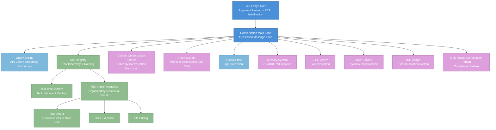
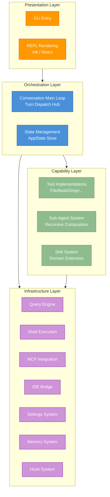
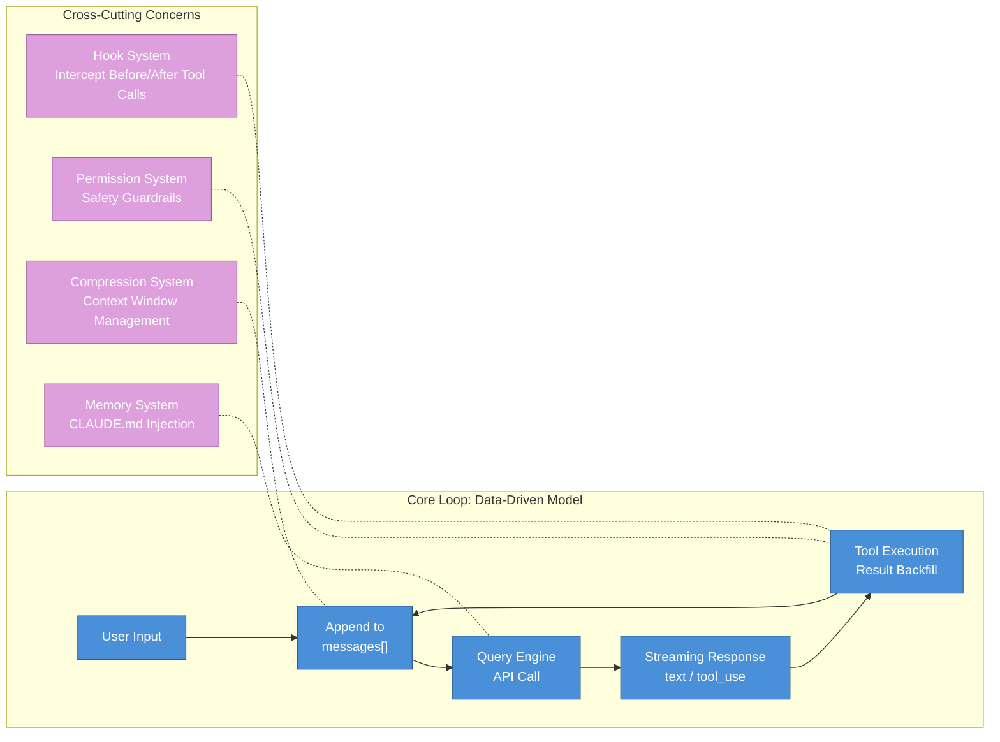
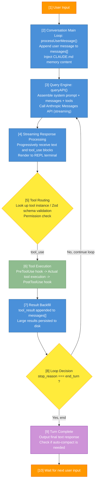
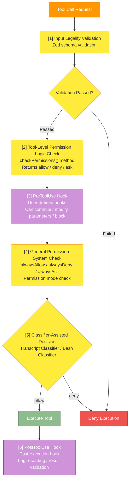
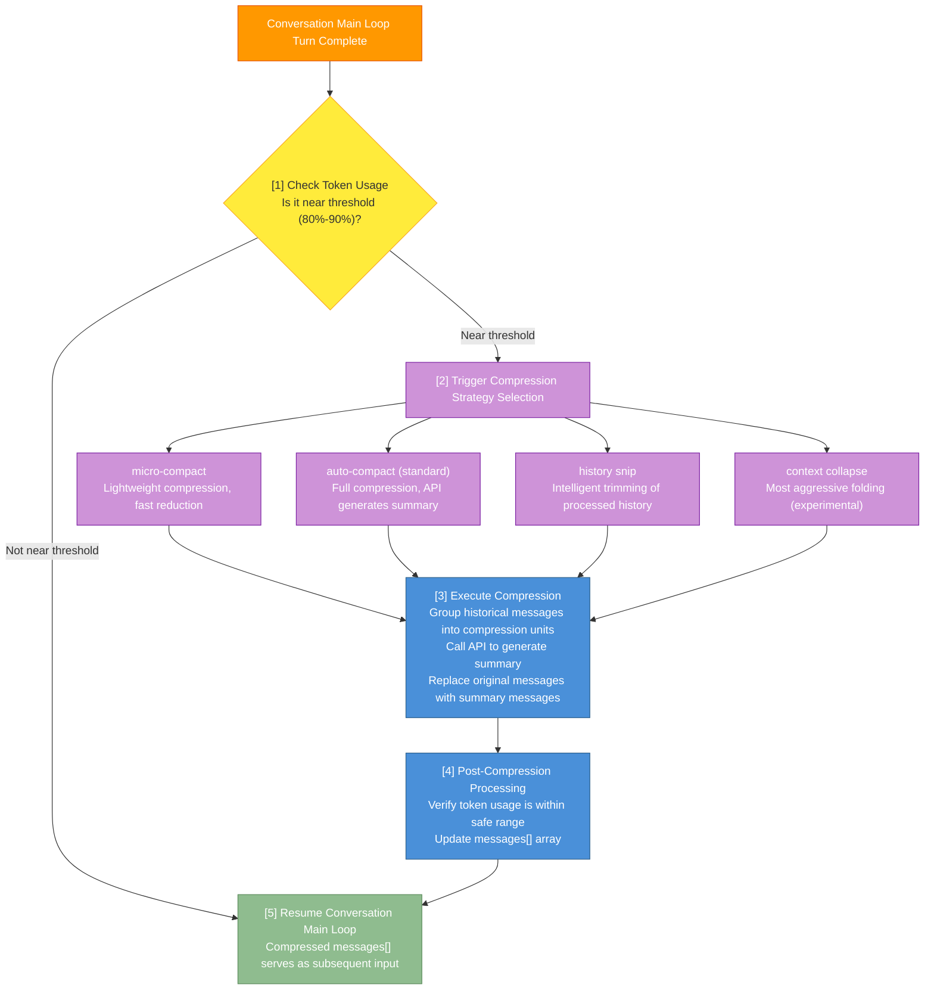
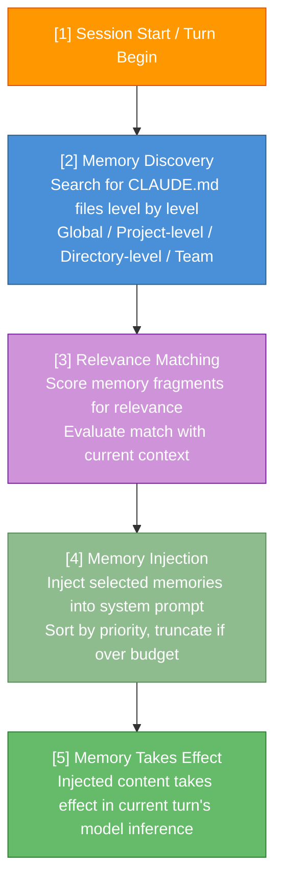
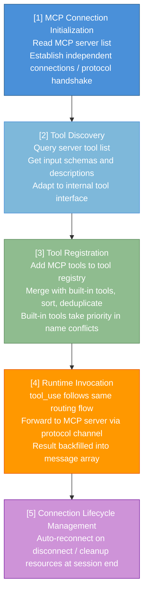
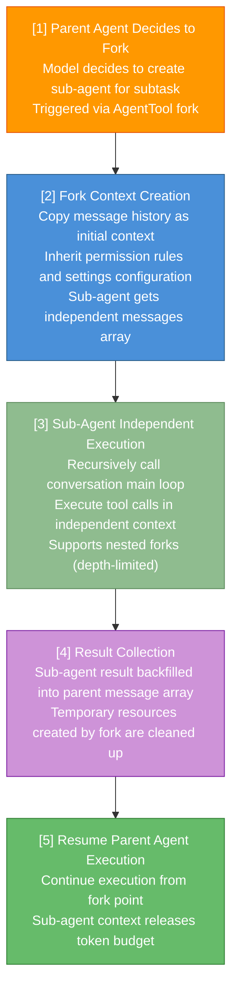

# Appendix A: Architecture Navigation Map

This appendix provides a conceptual navigation of the Claude Code system architecture, helping readers understand the responsibilities and collaboration relationships of each functional module from a macro perspective. Whether you want to quickly locate the architectural domain of a specific feature or trace a complete data flow path, this map is your go-to reference.

**How to use this map**:
- If you are reading for the first time, we recommend reading through in order from A.1 -> A.2 -> A.3 to build a holistic understanding
- If you want to find a specific module, locate it directly in the A.1 index table, then jump to the relevant section
- If you want to understand the data flow of a specific feature, find the corresponding flowchart in A.3
- If you are interested in collaboration contracts between modules, refer to the interface descriptions in A.4
- The module names in this map correspond closely to the chapters in the main body of this book and can be cross-referenced

---

## A.1 Core Module Index

The table below lists all core modules in the Claude Code architecture. Each module includes a responsibility description, an overview of key data structures, and a cross-reference to the relevant chapters.

| Module Name | Responsibility Description | Key Data Structures | Chapter Reference |
|---------|---------|------------|---------|
| CLI Entry & REPL | Command-line entry point, responsible for argument parsing, REPL interaction loop rendering, and session initialization. Serves as the system's launch anchor, parsing command-line flags before delegating to the conversation main loop | Command-line argument object, REPL rendering state tree | Chapter 2 |
| Conversation Main Loop | Turn-based conversation loop, the core dispatcher managing message sending/receiving and tool scheduling. It is the heart of the system; each turn represents a complete iteration of "user input -> model inference -> tool execution -> result backfill" | messages array (Message[]), turn counter, stop reason state | Chapter 2 |
| Query Engine | The underlying engine that encapsulates API calls, streaming response handling, and retry logic. Manages all communication with the Anthropic Messages API, including system prompt assembly, token counting, and caching strategies | API request configuration, streaming response blocks (ContentBlock[]), cache breakpoint markers | Chapter 2, Chapter 13 |
| Tool Type System | Generic interface definitions for tools, execution context, and tool factory functions. Defines the standard protocol that all tools must follow, including input validation, permission checking, concurrency safety, and other dimensions | Tool interface definitions, Zod input schemas, tool description templates | Chapter 3 |
| Tool Registry | Global tool registration, discovery, and assembly. Responsible for merging built-in tools with dynamic tools. At runtime, the tool pool assembly function merges built-in tools with MCP dynamic tools, sorts by name, and deduplicates | Tool map (Map<name, Tool>), registered tool list | Chapter 3 |
| Sub-Agent System | Sub-agent spawning, recovery, forking, and built-in agent definitions. Implements recursive composition of agents, allowing an agent to spawn sub-task executors with independent contexts during execution | Sub-agent configuration, fork state snapshot, agent recovery context | Chapter 9, Chapter 8 |
| Shell Execution Engine | Shell command permission validation, read-only detection, and secure sandbox execution. Abstracts shell command execution into a unified tool interface, including command injection prevention, timeout management, and output truncation | Command execution request, output streams (stdout/stderr), exit status code | Chapter 3, Chapter 4 |
| Context Compression | Multi-layer compression strategies including auto-compact, micro-compact, and session memory. Automatically triggers when context approaches the token limit, ensuring conversations are not interrupted by window overflow | Compression summary messages, token usage counts, compression threshold configuration | Chapter 7 |
| Hook System | Pre/post tool use hooks, session hooks, and async hook registration and execution. Provides extension point mechanisms spanning the entire lifecycle, allowing users to inject custom logic at critical event nodes | Hook registry, hook execution context, hook output results | Chapter 8 |
| Settings System | Three-tier configuration (global/project/local), permission rule definitions, and schema validation. Adopts a layered overlay model ensuring configuration flexibility and auditability | Three-tier configuration objects (Settings), permission rule arrays, Zod validation schemas | Chapter 5 |
| Memory System | CLAUDE.md discovery, nested memory, team memory, and relevance matching. Implements cross-session knowledge persistence for the agent, preserving user preferences and project knowledge through a hierarchical memory file system | Memory files (CLAUDE.md), memory hierarchy tree, relevance matching scores | Chapter 6 |
| Skill System | Built-in skill management, dynamic loading, and slash command registration. Skills are installable extension capability packages that expand the agent's domain-specific expertise through prompt templates and tool definitions | Skill registry, slash command mapping, skill prompt templates | Chapter 11 |
| MCP Integration | MCP connection management, protocol adaptation, resource read/write, and permission channels. Implements a complete Model Context Protocol client, allowing external tool servers to provide context and callable tools to the model | MCP connection configuration, resource descriptors, tool capability declarations | Chapter 12 |
| IDE Bridge | VSCode/JetBrains bidirectional communication, JWT authentication, and remote session management. Establishes a secure bidirectional communication pipeline between the Claude Code CLI and IDE plugins | Bridge message queue, JWT token, IDE state snapshot | Chapter 7 |
| Coordinator Pattern | Worker allocation and result aggregation in multi-agent coordination scenarios. Serves as the hub in multi-agent collaboration, responsible for task distribution, progress tracking, and result integration | Worker registry, task queue, result aggregation state | Chapter 10 |
| State Management | Global application state store, React integration, and selector pattern. Adopts a centralized state management strategy, enabling efficient state subscription and updates through the selector pattern | Global state tree (AppState), selector functions, state update events | Chapter 2, Chapter 13 |

> **Navigation Tip**: The "Chapter Reference" column in the table above points to chapters in the main body of this book that provide in-depth discussion of each module. We recommend reading the relevant chapters alongside this map for a complete understanding.

---

## A.2 Module Dependency Relationships

The core dependency chain of Claude Code is as follows (top to bottom):

### A.2.1 Layered Architecture Description

The Claude Code architecture can be clearly divided into four layers, each with well-defined responsibility boundaries and dependency directions:

**Presentation Layer**
- Contains the CLI entry point and REPL rendering module
- Uses the Ink framework (React-based) to render the component tree as terminal text output
- Responsible for user input capture, output rendering, keyboard shortcut handling, theme switching, and other UI-related responsibilities
- Does not contain any business logic; all user actions are delegated to the layer below
- Dependency direction: depends only on the Orchestration Layer below

**Orchestration Layer**
- Contains two core modules: the conversation main loop and state management
- The conversation main loop is the system's dispatch hub, coordinating collaboration between the query engine, tool registry, and compression service
- The state management module maintains the global application state tree, providing reactive state subscriptions to the presentation layer through the selector pattern
- The core invariant of this layer is turn completeness: each turn must complete the full cycle of "model call -> tool execution -> result backfill -> call again"
- Dependency direction: depends on the Capability Layer and Infrastructure Layer below

**Capability Layer**
- Contains all tool implementations, the sub-agent system, and the skill system
- Each tool is an independent capability unit that interfaces with the Orchestration Layer through a unified tool interface
- The sub-agent system achieves nested execution by recursively calling the Orchestration Layer's conversation main loop
- The skill system serves as a higher-level capability extension mechanism, combining multiple tools to form domain-specific capability packages
- Dependency direction: depends on the Infrastructure Layer below

**Infrastructure Layer**
- Contains the query engine, shell execution engine, MCP integration, IDE bridge, settings system, memory system, and hook system
- Modules in this layer provide the most fundamental technical capabilities and do not contain business logic
- The query engine encapsulates all communication details with the Anthropic API
- The settings system provides storage and validation capabilities for three-tier configuration
- The memory system provides CLAUDE.md file discovery and injection capabilities
- Dependency direction: does not depend on upper layers; can be called by any upper-layer module

### A.2.2 Core Loop and Data-Driven Model

**Core Loop**: CLI entry initializes REPL -> user input triggers the conversation main loop's turn cycle -> query engine initiates API call -> model returns tool_use -> tool registry routes to specific tool -> after tool execution, results are backfilled -> API is called again until the model outputs end (stop reason = "end_turn").

The core loop embodies Claude Code's fundamental design philosophy: **the data-driven loop model**. The system does not use traditional imperative flow control; instead, it drives execution through continuous appending to the messages array. The input for each turn is an ever-growing messages array, and each model inference makes decisions based on the complete contents of this array.

**Cross-Cutting Concerns**:
- **Hook System** (hooks) inserts interception logic before and after tool calls, allowing users to extend behavior without modifying core code. See Chapter 8 for detailed discussion
- **Permission System** determines whether execution is allowed through a unified permission check function, forming safety guardrails that span all tool executions. See Chapter 4 for the permission pipeline details
- **Compression System** automatically triggers when context approaches the token limit, serving as an engineering response to the fundamental hardware constraint of the context window. See Chapter 7 for context management strategies
- **Memory System** scans CLAUDE.md at the start of each turn and injects it into the system prompt, achieving cross-session knowledge persistence. See Chapter 6 for the memory architecture

### A.2.3 Inter-Module Coupling Analysis

Understanding the degree of coupling between modules helps readers identify the right entry points when reading source code or performing extension development:

| Coupling Relationship | Coupling Degree | Description |
|---------|---------|------|
| Conversation Main Loop <-> Query Engine | Tight Coupling | The main loop directly depends on the query engine's streaming output interface; both share the message array data model |
| Conversation Main Loop <-> Tool Registry | Tight Coupling | Tool dispatch is one of the main loop's core responsibilities; tool routing logic is embedded in the main loop's turn handling |
| Tool Registry <-> MCP Integration | Loose Coupling | MCP tools are integrated through a dynamic registration mechanism, discovered and loaded on demand at runtime |
| Sub-Agent <-> Conversation Main Loop | Recursive Coupling | Sub-agents achieve nested execution by recursively calling the conversation main loop, forming a self-similar fractal structure |
| Hook System <-> Tool Execution | Event Coupling | Hooks are triggered through lifecycle events without affecting the core path of tool execution |
| Memory System <-> Query Engine | Loose Coupling | Memory content is injected as part of the system prompt without directly participating in API call logic |
| Settings System <-> Global | Configuration Coupling | The settings system influences the behavior of nearly all modules through configuration objects, but there are no direct dependencies between modules |

---

## A.3 Data Flow Path Quick Reference

This section presents complete data flows for several key operations in Claude Code in flowchart form. Each flowchart annotates the core modules and key decision points involved, helping readers quickly trace how data flows through the system.

**Quick Navigation**:
- [Standard Tool Call Flow](#standard-tool-call-flow) -- The most core loop, the starting point for understanding Claude Code's runtime mechanism
- [Permission Decision Path](#permission-decision-path) -- The core decision chain of the safety guardrails
- [Context Compression Trigger Path](#context-compression-trigger-path) -- The lifeline for long conversations
- [Memory Injection Path](#memory-injection-path) -- How cross-session knowledge enters the conversation
- [MCP Tool Dynamic Registration Path](#mcp-tool-dynamic-registration-path) -- How external capabilities are integrated into the system
- [Sub-Agent Fork Execution Path](#sub-agent-fork-execution-path) -- Recursive decomposition of tasks

### Standard Tool Call Flow

This is Claude Code's most fundamental data flow path, describing how data flows from user input to final output within a complete turn. All other paths are variations or subsets of this core loop.

**Key Decision Point Descriptions**:
- Step [5] permission check is the system's most important security decision point, determining whether a tool is executed
- Step [7] large result persistence mechanism prevents the token window from being filled by a single tool result
- Step [8] loop condition (stop_reason) is the only mechanism for the entire system to exit from an "infinite loop"

### Permission Decision Path

The permission pipeline is the core of Claude Code's security model. Every tool call must pass through this complete decision chain before it can be executed. The permission decision result determines whether the tool is executed, requires user confirmation, or is directly denied.

**Permission Mode Interaction Relationships**:

| Permission Mode | Tool Execution Policy | User Experience |
|---------|------------|---------|
| ask (default) | All write operations require user confirmation | Most secure, but frequent interaction |
| auto-edit | File edits auto-approved, other write operations still require confirmation | Balances security and efficiency |
| full-auto | All operations execute automatically (subject to alwaysDeny rules) | Smoothest experience, but highest risk |
| plan | Only read-only tools allowed, enters pure planning mode | Used for safely reviewing task plans |

### Context Compression Trigger Path

Context compression is Claude Code's core engineering strategy for dealing with context window limitations. When conversation history approaches the token limit, the system automatically triggers compression to free up space.

**Compression Strategy Comparison**:

| Strategy | Trigger Condition | Compression Intensity | Quality Loss | Cache Friendly |
|------|---------|---------|---------|---------|
| micro-compact | Proactively triggered when approaching threshold | Light | Low | Yes (if CACHED_MICROCOMPACT enabled) |
| auto-compact | Triggered when threshold is reached | Medium | Medium | Depends on compression scope |
| history snip | Continuously executed | Medium-high | Medium-high | No |
| context collapse | Manual or emergency trigger | Extremely high | High | No |

### Memory Injection Path

The memory system injects knowledge from CLAUDE.md files into the conversation context at the start of each conversation turn. This is the key path for achieving cross-session knowledge persistence in the agent.

### MCP Tool Dynamic Registration Path

MCP (Model Context Protocol) allows external tool servers to dynamically register new tools with Claude Code. This is an important mechanism for system extensibility.

### Sub-Agent Fork Execution Path

Sub-agents create independent execution units through the fork mechanism. Each sub-agent has its own context and permission scope but can inherit key configurations from the parent agent.

---

## A.4 Module Interface Contract Overview

This section describes the interface contracts between core modules from a conceptual level, helping readers understand how modules collaborate through well-defined interfaces. Note that this describes architectural design patterns, not specific source code references.

### A.4.1 Contract Between Conversation Main Loop and Query Engine

The conversation main loop interacts with the Anthropic Messages API through the query engine. The core contract between the two is:
- **Input**: system prompt, messages array, available tool list, model configuration parameters
- **Output**: streaming sequence of content blocks (text or tool_use), each block with metadata
- **Guarantee**: the query engine handles network retries, stream parsing, and error recovery; the conversation main loop only cares about the semantics of content blocks

### A.4.2 Contract Between Conversation Main Loop and Tool Registry

The conversation main loop routes tool_use returned by the model to specific tool implementations through the tool registry. The core contract is:
- **Routing Interface**: given a tool name, returns the corresponding tool instance
- **Execution Interface**: given a tool instance and input parameters, executes the tool and returns a structured result
- **Permission Interface**: given a tool instance and input parameters, returns a permission decision result

### A.4.3 Standard Protocol of the Tool Type System

All tools (including built-in tools and MCP dynamic tools) must follow the standard protocol defined by the tool type system. Core protocol methods include:
- **isEnabled()**: determines whether the tool is enabled in the current context
- **isReadOnly()**: determines whether the tool only performs read operations
- **isConcurrencySafe()**: determines whether the tool can be safely executed in parallel
- **isDestructive()**: determines whether the tool performs irreversible operations
- **checkPermissions()**: performs permission check, returns allow/deny/ask
- **toAutoClassifierInput()**: generates feature descriptions for automatic classification
- **userFacingName()**: returns a user-friendly name

### A.4.4 Lifecycle Contract of the Hook System

The hook system defines three core lifecycle extension points:
- **PreToolUse**: triggered before tool execution, can modify input parameters or block execution
- **PostToolUse**: triggered after tool execution, can process execution results or log events
- **Session Hooks**: triggered at session-level events (such as session start, session end)

Each hook receives a structured context object containing event type, tool information, input/output data, and more.

---

## A.5 Architectural Design Pattern Quick Reference

Claude Code's architecture embodies multiple classic design patterns. Understanding these patterns helps readers more deeply grasp the system's design intent.

| Design Pattern | Application Location | Design Intent |
|---------|---------|---------|
| Agent Loop | Conversation main loop | Combines LLM inference capability with tool execution into an iterative loop until task completion |
| Factory Method | Tool type system | Creates tool instances through a unified factory function, ensuring all tools follow the same interface |
| Registry | Tool registry, skill registry | Registers and looks up capability units by name, supporting runtime dynamic extension |
| Plugin | MCP integration, skill system | Allows external modules to extend system capabilities without modifying core code |
| Observer | Hook system | Registers observers on lifecycle events, achieving loosely coupled cross-cutting concerns |
| Strategy | Context compression | Multiple compression strategies are interchangeable, selecting the optimal strategy based on context |
| Layered Architecture | Overall system | Clear layering of Presentation -> Orchestration -> Capability -> Infrastructure |
| Async Generator | Query engine, streaming output | Uses async function* to progressively yield streaming results, naturally supporting backpressure control |
| Hierarchical Agent | Sub-agent system | Achieves hierarchical composition of agents through fork, forming fractal structures |
| Feature Flag | System-wide | Boolean switches injected at compile time, enabling dead code elimination and progressive feature rollout |
