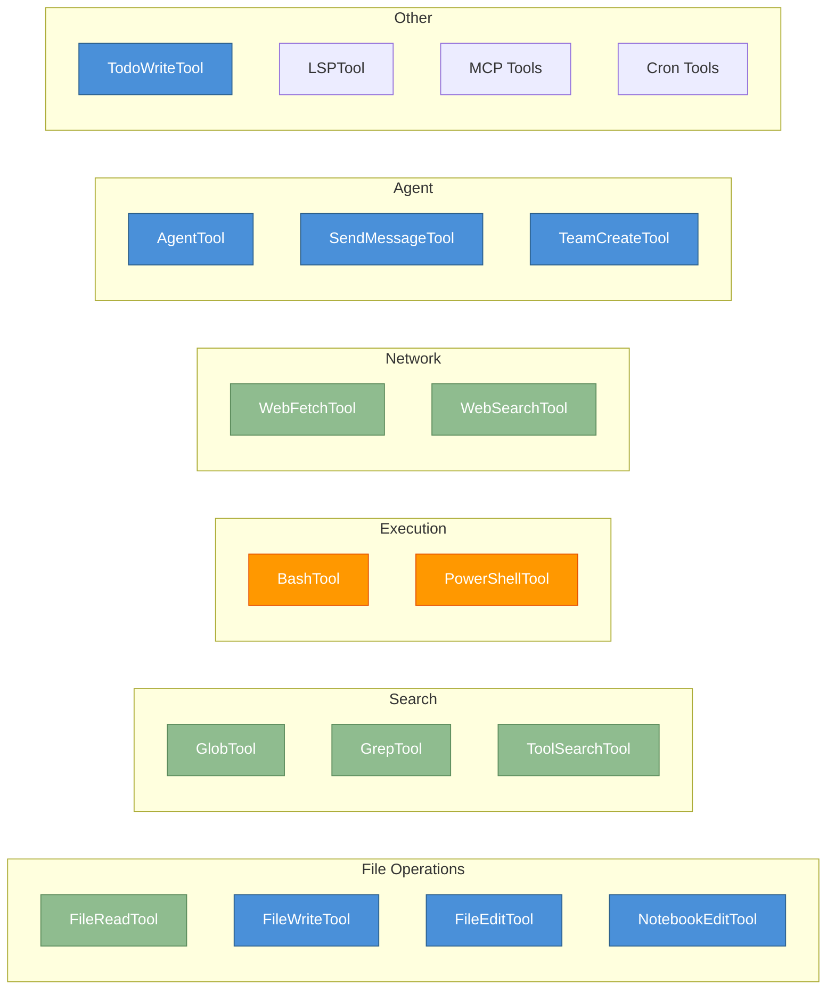
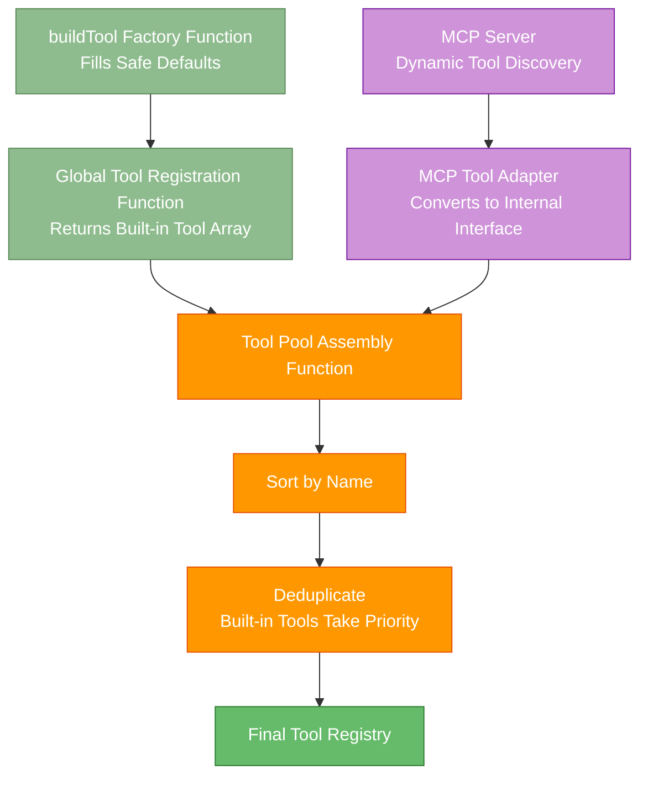
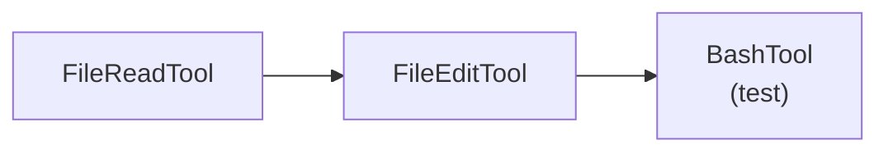
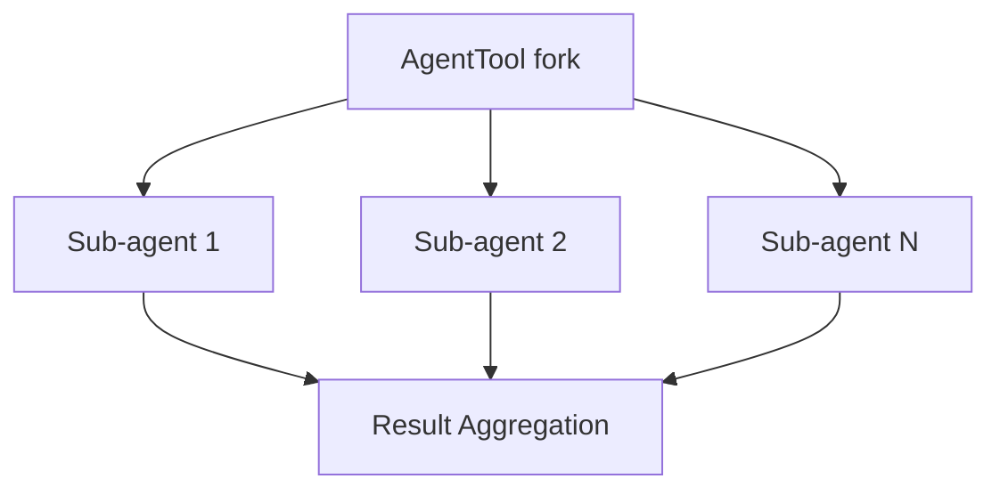

# Appendix B: Complete Tool Inventory

This appendix lists all tools registered in the Claude Code architecture, indexed by functional category. Tools are the fundamental capability units through which the agent interacts with the external world. Each tool is registered in the tool registry via a unified interface protocol and is dispatched by the conversation main loop.

**Permission Model Field Definitions**:
- **readOnly**: Whether the tool only performs read operations and does not modify the file system or external state. Read-only tools typically have more relaxed permission constraints and can be used in plan mode.
- **destructive**: Whether the tool performs irreversible operations (deletion, overwriting, sending). Destructive tools undergo stricter scrutiny during permission checks.
- **concurrencySafe**: Whether the tool can be safely executed in parallel (no dependency on shared mutable state). Concurrency-safe tools can be dispatched simultaneously by the streaming tool executor.

In the tables, `true`/`false` indicates the value is always returned; `dynamic` indicates runtime determination based on input parameters. Methods not explicitly overridden in the source code use the `buildTool` defaults (all `false`).

> **Cross-Reference**: The tool definition protocol is detailed in Appendix A.4.3, "Standard Protocol of the Tool Type System"; tool registration and discovery mechanisms are described in Chapter 3; the tool permission check flow is described in Appendix A.3, "Permission Determination Path."

---

## 1. File Operations

File operation tools are the foundational capabilities for the agent to process code and data. This group of tools covers the complete file operation chain from reading to editing to creation.

| Tool Name | readOnly | destructive | concurrencySafe | Description |
|---------|----------|-------------|-----------------|---------|
| FileReadTool | `true` | `false` | `true` | Reads file content; supports line number ranges, PDF pagination, images, and notebook formats |
| FileWriteTool | `false` | `false` | `false` | Writes files, overwriting existing content or creating new files |
| FileEditTool | `false` | `false` | `false` | Precise string-replacement editing; supports single-instance and global replacement |
| NotebookEditTool | `false` | `false` | `false` | Edits Jupyter Notebook cells (replace/insert/delete) |

**Usage Scenario Details**:
- **FileReadTool**: Suitable for code review (reading large files in segments), document analysis (PDF paginated reading), image understanding (multimodal input), and similar scenarios. Its concurrency safety allows multiple files to be read simultaneously to accelerate information gathering.
- **FileWriteTool**: Suitable for creating new files (e.g., configuration files, scaffolded code) or completely rewriting file content. Since writing is irreversible, it is recommended to use FileReadTool first to confirm the current content of important files.
- **FileEditTool**: Suitable for precisely modifying specific content within existing files. Its string matching mechanism ensures accurate modification placement, and the `replace_all` mode supports batch renaming and similar operations. This is the most commonly used tool for day-to-day code editing.
- **NotebookEditTool**: Designed specifically for Jupyter Notebooks, supporting insertion of code or markdown cells at specific positions, modification of existing cell content, and deletion of cells. Suitable for data analysis and scientific computing scenarios.

**Inter-Tool Collaboration Patterns**: A typical code modification workflow follows `FileReadTool -> Analysis -> FileEditTool/FileWriteTool`. First read to understand the current state, then decide whether to use precise editing or a complete rewrite.

## 2. Search

Search tools are the foundational capabilities for the agent to locate information in a codebase. File name search and content search complement each other, covering the complete search spectrum from structural positioning to semantic lookup.

| Tool Name | readOnly | destructive | concurrencySafe | Description |
|---------|----------|-------------|-----------------|---------|
| GlobTool | `true` | `false` | `true` | File name glob pattern matching search, sorted by modification time |
| GrepTool | `true` | `false` | `true` | Regex-based content search powered by ripgrep, supports multiple output modes |
| ToolSearchTool | `false` | `false` | `false` | Tool discovery search; matches lazily loaded tools by keyword |

**Usage Scenario Details**:
- **GlobTool**: Suitable for finding files by type (e.g., `**/*.ts`), by directory structure (e.g., `src/**/*.test.js`), or by modification time (most recently changed files appear first). Commonly used for project structure exploration and changed file identification.
- **GrepTool**: Suitable for searching for specific patterns in file content with regex support. Three output modes (files_with_matches, content, count) address different needs. Commonly used for API usage lookup, configuration item location, and code pattern analysis.
- **ToolSearchTool**: When the number of available tools is large (especially after enabling MCP dynamic tools), this tool helps the model quickly locate the needed tool by keyword, avoiding the need to include all tool descriptions in the context.

**Recommended Search Strategies**:
- When exploring an unfamiliar project: use GlobTool first to understand the file structure, then use GrepTool to search for key symbols.
- When locating specific code: GrepTool's content mode is the most efficient.
- When measuring code scale: GrepTool's count mode combined with GlobTool's file list.

## 3. Execution

Execution tools are the bridge between the agent and the operating system. BashTool is one of the most versatile tools; nearly all command-line operations are performed through it.

| Tool Name | readOnly | destructive | concurrencySafe | Description |
|---------|----------|-------------|-----------------|---------|
| BashTool | `dynamic` | `false` | `dynamic` | Shell command execution; read-only commands can run in parallel, write commands run serially. Permission is dynamically determined based on command content. |
| PowerShellTool | `dynamic` | `false` | `dynamic` | Windows PowerShell command execution (conditionally enabled, functionally equivalent to BashTool) |

**Usage Scenario Details**:
- **BashTool**: This is one of the most frequently used tools in Claude Code. Suitable for: building and testing (`npm test`, `cargo build`), version control (`git` operations), system administration (file operations, process management), script execution, package management, and more. Its `readOnly` and `concurrencySafe` attributes are dynamically determined based on command content.
- **PowerShellTool**: Automatically replaces BashTool in Windows environments, providing equivalent command execution capability. Only enabled when a Windows PowerShell environment is detected.

**Special Mechanisms of Execution Tools**:
- **Read-Only Detection**: BashTool internally maintains a list of read-only commands. Matched commands (e.g., `ls`, `cat`, `git status`) are marked as readOnly and can be executed under more relaxed permission conditions.
- **Parallel Execution**: When multiple BashTool invocations are all determined to be concurrencySafe, the streaming tool executor can dispatch them in parallel, significantly improving efficiency.
- **Timeout Management**: Long-running commands have a timeout mechanism to prevent indefinite blocking.
- **Output Truncation**: Command output is truncated when it exceeds the limit, with the remainder persisted to disk.

## 4. Network

Network tools provide the agent with the ability to access internet information, including two complementary approaches: web content fetching and web searching.

| Tool Name | readOnly | destructive | concurrencySafe | Description |
|---------|----------|-------------|-----------------|---------|
| WebFetchTool | `true` | `false` | `true` | Fetches URL content and converts it to markdown |
| WebSearchTool | `true` | `false` | `true` | Performs web search, returning structured search results |

**Usage Scenario Details**:
- **WebFetchTool**: Suitable for obtaining the complete content of a specific web page (e.g., API documentation, technical blogs). Converts HTML to markdown format for easier model comprehension and citation. Commonly used for consulting the latest documentation and verifying technical details.
- **WebSearchTool**: Suitable for open-ended information queries. Returns structured search results (titles, summaries, links) to help the model quickly learn the latest information on a topic. Commonly used for technical research and issue investigation.

**Combined Usage Pattern**: First use WebSearchTool for a broad search, then use WebFetchTool to deeply retrieve specific page content once relevant resources are identified.

## 5. Agent

Agent tools implement Claude Code's recursive composition capability, allowing agents to create and manage sub-agents, communicate among multiple agents, and form collaborative teams.

| Tool Name | readOnly | destructive | concurrencySafe | Description |
|---------|----------|-------------|-----------------|---------|
| AgentTool | `false` | `false` | `false` | Launches sub-agents (built-in/custom), supports fork, resume, and background execution |
| SendMessageTool | `dynamic` | `false` | `false` | Sends messages to other agents or channels; plain text messages are readOnly |
| TeamCreateTool | `false` | `false` | `false` | Creates multi-agent teams (conditionally enabled: Agent Swarms mode) |
| TeamDeleteTool | `false` | `false` | `false` | Deletes a created team |

**Usage Scenario Details**:
- **AgentTool**: The core sub-agent management tool. Suitable for decomposing complex tasks into subtasks for parallel processing, invoking built-in agents (e.g., ExploreAgent, PlanAgent) to complete specific phases, and performing high-risk operations in an isolated context. See Chapter 9 for sub-agent details.
- **SendMessageTool**: Used for cross-agent communication in multi-agent scenarios. Supports sending messages to specific agents or channels. See Chapter 10 for the coordinator pattern.
- **TeamCreateTool / TeamDeleteTool**: Used in Agent Swarms mode to create and manage multi-agent teams. Agents within a team can process their assigned subtasks in parallel.

## 6. Task Management

Task management tools provide lifecycle management capabilities for background tasks, with complete control from creation to monitoring to termination.

| Tool Name | readOnly | destructive | concurrencySafe | Description |
|---------|----------|-------------|-----------------|---------|
| TaskCreateTool | `false` | `false` | `false` | Creates a background task (conditionally enabled: Todo V2) |
| TaskGetTool | `true` | `false` | `true` | Gets details of a single task |
| TaskUpdateTool | `false` | `false` | `false` | Updates task status/content |
| TaskListTool | `true` | `false` | `true` | Lists all tasks |
| TaskOutputTool | `dynamic` | `false` | `dynamic` | Gets task output stream; concurrencySafe when readOnly |
| TaskStopTool | `false` | `false` | `true` | Stops a running task |

**Usage Scenario Details**: The task management toolset forms a complete CRUD + monitoring interface. A typical workflow is: TaskCreateTool to create a task -> TaskListTool to check progress -> TaskGetTool to inspect details -> TaskOutputTool to retrieve output -> TaskStopTool to stop the task when needed.

## 7. Plan

Plan mode tools provide safe planning capabilities, allowing the agent to formulate a plan before executing.

| Tool Name | readOnly | destructive | concurrencySafe | Description |
|---------|----------|-------------|-----------------|---------|
| EnterPlanModeTool | `true` | `false` | `true` | Enters plan mode, restricting to the read-only tool set |
| ExitPlanModeV2Tool | `true` | `false` | `true` | Exits plan mode, restoring normal tool permissions |

**Usage Scenario Details**: Plan mode is a safety strategy. Once entered, the agent can only use read-only tools (such as FileReadTool, GrepTool) for information gathering and analysis, and cannot perform any modification operations. Suitable for designing plans, assessing risks, and analyzing impact before executing complex changes. See Chapter 14 for structured workflows.

## 8. Worktree

Worktree tools provide file-system-level isolation for parallel tasks.

| Tool Name | readOnly | destructive | concurrencySafe | Description |
|---------|----------|-------------|-----------------|---------|
| EnterWorktreeTool | `false` | `false` | `false` | Creates a git worktree and switches the working directory (conditionally enabled) |
| ExitWorktreeTool | `false` | `false` | `false` | Exits the worktree, preserving or removing the working directory |

**Usage Scenario Details**: Worktree tools implement working directory isolation based on git worktree. Suitable for avoiding file conflicts when multiple sub-agents handle different tasks in parallel, making experimental modifications without affecting the main workspace, and working on different branches simultaneously.

## 9. Scheduling

Scheduling tools provide time-driven automation capabilities, allowing agents to execute tasks on a schedule.

| Tool Name | readOnly | destructive | concurrencySafe | Description |
|---------|----------|-------------|-----------------|---------|
| CronCreateTool | `false` | `false` | `false` | Creates a cron scheduled task (conditionally enabled: AGENT_TRIGGERS) |
| CronDeleteTool | `false` | `false` | `false` | Deletes a cron scheduled task |
| CronListTool | `true` | `false` | `true` | Lists all cron scheduled tasks |
| RemoteTriggerTool | `dynamic` | `false` | `false` | Remote trigger management (conditionally enabled: AGENT_TRIGGERS_REMOTE) |

**Usage Scenario Details**: The scheduling toolset implements time-driven automation for agents. CronCreateTool supports standard cron expressions for defining execution schedules, suitable for periodic code reviews, automated testing, scheduled report generation, and similar scenarios. RemoteTriggerTool extends triggering capabilities to remote environments.

## 10. Interaction

Interaction tools manage the agent's interactions with users and other system components.

| Tool Name | readOnly | destructive | concurrencySafe | Description |
|---------|----------|-------------|-----------------|---------|
| AskUserQuestionTool | `true` | `false` | `true` | Asks the user a question and waits for a reply |
| SkillTool | `false` | `false` | `false` | Invokes a registered slash command skill |
| ConfigTool | `dynamic` | `false` | `false` | Runtime configuration viewing/modification (ant build only) |

**Usage Scenario Details**:
- **AskUserQuestionTool**: When the agent encounters ambiguity or needs additional information during execution, it uses this tool to ask the user a question. This is the proactive communication channel between the agent and the user.
- **SkillTool**: Invokes slash commands registered through the skill system. Skills are extensible capability packages that expand the agent's domain-specific expertise through prompt templates and tool definitions. See Chapter 11 for the skill system.

## 11. MCP

MCP tools provide the ability to interact with MCP servers, enabling the agent to access external resources.

| Tool Name | readOnly | destructive | concurrencySafe | Description |
|---------|----------|-------------|-----------------|---------|
| ListMcpResourcesTool | `true` | `false` | `true` | Lists resources provided by MCP servers |
| ReadMcpResourceTool | `true` | `false` | `true` | Reads a specific resource on an MCP server |

**Usage Scenario Details**: MCP tools are the resource access interface for the Model Context Protocol client. ListMcpResourcesTool is used to discover available external resources (e.g., database tables, API endpoints), and ReadMcpResourceTool is used to read the content of a specific resource. Both tools are read-only and can be safely executed in parallel. See Chapter 12 for MCP integration.

## 12. Other

| Tool Name | readOnly | destructive | concurrencySafe | Description |
|---------|----------|-------------|-----------------|---------|
| TodoWriteTool | `false` | `false` | `false` | Todo panel writer (UI-linked, results not rendered to transcript) |
| BriefTool | `false` | `false` | `true` | Controls output brevity mode |
| LSPTool | `true` | `false` | `true` | LSP Language Server Protocol operations (conditionally enabled: ENABLE_LSP_TOOL) |
| SleepTool | `false` | `false` | `false` | Delayed wait (conditionally enabled: PROACTIVE / KAIROS) |
| TungstenTool | `false` | `false` | `false` | Internal tool (ant build only) |
| SyntheticOutputTool | `true` | `false` | `true` | Synthetic output tool (internal infrastructure) |
| SnipTool | `false` | `false` | `false` | History message trimming (conditionally enabled: HISTORY_SNIP) |
| MonitorTool | `false` | `false` | `false` | Monitor tool (conditionally enabled: MONITOR_TOOL) |
| WorkflowTool | `false` | `false` | `false` | Workflow script execution (conditionally enabled: WORKFLOW_SCRIPTS) |
| ListPeersTool | `false` | `false` | `false` | Lists peer agents (conditionally enabled: UDS_INBOX) |
| REPLTool | `false` | `false` | `false` | REPL wrapper, provides Bash/Read/Edit in a VM (ant build only) |
| SuggestBackgroundPRTool | `false` | `false` | `false` | Suggests background PR creation (ant build only) |
| WebBrowserTool | `false` | `false` | `false` | Browser tool (conditionally enabled: WEB_BROWSER_TOOL) |
| SendUserFileTool | `false` | `false` | `false` | Sends a file to the user (conditionally enabled: KAIROS) |
| PushNotificationTool | `false` | `false` | `false` | Push notification (conditionally enabled: KAIROS) |
| SubscribePRTool | `false` | `false` | `false` | PR webhook subscription (conditionally enabled: KAIROS_GITHUB_WEBHOOKS) |
| CtxInspectTool | `false` | `false` | `false` | Context inspector (conditionally enabled: CONTEXT_COLLAPSE) |
| TerminalCaptureTool | `false` | `false` | `false` | Terminal screenshot capture (conditionally enabled: TERMINAL_PANEL) |
| VerifyPlanExecutionTool | `false` | `false` | `false` | Plan execution verification (conditionally enabled: CLAUDE_CODE_VERIFY_PLAN) |
| OverflowTestTool | `false` | `false` | `false` | Overflow test tool (for internal testing) |
| TestingPermissionTool | `true` | `false` | `true` | Permission testing tool (NODE_ENV=test only) |

---

## Tool Enablement Conditions Quick Reference

Some tools are conditionally enabled through feature flags or environment variables. The table below lists all conditionally enabled tools and their corresponding flags:

| Condition Identifier | Enabled Tools | Referenced Chapter |
|---------|----------|---------|
| `USER_TYPE === 'ant'` | ConfigTool, TungstenTool, REPLTool, SuggestBackgroundPRTool | -- |
| `PROACTIVE` / `KAIROS` | SleepTool | Chapter 5 |
| `AGENT_TRIGGERS` | CronCreateTool, CronDeleteTool, CronListTool | Chapter 9 |
| `AGENT_TRIGGERS_REMOTE` | RemoteTriggerTool | Chapter 9 |
| `MONITOR_TOOL` | MonitorTool | Chapter 7 |
| `KAIROS` | SendUserFileTool, PushNotificationTool | Chapter 6 |
| `KAIROS_GITHUB_WEBHOOKS` | SubscribePRTool | Chapter 6 |
| `ENABLE_LSP_TOOL` | LSPTool | Chapter 7 |
| `WORKFLOW_SCRIPTS` | WorkflowTool | Chapter 9 |
| `HISTORY_SNIP` | SnipTool | Chapter 4 |
| `UDS_INBOX` | ListPeersTool | Chapter 7 |
| `WEB_BROWSER_TOOL` | WebBrowserTool | Chapter 7 |
| `CONTEXT_COLLAPSE` | CtxInspectTool | Chapter 4 |
| `TERMINAL_PANEL` | TerminalCaptureTool | Chapter 12 |
| `COORDINATOR_MODE` | Coordinator mode additionally enables AgentTool, TaskStopTool, SendMessageTool | Chapter 8 |
| `Todo V2` | TaskCreateTool, TaskGetTool, TaskUpdateTool, TaskListTool | -- |
| `Agent Swarms` | TeamCreateTool, TeamDeleteTool | Chapter 8 |
| `Worktree Mode` | EnterWorktreeTool, ExitWorktreeTool | Chapter 9 |
| `CLAUDE_CODE_SIMPLE` | Simplified mode retains only BashTool, FileReadTool, FileEditTool | -- |
| `ToolSearch` | ToolSearchTool | Chapter 3 |
| `CLAUDE_CODE_VERIFY_PLAN` | VerifyPlanExecutionTool | Chapter 14 |

> **Cross-Reference**: For detailed descriptions of feature flags, see Appendix C; for the dynamic tool registration mechanism, see Appendix A.3, "MCP Tool Dynamic Registration Path."

---

## Tool Registration Flow

All tools are created through a unified tool factory function, which fills in safe default values for methods not explicitly defined:

- `isEnabled()` defaults to returning `true`
- `isReadOnly()` defaults to returning `false`
- `isConcurrencySafe()` defaults to returning `false`
- `isDestructive()` defaults to returning `false`
- `checkPermissions()` defaults to returning allow
- `toAutoClassifierInput()` defaults to returning an empty string
- `userFacingName()` defaults to returning the tool name

The tool registration entry point is in the global tool registration function, which returns an array of tools. At runtime, the tool pool assembly function merges built-in tools with MCP dynamic tools, sorts them by name, and deduplicates them (built-in tools take priority).

---

## Recommended Tool Composition Patterns

The following lists several common tool composition patterns to help readers understand the collaborative relationships between tools:

### Pattern 1: Code Exploration and Understanding

First use GlobTool to locate the file structure, use GrepTool to search for key symbols, and use FileReadTool to read the specific code.

### Pattern 2: Code Modification

First read the target file, use FileEditTool for precise modification, then use BashTool to run tests for verification.

### Pattern 3: Information Research

First use WebSearchTool to search for related information, use WebFetchTool to retrieve specific page content, and finally use FileWriteTool to compile the results.

### Pattern 4: Multi-Task Parallelism

Fork multiple sub-agents through AgentTool, with each sub-agent independently processing its subtask. The parent agent ultimately aggregates the results.

### Pattern 5: Safe Planning

First enter plan mode for safety analysis, then exit plan mode to begin execution after planning is complete.

### Pattern 6: External Integration

Access external resources through MCP tools, combined with local tools for processing.

---

## Tool Performance Characteristics Overview

Understanding the performance characteristics of tools helps in making reasonable choices during use:

| Tool Category | Typical Latency | Token Consumption | Parallelism | Notes |
|---------|---------|----------|---------|---------|
| File Read | Low (local I/O) | Medium (depends on file size) | High (all concurrency-safe) | Large file output is truncated |
| File Write | Low (local I/O) | Low | No parallelism | Recommended to read and confirm before writing |
| File Edit | Low (local I/O) | Low | No parallelism | Requires exact match of original string |
| Search (Glob/Grep) | Low (local operation) | Medium (depends on result volume) | High (all concurrency-safe) | Result limits prevent token overflow |
| Bash Execution | Variable (depends on command) | Variable (depends on output) | Read-only commands can run in parallel | Long-running commands have timeout mechanism |
| Network Operations | High (network latency) | Medium (depends on page content) | High (all concurrency-safe) | Significantly affected by network conditions |
| Sub-agent | High (recursive API calls) | High (independent context) | High (independent execution) | Note nesting depth limits |
| MCP Operations | Medium (inter-process communication) | Medium (depends on resource size) | Depends on MCP server | Connection state affects availability |
