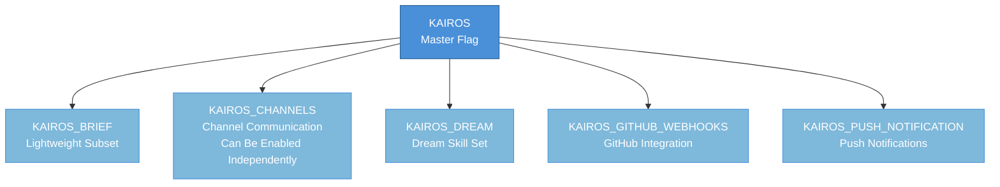
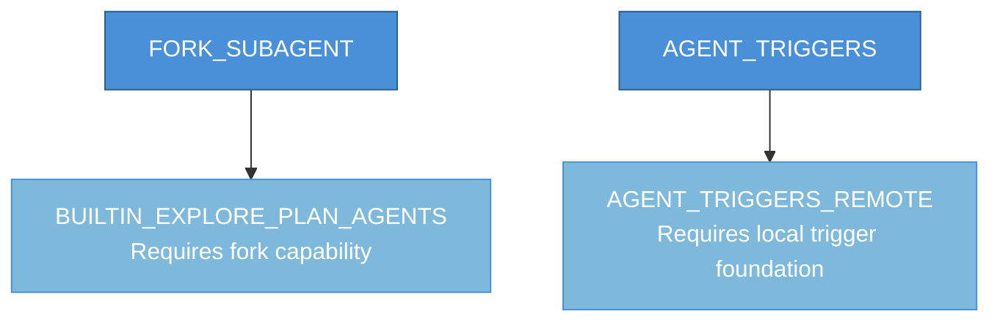
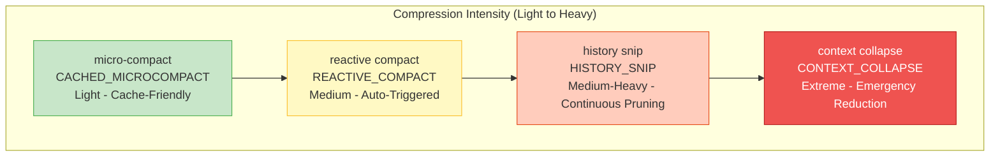
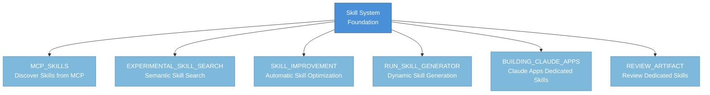
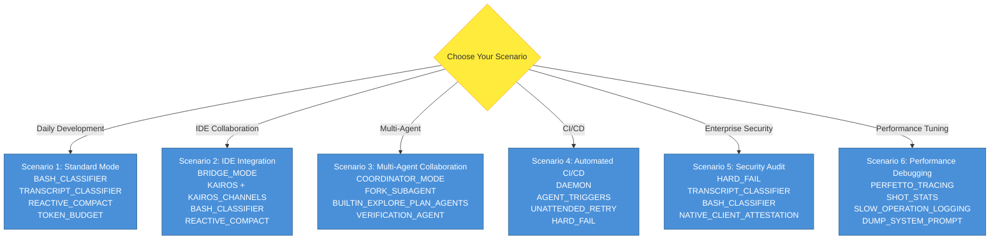

# Appendix C: Feature Flag Reference

> Feature flags are the core mechanism for implementing compile-time dead code elimination in Claude Code. All flags are injected as boolean values by the compiler during the bundling phase: when a flag is `false`, the code branch it guards is removed entirely, thereby reducing artifact size and protecting unreleased features.
>
> **Type Definitions**:
> - **Compile-time**: The flag is evaluated during the Bun bundling phase; code branches that resolve to `false` are completely absent from the output artifact.
> - **Compile-time + Runtime Gating**: The flag is `true` at compile time, but additional runtime conditions (such as environment variables or server-side configuration) must also be satisfied to truly activate the feature.
>
> **How to Use This Reference**:
> - Navigate to the target flag using the C.1 - C.12 category sections
> - The "Impact Scope" column describes the specific capabilities enabled when the flag is activated
> - The "Dependencies" column describes prerequisite relationships between flags
> - The "Tool Enablement Conditions Reference" table in Appendix B lists the specific tools enabled by each flag and can be used for cross-referencing

---

## C.1 Core Interaction Mode Flags

Core interaction mode flags control the primary operating modes of Claude Code. These flags define how the system interacts with users, IDEs, or other systems.

| Feature Flag | Type | Description | Impact Scope | Dependencies | Related Chapter |
|---|---|---|---|---|---|
| `PROACTIVE` | Compile-time | Proactive mode. When enabled, the agent can proactively offer suggestions and automatically execute background tasks during user idle periods | Enables SleepTool, proactive suggestion logic, background task triggers | No prerequisites | Chapter 5 |
| `KAIROS` | Compile-time + Runtime Gating | Assistant mode (formerly Harbor). IDE-oriented channel-based collaboration, including channel messaging, session recovery, and the complete feature set | Enables channel communication, session recovery, SleepTool, SendUserFileTool, PushNotificationTool, and the full feature set | No prerequisites, though some sub-features require their own sub-flags | Chapter 6 |
| `KAIROS_BRIEF` | Compile-time | KAIROS lightweight subset. Only enables basic capabilities such as session recovery, without the full channel functionality | Session recovery and basic interaction only | Depends on KAIROS context | Chapter 6 |
| `KAIROS_CHANNELS` | Compile-time + Runtime Gating | Channel functionality toggle independent of the full KAIROS feature set, allowing channel messaging alone to be enabled | Sending, receiving, and routing of channel messages | Can be enabled independently of the full KAIROS feature set | Chapter 6 |
| `KAIROS_DREAM` | Compile-time | KAIROS Dream mode, used for loading additional skill sets | Loading and registration of Dream-specific skill sets | Depends on KAIROS | Chapter 6 |
| `KAIROS_GITHUB_WEBHOOKS` | Compile-time | GitHub Webhook integration. Receives GitHub event pushes in KAIROS mode | SubscribePRTool, GitHub event listening and routing | Depends on KAIROS | Chapter 6 |
| `KAIROS_PUSH_NOTIFICATION` | Compile-time | KAIROS push notification capability | Notification logic for PushNotificationTool | Depends on KAIROS | Chapter 6 |
| `BRIDGE_MODE` | Compile-time + Runtime Gating | IDE bridge mode. When enabled, the REPL communicates with the IDE (e.g., VS Code) via a bridging protocol, supporting permission callback pipelines | IDE bidirectional communication, JWT authentication, permission callbacks, state synchronization | Requires an IDE plugin | Chapter 7 |
| `COORDINATOR_MODE` | Compile-time + Runtime Gating | Coordinator mode. Acts as a coordinator in multi-agent scenarios, distributing tasks and aggregating results | AgentTool, TaskStopTool, SendMessageTool coordinator extensions | No prerequisites | Chapter 8 |
| `VOICE_MODE` | Compile-time | Voice mode. Enables voice input/output, push-to-talk key bindings, and voice integration modules | Voice input capture, speech synthesis output, PTT key bindings | Requires microphone and speaker hardware support | Chapter 12 |
| `DAEMON` | Compile-time | Background daemon mode. Allows Claude Code to run long-term as a daemon process | Daemon startup logic, persistent services, scheduled task framework | No prerequisites | Chapter 11 |
| `BUDDY` | Compile-time | Companion Sprite. Displays an interactive animated character in the REPL interface, providing emotional feedback | Buddy component rendering, animation state machine, interaction event handling | No prerequisites | Chapter 12 |

**KAIROS Flag Family Relationship Diagram**:

## C.2 Agent and Subtask Flags

This group of flags controls the agent's task decomposition, scheduling, and automated execution capabilities.

| Feature Flag | Type | Description | Impact Scope | Dependencies | Related Chapter |
|---|---|---|---|---|---|
| `FORK_SUBAGENT` | Compile-time | Fork sub-agent. Allows creating independent sub-agents via a fork mechanism within a conversation to handle subtasks | AgentTool fork capability, sub-agent context isolation | No prerequisites | Chapter 8 |
| `AGENT_TRIGGERS` | Compile-time | Agent triggers. Enables scheduled task dispatch (cron) and periodic background agent execution | CronCreateTool, CronDeleteTool, CronListTool | Depends on DAEMON or a long-running environment | Chapter 9 |
| `AGENT_TRIGGERS_REMOTE` | Compile-time | Remote agent triggers. Supports execution of remotely hosted scheduled triggers | RemoteTriggerTool, remote trigger communication protocol | Depends on AGENT_TRIGGERS | Chapter 9 |
| `ULTRAPLAN` | Compile-time | Ultra-planning mode. Provides an interactive planning dialog that allows users to review and modify execution plans for complex tasks | Enhanced planning interface for EnterPlanModeTool/ExitPlanModeV2Tool | No prerequisites | Chapter 5 |
| `VERIFICATION_AGENT` | Compile-time | Verification agent. Automatically initiates a verification process after task completion | Post-task automatic verification logic, verification result reports | No prerequisites | Chapter 8 |
| `BUILTIN_EXPLORE_PLAN_AGENTS` | Compile-time | Built-in explore-plan agents. Provides pre-installed exploration and planning sub-agents | ExploreAgent, PlanAgent, and other built-in agent definitions | Depends on FORK_SUBAGENT | Chapter 8 |
| `AGENT_MEMORY_SNAPSHOT` | Compile-time | Agent memory snapshot. Supports snapshotting and restoring agent state | Snapshot creation, serialized storage, restore loading logic | No prerequisites | Chapter 10 |
| `WORKFLOW_SCRIPTS` | Compile-time | Workflow scripts. Enables local workflow task processors, supporting automated script orchestration | WorkflowTool, workflow script parsing and execution engine | No prerequisites | Chapter 9 |
| `TEMPLATES` | Compile-time | Template system. Enables the Job Classifier for identifying and routing different types of user requests | Job Classifier, request type identification, routing dispatch | No prerequisites | Chapter 9 |

**Agent Flag Dependency Relationships**:

## C.3 Context Management and Compression Flags

Context management flags control how Claude Code handles the token limits of the context window. Together, these flags form a multi-layered compression strategy system, ranging from preventive lightweight compression to emergency aggressive pruning.

| Feature Flag | Type | Description | Impact Scope | Dependencies | Related Chapter |
|---|---|---|---|---|---|
| `REACTIVE_COMPACT` | Compile-time + Runtime Gating | Reactive compression. Automatically triggers context compression when tokens approach the threshold, rather than waiting for user confirmation | Automatic compression trigger logic, threshold detector | No prerequisites | Chapter 4 |
| `CONTEXT_COLLAPSE` | Compile-time | Context collapse. Provides a more aggressive context reduction strategy than traditional compression, including a dedicated collapse UI and recovery mechanism | CtxInspectTool, collapse UI component, content recovery logic | No prerequisites | Chapter 4 |
| `CACHED_MICROCOMPACT` | Compile-time | Cached micro-compaction. Maintains prompt cache boundaries during micro-compaction, avoiding the overhead of cache invalidation | Micro-compaction cache boundary markers, cache-aware compression strategy | Depends on Prompt Cache API support | Chapter 4 |
| `HISTORY_SNIP` | Compile-time | History pruning (Snip Compact). Intelligently prunes processed conversation history, retaining key information while significantly reducing token usage | SnipTool, history message pruning algorithm | No prerequisites | Chapter 4 |
| `COMPACTION_REMINDERS` | Compile-time | Compression reminders. Displays reminder messages to the user during the compression process | Pre- and post-compression user notification UI | Depends on compression operations | Chapter 4 |
| `PROMPT_CACHE_BREAK_DETECTION` | Compile-time | Prompt cache break detection. Detects and reports prompt cache boundary breaks during compression operations | Cache breakpoint detection logic, break report generation | Depends on compression operations | Chapter 4 |
| `TOKEN_BUDGET` | Compile-time | Token budget manager. Tracks and visualizes token usage budgets, providing budget overrun warnings | Token usage tracking, budget warning UI, usage statistics | No prerequisites | Chapter 4 |
| `COMMIT_ATTRIBUTION` | Compile-time | Commit attribution. Adds pre- and post-compression context attribution markers to code commits after compression | Compression context to commit message mapping logic | Depends on compression operations | Chapter 4 |

**Compression Flag Strategy Matrix**:

| Compression Strategy | Corresponding Flag | Compression Intensity | Cache-Friendly | Applicable Scenario |
|---------|---------|---------|---------|---------|
| micro-compact | `CACHED_MICROCOMPACT` | Light | High | Preventive compression when approaching the threshold |
| reactive compact | `REACTIVE_COMPACT` | Medium | Medium | Automatically triggered standard compression |
| history snip | `HISTORY_SNIP` | Medium-Heavy | Low | Intelligent pruning of history messages |
| context collapse | `CONTEXT_COLLAPSE` | Extreme | Low | Aggressive reduction in emergency situations |

> **Recommended Configuration**: Enabling `REACTIVE_COMPACT` + `CACHED_MICROCOMPACT` + `TOKEN_BUDGET` together provides the best context management experience, offering both preventive protection and budget visualization.

## C.4 Permission and Security Flags

Permission and security flags control the agent's autonomous execution boundaries and security auditing capabilities. Together, these flags define the Claude Code trust model.

| Feature Flag | Type | Description | Impact Scope | Dependencies | Related Chapter |
|---|---|---|---|---|---|
| `TRANSCRIPT_CLASSIFIER` | Compile-time | Transcript classifier. Automatically determines the permission mode (including auto mode) based on conversation content, replacing purely manual permission switching | Permission mode automatic inference, auto mode decision logic | No prerequisites | Chapter 3 |
| `BASH_CLASSIFIER` | Compile-time | Bash classifier. Performs security classification on Bash commands; high-confidence safe commands can be automatically approved | Bash command security assessment, read-only command auto-approval | No prerequisites | Chapter 3 |
| `HARD_FAIL` | Compile-time | Hard fail mode. Terminates directly on critical errors rather than degrading gracefully | Error handling strategy, critical fault termination logic | No prerequisites | Chapter 3 |
| `NATIVE_CLIENT_ATTESTATION` | Compile-time | Native client attestation. Enables platform-native client identity verification mechanisms | Client identity verification, platform security integration | Requires platform security framework support | Chapter 3 |
| `ANTI_DISTILLATION_CC` | Compile-time | Anti-distillation protection. Prevents model outputs from being used for model distillation attacks | Output watermarking, distillation detection logic | No prerequisites | Chapter 3 |

**Security Flag Combination Recommendations**:

| Security Level | Recommended Combination | Description |
|---------|---------|------|
| Maximum Security (Enterprise Environment) | `TRANSCRIPT_CLASSIFIER` + `BASH_CLASSIFIER` + `HARD_FAIL` + `NATIVE_CLIENT_ATTESTATION` + `ANTI_DISTILLATION_CC` | All security features enabled |
| Standard Security | `TRANSCRIPT_CLASSIFIER` + `BASH_CLASSIFIER` | Automated classification assistance, reduced manual intervention |
| Development Debugging | `HARD_FAIL` only | Quickly surface errors for easier debugging |

## C.5 Tool and Skill Flags

Tool and skill flags control the extensibility of available tools in Claude Code and tool behaviors.

| Feature Flag | Type | Description | Impact Scope | Dependencies | Related Chapter |
|---|---|---|---|---|---|
| `MONITOR_TOOL` | Compile-time | Monitor tool. Provides monitoring capability when the Bash tool executes background tasks | MonitorTool, background task output monitoring | No prerequisites | Chapter 7 |
| `WEB_BROWSER_TOOL` | Compile-time | Web browser tool. Enables the built-in browser panel, supporting web browsing and content extraction | WebBrowserTool, browser panel UI | No prerequisites | Chapter 7 |
| `MCP_SKILLS` | Compile-time | MCP skill discovery. Allows dynamic discovery and loading of skills from MCP servers | MCP skill discovery protocol, dynamic skill registration | Depends on MCP connection | Chapter 7 |
| `EXPERIMENTAL_SKILL_SEARCH` | Compile-time | Experimental skill search. Enables semantic-based skill indexing and search capabilities | Semantic skill indexing, skill search engine | No prerequisites | Chapter 7 |
| `SKILL_IMPROVEMENT` | Compile-time | Skill improvement. Supports automatic optimization and iteration of installed skills | Skill auto-optimization logic, iterative improvement engine | Depends on skill system | Chapter 7 |
| `RUN_SKILL_GENERATOR` | Compile-time | Skill generator runner. Supports dynamic generation of new skills | Skill generation tool, dynamic skill creation workflow | Depends on skill system | Chapter 7 |
| `BUILDING_CLAUDE_APPS` | Compile-time | Claude app building mode. Loads a dedicated skill set for building Claude applications | Claude Apps dedicated skill set, application templates | Depends on skill system | Chapter 7 |
| `REVIEW_ARTIFACT` | Compile-time | Review artifact. Loads code review-related skills | Code review skill set, review templates | Depends on skill system | Chapter 7 |
| `HOOK_PROMPTS` | Compile-time | Hook prompts. Allows hooks to inject custom prompts into the conversation flow | Hook prompt injection mechanism, dynamic prompt extension | Depends on hook system | Chapter 9 |
| `CONNECTOR_TEXT` | Compile-time | Connector text blocks. Supports rendering special connector text block types within the message stream | Connector text renderer, special text block types | No prerequisites | Chapter 7 |
| `UDS_INBOX` | Compile-time | Unix Domain Socket inbox. Receives messages from other processes via UDS | ListPeersTool, UDS message listener | Requires UDS system support | Chapter 7 |
| `MCP_RICH_OUTPUT` | Compile-time | MCP rich output. Allows MCP tools to return structured rich media content | MCP output format extension, rich media rendering | Depends on MCP connection | Chapter 7 |
| `TREE_SITTER_BASH` | Compile-time | Tree-sitter Bash parsing. Uses Tree-sitter for precise AST parsing of Bash commands | Bash command AST parser, precise security analysis | No prerequisites | Chapter 3 |
| `TREE_SITTER_BASH_SHADOW` | Compile-time + Runtime Gating | Tree-sitter Bash shadow mode. Runs Tree-sitter in parallel alongside the existing parser for result comparison and verification | Parallel parsing comparison, result consistency verification | Depends on TREE_SITTER_BASH | Chapter 3 |

**Skill Flag Relationship Diagram**:

## C.6 Session and Persistence Flags

Session and persistence flags control the lifecycle management and state persistence capabilities of Claude Code sessions.

| Feature Flag | Type | Description | Impact Scope | Dependencies | Related Chapter |
|---|---|---|---|---|---|
| `BG_SESSIONS` | Compile-time | Background sessions. Supports maintaining independent session instances in the background, allowing long-running tasks to execute detached from the foreground | Background session manager, session serialization and recovery | No prerequisites | Chapter 11 |
| `AWAY_SUMMARY` | Compile-time | Away summary. Automatically generates a conversation summary covering the period when the user was away, displayed upon their return | Away detection, summary generation, return display | Depends on session persistence | Chapter 11 |
| `FILE_PERSISTENCE` | Compile-time | File persistence. Enables session-level file persistence tracking | File change tracking, state consistency during session recovery | No prerequisites | Chapter 11 |
| `NEW_INIT` | Compile-time | New initialization flow. Uses an improved session initialization logic | Session initialization flow, startup optimization | No prerequisites | Chapter 11 |

> **Recommended Configuration**: For scenarios requiring long-running tasks, it is recommended to enable `BG_SESSIONS` + `AWAY_SUMMARY` + `FILE_PERSISTENCE` together to ensure tasks can reliably execute in the background and seamlessly resume when the user returns.

## C.7 Memory and Knowledge Management Flags

Memory and knowledge management flags control Claude Code's cross-session knowledge storage, retrieval, and sharing capabilities.

| Feature Flag | Type | Description | Impact Scope | Dependencies | Related Chapter |
|---|---|---|---|---|---|
| `TEAMMEM` | Compile-time + Runtime Gating | Team memory. Enables a team-level shared memory file system, supporting read/write and synchronization of a team knowledge base | Team memory file read/write, knowledge base synchronization mechanism | No prerequisites | Chapter 10 |
| `EXTRACT_MEMORIES` | Compile-time | Memory extraction. Automatically extracts reusable knowledge fragments from conversations at session end and writes them to memory files | Automatic knowledge extraction, memory file writing | Depends on memory system | Chapter 10 |
| `LODESTONE` | Compile-time | Lodestone. Enables enhanced memory retrieval and matching mechanisms | Memory relevance scoring, enhanced retrieval algorithm | Depends on memory system | Chapter 10 |
| `MEMORY_SHAPE_TELEMETRY` | Compile-time | Memory shape telemetry. Collects anonymous telemetry data on memory file shape and usage patterns | Memory file statistical analysis, anonymous telemetry reporting | Depends on memory system | Chapter 10 |

**Memory Flag Enhancement Path**: Enabling `LODESTONE` improves the relevance accuracy of memory retrieval; combined with `EXTRACT_MEMORIES`, knowledge can be automatically distilled from conversations. In a team environment, additionally enabling `TEAMMEM` enables team-level knowledge sharing.

## C.8 Remote and Connectivity Flags

Remote and connectivity flags control Claude Code's connectivity capabilities across different network environments and deployment scenarios.

| Feature Flag | Type | Description | Impact Scope | Dependencies | Related Chapter |
|---|---|---|---|---|---|
| `SSH_REMOTE` | Compile-time | SSH remote mode. Supports connecting to remote machines via SSH to run Claude Code | SSH connection management, remote environment adaptation | Requires SSH infrastructure | Chapter 11 |
| `DIRECT_CONNECT` | Compile-time | Direct connect mode. Supports bypassing proxies to connect directly to the Anthropic API | Proxy bypass logic, direct connection network configuration | No prerequisites | Chapter 11 |
| `CHICAGO_MCP` | Compile-time | Chicago MCP. Enables a specific MCP server configuration and Computer Use integration | Computer Use toolset, dedicated MCP configuration | Depends on MCP integration | Chapter 7 |
| `CCR_AUTO_CONNECT` | Compile-time | CCR auto-connect. Automatically establishes a connection to the CCR (Claude Code Remote) service | CCR service auto-discovery, connection establishment | Depends on CCR service | Chapter 11 |
| `CCR_MIRROR` | Compile-time | CCR mirror. Supports bidirectional mirroring of session state between local and remote | Session state bidirectional synchronization, conflict resolution | Depends on CCR service | Chapter 11 |
| `CCR_REMOTE_SETUP` | Compile-time | CCR remote setup. Enables a one-click remote environment configuration flow | Remote environment auto-configuration, dependency installation | Depends on CCR service | Chapter 11 |
| `SELF_HOSTED_RUNNER` | Compile-time | Self-hosted runner. Supports running agents on self-hosted infrastructure | Self-hosted execution environment, infrastructure adaptation | No prerequisites | Chapter 11 |
| `BYOC_ENVIRONMENT_RUNNER` | Compile-time | BYOC environment runner. Supports agent execution in "Bring Your Own Cloud" environments | BYOC environment integration, multi-cloud adaptation | No prerequisites | Chapter 11 |

**Remote Deployment Scenarios and Flag Combinations**:

| Deployment Scenario | Recommended Flag Combination |
|---------|------------|
| Local development | No remote flags needed |
| SSH remote development | `SSH_REMOTE` |
| CCR cloud development | `CCR_AUTO_CONNECT` + `CCR_MIRROR` + `CCR_REMOTE_SETUP` |
| Self-hosted server | `SELF_HOSTED_RUNNER` + `DIRECT_CONNECT` |
| BYOC enterprise environment | `BYOC_ENVIRONMENT_RUNNER` + `DIRECT_CONNECT` |

## C.9 UI and Interface Flags

UI and interface flags control the visual presentation and interaction capabilities of the Claude Code terminal interface.

| Feature Flag | Type | Description | Impact Scope | Dependencies | Related Chapter |
|---|---|---|---|---|---|
| `MESSAGE_ACTIONS` | Compile-time + Runtime Gating | Message actions. Enables contextual action buttons on messages (e.g., copy, regenerate, etc.) | Message action button UI, context menus | No prerequisites | Chapter 12 |
| `TERMINAL_PANEL` | Compile-time + Runtime Gating | Terminal panel. Enables an independent terminal panel in full-screen layout (shortcut Meta+J) | TerminalCaptureTool, terminal panel component, full-screen layout | Depends on full-screen terminal environment | Chapter 12 |
| `QUICK_SEARCH` | Compile-time | Quick search. Enables in-conversation quick search functionality | Search UI, conversation content indexing | No prerequisites | Chapter 12 |
| `HISTORY_PICKER` | Compile-time | History picker. Provides a visual conversation history browsing and switching interface | History browsing UI, session switcher | No prerequisites | Chapter 12 |
| `AUTO_THEME` | Compile-time + Runtime Gating | Auto theme. Automatically switches between light and dark themes based on system preferences | Theme detection, auto-switching logic | Requires system theme API support | Chapter 12 |
| `STREAMLINED_OUTPUT` | Compile-time | Streamlined output. Reduces redundant visual elements in the interface, providing a more compact output style | Compact output rendering, visual element reduction | No prerequisites | Chapter 12 |
| `NATIVE_CLIPBOARD_IMAGE` | Compile-time | Native clipboard image. Supports pasting images directly from the system clipboard into conversations | Clipboard image reading, image format conversion | Requires platform clipboard API support | Chapter 12 |

## C.10 Settings Synchronization Flags

Settings synchronization flags control the bidirectional synchronization of user configurations between local and cloud storage.

| Feature Flag | Type | Description | Impact Scope | Dependencies | Related Chapter |
|---|---|---|---|---|---|
| `UPLOAD_USER_SETTINGS` | Compile-time | Upload user settings. Syncs local user settings to the cloud | Local-to-cloud configuration upload, conflict detection | Requires cloud service | Chapter 10 |
| `DOWNLOAD_USER_SETTINGS` | Compile-time + Runtime Gating | Download user settings. Pulls and applies user settings from the cloud to the local environment | Cloud-to-local configuration download, configuration merging | Depends on UPLOAD_USER_SETTINGS | Chapter 10 |

> **Note**: Settings synchronization typically requires both flags to be enabled together for complete bidirectional sync. `UPLOAD_USER_SETTINGS` is responsible for pushing local changes to the cloud, while `DOWNLOAD_USER_SETTINGS` is responsible for pulling existing configurations in a new environment.

## C.11 Telemetry and Diagnostic Flags

Telemetry and diagnostic flags control Claude Code's runtime data collection, performance profiling, and debugging capabilities. These flags are primarily used for internal quality assurance and performance optimization.

| Feature Flag | Type | Description | Impact Scope | Dependencies | Related Chapter |
|---|---|---|---|---|---|
| `COWORKER_TYPE_TELEMETRY` | Compile-time | Coworker type telemetry. Collects and reports type information about coworkers (e.g., IDE, terminal) | Collaboration environment detection, anonymous type reporting | No prerequisites | Chapter 13 |
| `ENHANCED_TELEMETRY_BETA` | Compile-time | Enhanced telemetry Beta. Enables extended anonymous usage telemetry data collection | Extended telemetry data collection, anonymous statistics | No prerequisites | Chapter 13 |
| `PERFETTO_TRACING` | Compile-time | Perfetto tracing. Integrates the Chrome Perfetto tracing framework for performance profiling and timeline visualization | Perfetto tracing integration, performance data export | No prerequisites | Chapter 13 |
| `SHOT_STATS` | Compile-time | Shot statistics. Collects and displays detailed statistics for each API call | API call statistics, latency analysis | No prerequisites | Chapter 13 |
| `SLOW_OPERATION_LOGGING` | Compile-time | Slow operation logging. Records operations whose execution time exceeds a threshold to assist with performance diagnostics | Slow operation detection, threshold alerts, performance logging | No prerequisites | Chapter 13 |
| `ABLATION_BASELINE` | Compile-time | Ablation baseline. Serves as the baseline control group in A/B experiments for evaluating the impact of new features | A/B experiment framework, baseline data collection | No prerequisites | Chapter 13 |

**Diagnostic Flag Combination Recommendations**:

| Diagnostic Purpose | Recommended Combination |
|---------|---------|
| Performance profiling | `PERFETTO_TRACING` + `SHOT_STATS` + `SLOW_OPERATION_LOGGING` |
| Usage statistics | `COWORKER_TYPE_TELEMETRY` + `ENHANCED_TELEMETRY_BETA` |
| A/B experiments | `ABLATION_BASELINE` + target flags to be tested |

## C.12 Infrastructure and Build Flags

Infrastructure and build flags control low-level technical behavior and build configuration. These flags typically do not require direct user attention, but are important in specific deployment and debugging scenarios.

| Feature Flag | Type | Description | Impact Scope | Dependencies | Related Chapter |
|---|---|---|---|---|---|
| `UNATTENDED_RETRY` | Compile-time | Unattended retry. Automatically retries on API call failures without user intervention | API retry logic, backoff strategy, maximum retry count | No prerequisites | Chapter 13 |
| `IS_LIBC_GLIBC` | Compile-time | Detects whether the target platform's libc is the glibc implementation, used for binary compatibility determination | Compatibility selection during binary distribution | No prerequisites | Appendix |
| `IS_LIBC_MUSL` | Compile-time | Detects whether the target platform's libc is the musl implementation (e.g., Alpine Linux), used for binary compatibility determination | Compatibility selection during binary distribution | No prerequisites | Appendix |
| `POWERSHELL_AUTO_MODE` | Compile-time | PowerShell auto mode. Provides dedicated automated permission configuration for Windows PowerShell environments | PowerShell environment permission auto-configuration | Windows environments only | Appendix |
| `ALLOW_TEST_VERSIONS` | Compile-time | Allow test versions. Accepts pre-release/test version numbers during version checks | Version check logic, pre-release version acceptance | No prerequisites | Appendix |
| `SKIP_DETECTION_WHEN_AUTOUPDATES_DISABLED` | Compile-time | Skip detection when auto-updates are disabled. When auto-updates have been explicitly disabled, skips version detection logic to reduce startup latency | Version detection skip, startup optimization | No prerequisites | Appendix |
| `DUMP_SYSTEM_PROMPT` | Compile-time | Dump system prompt. When enabled, outputs the complete system prompt to a log or file for debugging purposes | System prompt export, debug logging | No prerequisites | Appendix |
| `OVERFLOW_TEST_TOOL` | Compile-time | Overflow test tool. Provides a dedicated test tool for verifying context overflow handling logic | OverflowTestTool, overflow scenario simulation | Testing environments only | Appendix |
| `ULTRATHINK` | Compile-time | Deep thinking mode. Enables Extended Thinking capability | Extended Thinking API calls, thinking token processing | No prerequisites | Chapter 5 |
| `TORCH` | Compile-time | Torch mode. Experimental enhanced reasoning capability | Enhanced reasoning engine, experimental reasoning strategies | No prerequisites | Chapter 5 |

> **Debugging Tip**: When troubleshooting abnormal system behavior, `DUMP_SYSTEM_PROMPT` is one of the most effective diagnostic tools available. It can export the complete system prompt sent to the model, making it easy to inspect whether instructions are assembled correctly.

---

## C.13 Flag Usage Statistics

| Category | Count |
|---|---|
| Core Interaction Modes | 12 |
| Agent and Subtasks | 9 |
| Context Management and Compression | 8 |
| Permission and Security | 5 |
| Tools and Skills | 14 |
| Session and Persistence | 4 |
| Memory and Knowledge Management | 4 |
| Remote and Connectivity | 8 |
| UI and Interface | 7 |
| Settings Synchronization | 2 |
| Telemetry and Diagnostics | 6 |
| Infrastructure and Build | 10 |
| **Total** | **89** |

> **Note**: The flag list above is compiled from system architecture analysis and may change with version iterations. The specific activation method for each feature flag is determined by the build configuration, and some flags also require runtime gating conditions (such as specific activation detection functions) to truly activate the corresponding features.

---

## C.14 Common Configuration Scenario Recommendations

The following lists several typical usage scenarios and their recommended feature flag combinations to help readers configure based on their actual needs:

### Scenario 1: Daily Development (Standard Mode)

Suitable for everyday use by most developers, providing a balanced set of features and security.

**Core Flags**: `BASH_CLASSIFIER` + `TRANSCRIPT_CLASSIFIER` + `REACTIVE_COMPACT` + `TOKEN_BUDGET`

### Scenario 2: IDE Integration Development

Suitable for scenarios where Claude Code is used via plugins in VS Code or JetBrains.

**Core Flags**: `BRIDGE_MODE` + `KAIROS` + `KAIROS_CHANNELS` + `BASH_CLASSIFIER` + `REACTIVE_COMPACT`

### Scenario 3: Multi-Agent Collaboration

Suitable for complex scenarios requiring task distribution and coordination among multiple agents.

**Core Flags**: `COORDINATOR_MODE` + `FORK_SUBAGENT` + `BUILTIN_EXPLORE_PLAN_AGENTS` + `VERIFICATION_AGENT` + `AGENT_MEMORY_SNAPSHOT`

### Scenario 4: Automated CI/CD Integration

Suitable for unattended execution in CI/CD pipelines.

**Core Flags**: `DAEMON` + `AGENT_TRIGGERS` + `UNATTENDED_RETRY` + `HARD_FAIL` + `WORKFLOW_SCRIPTS`

### Scenario 5: Security Audit Mode

Suitable for enterprise environments with stringent security requirements.

**Core Flags**: `HARD_FAIL` + `TRANSCRIPT_CLASSIFIER` + `BASH_CLASSIFIER` + `NATIVE_CLIENT_ATTESTATION` + `ANTI_DISTILLATION_CC` + `ULTRAPLAN`

### Scenario 6: Performance Debugging and Optimization

Suitable for troubleshooting performance issues or optimizing system behavior.

**Core Flags**: `PERFETTO_TRACING` + `SHOT_STATS` + `SLOW_OPERATION_LOGGING` + `DUMP_SYSTEM_PROMPT` + `PROMPT_CACHE_BREAK_DETECTION`

---

## C.15 Global Flag Dependency Relationship Diagram

The following diagram illustrates the primary dependency relationships and grouping structure among feature flags:

```mermaid
flowchart TD
    subgraph InteractionModeLayer["Interaction Mode Layer"]
        PROACTIVE
        KAIROS --> KAIROS_BRIEF
        KAIROS --> KAIROS_CHANNELS
        KAIROS --> KAIROS_DREAM
        KAIROS --> KAIROS_GITHUB_WEBHOOKS
        KAIROS --> KAIROS_PUSH_NOTIFICATION
        BRIDGE_MODE
        COORDINATOR_MODE
        VOICE_MODE
        DAEMON
        BUDDY
    end

    subgraph AgentLayer["Agent Layer"]
        FORK_SUBAGENT --> BUILTIN_EXPLORE_PLAN_AGENTS
        AGENT_TRIGGERS --> AGENT_TRIGGERS_REMOTE
        ULTRAPLAN
        VERIFICATION_AGENT
        AGENT_MEMORY_SNAPSHOT
        WORKFLOW_SCRIPTS
        TEMPLATES
    end

    subgraph ContextManagementLayer["Context Management Layer"]
        REACTIVE_COMPACT
        CONTEXT_COLLAPSE
        CACHED_MICROCOMPACT
        HISTORY_SNIP
        COMPACTION_REMINDERS
        PROMPT_CACHE_BREAK_DETECTION
        TOKEN_BUDGET
        COMMIT_ATTRIBUTION
    end

    subgraph SecurityLayer["Security Layer"]
        TRANSCRIPT_CLASSIFIER
        BASH_CLASSIFIER
        HARD_FAIL
        NATIVE_CLIENT_ATTESTATION
        ANTI_DISTILLATION_CC
    end

    subgraph ToolAndSkillLayer["Tool and Skill Layer"]
        TREE_SITTER_BASH --> TREE_SITTER_BASH_SHADOW
        MONITOR_TOOL
        WEB_BROWSER_TOOL
        MCP_SKILLS
        MCP_RICH_OUTPUT
        SkillSystem["Skill System"] --> EXPERIMENTAL_SKILL_SEARCH
        SkillSystem --> SKILL_IMPROVEMENT
        SkillSystem --> RUN_SKILL_GENERATOR
        SkillSystem --> BUILDING_CLAUDE_APPS
        SkillSystem --> REVIEW_ARTIFACT
        HOOK_PROMPTS
        CONNECTOR_TEXT
        UDS_INBOX
    end

    subgraph RemoteAndConnectivityLayer["Remote and Connectivity Layer"]
        SSH_REMOTE
        DIRECT_CONNECT
        CCR_AUTO_CONNECT --> CCR_MIRROR
        CCR_REMOTE_SETUP
        SELF_HOSTED_RUNNER
        BYOC_ENVIRONMENT_RUNNER
    end

    subgraph InfrastructureLayer["Infrastructure Layer"]
        UNATTENDED_RETRY
        ULTRATHINK
        TORCH
        IS_LIBC_GLIBC
        IS_LIBC_MUSL
        POWERSHELL_AUTO_MODE
        DUMP_SYSTEM_PROMPT
    end

    classDef layer1 fill:#4a90d9,stroke:#2c5f8a,color:#fff
    classDef layer2 fill:#8fbc8f,stroke:#5a8a5a,color:#fff
    classDef layer3 fill:#ff9800,stroke:#e65100,color:#fff
    classDef layer4 fill:#ef5350,stroke:#c62828,color:#fff
    classDef layer5 fill:#ce93d8,stroke:#7b1fa2,color:#fff
    classDef layer6 fill:#7eb8da,stroke:#4a90d9,color:#fff
    classDef layer7 fill:#a0a0a0,stroke:#666,color:#fff

    class PROACTIVE,KAIROS,KAIROS_BRIEF,KAIROS_CHANNELS,KAIROS_DREAM,KAIROS_GITHUB_WEBHOOKS,KAIROS_PUSH_NOTIFICATION,BRIDGE_MODE,COORDINATOR_MODE,VOICE_MODE,DAEMON,BUDDY layer1
    class FORK_SUBAGENT,BUILTIN_EXPLORE_PLAN_AGENTS,AGENT_TRIGGERS,AGENT_TRIGGERS_REMOTE,ULTRAPLAN,VERIFICATION_AGENT,AGENT_MEMORY_SNAPSHOT,WORKFLOW_SCRIPTS,TEMPLATES layer2
    class REACTIVE_COMPACT,CONTEXT_COLLAPSE,CACHED_MICROCOMPACT,HISTORY_SNIP,COMPACTION_REMINDERS,PROMPT_CACHE_BREAK_DETECTION,TOKEN_BUDGET,COMMIT_ATTRIBUTION layer3
    class TRANSCRIPT_CLASSIFIER,BASH_CLASSIFIER,HARD_FAIL,NATIVE_CLIENT_ATTESTATION,ANTI_DISTILLATION_CC layer4
    class TREE_SITTER_BASH,TREE_SITTER_BASH_SHADOW,MONITOR_TOOL,WEB_BROWSER_TOOL,MCP_SKILLS,MCP_RICH_OUTPUT,EXPERIMENTAL_SKILL_SEARCH,SKILL_IMPROVEMENT,RUN_SKILL_GENERATOR,BUILDING_CLAUDE_APPS,REVIEW_ARTIFACT,HOOK_PROMPTS,CONNECTOR_TEXT,UDS_INBOX layer5
    class SSH_REMOTE,DIRECT_CONNECT,CCR_AUTO_CONNECT,CCR_MIRROR,CCR_REMOTE_SETUP,SELF_HOSTED_RUNNER,BYOC_ENVIRONMENT_RUNNER layer6
    class UNATTENDED_RETRY,ULTRATHINK,TORCH,IS_LIBC_GLIBC,IS_LIBC_MUSL,POWERSHELL_AUTO_MODE,DUMP_SYSTEM_PROMPT layer7
```

