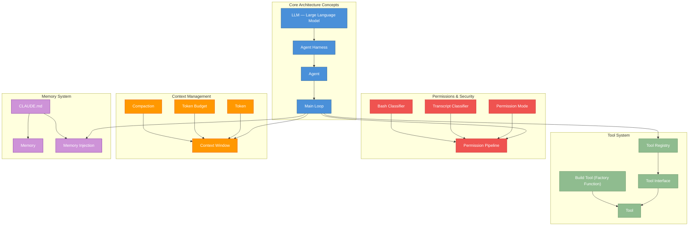
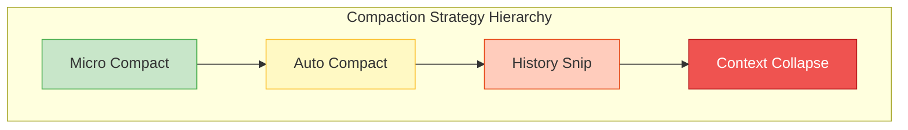

# Appendix D: Glossary

> This glossary covers the core terminology used throughout *Decoding Agent Harness: Claude Code Architecture Deep Dive*, sorted alphabetically. Each entry includes the original English term, a recommended Chinese translation, a concise definition, cross-references to related terms, and a reference to the chapter where the term is first discussed in depth.
>
> **How to use this glossary**:
> - The "See also" field after each term points to related terms, enabling thematic reading
> - The "Chapter" field after each term indicates where the term is first discussed in depth in the main text
> - Technical terms are kept in their original English form; Chinese translations are provided for supplementary understanding

## Core Concept Relationship Diagram

The following diagrams illustrate the relationships among the core terms in this book, helping readers establish an overall conceptual framework:

---

## A

| English Term | Chinese Translation | Concise Definition | See Also | Chapter |
|---|---|---|---|---|
| Ablation Baseline | 消融基线 | A control group marker in A/B experiments used to quantify the precise impact of a new feature on system behavior | Feature Flag, Enhanced Telemetry | Chapter 13 |
| Agent | 智能体 | An AI program entity with autonomous planning, tool invocation, and iterative execution capabilities that can dynamically adjust its behavior based on environmental feedback. In the Claude Code architecture, an Agent is wrapped by the Agent Harness and collaborates with the tool system through the Main Loop | Agent Harness, Subagent, Coordinator Mode | Chapter 1 |
| Agent Harness | 智能体线束 / 执行框架 | The runtime infrastructure layer that wraps the large language model, responsible for orchestrating and executing core capabilities such as tool dispatch, permission control, context management, and streaming rendering. This is the most fundamental architectural concept in Claude Code, defining the standard framework for LLM interaction with the external world | Agent, Tool, Permission Mode, Context Window | Chapter 1 |
| Agent Memory Snapshot | 智能体内存快照 | Serialized preservation of an agent's runtime internal state, supporting cross-session restoration of the execution context. Enabled by the `AGENT_MEMORY_SNAPSHOT` feature flag | Memory, Agent, Feature Flag | Chapter 10 |
| Agent Trigger | 智能体触发器 | A time-based (cron) or event-driven automatic scheduling mechanism that allows agents to execute tasks on a schedule without human attendance. Enabled by the `AGENT_TRIGGERS` feature flag | Daemon, Cron Tool | Chapter 9 |
| Always Allow / Always Deny / Always Ask | 始终允许 / 始终拒绝 / 始终询问 | Three basic policies in permission rules, with priority order: Always Deny > Always Allow > Always Ask. These rules are defined in the three-tier configuration of settings.json | Permission Mode, Permission Pipeline | Chapter 4 |
| API Turn | API 轮次 | A complete request-response interaction cycle, containing the full round-trip of user input, model inference, and tool call results. A single user request may trigger multiple API Turns (when tool calls are required) | Main Loop, Token, Tool | Chapter 2 |
| Async Generator | 异步生成器 | A function declared using `async function*` in JavaScript/TypeScript that incrementally yields asynchronous results via `yield`. It is the core programming primitive for Claude Code's streaming output. The query engine and streaming tool executor both use this pattern | Stream, Query Engine | Chapter 2 |
| Auto Compact | 自动压缩 | A context compression mechanism that is automatically triggered when the conversation context approaches the Token threshold, without requiring manual user intervention. Enhanced by the `REACTIVE_COMPACT` feature flag | Compaction, Context Window, Token Budget | Chapter 7 |
| Auto Mode | 自动模式 | A permission mode in which the agent can autonomously decide to execute most operations without requesting user confirmation for each one. Combined with `TRANSCRIPT_CLASSIFIER`, it enables automatic mode inference based on conversation content | Permission Mode, Transcript Classifier | Chapter 3 |
| Auto Theme | 自动主题 | A color scheme that automatically switches between light and dark themes based on the operating system's preference for the Claude Code terminal interface. Controlled by the `AUTO_THEME` feature flag | Feature Flag | Chapter 12 |
| Away Summary | 离开摘要 | An automatically generated conversation summary produced when the user returns after being away, helping the user quickly catch up on what happened during their absence. Controlled by the `AWAY_SUMMARY` feature flag | Background Session, Feature Flag | Chapter 11 |

## B

| English Term | Chinese Translation | Concise Definition | See Also | Chapter |
|---|---|---|---|---|
| Background Session (BG_SESSIONS) | 后台会话 | A session instance that runs independently of the foreground terminal, supporting continuous execution of long-running tasks in the background. Enabled by the `BG_SESSIONS` feature flag | Daemon, Agent Trigger | Chapter 11 |
| Bash Classifier | Bash 分类器 | A module that uses machine learning to classify the safety of Bash commands entered by the user; high-confidence safe commands can be automatically approved. Enabled by the `BASH_CLASSIFIER` feature flag | Permission Pipeline, BashTool | Chapter 3 |
| Bridge Mode | 桥接模式 | A bidirectional communication protocol between Claude Code and IDEs (such as VS Code, JetBrains), supporting permission callbacks and state synchronization. Enabled by the `BRIDGE_MODE` feature flag | IDE Integration, KAIROS | Chapter 7 |
| Build-time Dead Code Elimination | 编译时死代码消除 | The Bun bundler evaluates feature flags at compile time and removes entire code branches where conditions are false, reducing output size. This is the foundation of Claude Code's feature flag mechanism | Feature Flag, Bun Bundle | Appendix C |
| Buddy | 伴侣精灵 | An interactive animated character component in the REPL interface that provides personable feedback and visual companionship. Enabled by the `BUDDY` feature flag | REPL, Companion Sprite | Chapter 12 |
| Bun Bundle | Bun 打包 | The bundling functionality of the Bun runtime that injects static values of feature flags at compile time. Bun is Claude Code's primary build and runtime toolchain | Feature Flag, Dead Code Elimination | Appendix C |
| Build Tool (buildTool) | 工具工厂函数 | A unified factory function for creating tool instances that fills in safe default values for methods not explicitly defined (such as isEnabled, isReadOnly, etc.) | Tool, Tool Registry | Chapter 3 |

## C

| English Term | Chinese Translation | Concise Definition | See Also | Chapter |
|---|---|---|---|---|
| Cache Safe Params | 缓存安全参数 | A set of parameters marked in API requests that will not cause the Prompt Cache to be invalidated, ensuring maximum cache hit rates | Prompt Cache, Compaction | Chapter 7 |
| Cached Micro Compact | 缓存式微压缩 | An advanced compaction strategy that maintains Prompt Cache boundary markers during compression, preventing wholesale cache invalidation caused by compaction. Controlled by the `CACHED_MICROCOMPACT` feature flag | Compaction, Prompt Cache, Micro Compact | Chapter 7 |
| Channel | 频道 | A bidirectional communication pipe used in KAIROS mode for passing messages and permission requests between the IDE and Claude Code. Controlled by the `KAIROS_CHANNELS` feature flag | KAIROS, Bridge Mode | Chapter 6 |
| CHICAGO_MCP | Chicago MCP | A specific MCP server configuration pattern that integrates Computer Use capabilities and a dedicated toolset. Controlled by the `CHICAGO_MCP` feature flag | MCP, Feature Flag | Chapter 7 |
| CLI (Command Line Interface) | 命令行界面 | Claude Code's primary interaction entry point — a terminal-based text interface that uses the Ink framework to render React components. Responsible for argument parsing, REPL initialization, and user input capture | REPL, Ink | Chapter 2 |
| CLAUDE.md | CLAUDE 记忆文件 | The core carrier file of the memory system, supporting nested hierarchies at the global level (~/.claude/CLAUDE.md), project level (project root directory), and directory level. Its contents are injected into the system prompt at the start of each conversation turn | Memory, Memory Injection | Chapter 6 |
| Compaction | 上下文压缩 | The process of compressing lengthy conversation history into a concise summary that retains key information, freeing up Token space for subsequent conversation. Claude Code provides multiple compaction strategies: micro-compact, auto-compact, history snip, and context collapse | Auto Compact, Context Window, Token Budget | Chapter 7 |
| Companion Sprite | 伴侣精灵组件 | The visual implementation of the Buddy feature — an animated character React component rendered in the terminal | Buddy, REPL | Chapter 12 |
| Concurrency Safe | 并发安全 | A tool attribute; tools marked as concurrency safe can be scheduled for simultaneous execution by the streaming tool executor without waiting for the previous call to complete | Tool, Streaming Tool Executor | Chapter 3 |
| Context Collapse | 上下文折叠 | A more aggressive context reduction strategy than traditional compaction, using a dedicated collapse UI to make the user aware of and optionally restore collapsed content. Controlled by the `CONTEXT_COLLAPSE` feature flag | Compaction, Context Window | Chapter 7 |
| Context Window | 上下文窗口 | The maximum number of Tokens a model can process in a single request — the fundamental constraint underlying all context management strategies. Claude Code's compaction system and memory system are both designed around this limit | Token, Compaction, Token Budget | Chapter 7 |
| Coordinator Mode | 协调器模式 | The central role in multi-agent collaboration, responsible for task distribution, progress aggregation, and result consolidation. Controlled by the `COORDINATOR_MODE` feature flag | Agent, Subagent, FORK_SUBAGENT | Chapter 10 |
| COWORKER_TYPE_TELEMETRY | 协作者类型遥测 | An anonymous telemetry feature that automatically detects and reports the current collaboration environment type (IDE plugin, standalone terminal, CI pipeline, etc.) | Feature Flag, Telemetry | Chapter 13 |
| Cron Tool | Cron 定时工具 | A set of tools in agent triggers that define execution schedules based on standard cron expressions (CronCreateTool, CronDeleteTool, CronListTool). Controlled by the `AGENT_TRIGGERS` feature flag | Agent Trigger, Daemon | Chapter 9 |

## D

| English Term | Chinese Translation | Concise Definition | See Also | Chapter |
|---|---|---|---|---|
| Daemon | 守护进程 | A mode in which Claude Code runs as a long-lived background process, supporting persistent services and scheduled task execution. Controlled by the `DAEMON` feature flag | Background Session, Agent Trigger | Chapter 11 |
| Dead Code Elimination | 死代码消除 | An optimization technique where the compiler/bundler identifies and removes code paths that will never be executed during the build phase. In Claude Code, the `false` branches of Feature Flags are removed through this mechanism | Feature Flag, Bun Bundle, Build-time Dead Code Elimination | Appendix C |
| DIRECT_CONNECT | 直连模式 | Bypasses intermediate proxy layers to establish a direct network connection to the Anthropic API endpoint. Controlled by the `DIRECT_CONNECT` feature flag | Feature Flag, SSH Remote | Chapter 11 |
| Dynamic Tool Registration | 动态工具注册 | The process by which MCP tools are dynamically discovered, adapted, and registered in the tool registry at runtime. Unlike built-in tools' static registration, the number and types of MCP tools are not determined at compile time | MCP, Tool Registry, Build Tool | Chapter 12 |

## E

| English Term | Chinese Translation | Concise Definition | See Also | Chapter |
|---|---|---|---|---|
| Enhanced Telemetry | 增强遥测 | Extended anonymous usage telemetry data collection capabilities. Controlled by the `ENHANCED_TELEMETRY_BETA` feature flag | Telemetry, COWORKER_TYPE_TELEMETRY | Chapter 13 |
| Extended Thinking | 扩展思考 | The model's internal reasoning process before generating a final response, which improves reasoning quality on complex tasks through additional thinking Tokens. Controlled by the `ULTRATHINK` feature flag | Ultrathink, Token, LLM | Chapter 5 |
| Extract Memories | 记忆提取 | Automatically identifies and extracts reusable knowledge fragments from conversation content at session end, persisting them to the memory file system. Controlled by the `EXTRACT_MEMORIES` feature flag | Memory, CLAUDE.md, Team Memory | Chapter 10 |

## F

| English Term | Chinese Translation | Concise Definition | See Also | Chapter |
|---|---|---|---|---|
| Feature Flag | 功能标志 | A boolean switch injected at compile time via Bun define, controlling whether specific feature code is included in the final output. When a flag is false, the code branch it guards is entirely removed through dead code elimination | Build-time Dead Code Elimination, Bun Bundle | Appendix C |
| File Persistence | 文件持久化 | The ability to track and record file system changes across API turns, supporting state consistency during session recovery. Controlled by the `FILE_PERSISTENCE` feature flag | Background Session, Compaction | Chapter 11 |
| Fork Mode / Fork Subagent | Fork 模式 / Fork 子智能体 | A mode that creates independent child processes via fork to execute subtasks; subagents have their own context and permission scope. Controlled by the `FORK_SUBAGENT` feature flag. Subagents implement nested execution by recursively calling the Main Loop | Subagent, Agent, Main Loop | Chapter 9 |
| Fullscreen Layout | 全屏布局 | An enhanced layout that Claude Code activates in full-screen terminal environments (such as tmux, iTerm2), supporting multi-panel and floating elements. This is a prerequisite for advanced UI features such as Terminal Panel | Terminal Panel, REPL | Chapter 12 |

## G-H

| English Term | Chinese Translation | Concise Definition | See Also | Chapter |
|---|---|---|---|---|
| GlobTool | Glob 搜索工具 | A tool that searches for files by filename glob pattern matching, returning results sorted by modification time. Marked as readOnly and concurrencySafe | GrepTool, FileReadTool, Tool | Chapter 3 |
| GrepTool | Grep 搜索工具 | A regex-based content search tool powered by ripgrep, supporting three output modes: files_with_matches / content / count. Marked as readOnly and concurrencySafe | GlobTool, Tool | Chapter 3 |
| Hard Fail | 硬失败 | A mode that terminates directly on critical errors rather than degrading gracefully. Controlled by the `HARD_FAIL` feature flag | Feature Flag, Permission Pipeline | Chapter 3 |
| Hook | 钩子 | User-defined scripts or callback functions triggered at specific lifecycle events (such as before/after tool execution, session start/end). This is the core mechanism for Claude Code lifecycle extension | Hook Prompts, PreToolUse, PostToolUse | Chapter 8 |
| Hook Prompts | 钩子提示词 | A mechanism that allows hooks to inject custom prompts into the conversation flow, enabling dynamic system-level instruction customization. Controlled by the `HOOK_PROMPTS` feature flag | Hook, System Prompt | Chapter 9 |
| History Snip | 历史裁剪 / Snip Compact | A compaction strategy that intelligently trims processed conversation history, retaining key information while significantly reducing Token usage. Controlled by the `HISTORY_SNIP` feature flag | Compaction, Auto Compact, Token | Chapter 7 |

## I-J-K

| English Term | Chinese Translation | Concise Definition | See Also | Chapter |
|---|---|---|---|---|
| IDE Integration | IDE 集成 | Claude Code's integration capability with IDEs (such as VS Code, JetBrains) via Bridge Mode or KAIROS mode, supporting permission callbacks, state synchronization, and bidirectional communication | Bridge Mode, KAIROS, Channel | Chapter 7 |
| Ink | Ink 框架 | A React-based terminal UI rendering framework used by Claude Code to render React component trees as terminal text output. It is the core technology of the presentation layer | CLI, REPL, React | Chapter 2 |
| Job Classifier | 作业分类器 | A classification module based on the Templates feature flag that automatically identifies user request types and routes them to the corresponding processing pipeline | Templates, Feature Flag | Chapter 9 |
| JWT (JSON Web Token) | JSON Web 令牌 | A token mechanism used for secure authentication in IDE bridge mode, ensuring communication security between the CLI and IDE plugin | Bridge Mode, IDE Integration | Chapter 7 |
| KAIROS | 助手模式 / KAIROS 模式 | A complete collaboration feature set for IDE integration, including channel communication, session recovery, GitHub Webhook integration, and more. Controlled by the `KAIROS` feature flag, with multiple sub-flags (KAIROS_BRIEF, KAIROS_CHANNELS, etc.) | Channel, Bridge Mode, Feature Flag | Chapter 6 |
| KAIROS Dream | KAIROS Dream 模式 | An extended mode of KAIROS used for loading additional skill sets. Controlled by the `KAIROS_DREAM` feature flag | KAIROS, Skill | Chapter 6 |

## L-M

| English Term | Chinese Translation | Concise Definition | See Also | Chapter |
|---|---|---|---|---|
| Layered Architecture | 分层架构 | Claude Code's overall architectural style, divided into four layers: Presentation, Orchestration, Capability, and Infrastructure | Agent Harness, CLI, Main Loop | Appendix A |
| LLM (Large Language Model) | 大语言模型 | Large-scale pre-trained language models based on the Transformer architecture, such as Claude, which serve as the reasoning core of agents. In Claude Code, the LLM interacts with the tool system through the Agent Harness | Agent, Agent Harness, API Turn | Chapter 1 |
| Lodestone | 磁石 | An enhanced memory retrieval and matching mechanism that improves the accuracy of finding relevant knowledge from the memory file system. Controlled by the `LODESTONE` feature flag | Memory, CLAUDE.md | Chapter 10 |
| Main Loop | 主循环 | Claude Code's core execution loop, responsible for the iterative process of receiving user input, calling the model API, processing tool calls, and rendering output. Each iteration is called a turn | API Turn, Tool, Query Engine | Chapter 2 |
| MCP (Model Context Protocol) | 模型上下文协议 | A standardized protocol defined by Anthropic that allows external tool servers to provide context information and callable tools to the model. Claude Code implements a complete MCP client | Dynamic Tool Registration, MCP Skills | Chapter 12 |
| MCP Skills | MCP 技能发现 | The ability to dynamically discover and load extensible skills from external servers via the MCP protocol. Controlled by the `MCP_SKILLS` feature flag | MCP, Skill, Dynamic Tool Registration | Chapter 7 |
| Memory | 记忆 | A file system for persistently storing user preferences, project knowledge, and historical experience, retaining key information across sessions. The core carrier is the CLAUDE.md file | CLAUDE.md, Extract Memories, Team Memory | Chapter 6 |
| Memory Injection | 记忆注入 | The process of injecting knowledge from CLAUDE.md files into the system prompt at the start of each conversation turn. See the memory injection path in Appendix A.3 | Memory, CLAUDE.md, System Prompt | Chapter 6 |
| Message Actions | 消息操作 | Contextual action buttons provided on conversation messages, such as copying content, regenerating responses, and other interactive features. Controlled by the `MESSAGE_ACTIONS` feature flag | Feature Flag | Chapter 12 |
| Micro Compact | 微压缩 | A fast compaction strategy that performs lightweight context reduction without triggering full compaction. When used with Cached Micro Compact, it can maintain cache boundaries | Compaction, Cached Micro Compact, Auto Compact | Chapter 7 |
| Monitor Tool | 监控工具 | The ability to provide real-time output monitoring and status tracking when the Bash tool executes background commands. Controlled by the `MONITOR_TOOL` feature flag | BashTool, Tool | Chapter 7 |
| Multi-tier Settings | 三级配置 | The hierarchical configuration model of the settings system, containing three levels — global (~/.claude/settings.json), project (.claude/settings.json), and local (.claude/settings.local.json) — with lower-priority settings overridden by higher-priority ones | Permission Mode, Settings Sync | Chapter 5 |

## N-O-P

| English Term | Chinese Translation | Concise Definition | See Also | Chapter |
|---|---|---|---|---|
| Native Client Attestation | 原生客户端认证 | Enables platform-native client identity verification mechanisms. Controlled by the `NATIVE_CLIENT_ATTESTATION` feature flag | Feature Flag, Permission Pipeline | Chapter 3 |
| Permission Mode | 权限模式 | A setting that controls the agent's level of autonomous execution, including ask (confirm each time), auto-edit (auto-approve edits), full-auto (fully automatic), and more. Combined with Transcript Classifier, it enables automatic inference | Auto Mode, Permission Pipeline, Always Allow | Chapter 4 |
| Permission Pipeline | 权限管线 | The multi-layered permission check pipeline before tool execution, containing the complete decision chain of classifier evaluation, user confirmation dialogs, and auto-approval rules. See the permission decision path in Appendix A.3 | Permission Mode, Bash Classifier, Transcript Classifier | Chapter 4 |
| Plan Mode | Plan 模式 | An interactive planning interface provided by the Ultraplan feature, allowing users to review, modify, and approve complex task plans before execution. In Plan Mode, only read-only tools are permitted | EnterPlanModeTool, ExitPlanModeV2Tool, Ultraplan | Chapter 14 |
| Power Assertion | 幂等断言 | A code design principle ensuring that operations can be safely repeated without side effects. Used in the tool system design to guarantee retry safety | Tool, Unattended Retry | Chapter 3 |
| PreToolUse / PostToolUse | 工具执行前/后钩子 | Lifecycle hooks triggered before/after tool execution, used respectively for modifying input parameters or blocking execution, and for processing execution results or logging | Hook, Hook Prompts | Chapter 8 |
| Proactive Mode | 主动模式 | The agent's ability to proactively analyze code, offer suggestions, or perform background tasks when the user is idle. Controlled by the `PROACTIVE` feature flag | Feature Flag, SleepTool | Chapter 5 |
| Prompt Cache | 提示缓存 | A caching mechanism provided by the Anthropic API that caches recurring system prompts and context prefixes to reduce latency and cost | Cache Safe Params, Compaction | Chapter 7 |
| Prompt Cache Break Detection | 提示缓存断裂检测 | Detects whether cache boundaries have been disrupted during operations such as compaction, and reports the impact on cache hit rates. Controlled by the `PROMPT_CACHE_BREAK_DETECTION` feature flag | Prompt Cache, Compaction | Chapter 7 |

## Q-R

| English Term | Chinese Translation | Concise Definition | See Also | Chapter |
|---|---|---|---|---|
| Query Engine | 查询引擎 | The core engine that manages the complete conversation lifecycle (from receiving user input to outputting the final response), coordinating model calls, tool execution, and context management. It encapsulates all communication details with the Anthropic Messages API | Main Loop, Async Generator, API Turn | Chapter 2 |
| Quick Search | 快速搜索 | An interface feature for instant searching within the current conversation history, supporting quick location of specific content. Controlled by the `QUICK_SEARCH` feature flag | Feature Flag | Chapter 12 |
| Reactive Compact | 响应式压缩 | A compaction strategy that is automatically triggered when Token usage approaches the threshold, serving as a real-time response to resource pressure. Controlled by the `REACTIVE_COMPACT` feature flag | Auto Compact, Compaction, Token Budget | Chapter 7 |
| React | React 框架 | Claude Code's UI layer is built on the React framework, rendering React component trees as terminal text output through the Ink adapter | Ink, CLI, REPL | Chapter 2 |
| ReadOnly Tool | 只读工具 | A tool marked as readOnly that only performs read operations without modifying the file system or external state. Read-only tools can be used in Plan Mode and generally have more relaxed permission constraints | Tool, Plan Mode, Concurrency Safe | Chapter 3 |
| REPL (Read-Eval-Print Loop) | 交互式循环 | Claude Code's main interface loop, continuously receiving user input, executing processing, and rendering output to form an interactive closed loop. Rendered using the Ink framework | CLI, Ink, Main Loop | Chapter 2 |
| Runtime Gate | 运行时门控 | A type of feature flag that is true at compile time but requires additional conditions (such as environment variables, server-side configuration) to be truly activated at runtime. Examples include `KAIROS`, `COORDINATOR_MODE`, etc. | Feature Flag, Build-time Dead Code Elimination | Appendix C |

## S

| English Term | Chinese Translation | Concise Definition | See Also | Chapter |
|---|---|---|---|---|
| Selector Pattern | Selector 模式 | An efficient subscription pattern in state management that allows components to subscribe only to the state subsets they care about, avoiding unnecessary re-renders | State Management, React | Chapter 2 |
| Settings Sync | 设置同步 | The ability to bidirectionally synchronize user configuration (permission rules, environment variables, etc.) between local and cloud. Controlled by the `UPLOAD_USER_SETTINGS` and `DOWNLOAD_USER_SETTINGS` feature flags | Multi-tier Settings, Feature Flag | Chapter 10 |
| Skill | 技能 | An installable extension capability pack that extends the agent's domain expertise through prompt templates and tool definitions. Invoked via slash commands | Skill Generator, MCP Skills, Slash Command | Chapter 11 |
| Skill Generator | 技能生成器 | A tool that dynamically generates new skill definitions, supporting users in creating custom skills through natural language descriptions. Controlled by the `RUN_SKILL_GENERATOR` feature flag | Skill, Feature Flag | Chapter 7 |
| Slash Command | 斜杠命令 | A skill invocation method triggered by the `/` prefix, such as `/commit`, `/review-pr`, etc. Each slash command corresponds to a registered skill | Skill, SkillTool | Chapter 11 |
| Snip Compact | 裁剪压缩 | The compaction implementation of the History Snip feature, which intelligently trims processed historical messages | History Snip, Compaction | Chapter 7 |
| SSH Remote | SSH 远程模式 | The ability to connect to a remote machine via the SSH protocol and run Claude Code in the remote environment. Controlled by the `SSH_REMOTE` feature flag | Feature Flag, DIRECT_CONNECT | Chapter 11 |
| State Management | 状态管理 | Claude Code's global application state management mechanism, using a centralized state store combined with the selector pattern for efficient state subscription and updates | Selector Pattern, React | Chapter 2 |
| Stop Reason | 停止原因 | A field in the model response that identifies the reason for ending the current inference turn, with values of `end_turn` (normal end) or `tool_use` (tool execution required). The Main Loop uses the stop reason to determine whether to continue looping | API Turn, Main Loop, Tool | Chapter 2 |
| Stream | 流 / 流式 | A method of transmitting and processing data incrementally in chunks. Claude Code uses streaming APIs to achieve incremental output and tool calls. Implemented at the lower level via Async Generators | Async Generator, Query Engine | Chapter 13 |
| Streaming Tool Executor | 流式工具执行器 | An execution module that runs tools in a streaming manner and renders output in real time during tool execution. Supports parallel scheduling of concurrency-safe tools | Tool, Concurrency Safe, Stream | Chapter 3 |
| Subagent | 子智能体 | An independent execution unit forked or spawned by the main agent, with its own context and permissions, handling specific subtasks. Implements nested execution by recursively calling the Main Loop | Fork Mode, Agent, Coordinator Mode | Chapter 9 |
| System Prompt | 系统提示词 | Instruction text injected at the beginning of each API request, defining the agent's behavioral norms, available tools, and usage constraints. Memory content from CLAUDE.md is merged into the system prompt through Memory Injection | Memory Injection, CLAUDE.md, Prompt Cache | Chapter 2 |

## T

| English Term | Chinese Translation | Concise Definition | See Also | Chapter |
|---|---|---|---|---|
| Team Memory (TEAMMEM) | 团队记忆 | A shared memory file system for teams, supporting the sharing of project knowledge and coding standards among team members. Controlled by the `TEAMMEM` feature flag | Memory, CLAUDE.md, Extract Memories | Chapter 10 |
| Terminal Panel | 终端面板 | An independent terminal panel component in the fullscreen layout that allows users to execute terminal commands without leaving Claude Code. Controlled by the `TERMINAL_PANEL` feature flag, with the shortcut key Meta+J | Fullscreen Layout, Feature Flag | Chapter 12 |
| Templates | 模板系统 | A classification module that enables the Job Classifier for identifying and routing different types of user requests. Controlled by the `TEMPLATES` feature flag | Job Classifier, Feature Flag | Chapter 9 |
| Token | 词元 / Token | The basic unit of text processing by the model, and the core metric for context window capacity and API billing. All context management strategies revolve around the effective utilization of Tokens | Context Window, Token Budget, Compaction | Chapter 2 |
| Token Budget | Token 预算 | A management mechanism that plans and monitors the total available Tokens in a single session, providing usage warnings and allocation strategies. Controlled by the `TOKEN_BUDGET` feature flag | Token, Context Window, Compaction | Chapter 7 |
| Tool | 工具 | An external capability unit that an agent can invoke (such as file read/write, Bash commands, web search, etc.), registered and executed through a standardized interface. All tools follow the protocol defined by the Tool Interface | Tool Registry, Build Tool, Permission Pipeline | Chapter 3 |
| Tool Interface | 工具接口 | The standard protocol that all tools must follow, defining core methods such as isEnabled, isReadOnly, isConcurrencySafe, isDestructive, checkPermissions, and more | Tool, Build Tool | Chapter 3 |
| Tool Orchestration | 工具编排 | The high-level scheduling capability of an agent to select, combine, and sequence multiple tool calls based on task requirements | Tool, Agent, Main Loop | Chapter 3 |
| Tool Permission Context | 工具权限上下文 | A state object containing the current permission mode, authorized rules, and pending checks,贯穿 throughout the tool execution's permission decision flow | Permission Pipeline, Permission Mode | Chapter 4 |
| Tool Registry | 工具注册表 | The central module for global tool registration, discovery, and assembly, responsible for merging built-in tools with MCP dynamic tools, sorting by name, and deduplicating (built-in tools take priority) | Tool, Dynamic Tool Registration, MCP | Chapter 3 |
| ToolSearch Tool | 工具搜索工具 | A lazily-loaded tool that matches by keyword, helping the model quickly locate needed tools among a large number of available tools. Controlled by the `ToolSearch` feature flag | Tool Registry, Feature Flag | Chapter 3 |
| Transcription / Transcript | 对话转录 / 转录记录 | The complete conversation history record, containing all user messages, model responses, and tool call results. It serves as the data foundation for compaction and auditing | Transcript Classifier, Compaction | Chapter 2 |
| Transcript Classifier | 转录分类器 | A classification model that automatically determines the appropriate permission mode based on conversation content, supporting inference of auto mode from conversation context. Controlled by the `TRANSCRIPT_CLASSIFIER` feature flag | Permission Mode, Auto Mode, Feature Flag | Chapter 3 |
| Tree-sitter | Tree-sitter 解析器 | An incremental parsing framework used for precise AST-level parsing and safety analysis of Bash commands. Controlled by the `TREE_SITTER_BASH` feature flag, with a shadow mode (`TREE_SITTER_BASH_SHADOW`) for validation | Bash Classifier, Feature Flag | Chapter 3 |
| Turn | 轮次 | A complete iteration of the conversation main loop, from sending a message to the model to receiving the full response. A single user request may trigger multiple turns (when tool calls are involved) | API Turn, Main Loop, Stop Reason | Chapter 2 |

## U-V

| English Term | Chinese Translation | Concise Definition | See Also | Chapter |
|---|---|---|---|---|
| UDS (Unix Domain Socket) Inbox | Unix 域套接字收件箱 | A communication endpoint that receives messages from other local processes via Unix Domain Socket. Controlled by the `UDS_INBOX` feature flag | Feature Flag, ListPeersTool | Chapter 7 |
| Ultraplan | 超级规划 | An advanced planning feature that provides an interactive plan review interface, supporting user approval and modification of complex task execution plans before execution. Controlled by the `ULTRAPLAN` feature flag | Plan Mode, EnterPlanModeTool | Chapter 5 |
| Ultrathink | 深度思考 | A feature flag that enables Extended Thinking capability, allowing the model to perform deeper reasoning before generating a response | Extended Thinking, Feature Flag, Token | Chapter 5 |
| Unattended Retry | 无人值守重试 | A mechanism that automatically retries on API call failure without user intervention. Controlled by the `UNATTENDED_RETRY` feature flag. Combined with Power Assertion to ensure retry safety | Feature Flag, Power Assertion | Chapter 13 |
| Verification Agent | 验证智能体 | An automated verification process launched after task completion, used to confirm the correctness and completeness of task results. Controlled by the `VERIFICATION_AGENT` feature flag | Agent, Feature Flag | Chapter 8 |
| Voice Mode | 语音模式 | An interactive mode that enables Push-to-Talk voice input and speech synthesis output, supporting voice-driven conversation experiences. Controlled by the `VOICE_MODE` feature flag | Feature Flag | Chapter 12 |

## W-Z

| English Term | Chinese Translation | Concise Definition | See Also | Chapter |
|---|---|---|---|---|
| Web Browser Tool | 网页浏览器工具 | A browser panel built into Claude Code that supports web content browsing, extraction, and interaction. Controlled by the `WEB_BROWSER_TOOL` feature flag | WebFetchTool, WebSearchTool, Feature Flag | Chapter 7 |
| Workflow Scripts | 工作流脚本 | A script system that supports automated task orchestration, allowing the definition and execution of multi-step workflows. Controlled by the `WORKFLOW_SCRIPTS` feature flag | Agent Trigger, Feature Flag | Chapter 9 |
| Worktree | 工作树 | A wrapper around Git worktree that creates isolated working directories for subagents or parallel tasks, avoiding file conflicts in the main workspace. Controlled by the Worktree Mode feature flag | Fork Mode, Subagent, EnterWorktreeTool | Chapter 9 |
| Zod Schema | Zod 验证模式 | A runtime type validation schema defined using the Zod library, used for type checking of tool input parameters and auto-completion hint generation. Each tool's input parameters are validated through a Zod Schema | Tool, Tool Interface, Build Tool | Chapter 3 |

---

> **Note**: This glossary contains approximately 100 core terms covering the main concepts discussed throughout the book. The Chinese translations are the recommended standardized translations used in this book; readers may encounter different translations in other materials. For detailed information on specific feature flags, please refer to Appendix C; for attribute information on specific tools, please refer to Appendix B.
