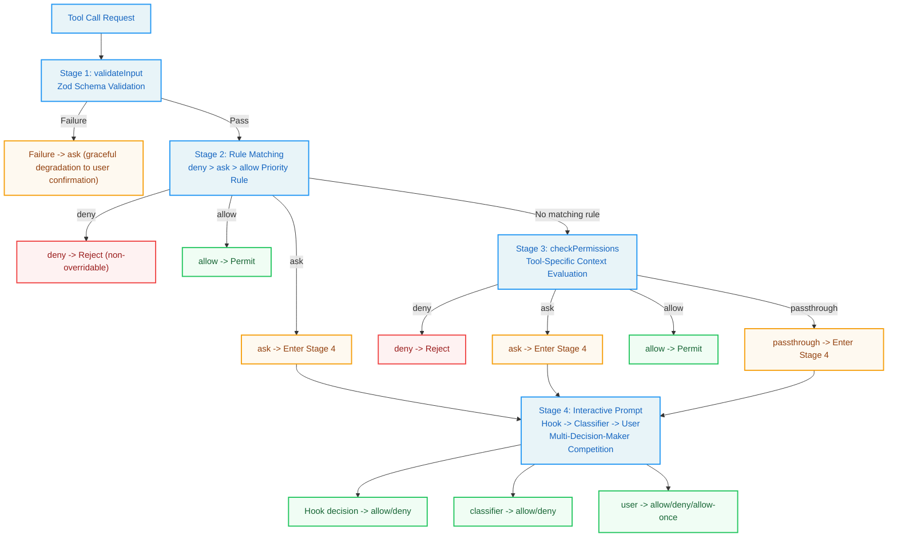
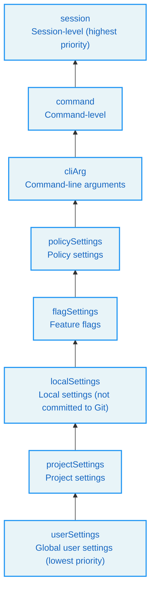
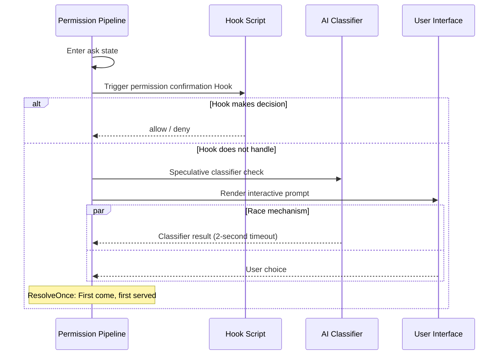
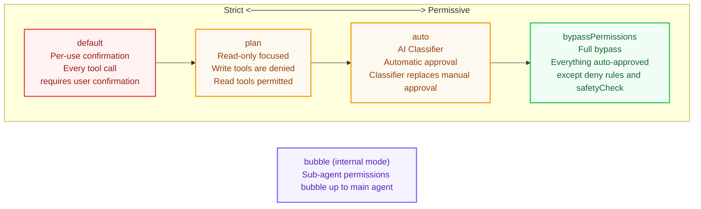
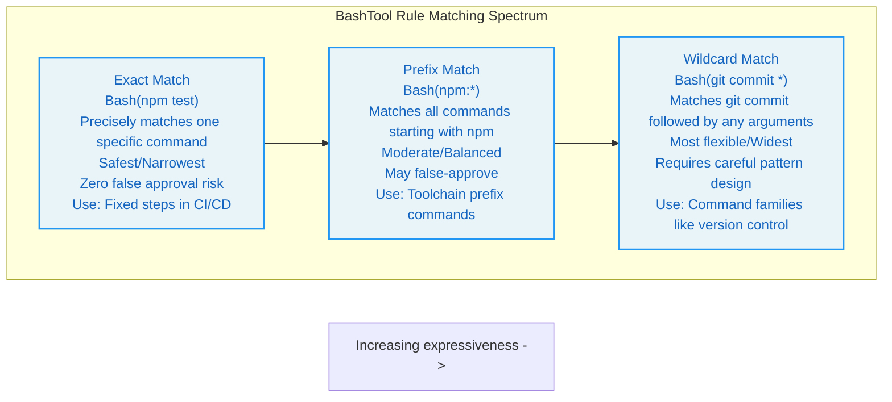
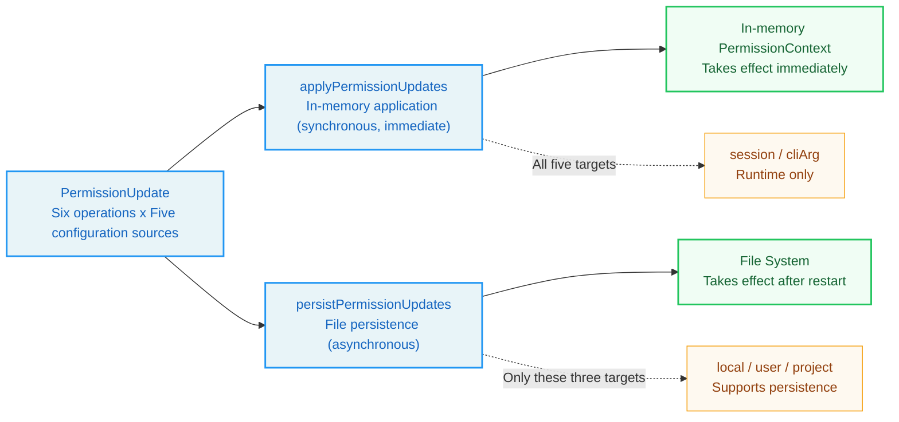

# Chapter 4: The Permission Pipeline -- Agent Guardrails

> Learning Objectives: After reading this chapter, you will be able to:

> - Understand the design rationale and engineering trade-offs of Claude Code's four-stage permission checking process
> - Master the design philosophy and immutable data pattern of the permission context
> - Analyze the behavioral differences and applicable scenarios of the five permission modes
> - Understand the implementation mechanism of BashTool's fine-grained permission control
> - Master best practices for enterprise-grade security configuration

When an Agent executes tasks autonomously, it may invoke dozens of tools in a single session -- writing files, running Bash commands, searching code. Every invocation carries hidden risk: an inappropriate `rm -rf`, an accidental `npm publish`, either could cause irreversible consequences. The Permission Pipeline is the safety guardrail that Claude Code constructs for the Agent. It is not a simple "allow/deny" switch, but a carefully designed multi-stage checking mechanism that finds a precise balance between automation efficiency and security control.

To understand the permission pipeline through a physical-world analogy: a modern office building's access control system doesn't just place a single security guard at the entrance (a single checkpoint). Instead, it sets up different levels of security checks in different areas -- the lobby only requires a card swipe, meeting rooms require reservation confirmation, and the server room requires fingerprint verification plus dual-person authorization. Each layer of security check is independent; even if one layer is bypassed, the next layer can still prevent unauthorized access. Claude Code's permission pipeline is precisely the embodiment of this "defense in depth" philosophy in a software system.

This chapter will start from architectural design, deeply dissect each stage of the permission pipeline, understand its design decisions, and master configuration methods through hands-on exercises.

## 4.1 The Four Stages of the Permission Pipeline

Claude Code's permission checking is not a Boolean judgment from a single function, but a pipeline composed of four stages. Each stage has its own responsibilities and short-circuit logic: as long as a preceding stage makes a final decision, subsequent stages will not execute.

These four stages can be visualized with a flowchart:



These four stages are: validateInput (input validation), hasPermissionsToUseTool (rule matching), checkPermissions (context evaluation), and interactive prompt (user confirmation). Together they form a complete defense line from "data validity" to "human authorization."

### 4.1.1 Stage 1: validateInput -- Zod Schema Validation

The first checkpoint of the permission pipeline is not about permissions per se, but about input data validity. In the permission checking function, the tool's input is first parsed through a Zod Schema using strict structural validation. If the input does not conform to the Schema definition (e.g., the Bash tool is missing the required `command` field), the parsing will throw an exception and the tool call is rejected outright. This design separates "invalid data" from "insufficient permissions" -- the former is a programming error, the latter is a policy decision.

It is worth noting that when parsing fails, `toolPermissionResult` retains its default `passthrough` state, which is subsequently converted to `ask` behavior. This means that even when data validation fails, the system gracefully degrades to requesting user confirmation rather than crashing outright.

This design choice embodies an important engineering principle: **in security systems, error handling should be "safe" rather than "correct."** Crashing outright does expose the problem, but during Agent runtime it could interrupt the entire session. Gracefully degrading to user confirmation is a safer error handling strategy -- it gives the user the opportunity to decide whether to continue, rather than having the system decide on the user's behalf.

### 4.1.2 Stage 2: hasPermissionsToUseTool -- Rule Matching

Rule matching is the core of the permission pipeline. The `hasPermissionsToUseToolInner` function checks three types of rules in strict priority order: deny rules, ask rules, and allow rules.

**Step 1a: Tool-level deny check.** This is the highest priority. If a tool is denied entirely, the call is immediately rejected.

The `getDenyRuleForTool` function traverses deny rules from all sources (userSettings, projectSettings, localSettings, flagSettings, policySettings, cliArg, command, session) for matching. The matching logic supports exact tool name matching and MCP server-level wildcards -- for example, the rule `mcp__server1__*` can match all tools under that server.

The priority ordering of the seven rule sources reflects the "principle of proximity": session-level rules (the most recently set) take priority over command-line arguments, command-line arguments take priority over project configuration, and project configuration takes priority over global user configuration. This priority ordering ensures that more specific, more recent rules can override more general, earlier ones.



**Step 1b: Tool-level ask check.** When a tool is configured to "always ask," the system forces a confirmation prompt. There is one exception: when the Bash tool is in sandbox mode and the sandbox auto-approve option is configured, sandboxed commands can skip the ask rule. The design intent of this exception is: if the user already trusts the sandbox environment (commands within the sandbox cannot affect the system outside the sandbox), then the risk of executing commands within the sandbox has been reduced to an acceptable level.

**Step 2b: Tool-level allow check.** If no deny or ask rules match, the system checks whether an allow rule exists to directly permit the operation.

The core abstraction of rule matching is the PermissionRule type, which unifies source, behavior, and target into a single structured object.

> **Priority Rule:** deny always takes precedence over allow, regardless of their source. This is a fundamental principle of security systems -- the power of "explicit denial" is greater than "explicit permission." Even if a user has allowed a tool in the global configuration, as long as the project-level configuration denies it, the tool remains unavailable.

### 4.1.3 Stage 3: checkPermissions -- Context Evaluation

Each tool can implement its own `checkPermissions` method for more fine-grained context evaluation. For example, the Bash tool parses subcommands in the command, checks path safety, matches prefix rules, and so on. This stage's invocation occurs before the rule matching in Stage 2 (Step 1c in the code), but its results may be overridden by subsequent allow rules.

The `PermissionResult` returned by `checkPermissions` has four behaviors:

- `allow`: Permit directly, possibly carrying `updatedInput`
- `deny`: Reject execution
- `ask`: Requires user confirmation
- `passthrough`: Defer to subsequent stages (ultimately becomes `ask`)

`passthrough` is a unique design. When a tool has no special permission logic, it can return `passthrough`, allowing the pipeline to continue flowing. In subsequent steps, `passthrough` is automatically converted to `ask`, accompanied by a permission request message.

> **Design Insight:** Why is `passthrough` needed instead of having tools without special permission logic return `ask` directly? The difference lies in "intent" -- `passthrough` means "I have no opinion, let subsequent stages decide," while `ask` means "I believe this operation requires user confirmation." If a subsequent allow rule matches, `passthrough` will be overridden to `allow`, but `ask` will not be overridden. This subtle difference produces different behaviors in specific scenarios.

### 4.1.4 Stage 4: Interactive Prompt -- User Confirmation

When the pipeline flows to the `ask` state, the permission confirmation Hook takes control. This React Hook transforms the permission request into a user interaction interface. The flow triggered by the `ask` state contains multiple branching paths: coordinator permission handling, swarm worker permission handling, speculative classifier checking, and interactive permission prompting.

The most critical branch is the interactive handling branch, which pushes the permission request into a confirmation queue, renders the confirmation interface in the terminal, and waits for the user to make choices such as "allow/deny/allow this time."

Before the user responds, the system may also run an asynchronous classifier check (`pendingClassifierCheck`). This means that after the user sees the prompt, the classifier may have already automatically approved the operation while the user is still thinking, implementing a "race" mechanism -- whoever makes a decision first, that decision takes effect.



> **Best Practice:** In enterprise environments, if you want to reduce the disruption of frequent permission prompts seen by users, three strategies can be combined: (1) Pre-configure allow rules in the project configuration to cover common operations; (2) Use auto mode to let the classifier automatically handle common requests; (3) Configure Hook scripts to implement custom auto-approval logic. These three strategies can be stacked, covering all scenarios from simple to complex.

## 4.2 PermissionContext Design

### 4.2.1 ToolPermissionContext Type Structure

`ToolPermissionContext` is the core data structure of the entire permission system. It carries all the context information needed for permission checking. It includes fields such as permission mode, extra working directories, rules at all levels (allow/deny/ask), bypass mode availability flag, and whether permission prompts should be avoided.

The elegance of this type lies in its immutability (all fields are readonly). Every permission update produces a new `ToolPermissionContext` object rather than modifying the existing one. This immutable data pattern ensures consistency in concurrent environments -- when multiple tools check permissions simultaneously, the context each reads will not change unexpectedly due to another tool's permission update.

The necessity of immutability here can be understood through a concrete scenario: suppose Tool A and Tool B simultaneously begin permission checking. During the check process, Tool A's user confirmation triggers a permission rule update (the user selects "always allow"). If PermissionContext were mutable, Tool B might see the rules modified mid-check, leading to inconsistency between the front and back checks of the same request. Immutability ensures that each permission check uses a deterministic snapshot.

Among these, rules are indexed by source. This design allows the system to precisely track the origin of each rule and display information such as "this rule comes from project-level settings" in the rule management interface. This capability is crucial in multi-level configuration scenarios -- when a rule is defined by multiple sources, users need to know which rule is in effect, where it comes from, and how to modify it.

### 4.2.2 PermissionDecision Sources: hook, user, classifier

Permission decisions (PermissionDecision) come from three sources, each with different trust levels and behavioral characteristics:

**hook source:** External Hook scripts can make decisions through permission request hooks before the user sees the prompt. This is particularly useful in CI/CD environments -- Hook scripts can automatically approve or deny specific operations based on custom logic. Hook decisions have the highest trust level because they represent the explicit intent of the system administrator.

**user source:** The user's manual selection in the terminal interface. The `permanent` flag indicates whether the user chose to persist this decision to the configuration file. User decisions have a medium trust level -- they represent the intent of the current operator, but the operator may not be the system administrator.

**classifier source:** Automatic decisions made by the AI classifier in auto mode, which will be discussed in detail later. Classifier decisions have the lowest trust level -- they are AI judgments that may be incorrect, which is why certain security check types are "classifier-immune."

`PermissionDecision` itself is a union type containing the three behaviors: allow, ask, and deny.

> **Design Insight:** The trust level ordering of the three decision sources (hook > user > classifier) embodies the principle of "trust matching capability": Hook scripts are written by system administrators and have the highest level of system understanding, hence the highest trust level; the classifier is an AI making automatic judgments, and while its accuracy is very high, it can still make errors, hence the lowest trust level.

### 4.2.3 The ResolveOnce Pattern: Atomic Race Resolution

In permission interactions, multiple asynchronous participants may simultaneously attempt to resolve the same permission request -- the user clicks "allow" at the same moment the classifier returns "pass." The `ResolveOnce` pattern is designed precisely to resolve this race condition. It provides three methods: resolve, isResolved, and claim.

Its implementation uses a `claimed` flag to ensure atomicity. The `claim()` method is key -- it provides a "first come, first served" atomic operation. In JavaScript's single-threaded model, `claim()` guarantees that even if two asynchronous callbacks are scheduled nearly simultaneously, only one can successfully claim, and the other will be rejected. This is a lightweight mutex implementation that avoids the overhead of locks commonly seen in distributed systems.

> **Cross-Reference:** The ResolveOnce pattern and the "immutable state flow" principle from Chapter 2 share a common lineage. Both ensure concurrent safety through atomic state changes -- the state is either old or new; there is no "half-new, half-old" intermediate state.

This design can be understood through a real-world analogy: imagine a "non-transferable ticket" -- once redeemed (claimed) by someone, no one else can use the same ticket. No locks needed, no waiting, no coordination -- just a simple "redeemed" flag. The `claim()` method of ResolveOnce is exactly this ticket's redemption operation.

## 4.3 The Permission Mode Spectrum

Claude Code defines five internal permission modes that form a spectrum from strict to permissive. Understanding this spectrum is crucial for choosing the appropriate permission configuration.



### 4.3.1 default Mode: Per-Use Confirmation

The `default` mode is the most conservative. Aside from tools explicitly permitted by allow rules, every tool call requires user confirmation. This is the default experience when an ordinary user starts Claude Code. In the permission mode configuration, the default mode reflects its conservative tone, with no special UI marker, implying this is the "standard state."

**Applicable scenario:** Daily interactive use. Developers want to confirm before the Agent performs any potentially risky operation, ensuring full control over the Agent's behavior.

**User experience trade-off:** Safest but most tedious. For a large refactoring task, the Agent may need to perform dozens of file edits and command runs, and each confirmation interrupts the developer's train of thought.

### 4.3.2 plan Mode: Read-Only Focused

The `plan` mode restricts the Agent to read-only operations. Its UI indicator is a pause icon.

In plan mode, write tools (Edit, Write) have their permission checks return `deny`, but read tools (Read, Grep, Glob) are permitted normally. A noteworthy detail is that when plan mode's bypass availability flag is true, it means the user was originally using bypass mode and then switched to plan mode, and at this point the bypass permission logic still takes effect.

**Applicable scenario:** Code review and architecture analysis. Developers want the Agent to first "look at" the code without modifying anything, provide analysis and suggestions, and then decide whether to execute modifications.

**Design Philosophy:** The plan mode embodies a "understand before acting" workflow -- the Agent first understands the codebase in read-only mode, proposes modification plans, and switches to execution mode after receiving user approval. This two-phase workflow is particularly effective when working with large codebases, preventing the Agent from making inappropriate modifications without sufficient understanding.

### 4.3.3 auto Mode: Automatic Approval (with Classifier)

The `auto` mode is one of Claude Code's most sophisticated modes. It uses an AI classifier (referred to as the "YOLO classifier") to replace manual approval. When the permission pipeline reaches the `ask` state and the mode is `auto`, the system invokes the classifier for AI judgment, formatting the tool name and input into a classifier-understandable format, and sending the conversation context and tool list for the classifier's reference.

The core challenge of auto mode is finding the balance between "automation efficiency" and "security." Pure automatic approval is too dangerous, and pure per-use confirmation is too slow. The AI classifier is a compromise between the two -- it uses another AI to judge whether the current AI's operation is safe, implementing an "AI supervising AI" architecture.

Auto mode implements multiple layers of optimization to reduce the classifier's API call overhead:

1. **acceptEdits fast path:** Before calling the classifier, first check with acceptEdits mode whether the tool would be permitted. If it passes under acceptEdits mode, it is approved directly without needing to call the classifier. This is a "short-circuit optimization" -- if it's known to be safe, there's no need to waste an API call.

2. **Safe tool allowlist:** Safe tools that do not require classifier checking include Read, Grep, Glob, TodoWrite, and other read-only or low-risk tools. The design philosophy of this allowlist is "explicitly declare safety" -- only tools in the allowlist skip classifier checking; new tools require checking by default.

3. **Rejection tracking:** When the classifier consecutively rejects multiple times, the system automatically falls back to interactive prompting, preventing the Agent from wasting tokens in meaningless loops. This mechanism acts as a "circuit breaker" -- when the accuracy of automatic decisions drops below a certain threshold, it automatically falls back to manual confirmation.

An important security design of auto mode is: decisions for certain security check types (such as operations involving `.git/` and `.claude/` directories) are "classifier-immune" -- even if the classifier attempts to approve them, these security checks cannot be bypassed.

> **Anti-Pattern Warning:** Auto mode is not suitable for the following scenarios: (1) Operations involving production environment deployments; (2) Operations involving sensitive data (keys, credentials); (3) Irreversible operations (such as deleting databases). In these scenarios, even if users trust the classifier's judgment, they should use default mode or configure explicit deny rules.

### 4.3.4 bypassPermissions Mode: Full Bypass

The `bypassPermissions` mode is the permission system's "off switch." When activated, all tool calls are automatically approved except those blocked by deny rules and non-bypassable security checks. When determining whether permissions should be bypassed, it checks whether the current mode is bypassPermissions, or whether the mode is plan but the bypass flag is available.

But even bypass mode cannot break through the following defenses:
- Step 1a's deny rules (executed before the bypass check)
- Step 1e's `requiresUserInteraction` check
- Step 1f's content-level ask rules
- Step 1g's safetyCheck

This layered defense design ensures that even under "full trust" mode, there is a minimum level of safety protection.

**Applicable scenario:** CI/CD pipelines, automated testing, controlled execution environments. In these scenarios, the Agent's operations are already secured through other means (such as container isolation, network isolation), and permission checking only adds unnecessary latency.

> **Enterprise Security Best Practice:** If your team uses bypass mode, it is strongly recommended to: (1) Run Claude Code in a container or virtual machine to ensure file system isolation; (2) Configure explicit deny rules to block dangerous operations (such as `Bash(rm -rf *)`, `Bash(npm publish)`); (3) Use the `--allowedTools` parameter to limit the available tool scope; (4) Enable audit logging to record all tool calls.

### 4.3.5 bubble Mode: Sub-Agent Permission Bubbling

The `bubble` mode is an internal mode (not exposed externally), used for sub-agent scenarios. When the main Agent spawns a sub-agent, the sub-agent's permission checks "bubble up" back to the main Agent's permission context, ensuring the sub-agent does not gain permissions beyond those of the main Agent.

> **Cross-Reference:** The bubble mode is closely related to AgentTool from Chapter 3. AgentTool sets bubble mode through `createSubagentContext` when creating sub-agents, ensuring that the sub-agent's permission boundary does not exceed that of the main agent.

The internal permission mode type includes all modes (including auto and bubble), while the external visibility check function ensures that internal modes are not leaked to external interfaces. This type design that differentiates between internal and external is an embodiment of the "information hiding" principle -- external users do not need to know about the bubble mode's existence; it is an internal implementation detail.

## 4.4 BashTool Permission Details

The Bash tool is the most complex tool in the permission system because the composability and expressiveness of shell commands far exceed those of other tools. A simple `git` command can be safe (`git status`) or dangerous (`git push --force origin main`). The permission system needs to understand the semantics of commands, not merely match command names.

### 4.4.1 Command Classification and Wildcard Matching

The parsing of permission rule strings is handled by a dedicated function that supports three formats: tool name matching without parentheses, and the ToolName(content) format with parentheses (used for specifying tool-level precise command matching).

For the Bash tool, `ruleContent` can be:
- Exact command: `Bash(npm test)` -- matches only `npm test`
- Prefix rule: `Bash(npm:*)` -- matches all commands starting with `npm`
- Wildcard rule: `Bash(git commit *)` -- matches `git commit` followed by any arguments

These three formats form a spectrum of increasing expressiveness:



The wildcard matching engine implements full pattern matching, handles escape sequences, converts the `*` wildcard to regular expressions, and supports escaped `\*` and `\\`.

An elegant detail: when a pattern ends with ` *` (space plus wildcard) and this is the only wildcard, the trailing space and arguments become optional. This means the rule `git *` matches both `git add .` and the bare `git` command -- maintaining semantic consistency with the `git:*` prefix. This "equivalent syntax" design reduces users' cognitive burden -- you don't need to remember two different syntax rules; `git:*` and `git *` do the same thing.

### 4.4.2 Prefix Extraction Rules

Prefix extraction handles the backward-compatible `:*` syntax, using regex matching to extract the part before the colon as the prefix.

When parsing rules, the system first checks for `:*` syntax (prefix matching), then checks for wildcards, and finally falls back to exact matching. This priority ordering goes "from broad to narrow" -- it first tries to match the broadest rules, then progressively narrows the scope.

> **Best Practice:** When writing BashTool permission rules, prefer prefix matching (`:*` syntax) over wildcard matching. Prefix matching has clearer semantics and is less error-prone. For example, `Bash(npm:*)` more explicitly expresses the intent of "all commands starting with npm" than `Bash(npm *)`.

### 4.4.3 Classifier Automatic Approval Mechanism

The Bash tool has its own classifier automatic approval mechanism that runs in parallel with the auto mode's YOLO classifier. When a permission request is in the `ask` state, the system attempts to "speculatively" run the classifier check.

There is a carefully designed timeout mechanism here -- using a Promise race to pit the classifier check against a 2-second timer. If the classifier returns a high-confidence matching result within 2 seconds, the operation is automatically approved; otherwise, the user sees the interactive prompt. This "best effort" strategy ensures the classifier does not become a user experience bottleneck.

The 2-second timeout choice is a deliberate trade-off: too short (e.g., 500ms) might prevent the classifier from responding in time due to network latency, while too long (e.g., 10 seconds) would make users feel the wait is excessive. 2 seconds is a "sweet spot" -- for simple commands, the classifier usually responds within 1 second; for complex commands, the 2-second timeout ensures users don't wait too long.

## 4.5 Permission Updates and Persistence

### 4.5.1 The PermissionUpdate Pattern

Permission updates are expressed through the `PermissionUpdate` union type, supporting six operations: add rule, replace rule, remove rule, set mode, add directory, and remove directory.

Each operation specifies the configuration source to which the update should be applied: global user settings, project-level settings, local (not committed to version control) settings, current session only, or command-line arguments.

The combination of six operations and five configuration sources yields 30 possible update operations. This fine-grained control allows users to manage permissions at different levels -- for example, allowing all `git` commands in global user settings while denying `git push --force` in a specific project's local settings.

### 4.5.2 applyPermissionUpdates and persistPermissionUpdates

`applyPermissionUpdates` applies updates to the in-memory permission context and takes effect immediately. It iterates through all updates, applies each to the context object, and returns the updated new context.

`applyPermissionUpdate` handles each update type. Taking `addRules` as an example, it adds the rule string to the rule list corresponding to the behavior type (allow/deny/ask) and the corresponding source, producing a new context object through immutable updates.

Meanwhile, `persistPermissionUpdates` writes updates to the file system, ensuring they remain in effect after restarts. Only local settings, user settings, and project settings targets support persistence. Session-level and command-line argument-level updates are only effective at runtime.

The separation design of these two functions is very important: memory application is synchronous and immediate, while file persistence may involve I/O operations. In the user approval handling method of the permission context, the two are called in sequence.

This "memory first, persistence asynchronous" design pattern is common in high-performance systems: first ensure the in-memory state is correct (affecting current behavior), then asynchronously write to persistent storage (affecting future behavior). If persistence fails, the current session's behavior is unaffected, but the rules will be lost after a restart.



The persistence function returns a boolean value indicating whether a persistent update occurred, which is used in log records to mark decisions as "permanent" or "temporary."

> **Enterprise Security Best Practice:** The persistence design of permission rules is particularly important in team collaboration. The recommended practice is: (1) Place team-wide allow/deny rules in the project-level `.claude/settings.json`, committed to version control, ensuring all team members share the same security baseline; (2) Place personal preference rules in `.claude/settings.local.json`, not committed to version control; (3) Use session-level rules for temporary needs to avoid polluting persistent configuration.

---

## Hands-On Exercises: Configuring a Project-Level Permission System

### Exercise 1: Configuring Project-Level .claude/settings.json

Let's understand permission configuration through a practical scenario. Suppose you are developing a Node.js project and want Claude Code to automatically perform the following operations:

1. Run `npm test` and `npm run lint` without requiring confirmation each time
2. Allow execution of all `git` commands
3. Prohibit execution of `npm publish`
4. Prohibit deleting directories other than `node_modules`

Create `.claude/settings.json` in the project root:

```json
{
  "permissions": {
    "allow": [
      "Bash(npm test)",
      "Bash(npm run lint)",
      "Bash(git:*)",
      "Read",
      "Glob",
      "Grep"
    ],
    "deny": [
      "Bash(npm publish)",
      "Bash(rm -rf *)"
    ]
  }
}
```

**Rule parsing:**

- `Bash(npm test)` -- Exact match, only allows the specific `npm test` command
- `Bash(git:*)` -- Prefix match, allows all commands starting with `git` (`git add`, `git commit`, etc.)
- `Read` -- No `ruleContent`, means all Read tool calls are allowed
- `Bash(npm publish)` -- Deny rule, specifically rejects the publish operation

If you want rules to apply only locally (not committed to Git), you can use `.claude/settings.local.json` instead. It has the same configuration format, but `.gitignore` excludes it by default.

### Exercise 2: More Fine-Grained Wildcard Control

More fine-grained control can be achieved using wildcards:

```json
{
  "permissions": {
    "allow": [
      "Bash(npm run *)",
      "Bash(npx eslint *)"
    ],
    "deny": [
      "Bash(npm publish *)",
      "Bash(* > /etc/*)"
    ]
  }
}
```

`Bash(npm run *)` will match `npm run build`, `npm run test:coverage`, and all other subcommands. And `Bash(* > /etc/*)` uses multiple wildcards to intercept any command attempting to write to the `/etc` directory.

**Discussion Question:** Would `Bash(npm run *)` also match `npm run` (without a subcommand)? Why? Hint: Review the discussion of trailing wildcards in Section 4.4.1.

### Exercise 3: Enterprise Security Configuration Template

Design a security configuration for a development team using Claude Code. Requirements:

1. Team members can freely read and write code within the project directory
2. Prohibit modifying CI configurations under `.github/workflows/`
3. Prohibit executing publish operations like `npm publish`, `docker push`
4. Allow running `npm test`, `npm run build`, `npm run lint`
5. Prohibit accessing system directories like `/etc`, `/var`

Try designing the content for both `.claude/settings.json` (team-shared, committed to version control) and `.claude/settings.local.json` (personal preferences, not committed to version control) separately.

**Hint:** Leverage the property that deny rules take higher priority than allow rules. First use broad allow rules to authorize basic operations, then use precise deny rules to exclude dangerous operations.

### Exercise 4: Scenario Analysis of Permission Decision Flow

Analyze the permission pipeline's decision path in the following scenarios:

**Scenario A:** A user in default mode requests `Bash(npm test)`, and `.claude/settings.json` is configured with `"allow": ["Bash(npm test)"]`.

**Scenario B:** A user in auto mode requests `Bash(curl https://api.example.com/data)`, with no related rules.

**Scenario C:** A user in bypass mode requests `Bash(rm -rf /tmp/test)`, and `.claude/settings.json` is configured with `"deny": ["Bash(rm -rf *)"]`.

**Scenario D:** A sub-agent (bubble mode) requests `FileWriteTool` to write a sensitive configuration file.

For each scenario, draw the decision path through the four stages of the permission pipeline, explaining the final result and reasoning.

---

## Key Takeaways

1. **Four-stage pipeline:** Permission checking advances sequentially through validateInput -> rule matching -> checkPermissions -> interactive prompt. Any stage can make a final decision. This defense-in-depth design ensures that no single security checkpoint is a "silver bullet," but each layer can independently short-circuit and block unsafe operations.

2. **Priority Rule:** Deny rules have the highest priority and are always checked before allow rules. Even when a user has configured `bypassPermissions` mode, deny rules and safetyCheck remain in effect. This rule ensures the non-negotiability of security policies -- regardless of what mode the system is in, explicitly denied rules are always effective.

3. **PermissionContext Immutability:** Every permission update produces a new context object, ensuring concurrent safety. This is consistent with the "immutable state flow" principle from Chapter 2 and the tool context management from Chapter 3 -- immutability is a core design pattern that runs throughout the entire system.

4. **ResolveOnce Atomic Race:** The race between user interaction and classifier automatic approval is resolved through the `claim()` atomic operation, guaranteeing only one decision-maker. This lightweight mutex mechanism avoids complex lock management while ensuring decision determinism.

5. **Five-Mode Spectrum:** From the strictest `default` to the most permissive `bypassPermissions`, with `plan` (read-only), `auto` (AI classifier), and `bubble` (sub-agent bubbling) as three special modes in between, covering the complete range of scenarios from interactive development to automation. Choosing the right mode is key to balancing security and efficiency.

6. **Bash Tool Fine-Grained Control:** Supports three rule formats -- exact matching, prefix matching (`:*` syntax), and wildcard matching -- along with speculative classifier automatic approval. BashTool's permission system is the most complex part of the entire pipeline because the composability and expressiveness of shell commands far exceed those of other tool types.

7. **Dual-Layer Update Mechanism:** `applyPermissionUpdates` immediately modifies the in-memory context, while `persistPermissionUpdates` asynchronously writes to the file system. The separation of the two ensures both responsiveness and data persistence. This "memory first, persistence asynchronous" pattern is a universal design pattern in high-performance systems.

8. **Key to Enterprise Security:** In team environments, through the combined configuration of project-level `settings.json` (shared) and local `settings.local.json` (personal), together with the deny-priority rule system, you can build security policies covering everything from individual development to team collaboration.

In Part 2 of this book, we will deeply analyze Claude Code's core subsystems, including the compression strategies of context management, the implementation details of cache-aware design, and the error recovery mechanisms of the streaming architecture. These subsystems together form the engineering infrastructure of the Agent Harness, and understanding their design will help you move from "understanding the architecture" to "being able to build."
