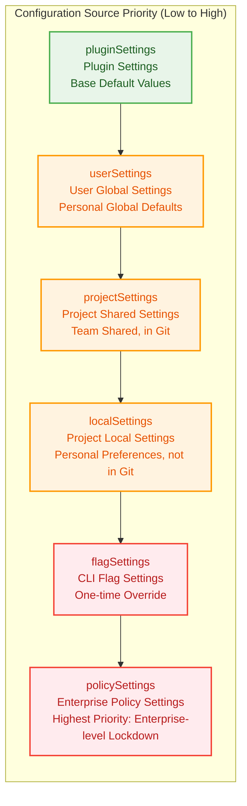
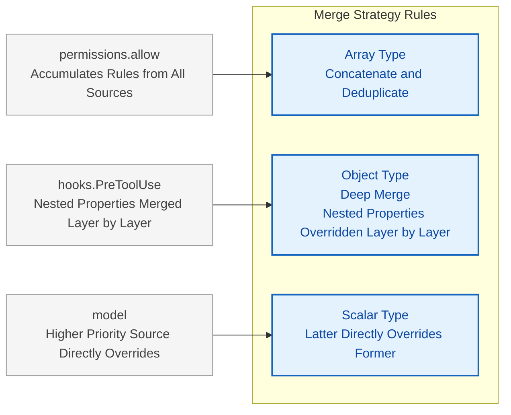
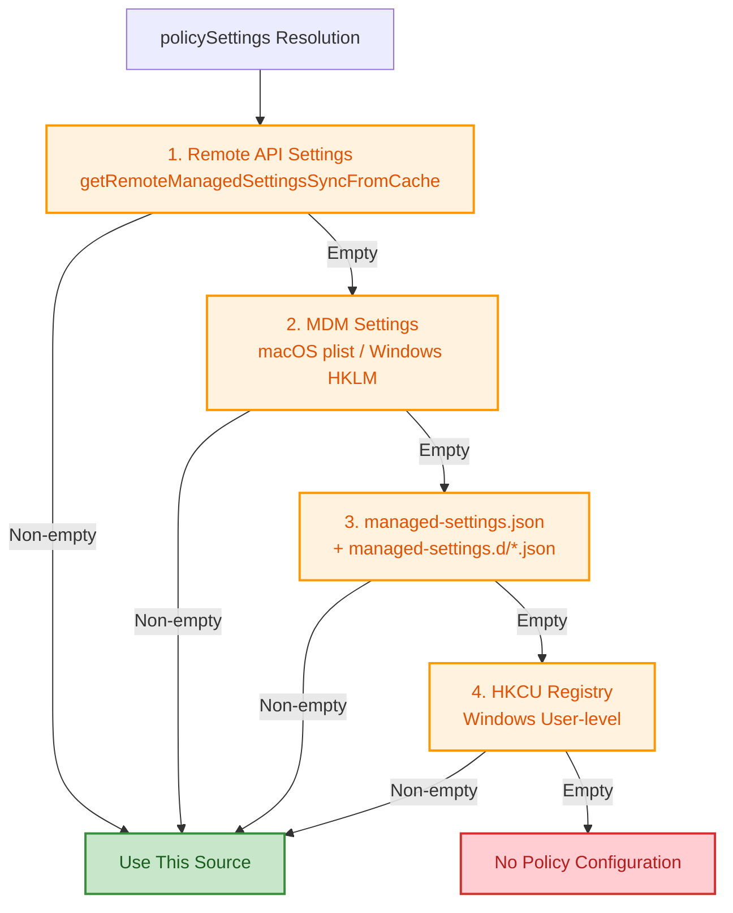
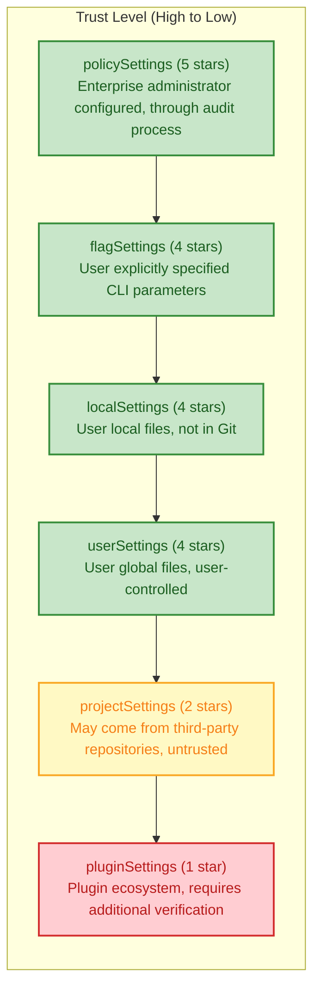
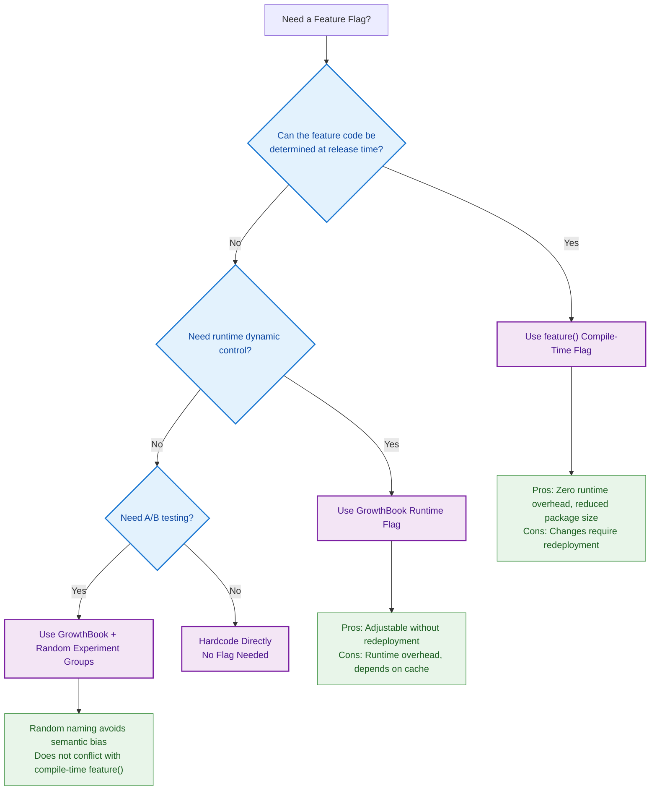
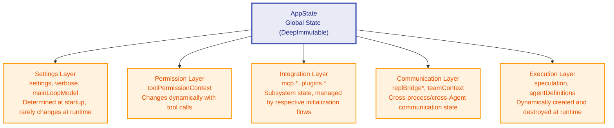

# Chapter 5: Settings and Configuration -- Agent DNA

> **Learning Objectives:** Understand the merge rules and security boundaries of the six-layer configuration sources, master the compile-time optimization mechanism of the feature flag system, and grasp the design philosophy of the Zustand-like immutable state store. Through this chapter, you will be able to design reasonable configuration strategies for teams of different scales and understand how the configuration system serves as the first line of defense in Agent security.

---

Claude Code's behavior is not determined by a single configuration file, but by six layers of configuration sources merged in sequence. These configuration sources are like the Agent's "DNA" -- they are written before the Agent starts, determining what the Agent can do, what it cannot do, and how it does things. Understanding this system is the first step toward mastering Claude Code's behavior customization capabilities.

The analogy of the configuration system as "DNA" is fitting: just as an organism's genes are determined at the moment of fertilization and expressed layer by layer during development, Claude Code's configuration is loaded at startup and takes effect layer by layer at runtime. The difference is that the Agent's "DNA" can be precisely edited and overridden -- this is both a powerful capability and a security challenge.

## 5.1 The Priority System of Six Configuration Sources

### 5.1.1 Configuration Source Definition and Order

Claude Code's configuration sources are defined as an ordered array in the configuration constants module, containing five configuration origins: user global settings (userSettings), project shared settings (projectSettings), project local settings (localSettings, gitignored), CLI flag settings (flagSettings), and enterprise policy settings (policySettings).

The configuration loading function `loadSettingsFromDisk()` follows a key principle: **later-loaded sources override earlier ones**. The merge is not a simple full replacement, but uses a deep merge strategy with custom rules.

In practice, there is also a hidden lowest-priority layer: **pluginSettings** (plugin settings). In the configuration loading process, plugin settings are loaded first as the base for merging, and subsequent configuration layers are stacked on top of this base.

Therefore, the complete priority chain from low to high is:

**pluginSettings -> userSettings -> projectSettings -> localSettings -> flagSettings -> policySettings**

To better understand the relationship between these six configuration sources, we can use a "geological strata" model as an analogy:



> Each layer can override the configuration of lower layers, but will not delete them -- they are simply "shadowed." This design ensures that each layer can be independently understood and maintained.

### 5.1.2 Merge Rules



The core of the merge logic lies in the custom merge strategy function `settingsMergeCustomizer`: this function performs concatenation and deduplication for array types, while other types are handled by the default deep merge logic.

The key characteristics of these rules are:

- **Array type**: Concatenate and deduplicate (rather than replace). For example, the `permissions.allow` field accumulates rules from all sources.
- **Object type**: Deep merge. Nested properties are overridden layer by layer.
- **Scalar type**: The latter directly overrides the former.

This means that if `userSettings` sets `model: "claude-sonnet-4"` and `policySettings` sets `model: "claude-opus-4"`, the final effective value is `"claude-opus-4"`. But if both set `permissions.allow: ["Bash(*)"]`, the final result is a merged, deduplicated array.

**Why do arrays use concatenation instead of replacement?** This is a deliberate design decision. In the permission system, each rule is a "defense line" -- if a higher-priority source's array replaced a lower-priority source's array, the higher-priority source would have to completely enumerate all needed permission rules, and any omission would become a security vulnerability. The concatenation strategy allows each layer to only care about the rules it wants to "add," and the system automatically merges all layers' security policies.

> Anti-Pattern Warning: Do not use array concatenation to "revoke" rules from lower layers. For example, you cannot clear lower-layer permissions by setting an empty array in an upper layer -- after concatenation, the lower-layer rules still exist. If you need to revoke, you should use the `permissions.deny` field to explicitly deny.

Let's demonstrate the merge process with a complete example:

```
Scenario: A Frontend Team's Project Configuration

// ~/.claude/settings.json (userSettings - Developer Xiao Zhang's personal global settings)
{
  "model": "claude-sonnet-4",
  "permissions": {
    "allow": ["Bash(npm *)", "Bash(node *)"]
  },
  "verbose": true
}

// .claude/settings.json (projectSettings - Team shared settings, committed to Git)
{
  "permissions": {
    "allow": ["Bash(npm run lint)", "Bash(npm test)", "Read(*)"]
  },
  "hooks": {
    "PreToolUse": [{ "matcher": "Bash(*)", "hooks": [{ "type": "command", "command": "audit-log.sh" }] }]
  }
}

// .claude/settings.local.json (localSettings - Xiao Zhang's local override)
{
  "model": "claude-opus-4",
  "permissions": {
    "allow": ["Bash(git *)"]
  }
}

Merge Result:
{
  "model": "claude-opus-4",          // localSettings overrides userSettings
  "verbose": true,                    // Only set by userSettings, remains unchanged
  "permissions": {
    "allow": [
      "Bash(npm *)",                  // From userSettings
      "Bash(node *)",                 // From userSettings
      "Bash(npm run lint)",           // From projectSettings
      "Bash(npm test)",              // From projectSettings
      "Read(*)",                      // From projectSettings
      "Bash(git *)"                   // From localSettings
    ]                                  // Array concatenated and deduplicated
  },
  "hooks": {
    "PreToolUse": [{ ... }]           // Only set by projectSettings
  }
}
```

### 5.1.3 Actual Paths of Configuration Files

Each configuration source corresponds to a specific file path, determined by the configuration path mapping function:

| Configuration Source | File Path | Description | In Git? |
|---------------------|-----------|-------------|---------|
| userSettings | `~/.claude/settings.json` | Global user settings | N/A (User directory) |
| projectSettings | `<project>/.claude/settings.json` | Project shared settings (committed to Git) | Yes |
| localSettings | `<project>/.claude/settings.local.json` | Project local settings (added to .gitignore) | No |
| flagSettings | CLI `--settings` parameter specified path | One-time override | N/A |
| policySettings | Platform-specific managed-settings.json | Enterprise managed | N/A |

The resolution of `policySettings` is the most complex. It follows a **"first source wins"** (first non-empty source wins) strategy, with priority from high to low:



Note that policySettings uses "first non-empty source wins" rather than "deep merge." This difference is crucial: enterprise management policies are typically a complete, audited configuration scheme, and policies from different sources should not "leak" into each other. For example, a policy delivered via remote API already contains complete security rules and should not be diluted by partial configurations from a local managed-settings.json file.

### 5.1.4 The Special Status of the Policy Layer

Unlike other configuration sources that use deep merge, `policySettings` employs a completely different resolution logic. Instead of reading from files and merging, it searches for the first non-empty source by priority (remote API settings > MDM settings > managed-settings.json file > HKCU registry).

This means enterprise administrators only need to configure policies in one location, and the system will use the highest-priority source rather than merging all sources.

**Design Decision Analysis: Why is the merge logic for policySettings different from other configuration sources?**

This stems from two different trust models. The five configuration layers from userSettings to flagSettings follow an "incremental accumulation" model -- each layer adds its preferences on top of trusting the lower layers. policySettings, on the other hand, follows a "single authority" model -- enterprise policies are completely delivered from a single authoritative source, and merging between different sources would introduce unpredictable behavior.

Imagine if two MDM systems respectively delivered different model restrictions and permissions rules. After merging, semantic conflicts could arise: one restricts the available model list, another restricts the permission scope, but the merged result might allow users to use a restricted model to bypass permission restrictions. The "first non-empty source wins" strategy ensures the determinism and auditability of the policy source.

### 5.1.5 Real-World Project Practices for Configuration Loading

In real-world projects, the proper use of the six-layer configuration system can greatly enhance team collaboration efficiency and security. Here are several common configuration strategy patterns:

**Pattern 1: Personal-Team Separation**

This is the most common pattern. Developers place personal preferences in `userSettings` and `localSettings`, and team-shared rules in `projectSettings`:

```
~/.claude/settings.json      -> Personal model preferences, commonly used personal permission rules
.claude/settings.json         -> Team-wide lint rules, permission baselines, shared hooks
.claude/settings.local.json   -> Personal overrides (debug mode, special permissions)
```

**Pattern 2: CI/CD-Specific Configuration**

In automated pipelines, use `flagSettings` to inject one-time configuration via CLI parameters, avoiding modifications to any persistent configuration files:

```
claude --settings /path/to/ci-settings.json
```

This approach ensures that CI environment configuration is temporary and traceable, without polluting developers' local environments.

**Pattern 3: Enterprise Unified Control**

Large organizations uniformly deliver policySettings through MDM or remote APIs, locking down security-related configuration items (allowed tools, hooks whitelist, etc.) while allowing teams to customize non-security-related behaviors in projectSettings:

```
policySettings    -> Locked: model, permissions.deny, allowManagedHooksOnly
projectSettings   -> Customized: hooks (non-security), MCP server configuration
userSettings      -> Personalized: verbose, theme and other UI preferences
```

## 5.2 Security Boundary Design

The core security challenge of the configuration system is: `projectSettings` (`.claude/settings.json`) is committed to Git repositories, which means users who clone a malicious repository may unknowingly load the attacker's configuration. Claude Code's defense strategy is: **systematically exclude `projectSettings` in security-sensitive checks**.

This is like a building's access control system: project keycards can open meeting rooms and break rooms (projectSettings), but can never open server rooms and secure rooms (security-sensitive operations). Different levels of access are controlled by different trust levels.

### 5.2.1 Threat Model of Supply Chain Attacks

Before understanding the security boundary design, we need to clarify the threat model. The particularity of supply chain attacks in the Agent scenario is:

**Traditional Supply Chain Attacks vs. Agent Configuration Supply Chain Attacks**

| Dimension | Traditional Software Supply Chain | Agent Configuration Supply Chain |
|-----------|----------------------------------|--------------------------------|
| Attack Vector | Malicious dependency packages, tampered build artifacts | Malicious configuration files, hooks injection |
| Victim | System running the software | Developer using the Agent |
| Attack Surface | Build pipeline, runtime environment | File system, code execution, data access |
| Stealth | Medium (requires bypassing security detection) | Very High (configuration files appear normal) |
| Impact Scope | Software users | Developer's entire work environment |

A concrete attack scenario: An attacker creates a seemingly normal open-source project with a `PreToolUse` hook configured in `.claude/settings.json` that sends the user's sensitive information (API keys, environment variables) to the attacker's server on every tool call. When a developer clones the project and starts Claude Code, the malicious hook executes without their knowledge.

**Why is projectSettings the highest-risk configuration source?**

Unlike other configuration sources, projectSettings has three unique properties that make it the primary risk point:

1. **Untrusted Source**: projectSettings comes from cloned third-party repositories, not written by the user themselves
2. **Automatic Loading**: Configuration takes effect automatically upon entering the project directory, without user confirmation
3. **Executable Code**: Hooks configuration can execute arbitrary shell commands

userSettings and localSettings do not have the first property (they are on the user's own filesystem), flagSettings requires the user to explicitly specify it (does not have the second property), and policySettings is controlled by administrators (does not have the first property). Therefore, projectSettings is the only configuration source that simultaneously possesses all three high-risk properties.

### 5.2.2 shouldAllowManagedHooksOnly

In the hooks configuration snapshot module, the `shouldAllowManagedHooksOnly` function determines whether only managed hooks are allowed to run. It checks whether `allowManagedHooksOnly` is enabled in the policy settings, returning true if it is.

When this function returns `true`, hooks execution only uses hooks from `policySettings`; all hooks from user/project/local sources are skipped. This is an enterprise security feature: administrators can ensure that only audited hooks run within the organization.

**Real-World Scenario: Financial Institution Compliance Requirements**

Suppose a financial institution requires all code changes to be logged through an internal audit system. An administrator can configure the following in managed-settings.json:

- Set `allowManagedHooksOnly: true` to block all non-managed hooks
- Configure an audit logging hook in policySettings' hooks
- This way, regardless of what hooks are in developers' local projectSettings, only the administrator's audit hook will run

This "managed-only" mode ensures that hooks execution within the organization is predictable and auditable -- developers cannot bypass auditing by modifying local configurations.

### 5.2.3 pluginOnlyPolicy

The plugin policy module implements the `strictPluginOnlyCustomization` strategy, which defines four lockable "customization surfaces": skills, agents, hooks, and mcp.

The core judgment function `isRestrictedToPluginOnly` checks the policy configuration: if the policy is `true`, all surfaces are locked; if the policy is an array, only the specified surfaces are locked.

Within locked surfaces, only the following sources are trusted:

- **plugin** -- separately managed through `strictKnownMarketplaces`
- **policySettings** -- set by administrators, inherently trusted
- **built-in / bundled** -- shipped with the CLI, not user-written

User-level (`~/.claude/*`) and project-level (`.claude/*`) customizations are completely blocked.

The elegance of this design lies in "selective locking." Enterprise administrators don't need to bluntly prohibit all customization but can finely control which customization surfaces need to be locked. For example:

- Lock `mcp`: Prevent developers from connecting to unapproved MCP servers (preventing data leaks)
- Lock `hooks`: Prevent developers from executing unaudited custom scripts
- Don't lock `skills`: Allow developers to create custom skills (enhancing productivity)

### 5.2.4 Systematic Exclusion of projectSettings

In security-sensitive functions, `projectSettings` is consistently excluded. The following functions demonstrate the same pattern: when checking `skipDangerousModePermissionPrompt`, they only read from userSettings, localSettings, flagSettings, and policySettings, **intentionally excluding projectSettings**.

The same exclusion pattern appears in `hasAutoModeOptIn()`, `getUseAutoModeDuringPlan()`, and `getAutoModeConfig()`. The comments consistently point to the same reason: **projectSettings is intentionally excluded -- a malicious project could otherwise auto-bypass the dialog (RCE risk)**.

The assumption behind this defense is: the user's own settings (`userSettings`/`localSettings`) are trusted because they are on the user's filesystem and edited by the user themselves; whereas `projectSettings` may come from cloned third-party repositories, posing a supply chain attack risk.

**Design Principle Summary: Decreasing Trust Radius**

Claude Code's security boundaries follow a clear "decreasing trust radius" principle:



> In security-sensitive checks, the system only reads from configuration sources with a trust level of 4+ stars. This principle runs throughout the security design of the entire configuration system.

> Cross-Reference: The `projectSettings` exclusion mechanism discussed in this chapter is closely related to the security model in Chapter 8 (Hooks System). The loading of hooks similarly follows this trust model -- when `allowManagedHooksOnly` is enabled, hooks from projectSettings are completely blocked.

## 5.3 Feature Flag System

Claude Code's feature flag system is divided into two layers: **compile-time** `feature()` function and **runtime** GrowthBook experimentation framework. This dual-layer design reflects a classic tradeoff in software release engineering: compile-time flags provide zero-overhead feature control, while runtime flags provide rapid iteration capability without redeployment.

### 5.3.1 Compile-Time Dead Code Elimination

The `feature()` function is introduced through the bundler. When `feature('FEATURE_NAME')` returns `false`, the bundler completely removes the corresponding code branch. This is a form of compile-time dead code elimination.

Throughout the codebase, this pattern appears extensively: feature flags determine whether certain functionality code is compiled, and unenabled features are completely absent from the build artifacts.

**Why choose compile-time elimination over runtime conditional checks?**

Consider two approaches:

```
Approach A (Runtime Check):
if (featureFlags.isEnabled('KAIROS')) { ... }

Approach B (Compile-Time Elimination):
if (feature('KAIROS')) { ... }  // Bundler completely removes this branch when false
```

The problems with Approach A are: (1) unenabled feature code still occupies package size, affecting load times; (2) conditional branches produce minor performance overhead on hot paths; (3) code for unenabled features may contain uncovered bugs or security vulnerabilities. Approach B solves all three problems through compile-time elimination -- unenabled features simply do not exist in the build artifacts.

The main feature flags include:

| Feature Flag | Scope | Description | Architectural Significance |
|-------------|-------|-------------|--------------------------|
| `KAIROS` | Core Architecture | Assistant mode (persistent sessions) | Core interaction mode switching |
| `EXTRACT_MEMORIES` | Memory System | Background memory extraction | Directly related to Chapter 6 Memory System |
| `TRANSCRIPT_CLASSIFIER` | Permission System | Automatic mode classifier | Foundation for automated permission decisions |
| `TEAMMEM` | Collaboration System | Team memory | Key capability for multi-person collaboration scenarios |
| `CHICAGO_MCP` | Tool System | Computer Use MCP | Interface for extending the tool ecosystem |
| `TEMPLATES` | Task System | Templates and workflows | Infrastructure for reusable workflows |
| `BUDDY` | UI System | Companion sprite | Enhancement of user interaction experience |
| `DAEMON` | Architecture | Background daemon | Capability for persistent background operation |
| `BRIDGE_MODE` | Architecture | Bridge mode | Bridge for cross-process communication |

From these feature flags, we can discern the evolutionary direction of Claude Code's architecture: KAIROS (persistent sessions) and DAEMON (background daemon) point to the evolution path from "on-demand invocation" to "continuous operation"; TEAMMEM (team memory) and TEMPLATES (template workflows) point to the evolution path from "personal tool" to "team infrastructure."

### 5.3.2 GrowthBook Experimentation Framework

For features that need to be dynamically controlled at runtime, Claude Code uses the GrowthBook A/B testing framework. The main entry function `getFeatureValue_CACHED_MAY_BE_STALE` accepts a feature name and default value, and synchronously reads the experiment configuration from cache.

The "CACHED_MAY_BE_STALE" in the function name plainly states its semantics: the value comes from cache and may be stale in cross-process scenarios. This is to avoid asynchronous waiting on the startup critical path -- synchronously reading from cache is preferable to blocking while waiting for remote configuration.

**This naming convention is worth learning for all system designers.** In API design, encoding non-obvious behavioral constraints directly into function names "reminds" callers of this constraint every time they use it. In contrast, a function named `getFeatureValue` would give the false expectation of "returning the latest value."

In the memory system, we can see the usage of GrowthBook feature flags -- checking randomly named feature flags to determine whether to enable certain memory features.

These feature flags named with random animal names (e.g., `tengu_passport_quail`, `tengu_coral_fern`, `tengu_moth_copse`) are standard practice for GrowthBook experiments -- random names avoid semantic bias and do not conflict with the compile-time `feature()` function.

**Decision Tree for Compile-Time vs. Runtime Flags:**



> Cross-Reference: The compile-time feature flag `EXTRACT_MEMORIES` directly controls whether the background memory extraction feature in Chapter 6 (Memory System) is compiled into the final artifact. This is a classic case of the configuration system influencing core functionality.

## 5.4 State Management System

State management is the "nervous system" of an Agent system -- configuration is the DNA that determines the Agent's potential; state is the nervous system that transmits and coordinates the Agent's runtime behavior in real time. Claude Code has chosen a minimalist yet powerful state management solution whose design philosophy deserves in-depth analysis.

### 5.4.1 Store: A Minimalist Immutable State Container

The state management module implements a generic Store in just 34 lines, inspired by Zustand. The Store provides three core methods: `getState` retrieves the current state, `setState` updates state through an updater function, and `subscribe` subscribes to state changes.

Three key design decisions:

1. **Immutable Updates**: `setState` accepts an updater function `(prev: T) => T`, requiring callers to return an entirely new state object. It compares old and new references using `Object.is` -- only when the reference changes are listeners notified.
2. **Generic `onChange` Callback**: Passed in when the Store is created, it is called with both old and new states on every state change. This is used in `AppStateProvider` to respond to external setting changes.
3. **Set-based Listener Management**: Uses `Set` instead of arrays for automatic deduplication; `subscribe` returns an unsubscribe function, following React's cleanup pattern.

**Why Only 34 Lines? -- The "Less Is More" Philosophy of State Management**

In today's frontend ecosystem, state management libraries are层出不穷 -- Redux, MobX, Recoil, Jotai, Valtio... each trying to solve different pain points. Claude Code's Store has chosen a minimalist path, which is not laziness but a precise grasp of requirements.

The state management needs of an Agent CLI tool are fundamentally different from those of a complex Web application:

| Dimension | Web Application | Agent CLI |
|-----------|----------------|-----------|
| State Change Frequency | Very High (millisecond-level UI interactions) | Medium (second-level tool calls) |
| Concurrent Updates | Common (multiple users operating simultaneously) | Rare (single user, single session) |
| Time-Travel Debugging | Valuable (tracing complex interactions) | Unnecessary |
| Middleware Needs | High (async operations, side effects) | Low (primarily synchronous) |
| Learning Curve Tolerance | Low (team collaboration) | Low (but for a different reason: keeping code concise) |

A 34-line Store means: no reducer boilerplate, no action type definitions, no middleware configuration, no DevTools integration -- only the core get/set/subscribe. Every removed feature is a deliberate "no."

**The Deeper Implications of Immutable Updates**

The `Object.is` reference comparison has subtle semantics. It means:

```javascript
// Will NOT trigger notification -- returns the same reference
setState(prev => prev)

// Will trigger notification -- returns a new reference
setState(prev => ({ ...prev, count: prev.count + 1 }))

// Will NOT trigger notification -- same value, but this is correct behavior
setState(prev => ({ ...prev, count: prev.count }))
// Note: In this case, a new object is created but nothing actually changed
// Production code should check whether the value truly changed before creating a new object
```

This design delegates the judgment of "whether a change occurred" to the caller -- the caller expresses the semantics of "whether the state changed" through whether they return a new reference. This is a "convention over configuration" design style: the convention is "return new reference = state changed," rather than providing an explicit `hasChanged` callback.

### 5.4.2 AppState: Global State Type Definition

The global state type `AppState` is marked as DeepImmutable, containing over 50 state fields that cover:

- **Settings Layer**: `settings` (merged SettingsJson), `verbose`, `mainLoopModel`
- **UI Layer**: `expandedView`, `footerSelection`, `statusLineText`
- **Tool Permission Layer**: `toolPermissionContext` (current permission mode, allowed tools list, etc.)
- **MCP Layer**: `mcp.clients`, `mcp.tools`, `mcp.commands`
- **Plugin Layer**: `plugins.enabled`, `plugins.disabled`, `plugins.errors`
- **Bridge Layer**: `replBridgeEnabled`, `replBridgeConnected`, and ten other bridge-related states
- **Agent Layer**: `agentDefinitions`, `agentNameRegistry`, `teamContext`
- **Speculative Execution Layer**: `speculation` (idle/active state machine)

The default state is constructed by `getDefaultAppState()`, which loads the merged settings at startup and initializes all subsystems to safe default values.

**DeepImmutable's Type-Level Guarantee**

`AppState` uses the `DeepImmutable<T>` type marker, which means the TypeScript compiler prevents any attempt to directly modify state fields at compile time. This is a manifestation of the "make the right thing easy and the wrong thing impossible" design philosophy at the type system level.

The categorization of state fields maps to the architectural layers of the Agent system:



> This layered structure implies a core architectural principle of the Agent system: state ownership. Each layer's state changes are driven by the corresponding layer's logic, while other layers only read.

### 5.4.3 AppStateProvider: React Context Wrapper

`AppStateProvider` wraps the Store as a React Context. The Store is created only once (through `useState` lazy initialization), and the Provider itself does not re-render due to state changes. Consumers access state through two hooks:

- **`useAppState(selector)`**: Uses `useSyncExternalStore` to subscribe to a state slice. It only triggers re-render when the selector's return value changes by `Object.is`. This is a fine-grained subscription mechanism that avoids the problem of "subscribing to the entire state tree causing the entire component tree to re-render."
- **`useSetAppState()`**: Only retrieves the `setState` function without subscribing to any state. The returned reference never changes, so components using this hook do not re-render due to state changes.

There is also a safe variant `useAppStateMaybeOutsideOfProvider` for components that may render outside of `AppStateProvider` -- it returns `undefined` instead of throwing an exception when there is no Provider.

**The Significance of Choosing `useSyncExternalStore`**

Claude Code chose React 18's `useSyncExternalStore` over a custom subscription implementation (like useEffect + useState). This choice is worth analyzing. `useSyncExternalStore` is React's official hook designed for "external state sources," providing three key guarantees:

1. **Consistency**: In concurrent mode, the state snapshot during rendering is consistent (no torn reads)
2. **Batched Updates**: Multiple `setState` calls trigger only one re-render
3. **Server Compatibility**: Supports SSR snapshot mode

For an Agent system where state changes may trigger side effects like tool calls and file operations, consistency guarantees are particularly important. Imagine: if permission state were inconsistent during rendering, one component might think permission was granted while another thinks it wasn't, producing contradictory behavior.

**Performance Optimization Pattern Comparison**

```
Pattern A: Subscribe to Entire State (Anti-Pattern)
const state = useAppState(s => s);
// Any field change triggers re-render

Pattern B: Precisely Subscribe to Individual Fields (Recommended)
const model = useAppState(s => s.mainLoopModel);
const verbose = useAppState(s => s.verbose);
// Only triggers re-render when corresponding fields change

Pattern C: Write-Only, No Read (Recommended)
const setState = useSetAppState();
// Never re-renders due to state changes
// Suitable for components that only need to modify state but don't need to read it
```

> Best Practice:
>
> 1. Follow the "principle of minimum subscription" -- components should only subscribe to the portion of state they actually use
> 2. Use `useSetAppState()` instead of `useAppState(s => s.setState)` -- the former does not subscribe to any state
> 3. Avoid creating new objects in selectors -- `useAppState(s => ({ a: s.a, b: s.b }))` returns a new reference on every call, causing infinite re-renders. Instead, subscribe separately or use shallow comparison

> Cross-Reference: The `mcp.*` fields in AppState are directly related to Chapter 9 (MCP Tool System); `toolPermissionContext` is related to the permission system; `speculation` state machine is related to the speculative execution architecture. Understanding AppState's structure is key to understanding how subsystems collaborate.

---

## Practical Exercises

### Exercise 1: Configuration Merge Prediction

Assume the following configurations exist:

- `~/.claude/settings.json`: `{ "permissions": { "allow": ["Bash(ls)"] }, "model": "sonnet" }`
- `.claude/settings.json`: `{ "permissions": { "allow": ["Read(*)"] }, "hooks": { "Stop": [...] } }`
- `.claude/settings.local.json`: `{ "permissions": { "allow": ["Bash(git *)"] } }`

Predict the merged `permissions.allow` and `model` values.

**Reference Answer**: `permissions.allow` is `["Bash(ls)", "Read(*)", "Bash(git *)"]` (array concatenation with deduplication), `model` is `"sonnet"` (no higher-priority override).

**Extended Thinking**: If you now pass `{ "model": "opus" }` via CLI parameter `--settings`, what would the `model` value become? If the enterprise policy sets `"model": "haiku"`, what would the final value be?

### Exercise 2: Security Boundary Analysis

If you are an enterprise administrator and want to ensure: (1) All users can only use administrator-approved hooks; (2) Users cannot self-install MCP servers. Which fields should you set in `managed-settings.json`?

**Reference Answer**: Set `allowManagedHooksOnly: true` and `strictPluginOnlyCustomization: ["mcp"]`.

**Extended Thinking**: If, in addition to the above requirements, you also want to ensure team members cannot override the model setting, how should you configure it? Hint: Consider whether the `model` field can be directly locked in policySettings.

### Exercise 3: State Subscription Optimization

A component needs to display the current model name and the verbose flag. Which of the following two approaches is better?

- **Approach A**: Subscribe to the entire state object via `useAppState`
- **Approach B**: Precisely subscribe to `mainLoopModel` and `verbose` fields separately via `useAppState`

**Reference Answer**: Approach B is better. Approach A subscribes to the entire state tree, and any state change will trigger a re-render. Approach B precisely subscribes to two fields, only triggering re-render when those two fields change.

**Extended Thinking**: If a component needs to display the boolean value "whether the current model is Opus," which of the following approaches is better?

- Approach C: `useAppState(s => s.mainLoopModel)` and then determine in the component
- Approach D: `useAppState(s => s.mainLoopModel?.includes('opus'))`

### Exercise 4: Configuration Strategy Design

Design a configuration strategy for a 20-person development team with the following requirements:

- The team uniformly uses a specified model and permission baseline
- Each developer can customize UI preferences and local permission extensions
- The CI/CD environment follows the principle of least privilege

Specify what content should be placed in each configuration source and explain why.

---

## Key Takeaways

1. **Six-Layer Priority Chain**: pluginSettings -> userSettings -> projectSettings -> localSettings -> flagSettings -> policySettings, where the latter overrides the former. Understanding the role of each layer is the foundation for designing sound configuration strategies.
2. **Merge Strategy**: Arrays are concatenated and deduplicated, objects are deeply merged, scalars are directly overridden. The array concatenation design ensures that permission rules are only ever added, never accidentally removed.
3. **Security Boundaries**: `projectSettings` is excluded in all security-sensitive checks to prevent supply chain attacks from malicious repositories. This is a direct manifestation of the "decreasing trust radius" principle.
4. **Special Merge for the Policy Layer**: policySettings uses "first non-empty source wins" instead of deep merge, ensuring the determinism and auditability of enterprise policies.
5. **Dual Feature Flags**: `feature()` provides compile-time dead code elimination (zero runtime overhead), while GrowthBook provides runtime experiment control (flexible but cache-dependent). The choice between the two depends on whether the feature needs to be dynamically adjusted after release.
6. **Immutable State**: The Store uses `Object.is` reference comparison to enforce immutable update patterns, combined with React's `useSyncExternalStore` for fine-grained subscription rendering. 34 lines of code implement all necessary state management capabilities.
7. **DeepImmutable Types**: Prevents direct state modification at the type system level, making the right thing easy and the wrong thing impossible.
