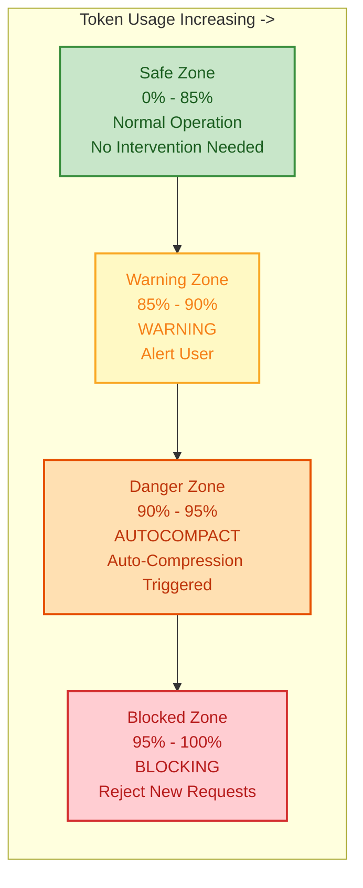
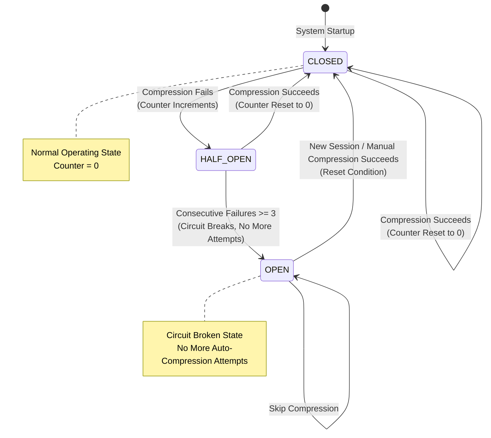
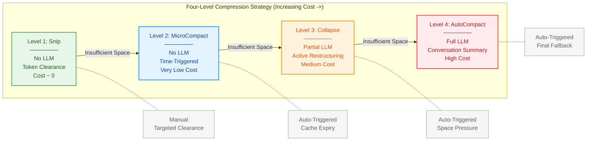
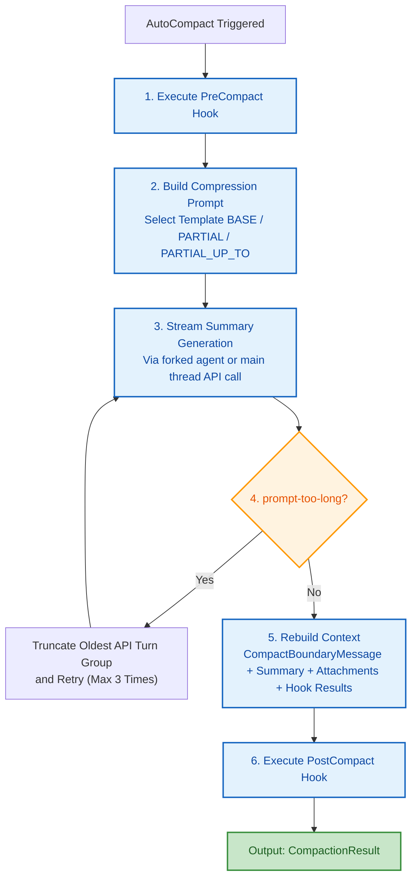
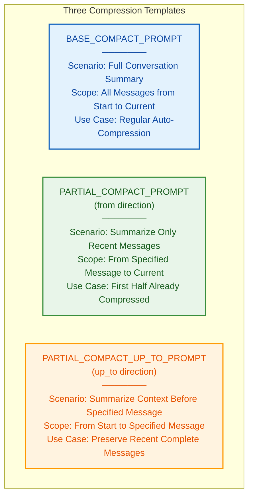
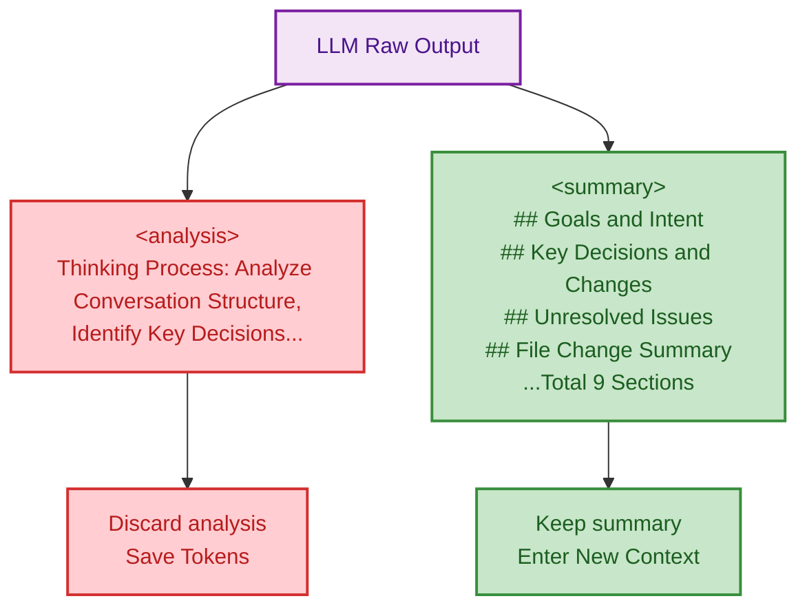
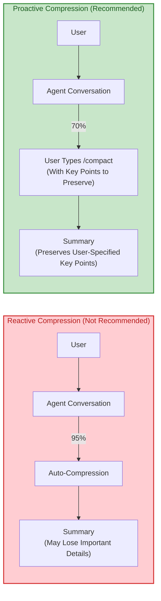

# Chapter 7: Context Management -- The Agent's Working Memory

> **Learning Objectives:**
> 1. Understand the hard constraints of the Agent's context window and how effective space is calculated
> 2. Master the design motivations and working mechanisms of the four-level progressive compression strategy (Snip -> MicroCompact -> Collapse -> AutoCompact)
> 3. Understand how the circuit breaker pattern protects the system from cascading failures
> 4. Analyze the dual-phase output structure of compression prompt engineering
> 5. Be able to select the optimal context management strategy for different usage scenarios

---

## 7.1 Context Window Constraints

All of a large language model's reasoning capabilities rest on a single premise: the context window. In every conversation turn, Claude Code must package the complete message history (system prompts, user messages, assistant replies, tool calls and results) and send it to the model. As the conversation progresses, this history inevitably expands until it hits the ceiling of the model's context window.

You can think of the context window as a **whiteboard of limited size**. All of the Agent's working memory -- conversation history, tool results, intermediate reasoning -- must be written on this whiteboard. When the whiteboard runs out of space, you must erase old content before writing new content. The key question is: **what to erase, what to keep, and how to erase it**?

This is not just a problem for Claude Code; it is a core engineering challenge that all long-conversation Agent systems must solve. Many Agent frameworks opt for "brute-force truncation" on this problem -- simply discarding the oldest messages. Claude Code's approach is far more refined.

### The Effective Window Formula

Claude Code uses a precise formula to characterize the space truly available for conversation:

```
Effective Window = Model Window - Reserved Output Tokens
```

In the auto-compaction module, the `getEffectiveContextWindowSize` function implements the calculation of the effective window size: it reserves the lesser of the model's maximum output tokens and 20,000 tokens as reserved space for the compression summary. The remainder is the effective carrying capacity of the context.

> **Why reserve 20,000 tokens?** Because AutoCompact (Level 4 compression) needs to call the LLM to generate a summary, and the summary itself consumes output tokens. If no space is reserved, the compression operation itself may fail due to insufficient output space -- a classic "compression paradox."

Let's use concrete numbers: suppose the model context window is 200,000 tokens and the maximum output tokens are 16,384:
- Reserved space = min(16,384, 20,000) = 16,384 tokens
- Effective window = 200,000 - 16,384 = **183,616 tokens**

These 183,616 tokens are the space truly available for carrying conversation history.

### Buffers and Thresholds

Based on the effective window, Claude Code defines multiple key threshold constants, forming a **progressively tightening safety net**:



| Constant | Value | Meaning | Design Intent |
|----------|-------|---------|---------------|
| `AUTOCOMPACT_BUFFER_TOKENS` | 13,000 | Auto-compression trigger buffer | Reserves a safety margin before space is exhausted, avoiding "edge cases" |
| `WARNING_THRESHOLD_BUFFER_TOKENS` | 20,000 | Warning threshold buffer | Early warning, giving users time to react |
| `ERROR_THRESHOLD_BUFFER_TOKENS` | 20,000 | Error threshold buffer | Marks the danger zone, triggering more aggressive compression strategies |
| `MANUAL_COMPACT_BUFFER_TOKENS` | 3,000 | Manual compression buffer | Minimum safety margin when users manually trigger compression |

> **Best Practice:** When you see token usage exceed 80%, you should consider manually triggering compression (by typing `/compact`) rather than waiting for auto-compression to trigger. Proactive compression typically preserves more valuable content because you can provide advance guidance on which information is most important.

### Circuit Breaker Design

Auto-compression does not always succeed. Network fluctuations, API errors, or structural issues in the context itself can all cause compression to fail. If the system retries blindly, it will make doomed API calls on every turn, wasting significant resources.

Claude Code introduces a Circuit Breaker mechanism: when the number of consecutive failures reaches 3 (`MAX_CONSECUTIVE_AUTOCOMPACT_FAILURES`), the system directly skips subsequent compression attempts.



On success, the failure counter resets to zero; on failure, the counter increments and is propagated to the upper-level caller. This is a classic circuit breaker pattern -- once consecutive failures reach the threshold, the circuit breaks, preventing avalanche effects.

**Real-world data from the circuit breaker:** According to engineering analysis, before the circuit breaker was introduced, 1,279 sessions were observed with over 50 consecutive compression failures (up to 3,272), wasting approximately 250K API calls per day. After its introduction, such cascading failures were completely eliminated.

> **Anti-Pattern Warning:** If you are building your own Agent system, do not ignore circuit breakers. A system without circuit breakers will fall into a "compression failure -> retry -> fail again" death spiral when the API is unstable, wasting resources and potentially further degrading the user experience due to increased latency.

> **Cross-Reference:** The circuit breaker pattern is also discussed as a key design pattern in Chapter 15 on building your own Agent Harness. Similar state protection mechanisms also appear in the conversation loop in Chapter 2 (the `max_output_tokens_recovery` path).

---

## 7.2 The Four-Level Compression Strategy

Claude Code's context management employs a four-level progressive compression strategy, escalating from low cost to high cost. Each level is activated only when the previous level is insufficient to free up space.

This design philosophy can be understood through an analogy: **compression strategies are like organizing clothing storage**. You don't start by throwing away all your clothes (brute-force truncation); instead, you first put away clothes you no longer wear (Snip), then compress seasonal clothing (MicroCompact), then vacuum-seal bulky items (Collapse), and only finally do a comprehensive sort-and-discard (AutoCompact).



### Level 1: Snip

Snip is the lightest-weight compression method. It does not invoke any LLM; instead, it directly clears old tool result content. When a user marks messages as no longer needed through the Snip tool, the system replaces the tool call results with a brief marker text (e.g., `[Old tool result content cleared]`), thereby freeing token space.

In the micro-compaction module, you can see the definition of this marker text: `'[Old tool result content cleared]'`.

Snip operations record the number of tokens freed and pass this information to the auto-compression decision function, enabling a more accurate assessment of whether higher-level compression needs to be triggered.

**The design wisdom of Snip:** Why replace messages with marker text instead of deleting them outright? Because deleting messages breaks the continuity of the message chain -- subsequent messages may reference earlier tool call IDs. The marker text both frees space and maintains message structural integrity.

**Typical usage scenario:** You just used the Read tool to read 10 files, each with 500 lines of code, consuming approximately 15,000 tokens. Once the analysis is complete, these file contents are no longer needed. At this point, using Snip to clear these tool results immediately reclaims a large amount of space.

### Level 2: MicroCompact

MicroCompact is a time-triggered, large-scale tool result cleanup. When the system detects that the time interval since the last assistant message exceeds a configured threshold, it means the server-side cache has expired. At that point, regardless of how important the content is, a full rewrite is unavoidable -- so it is better to proactively clear old tool results before the request, reducing the rewrite payload.

> **Why is this related to cache expiry?** Claude's API supports Prompt Caching -- if consecutive requests share the same prefix, cached portions can significantly reduce cost and latency. However, over time, caches expire. When a cache expires, the full content must be resent regardless. At that point, keeping old tool results only adds unnecessary payload.

The core logic for time-based triggering resides in the time evaluation function: it checks whether the feature flag is enabled, whether the message source is the main thread, and then calculates the time interval since the last assistant message. If the interval exceeds the configured threshold, micro-compaction is triggered.

Once triggered, the system retains the most recent N compressible tool results (`config.keepRecent`, minimum value of 1) and replaces all other tool result content with the clearance marker text. Compressible tool types include Read, Bash, Grep, Glob, WebSearch, WebFetch, Edit, and Write.

Additionally, MicroCompact has a cache editing-based path that uses the `cache_edits` mechanism at the API layer to delete tool results without breaking the cache prefix -- a more advanced lossless optimization.

**Core trade-offs of MicroCompact:**

| Dimension | Description |
|-----------|-------------|
| **Trigger Condition** | Time since last assistant message exceeds threshold |
| **Retention Policy** | Keep the most recent N tool results, clear the rest |
| **Cost** | Zero LLM calls, string replacement only |
| **Information Loss** | Old tool result content is lost, but message structure is preserved |
| **Applicable Scenario** | "Natural breakpoints" in long conversations (user returns after a pause) |

### Level 3: Collapse

Collapse is context restructuring-level compression. When the Context Collapse feature is enabled, the system begins committing (commit) compression operations at 90% context utilization and blocks new spawns at 95%. The design philosophy of this level is to shift context management from "reactive compression" to "proactive restructuring."

Collapse mode suppresses the triggering of auto-compression because the two would compete at the 93% critical point. Collapse, as a more refined context management system, has higher priority.

> **Design Philosophy:** Collapse represents a different mindset -- not "compress when space runs out," but "proactively restructure before space pressure appears." This is similar to an operating system's memory prefetching strategy, which starts defragmenting before memory is exhausted.

**Key differences between Collapse and AutoCompact:**

| Feature | Collapse | AutoCompact |
|---------|----------|-------------|
| Trigger Timing | 90% utilization (proactive) | Exceeds threshold (reactive) |
| Compression Granularity | Selectively restructures message groups | Full conversation summary |
| Information Retention | More original details preserved | Only summary retained |
| Relationship with Fork | Blocks new spawns (95%) | Does not affect spawns |

### Level 4: AutoCompact

AutoCompact is the most thorough compression level -- it invokes the LLM to summarize the complete conversation. When the above three levels cannot effectively free space and token usage exceeds the auto-compression threshold, the system initiates AutoCompact.

This is the final fallback and also the most "expensive" -- it requires an additional API call to generate the summary.

The compression process is driven by the `compactConversation` function, whose core steps are:



The `CompactionResult` interface describes the complete structure of the compression output, including: boundary marker (boundaryMarker), summary messages (summaryMessages), re-injected attachments (attachments), hook results (hookResults), messages retained during partial compression (messagesToKeep), and token counts before and after compression.

Notably, the `buildPostCompactMessages` function ensures consistent output message ordering across all compression paths: boundary marker, summary messages, retained messages, attachments, hook results.

> **Cross-Reference:** AutoCompact's forked agent execution method is closely related to the Fork pattern discussed in Chapter 9. The compression operation executes in a restricted sub-Agent that runs for at most 1 turn (generating only a summary, no tool calls), ensuring compression does not produce side effects.

> **Cross-Reference:** PreCompact and PostCompact hooks are important application scenarios of the hook system covered in Chapter 8. Users can inject custom compression instructions through PreCompact hooks (e.g., "specifically preserve all discussions related to the database").

---

## 7.3 Compression Prompt Engineering

The quality of compression directly depends on prompt design. Claude Code's compression prompt engineering is a carefully designed system with multiple variants and strict output format constraints.

You can think of compression prompts as instructions to a stenographer: you need to clearly tell them "what to record, what not to record, and what format to use." If the instructions are not precise enough, the summary will either lose critical information or be stuffed with unnecessary details.

### Compression-Specific Prompt Templates

The compression prompt module defines three compression prompt templates, corresponding to three different compression scenarios:



Each prompt includes a critical anti-tool-call preamble: it instructs the model to respond only in text form and not to invoke any tools (including Read, Bash, Grep, etc.). This directive ensures the summary generation process does not trigger tool calls, because compression runs in a restricted forked agent environment (maximum 1 turn), and a rejected tool call would directly result in empty output.

> **Design Philosophy:** Why must compression execute in a restricted environment? Because compression is a "rewriting" operation on conversation history -- if new conversation history is generated during the rewriting process, it creates a recursion problem. Restricting it to a single turn with no tool calls ensures compression is a pure "read-summarize-output" process.

### Dual-Phase Output Structure

The compression prompt requires the model to output two XML blocks:

- `<analysis>` block: A thinking scratchpad used to organize thoughts and ensure comprehensive coverage. This block is discarded in the final result.
- `<summary>` block: The formal summary content, containing a structured set of 9 sections.

The `formatCompactSummary` function handles post-processing: it first discards the `<analysis>` block (thinking scratchpad), then extracts the content of the `<summary>` block as the formal summary.

This design pattern is noteworthy: the `<analysis>` block serves as a Chain-of-Thought carrier that improves summary quality, but it does not enter the final context window, avoiding token waste.



**Why is the dual-phase design so important?** If you directly ask the model to output a summary (without an analysis phase), the model will often miss important information -- because it lacks "thinking" space. But if you keep the analysis in the context, you waste valuable tokens. The dual-phase design perfectly resolves this contradiction: **thinking is the process, the summary is the result**. The process is not counted; only the result enters the context.

> **Best Practice:** If you need to customize compression behavior in a PreCompact hook, you can adjust the priority of the 9 sections within `<summary>`. For example, if your work focuses on API design, you can inject an instruction in the hook: "In the summary, specifically preserve all API endpoint definitions and their rationale for changes."

### CompactBoundaryMessage

After each compression is completed, the system inserts a `CompactBoundaryMessage` into the message stream as a dividing line between pre-compression and post-compression. This marker carries compression metadata: trigger type (manual/automatic), pre-compression token count, and number of messages involved in the compression. The `logicalParentUuid` field associates the boundary marker with the last message before compression, constructing logical continuity of the message chain.

The presence of the boundary marker enables subsequent compression operations to accurately identify "which messages have already been compressed," avoiding redundant compression of already-summarized content.

> **Cross-Reference:** `CompactBoundaryMessage` is directly related to the message chain mechanism in the conversation loop from Chapter 2. When building API requests, the conversation loop needs to correctly handle boundary markers -- messages before the boundary marker have been replaced by summaries and should not be sent again.

---

## 7.4 Token Budget Tracking

Token management is not just about reactive compression triggering; it also includes proactive budget planning and early warning systems.

### Multi-Level Warning States

The `calculateTokenWarningState` function calculates the current token usage state and returns multiple boolean flags:

| Flag | Trigger Condition | UI Behavior |
|------|-------------------|-------------|
| `isAboveWarningThreshold` | Token usage >= threshold - 20,000 | Display yellow warning |
| `isAboveErrorThreshold` | Token usage >= threshold - 20,000 | Display red warning |
| `isAboveAutoCompactThreshold` | Token usage >= auto-compression threshold | Trigger auto-compression |
| `isAtBlockingLimit` | Token usage >= effective window - 3,000 | Block new requests |

These flags drive warning display at the UI level and trigger compression behavior. The `percentLeft` field shows the user the percentage of remaining space.

### Post-Compression Token Budget

After compression is complete, the system does not simply release all space. The compression module defines strict token budget constants:

| Constant | Value | Purpose |
|----------|-------|---------|
| `POST_COMPACT_MAX_FILES_TO_RESTORE` | 5 | Maximum number of files to restore |
| `POST_COMPACT_TOKEN_BUDGET` | 50,000 | Total token budget cap |
| `POST_COMPACT_MAX_TOKENS_PER_FILE` | 5,000 | Token cap per file |
| `POST_COMPACT_MAX_TOKENS_PER_SKILL` | 5,000 | Token cap per skill |
| `POST_COMPACT_SKILLS_TOKEN_BUDGET` | 25,000 | Independent skill budget |

These budgets limit the amount of content re-injected into the context after compression, ensuring that compression does not immediately trigger another compression due to excessive attachment injection.

> **Anti-Pattern Warning:** A common mistake is to immediately reload all previously read files after compression. Doing so rapidly depletes the token budget, causing compression to trigger again after just a few conversation turns, creating a vicious "compress-expand-recompress" cycle. The correct approach is to only reload files needed for the current task.

### True Token Estimation

`truePostCompactTokenCount` is an estimate of the actual post-compression context size, including the sum of tokens for the boundary marker, summary messages, attachments, and hook results. This value is used to determine whether compression would immediately trigger another compression in the next turn, providing critical diagnostic information for telemetry.

If the post-compression token count still exceeds the auto-compression threshold, the system knows the compression "was done in vain" -- this situation typically occurs when the conversation structure is extremely complex or the summary itself is too long.

---

## 7.5 Context Management Strategies for Long Conversations

Having understood the compression mechanisms, let's look at how to optimize context management in practice.

### Strategy 1: Proactive Compression Over Reactive Compression



When you sense that a conversation is becoming lengthy during extended work, proactively type `/compact` with a hint (e.g., "/compact preserve all database schema related content") to make the compression more targeted.

### Strategy 2: Phased Work

For large projects, divide work into multiple phases:
1. **Research Phase**: Read files, understand code structure -> compress when complete
2. **Planning Phase**: Formulate plans based on the summary -> compress when complete
3. **Implementation Phase**: Execute modifications based on the plan -> compress when complete

Compression at the end of each phase ensures ample context space for the next phase.

### Strategy 3: Leverage the Memory System to Supplement Context

> **Cross-Reference:** The memory system from Chapter 6 is an important supplement to context management. Compression loses conversation details, but if key information has already been saved as memory files, the Agent can still recover critical context by reading memories after compression.

This means you should develop the habit of having the Agent save memories when important decisions are made -- so that even if the conversation is compressed, critical information is not lost.

### Context Strategies for Multi-File Projects

When working with large projects, context management is especially critical:

| Scenario | Recommended Strategy |
|----------|---------------------|
| After reading 10+ files | Use Snip to clear analyzed file contents |
| Returning after a long pause | MicroCompact automatically clears expired cache |
| Implementing multiple features consecutively | Manually compress after completing each feature |
| Refactoring across multiple subsystems | Phased work + memory system support |

---

## Practical Exercises

**Exercise 1: Token Budget Calculator**

Assume your model context window is 200,000 tokens and the maximum output tokens are 16,384. Please calculate:
- Effective context window size
- Auto-compression trigger threshold
- Warning threshold
- Blocking limit

> *Advanced Challenge:* If the conversation includes a system prompt that consumes 50,000 tokens, how much effective conversation space do you have left? What impact does this have on the choice of compression strategy?

**Exercise 2: Design a Custom Compression Strategy**

Design the most appropriate compression level combination for the following scenarios:
- Scenario A: Code review session, user works continuously for 2 hours, contains extensive file read results
- Scenario B: Automated CI/CD Agent, long-running task pipeline
- Scenario C: Interactive teaching session, needs to maintain precise quotations from early conversation

> *Advanced Challenge:* Design a PreCompact hook instruction for each scenario, guiding the summary on which key information to preserve.

**Exercise 3: Circuit Breaker Behavior Analysis**

Trace the circuit breaker state changes through the following event sequence:
1. Compression succeeds (consecutiveFailures = ?)
2. Compression fails (consecutiveFailures = ?)
3. Compression fails (consecutiveFailures = ?)
4. Compression fails (consecutiveFailures = ?)
5. Will compression be attempted in the next turn?

> *Advanced Challenge:* If the circuit breaker threshold is changed from 3 to 5, with an API failure rate of 30%, how many additional API calls would be wasted per day? (Hint: refer to the data from 1,279 sessions in the text)

**Exercise 4: Context Compression in Practice**

Start a long conversation session using Claude Code:
1. Have the Agent read 8-10 files consecutively
2. Observe changes in token usage
3. When usage reaches 60%, manually type `/compact` with the key points you want to preserve
4. Compare token counts before and after compression

> *Advanced Challenge:* Try manually clearing unnecessary tool results with the Snip tool before compression. Compare the difference between "Snip first, then compact" versus "compact directly."

**Exercise 5: Cross-Chapter Comprehensive Analysis**

Combining Chapter 2 (Conversation Loop) and Chapter 9 (Fork Pattern), analyze the following questions:
- In the conversation loop's preprocessing pipeline, at which step does context compression execute? Why at that position?
- When a Fork creates a sub-Agent, if the parent Agent's context has already been compressed, what does the sub-Agent inherit? What impact does this have on the sub-Agent's behavior?

---

## Key Takeaways

1. **Effective Window = Model Window - Reserved Output Tokens**: Claude Code reserves up to 20,000 tokens for compression summary output space, ensuring the compression operation itself does not fail due to insufficient space.
2. **Four-Level Progressive Compression**: Snip -> MicroCompact -> Collapse -> AutoCompact, with costs escalating at each level. Each level is an "upgrade" of the previous one.
3. **Circuit Breaker Protection**: After 3 consecutive compression failures, further attempts are stopped, preventing avalanche effects from wasted API calls. This design stems from actual data analysis of 1,279 sessions.
4. **Dual-Phase Prompt Structure**: `<analysis>` thinking scratchpad + `<summary>` formal summary. The former is discarded in the final context to save tokens -- "thinking is the process, the summary is the result."
5. **CompactBoundaryMessage**: The compression boundary marker carries metadata and maintains logical continuity of the message chain through `logicalParentUuid`, enabling subsequent operations to accurately identify already-compressed content.
6. **Post-Compression Budget Control**: Re-injected content has strict token budget limits (50,000 total budget, 5,000 per file), preventing immediate re-triggering of compression.
7. **Time-Triggered Micro-Compression**: When server-side cache expires (timeout since last assistant message), old tool results are proactively cleared to reduce rewrite costs.
8. **Proactive Compression Over Reactive Compression**: Manually triggering compression at key work milestones with annotation of key points preserves more valuable information than waiting for auto-compression.
9. **Memory System as a Context Supplement**: Important decisions should be saved as memory files, so that even if the conversation is compressed, critical information is not lost. See Chapter 6 for details.
