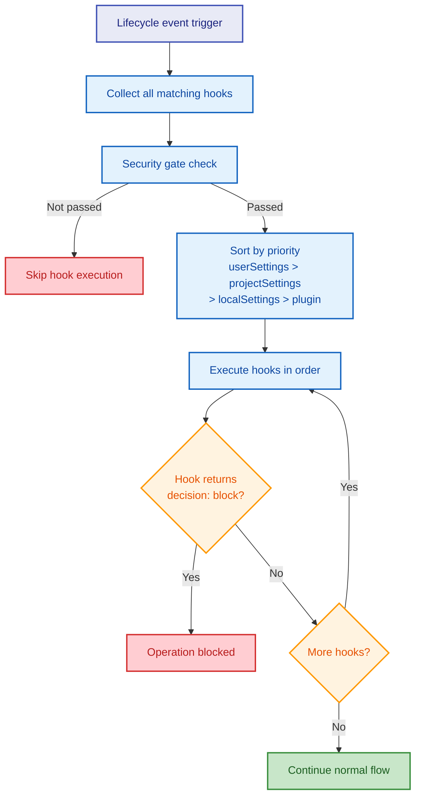
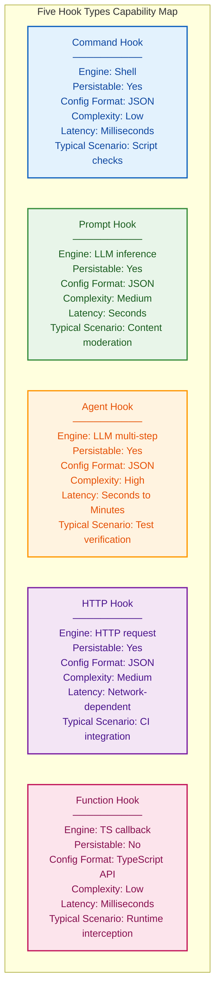
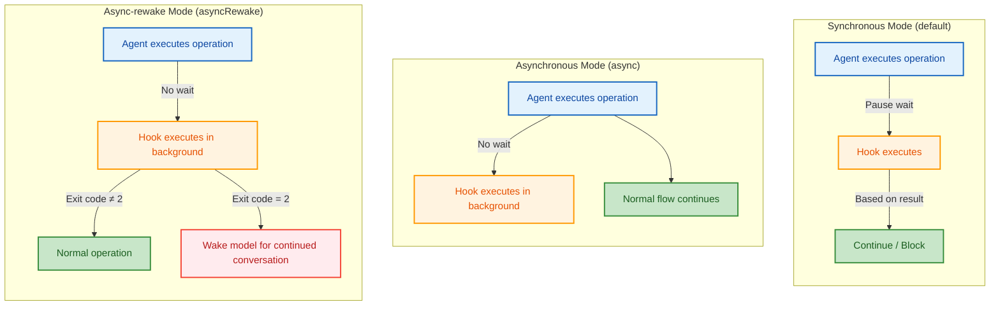
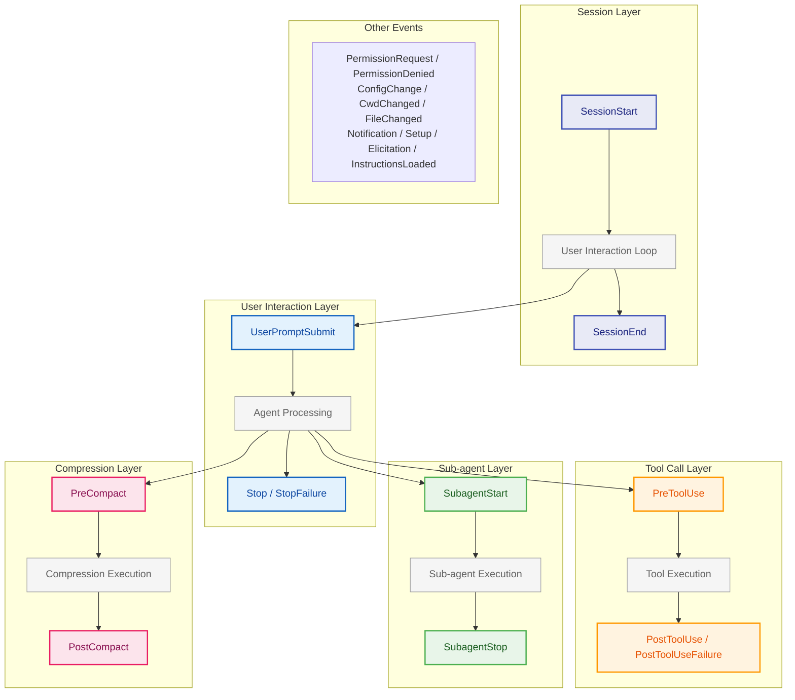
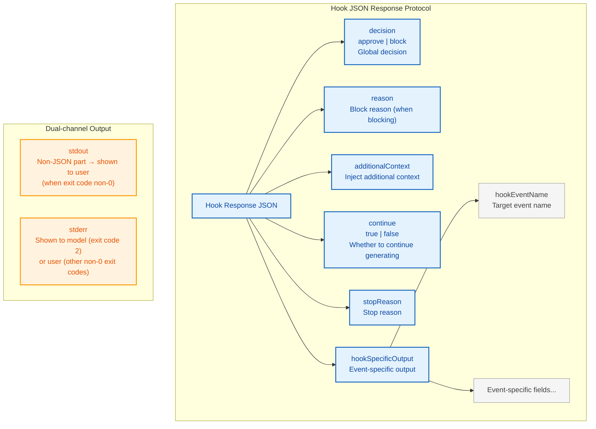
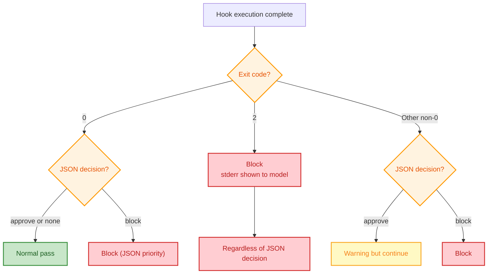
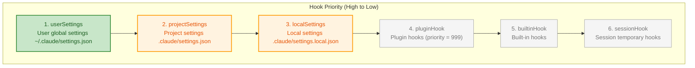
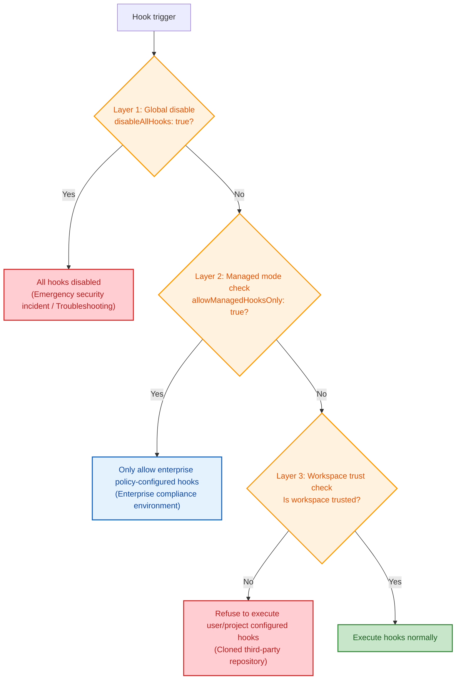

# Chapter 8: The Hook System -- Agent's Lifecycle Extension Points

> **Learning Objectives:** After reading this chapter, you will be able to:
>
> - Understand the design philosophy, capability boundaries, and applicable scenarios of five hook types
> - Master the trigger timing, input structure, and exit code semantics of 26 lifecycle events
> - Design structured hook responses, utilizing `decision`, `updatedInput`, `additionalContext` and other fields for fine-grained control
> - Understand the multi-layer security model: global disable, managed-hooks-only, workspace trust check three-layer gating
> - Analyze hook priority ordering rules and conflict resolution strategies
> - Master best practices for hook configuration, avoiding common anti-patterns
> - Understand the collaboration between the hook system and permission pipeline (Chapter 4), configuration system (Chapter 5)

---

If the permission pipeline (Chapter 4) is the Agent's "guardrails", then the hook system is the Agent's "nervous system". The permission pipeline determines whether the Agent **can** execute an operation, while the hook system determines what happens **before and after** execution. It provides fine-grained extension points for the Agent's entire lifecycle -- from session startup to tool invocation, from user input to context compression, every critical node can be observed, intercepted, and enhanced.

Using a biological analogy to understand: the human body has not just bones (architecture) and muscles (core logic), but also a nervous system spread throughout. Nerve endings perceive external stimuli (event triggers), conduct signals to the brain (hook logic), and after the brain responds, instructions are sent through motor nerves (decisions and operations). The hook system is precisely this "neural reflex arc" of Claude Code -- it doesn't require modifying core organ functions, yet can insert reflexive behaviors at critical nodes.

From an engineering perspective, the hook system follows the classic **Observer Pattern** combined with **Chain of Responsibility Pattern**. Each lifecycle event is a "signal", multiple hooks can listen to the same signal, processing in priority order, and any hook can choose to "block signal propagation". This design enables Claude Code's core execution engine to operate without knowledge of extension logic, achieving complete decoupling between the core system and user-defined logic.

## 8.1 Hook Types and Execution Model

Hooks are user-customizable extension points in Claude Code's lifecycle. Through hooks, users can inject custom logic at critical nodes without modifying Claude Code source code -- from approving tool calls, modifying tool inputs, to intercepting user requests, injecting additional context.



### Five Hook Types

The hook Schema definition module defines four persistable hook types, plus FunctionHook which only exists at runtime, making five total. This comparison table helps you quickly understand each hook type's positioning and capability boundaries:



**1. Command Hook** (`BashCommandHookSchema`)

The most common hook type, executes Shell commands. Supports choosing Shell interpreter (bash/powershell), custom timeout, custom status message, and `once` flag (automatically removed after one execution).

Applicable scenarios: Executing script checks, filesystem operations, calling external CLI tools, conditional approval or rejection of operations.

Configuration example:

```json
{
  "hooks": {
    "PreToolUse": [{
      "matcher": "Bash",
      "hooks": [{
        "type": "command",
        "command": "python3 scripts/validate_command.py",
        "timeout": 5000,
        "message": "Validating bash command safety..."
      }]
    }]
  }
}
```

**2. Prompt Hook** (`PromptHookSchema`)

Calls LLM to evaluate hook input, outputs JSON response. Supports specifying model (defaults to fast small model) and `$ARGUMENTS` placeholder to reference hook input.

Applicable scenarios: Approval flows requiring "intelligent judgment" rather than hardcoded rules. For example, determining whether a code modification is safe relies not on regex matching keywords but letting LLM understand code semantics to make judgments.

Configuration example:

```json
{
  "hooks": {
    "PreToolUse": [{
      "matcher": "Write",
      "hooks": [{
        "type": "prompt",
        "prompt": "Analyze this file write operation. If it modifies any file in src/core/, respond with {\"decision\": \"block\", \"reason\": \"Core module changes require code review\"}. Otherwise respond with {\"decision\": \"approve\"}. Input: $ARGUMENTS"
      }]
    }]
  }
}
```

**3. Agent Hook** (`AgentHookSchema`)

Agentic validator hook. Similar to Prompt hook but designed for validation scenarios requiring multi-step reasoning, such as verifying whether unit tests pass -- it may need to first run tests, read results, analyze coverage, before making a judgment.

Applicable scenarios: Complex approval flows requiring multi-step, iterable validation. For example, verifying all related tests still pass after code modifications.

**4. HTTP Hook** (`HttpHookSchema`)

POSTs hook input JSON to specified URL. Supports custom request headers, environment variable interpolation (controlled through `allowedEnvVars` whitelist), suitable for integration with external systems.

Applicable scenarios: Integration with CI/CD systems (like Jenkins, GitHub Actions), sending audit logs to SIEM systems, calling enterprise internal approval services.

Configuration example:

```json
{
  "hooks": {
    "PostToolUse": [{
      "matcher": "Bash",
      "hooks": [{
        "type": "http",
        "url": "https://audit.example.com/api/log",
        "headers": {
          "Authorization": "Bearer $AUDIT_TOKEN",
          "Content-Type": "application/json"
        },
        "allowedEnvVars": ["AUDIT_TOKEN"]
      }]
    }]
  }
}
```

> **Anti-pattern warning:** When using `allowedEnvVars` in HTTP hooks, be sure to only expose necessary variables. Don't open the entire environment variable whitelist, as this could lead to credential leakage in multi-user environments.

**5. Function Hook**

In-memory hooks that only exist at runtime, executing TypeScript callback functions. Cannot be persisted to configuration files, lifecycle bound to session. Callbacks receive message arrays and optional abort signal, returning boolean indicating success.

Applicable scenarios: Scenarios requiring deep interaction with Claude Code runtime state, such as dynamic behavior control in SDK embedding mode.

> **Design reflection:** Why can't Function hooks be persisted? Because TypeScript callback functions are in-memory executable code references that cannot be serialized to JSON configuration. This is the boundary between "code as configuration vs configuration as code" -- persistable hooks (Command/Prompt/Agent/HTTP) are fundamentally **declarative configuration**, while Function hooks are **imperative code**. Mixing both in the same configuration system would lead to unpredictable behavior and security risks.

### Sync vs Async Hooks

Command hooks support three execution modes:

- **Synchronous mode** (default): Blocks current operation, waits for hook completion before deciding whether to continue. This is the most common and safest mode, suitable for "approve before execute" scenarios.
- **Asynchronous mode** (`async: true`): Runs in background, doesn't block current operation. Hook results are not visible to the model. Suitable for "fire-and-forget" logging or notification scenarios.
- **Async-rewake mode** (`asyncRewake: true`): Runs in background, but when hook exits with code 2, injects error message to wake model for continued conversation. This implies `async` attribute. Suitable for long-running monitoring tasks -- normal operation doesn't disturb Agent, only intervenes when anomaly detected.



Async hook implementation is completed in background execution functions. Async-rewake mode hooks bypass the regular registry, injecting messages through notification queue upon completion. This design ensures async hook execution doesn't block Agent's main loop while retaining the ability to "sound the alarm" when necessary.

---

## 8.2 Core Lifecycle Events

The SDK core types module defines the complete `HOOK_EVENTS` array with 26 lifecycle events, covering all critical nodes including tool invocation, user interaction, session management, sub-agents, compression, permissions, configuration changes, etc.

The best way to understand these events is to imagine an Agent's complete execution cycle as an "assembly line". Materials (user requests) enter from one end, are processed through multiple stations (lifecycle events), and finally exit from the other end as finished products (Agent responses). Each station has "sensors" (events) installed, and hooks are the "control units" connected to these sensors.



Below introduces core events grouped by function, with detailed explanation of trigger timing, input structure, and usage scenarios for each event.

### Tool Call Lifecycle

Tool call lifecycle events are the most frequently used and powerful set of events in the hook system. They form a "sandwich" structure: PreToolUse intercepts before execution, PostToolUse handles after success, PostToolUseFailure catches after failure.

**PreToolUse** (Before tool execution)

The most important interception point. Input is the tool call's parameter JSON. Hooks can block tool execution by returning `decision: "block"`, or modify the tool's actual input parameters through `updatedInput`. Exit code semantics:

- Exit code 0: stdout/stderr not shown to model (silent pass)
- Exit code 2: Show stderr to model and block tool call (active block)
- Other exit codes: Show stderr to user but don't block (warning mode)

> **Cross-reference with Chapter 4:** PreToolUse hooks occur after the permission pipeline. The permission pipeline determines "whether the tool is allowed to execute", while PreToolUse hooks determine "given allowed execution, whether to attach additional conditions or modify parameters". This means even if the permission pipeline passes, PreToolUse hooks can still "veto".

Typical use cases:

1. **Security auditing**: Log before dangerous operations like `rm`, `delete`
2. **Input correction**: Automatically add safety prefixes to Bash commands (like `--dry-run`)
3. **Environment checks**: Verify current environment is correct before deployment operations
4. **Compliance approval**: Require additional approval for operations involving production environments

Configuration example -- Block all writes to production environment config files:

```json
{
  "hooks": {
    "PreToolUse": [{
      "matcher": "Write",
      "hooks": [{
        "type": "command",
        "command": "echo $INPUT_JSON | python3 -c \"import sys,json; d=json.load(sys.stdin); exit(2) if 'prod' in d.get('file_path','') else exit(0)\"",
        "message": "Checking production file protection..."
      }]
    }]
  }
}
```

**PostToolUse** (After tool execution)

Input contains tool call parameters and response. Can be used for audit logs, result post-processing. Supports `updatedMCPToolOutput` field to override MCP tool's actual output.

Typical use cases:

1. **Audit trail**: Record each tool call's parameters and results to external systems
2. **Result enhancement**: Append additional notes or warnings after tool output
3. **Automatic notification**: Send Slack/email notifications after specific tool calls
4. **MCP output override**: Post-process or sanitize MCP tool return values

> **Best practice:** PostToolUse hooks should尽量 use async mode (`async: true`) because the tool has already finished executing, hook results usually don't need to affect subsequent flow. Only use sync mode when needing to override MCP tool output.

**PostToolUseFailure** (After tool execution failure)

Triggered when tool execution fails due to error, interruption, or timeout. Input contains `error`, `error_type`, `is_interrupt` and `is_timeout` fields, providing detailed failure diagnostics.

Typical use cases:

1. **Error reporting**: Report tool failure info to monitoring systems (like Sentry)
2. **Automatic retry suggestion**: Generate retry strategies based on error type
3. **Failure analysis**: Collect failure scene info for post-analysis
4. **Graceful degradation**: Automatically switch to backup plan when critical tools fail

### User Interaction Lifecycle

**UserPromptSubmit** (When user submits prompt)

Triggered after user submits message, before model processing. This is the key timing to modify user input or inject additional context. Exit code 2 can completely block message processing and erase original prompt.

This event is the translation layer between "user intent" and "model understanding". You can use it to provide additional information to the model without the user knowing, or completely block message sending under specific conditions.

Typical use cases:

1. **Sensitive word filtering**: Detect and block messages containing sensitive information
2. **Context injection**: Automatically attach relevant project documentation based on user message content
3. **Input enhancement**: Expand user's brief questions into more complete prompts
4. **Usage limits**: Block message sending when quota exceeded

Configuration example -- Automatically attach current Git branch info to each user question:

```json
{
  "hooks": {
    "UserPromptSubmit": [{
      "hooks": [{
        "type": "command",
        "command": "echo '{\"additionalContext\": \"Current git branch: '$(git branch --show-current)'. Recent commits: '$(git log --oneline -3)'\"}'",
        "message": "Attaching git context..."
      }]
    }]
  }
}
```

**Notification** (When notification is sent)

Triggered when system sends notification. Notification types include `permission_prompt`, `idle_prompt`, `auth_success`, etc.

Typical use cases: Integration with external notification systems (like Slack, Teams), sending reminders when Agent needs user intervention.

### Session Lifecycle

Session lifecycle events constitute the complete narrative of an Agent from "birth" to "death".

**SessionStart** (Session startup)

Triggered when session starts, sources include `startup` (new start), `resume` (resume session), `clear` (clear reset), `compact` (restart after compression). Hook's stdout is shown to Claude. Blocking errors are ignored -- session start hooks shouldn't block session startup.

> **Design philosophy:** Why are SessionStart hook blocking errors ignored? Because session startup is the system initialization process; if hooks were allowed to block startup, one misconfigured hook could make the entire system unstartable -- this violates the "graceful degradation" principle. Core system functions should not be hijacked by extension logic.

Typical use cases:

1. **Environment reporting**: Display current environment status at session start (Node version, Git status, etc.)
2. **Project context**: Automatically inject project-specific instructions and constraints
3. **State recovery**: Reload previous working state when resuming sessions
4. **Welcome message**: Display usage guide for new users

Configuration example -- Automatically report project status at session start:

```json
{
  "hooks": {
    "SessionStart": [{
      "hooks": [{
        "type": "command",
        "command": "echo 'Project: '$(basename $(pwd))', Branch: '$(git branch --show-current)', Status: '$(git status --short | head -5)",
        "message": "Loading project context..."
      }]
    }]
  }
}
```

**SessionEnd** (Session end)

Triggered when session ends, reasons include `clear`, `logout`, `prompt_input_exit`, `other`. Note SessionEnd hooks have separate timeout limits (default 1,500ms) because they run during the shutdown process.

Typical use cases:

1. **Cleanup work**: Delete temporary files, release resources
2. **Session summary**: Save session records to project logs
3. **Usage statistics**: Report session duration and operation statistics
4. **Environment reset**: Restore temporary modifications to hooks or configuration

> **Best practice:** SessionEnd hooks should be as lightweight as possible. 1,500ms timeout means any operation exceeding this will be forcibly terminated. If time-consuming operations are needed (like uploading large files), trigger a background process in SessionEnd rather than waiting for completion.

**Stop** (Before assistant response ends)

Triggered just before Claude is about to end response. Exit code 2 can inject stderr to model and force continued conversation. This is the key event for implementing "ensure task completion" logic.

This event's design motivation is clever: LLMs sometimes stop generating before a task is fully complete (e.g., due to token limits or "feeling the answer is sufficient"). Stop hooks give users a chance to "pull the model's sleeve" to continue working.

Typical use cases:

1. **Completeness check**: Check if the model actually completed all requested tasks
2. **Quality gate**: Automatically check code quality after model output
3. **Force continue**: Force model to continue when detecting unfinished TODOs
4. **Auto-summary**: Generate execution summary after model answers

Configuration example -- Ensure model response includes code examples:

```json
{
  "hooks": {
    "Stop": [{
      "hooks": [{
        "type": "command",
        "command": "if echo \"$CLAUDE_OUTPUT\" | grep -q '```'; then exit 0; else echo 'Please include code examples in your response.' >&2; exit 2; fi",
        "message": "Checking response completeness..."
      }]
    }]
  }
}
```

**StopFailure** (When ending due to API error)

Triggered when turn ends due to API error (rate limiting, auth failure, etc.), replacing Stop event. This is a fire-and-forget event -- hook output and exit codes are ignored.

Typical use cases: Automatic reporting and diagnostic logging of API errors.

### Sub-agent Lifecycle

**SubagentStart / SubagentStop**

Triggered when sub-agent (Agent tool call) starts and ends. Input contains `agent_id` and `agent_type`. SubagentStart's stdout is shown to sub-agent; SubagentStop's exit code 2 can let sub-agent continue running.

> **Cross-reference with Chapter 7:** Sub-agents are a key concept in context management. When the main Agent's context space is insufficient for all information in a complex task, it delegates sub-agents to handle subtasks. Sub-agent lifecycle hooks let you monitor and intervene in this delegation process.

Typical use cases:

1. **Sub-agent auditing**: Record which subtasks were delegated to sub-agents
2. **Resource limits**: Inject resource usage constraints when sub-agent starts
3. **Result validation**: Validate sub-agent output quality after completion
4. **Timeout protection**: Monitor long-running sub-agents

### Compression Lifecycle

**PreCompact / PostCompact**

Triggered before and after compression. PreCompact's stdout is attached as custom compression instructions to the compression prompt, allowing users to customize summarization behavior. Exit code 2 can block compression. PostCompact receives compression summary as input.

PreCompact hook processing flow includes: building hook input, executing hook, extracting custom instructions, merging user instructions with hook instructions.

> **Design reflection:** Why allow hooks to customize compression instructions? Because different projects have different definitions of "what information is important". In an API project, interface definitions and parameter types are critical; in a frontend project, component hierarchy and state management are critical. PreCompact hooks let users customize compression strategies for different projects, ensuring important information is preserved during compression.

Typical use cases:

1. **Critical information protection**: Specify which code regions must be preserved during compression
2. **Compression condition control**: Block compression under specific conditions (like ongoing debugging sessions)
3. **Compression quality monitoring**: Check whether summary lost critical information after compression
4. **Custom summary template**: Define different summary formats for different project types

### Permission and Security Events

**PermissionRequest**: Triggered when permission dialog displays. Hook can return `decision` to allow or deny, enabling automated permission approval flows.

> **Cross-reference with Chapter 4:** This event directly interacts with the permission pipeline's "user interaction stage". Chapter 4 introduced the permission pipeline's four stages (built-in rules -> hook decisions -> admin policies -> user confirmation); PermissionRequest hooks are at the second stage, able to make decisions before users see permission dialogs.

**PermissionDenied**: Triggered when auto-mode classifier rejects tool call. Hook can suggest retry or provide alternatives. This is useful for implementing "soft rejection" strategies -- not simply blocking operations but guiding the model to use safer approaches to achieve the same goal.

### Other Events

- **Setup**: Triggered during repository initialization and maintenance. Suitable for environment checks or dependency installation when a project is first opened by Claude Code.
- **ConfigChange**: Triggered when configuration file changes. Hook can block changes from taking effect. This is a security audit critical point -- preventing malicious modification of config files to bypass security policies.
- **Elicitation / ElicitationResult**: Triggered when MCP server requests user input. Used for MCP server's interactive authentication or parameter collection flows.
- **CwdChanged / FileChanged**: Triggered when working directory and files change. Suitable for implementing filesystem monitoring and auto-refresh caches.
- **InstructionsLoaded**: Triggered when instruction files are loaded (observable only, blocking not supported). Suitable for auditing and logging, understanding what instructions the system loaded.

The table below summarizes all 26 events' classification, blockability, and typical uses:

| Event Name | Category | Blockable | Core Use |
|---------|------|-------|---------|
| PreToolUse | Tool call | Yes | Intercept/modify tool input |
| PostToolUse | Tool call | No | Audit/post-process tool output |
| PostToolUseFailure | Tool call | No | Failure diagnosis/reporting |
| UserPromptSubmit | User interaction | Yes | Modify/block user message |
| Notification | User interaction | No | Notification integration |
| SessionStart | Session management | No* | Environment initialization/context injection |
| SessionEnd | Session management | No | Cleanup/summary |
| Stop | Session management | Yes | Force continue/quality check |
| StopFailure | Session management | No | Error reporting |
| SubagentStart | Sub-agent | No | Sub-agent monitoring |
| SubagentStop | Sub-agent | Yes | Result validation |
| PreCompact | Compression | Yes | Custom compression strategy |
| PostCompact | Compression | No | Compression quality check |
| PermissionRequest | Permission | Yes | Auto permission approval |
| PermissionDenied | Permission | No | Alternative suggestion |
| Setup | Initialization | No | Environment preparation |
| ConfigChange | Configuration | Yes | Config change audit |
| Elicitation | MCP interaction | No | MCP input monitoring |
| ElicitationResult | MCP interaction | No | MCP result monitoring |
| CwdChanged | Environment | No | Directory change notification |
| FileChanged | Environment | No | File change notification |
| InstructionsLoaded | Instructions | No | Instruction loading audit |

* SessionStart blocking is ignored (graceful degradation design)

---

## 8.3 Hook Response Protocol

Hook output is not just a piece of stdout text, but a structured JSON response protocol. The output parsing function in hook execution module is responsible for parsing and processing this protocol. Understanding this protocol is the foundation for designing advanced hooks.

> **Design reflection:** Why is hook output structured JSON instead of simple stdout text? Because hooks need precise control over Claude Code's behavior -- not just "say something", but clearly specify "allow" or "block", "modify input" or "inject context". Plain text output can't express this structured intent. Keeping stdout as unstructured output channel (for logging and debugging) while JSON as structured control channel, this dual-channel design balances flexibility and precision.

### Response Protocol Overview



### Top-level Decision Fields

**decision field**: `approve` or `block`

When hook returns `{"decision": "approve"}`, tool call is allowed to continue; when returning `{"decision": "block"}`, tool call is blocked, `reason` field value is shown as block reason.

In hook output processing function, when `decision` field is parsed, `approve` corresponds to allowing continued execution, `block` corresponds to denial with block reason.

This field's design follows the "default allow, explicit block" principle. If hook output isn't valid JSON, or JSON doesn't have `decision` field, system default behavior is to continue execution (exit code semantics still apply). This design ensures a malformed hook output doesn't accidentally block normal operations.

### hookSpecificOutput Event-specific Output

`hookSpecificOutput` field contains event-specific structured response, identified by `hookEventName` for target event:

**PreToolUse specific fields**:

- `permissionDecision`: Override permission decision, values are `allow`, `deny`, or `ask`
- `permissionDecisionReason`: Decision reason
- `updatedInput`: Runtime modification of tool input

`updatedInput` is a powerful capability -- hooks can modify parameters actually sent to tools without changing user intent. For example, automatically adding specific prefixes to all Bash commands, or filtering sensitive parameters.

> **Best practice:** `updatedInput` is a double-edged sword. Used well, it can enhance security without modifying user operations (like auto-adding `--dry-run` flag); abused, it breaks user expectations (like silently modifying file paths causing operations to wrong locations). When using, follow the "transparency principle" -- modifications should be predictable, documented, and visible to users.

**UserPromptSubmit specific fields**:

- `additionalContext`: Inject additional context into user prompt

This field allows hooks to attach extra context information before user message reaches model, without modifying user's original input. This design is elegant: it preserves user input integrity while providing richer background information to the model.

### additionalContext: Injecting Additional Context

`additionalContext` is a generic field supported by multiple events. It injects hook-generated additional information into model context, attached as system reminder messages. This is particularly useful in the following scenarios:

- Injecting project status information in `SessionStart` event
- Adding extra usage notes in `PostToolUse` event
- Injecting environment configuration info in `Setup` event
- Attaching relevant project documentation in `UserPromptSubmit` event

> **Cross-reference with Chapter 5:** `additionalContext` injection mechanism is similar to `customInstructions` in Chapter 5's configuration system, but with a key difference: `customInstructions` are static, determined at config load time, while `additionalContext` is dynamic, generated differently each time hook executes. This is like the difference between "prefabricated panels" and "poured concrete" -- the former is standardized but inflexible, the latter is flexible but requires more on-site work.

### continue Field

`continue` field controls whether assistant should continue responding. When set to `false`, assistant stops generating, `stopReason` field can provide stop reason. This allows hooks to force assistant stop when detecting specific conditions.

Typical application: In Stop event, when hook detects model has output sufficient content, or detects model is drifting off-topic, it can force generation termination via `continue: false`.

### Collaboration Between Exit Codes and JSON Response

Hook behavior is jointly controlled by two dimensions: **exit code** (process level) and **JSON response** (content level). Understanding their collaboration is key to designing correct hooks:



| Exit Code | JSON decision | Final Effect |
|--------|--------------|---------
| 0 | approve or none | Normal pass |
| 0 | block | Block (JSON priority) |
| 2 | Any | Block, stderr shown to model |
| Other non-0 | approve | Warning but continue |
| Other non-0 | block | Block |

> **Anti-pattern warning:** Don't rely on exit codes and JSON decision to express contradictory intents. For example, exit code 0 but decision block, or exit code 2 but decision approve. Although system has clear processing priority, contradictory signals will confuse maintainers and increase debugging difficulty.

---

## 8.4 Hook Configuration and Security

### Configuration Validation

Hook configuration is strictly validated through Zod Schema. The hook Schema module defines the complete type system:

- `HookCommandSchema`: Discriminated union of four persistable hooks -- type discrimination through `type` field (`command`, `prompt`, `agent`, `http`)
- `HookMatcherSchema`: Matcher configuration, containing `matcher` string pattern and `hooks` array
- `HooksSchema`: Top-level configuration, mapping events to matcher arrays using `partialRecord`

> **Cross-reference with Chapter 5:** Hook configuration is an important component of the six-layer configuration system introduced in Chapter 5. Hook configuration is stored in `hooks` field of each layer, following the same merge and override rules as regular settings. Understanding Chapter 5's configuration merge mechanism helps you understand why hooks with the same name defined in different config files exhibit specific priority behaviors.

Matchers use permission rule syntax for filtering (`if` condition field). For example `"Bash(git *)"` only triggers hook when Bash tool call starts with `git`. This condition field is an optional string supporting permission rule syntax pattern matching.

Complete hook configuration structure example:

```json
{
  "hooks": {
    "PreToolUse": [
      {
        "matcher": "Bash",
        "hooks": [
          {
            "type": "command",
            "command": "python3 scripts/check_bash_safety.py",
            "timeout": 5000
          }
        ]
      },
      {
        "matcher": "Write",
        "hooks": [
          {
            "type": "prompt",
            "prompt": "Check if this file write is safe. $ARGUMENTS"
          }
        ]
      }
    ],
    "SessionStart": [
      {
        "hooks": [
          {
            "type": "command",
            "command": "cat .claude/context.md 2>/dev/null || echo 'No project context file found'",
            "message": "Loading project context..."
          }
        ]
      }
    ],
    "Stop": [
      {
        "hooks": [
          {
            "type": "command",
            "command": "python3 scripts/check_task_completion.py",
            "asyncRewake": true
          }
        ]
      }
    ]
  }
}
```

### Hook Sources and Priority

Hooks come from multiple configuration sources. The `getAllHooks` function shows the collection process: first check if restricted to managed hooks only, if not restricted, collect hooks from userSettings, projectSettings, localSettings sources, finally getting session hooks.

The `sortMatchersByPriority` function defines priority ordering. Priority is based on configuration source constant array with order: localSettings, projectSettings, userSettings.

Complete priority order:



Plugin hooks and built-in hooks are assigned lowest priority values in sorting, ensuring they don't override user-configured hooks.

> **Design reflection:** Why does user global settings have highest priority? This embodies the "user sovereignty" principle -- users' personal configuration should be able to override project configuration and plugin defaults. This aligns with Chapter 4's permission pipeline design philosophy of "user decisions take precedence over auto-mode classifier". In a multi-user collaborative project, each developer should be able to customize hook behavior according to their own security preferences.

### Priority Conflict Resolution Case Studies

The best way to understand priority ordering is through practical cases.

**Case 1: Multiple hooks for same event**

Suppose three configuration sources define hooks for `PreToolUse` event:

```
userSettings:    [Hook A: Audit log]
projectSettings: [Hook B: Security check]
localSettings:   [Hook C: Local debugging]

Execution order (by priority high to low):
  1. Hook A (userSettings) -- executes first
  2. Hook B (projectSettings) -- executes second
  3. Hook C (localSettings) -- executes last
```

Note: All matching hooks will execute, unless one hook returns `decision: "block"`. Once a hook blocks the operation, subsequent lower-priority hooks will still execute (they just see the blocked state), but the operation itself is already blocked.

**Case 2: Matcher fine-grained control**

Same event can have multiple matchers, each targeting different tools:

```json
{
  "hooks": {
    "PreToolUse": [
      {
        "matcher": "Bash(rm *)",
        "hooks": [{"type": "command", "command": "python3 check_delete.py"}]
      },
      {
        "matcher": "Bash(npm publish *)",
        "hooks": [{"type": "command", "command": "python3 check_publish.py"}]
      },
      {
        "matcher": "Write",
        "hooks": [{"type": "command", "command": "python3 check_write.py"}]
      }
    ]
  }
}
```

In this configuration, if model executes `rm -rf /tmp/test`, only first matcher triggers; if executing `npm publish`, only second matcher triggers; if write file operation, only third matcher triggers. Matchers provide "precise interception" capability.

### Emergency Disable Switches

Claude Code provides multiple security switches to handle hook-related risks. This embodies the "Defense in Depth" security design philosophy -- not relying on a single security measure but setting barriers at multiple levels.



**Global disable**: When `policySettings` (enterprise policy configuration) has `disableAllHooks: true`, all hooks (including managed hooks) are disabled. This is the ultimate emergency switch.

**Restrict to managed hooks only**: Check `allowManagedHooksOnly` field in policy settings; when this mode is enabled, hooks in user/project/local configs are all blocked, only allowing hooks deployed by enterprise admins through policy configuration.

**Workspace trust check**: All hooks in interactive mode require workspace to be trusted. The check function determines whether current is non-interactive session (SDK mode trust implicitly granted) and whether user has accepted trust dialog.

All hooks in interactive mode require workspace to be trusted. This is a defense-in-depth measure -- hook configuration is stored in `.claude/settings.json`; executing these commands in an untrusted workspace is unsafe. Imagine: you cloned an open-source project, the project's `.claude/settings.json` might contain malicious hooks (like PreToolUse hook sending your sensitive data to external servers). Workspace trust check is the key defense against this "supply chain attack".

The `executeHooks` function chains these checks together, forming complete security gating: first check global disable switch, then check simple mode flag, finally check workspace trust status; only after all pass does normal hook execution proceed.

### Session Hook Special Design

Session hooks use `Map` instead of `Record` to store state, a deliberate performance design.

In parallel workflows, N Agents might register hooks in the same synchronous clock cycle. Using `Record` spread operations would cause O(N^2) total overhead, while `Map.set()` is O(1), and by returning unmodified `prev` reference avoids triggering ~30 store listeners.

> **Performance analysis:** Why is this optimization so important? In a typical parallel Agent scenario, assume 10 sub-agents simultaneously register hooks. Using `Record`, each registration creates new object and triggers all listeners, total overhead is 10 * 10 = 100 listener triggers. Using `Map`, `set()` operation is in-place modification returning same reference, listeners don't trigger. In high-frequency hook registration/deregistration scenarios, this difference is significantly amplified. This embodies the engineering philosophy that "in high-concurrency paths, data structure choice is not a preference question but a correctness question".

---

## 8.5 Hook Best Practices and Anti-patterns

### Best Practices Checklist

**1. Keep hooks lightweight**

Hooks run on Agent's main execution path (in sync mode). A 5-second hook makes users feel Claude Code is "stuck". Try to keep hook execution time under 1 second. For time-consuming operations, use async mode or async-rewake mode.

**2. Handle exceptions gracefully**

Hooks should be responsible for their own errors. Don't let hook exceptions crash the Agent. Use `try-catch` in Command hook scripts (or Shell's `||` fallback), ensuring meaningful exit codes are returned even if script errors.

**3. Use matcher for precise filtering**

Don't register a hook without matcher on `PreToolUse` then judge tool type in script -- this causes your hook to execute on every tool call, even when it only needs to handle `Bash` tool. Using `"matcher": "Bash"` for precise filtering greatly reduces unnecessary hook execution.

**4. Document your hook intent**

Use comments in config files (or adjacent README files) to explain each hook's purpose and behavior. You returning to look at config three months later will thank yourself for writing comments now.

**5. Follow principle of least privilege**

Only intercept events you need, only use response fields you need. Don't register hooks on all events "just in case" -- each hook has performance overhead and maintenance cost.

### Anti-pattern Warnings

**Anti-pattern 1: Executing time-consuming operations in PreToolUse**

```json
// Anti-pattern: Complete code review before every tool call
{
  "PreToolUse": [{
    "hooks": [{
      "type": "command",
      "command": "npm run full-code-review",
      "timeout": 300000
    }]
  }]
}
```

This causes waiting 5 minutes for code review before every tool call. Correct approach is only using async mode for review in `Write` tool's `PostToolUse`.

**Anti-pattern 2: Circular dependencies between hooks**

Hook A's execution triggers event Hook B listens to, Hook B's execution triggers event Hook A listens to. Claude Code has internal mechanisms preventing infinite recursion, but circular dependencies cause performance degradation and unpredictable behavior.

**Anti-pattern 3: Overusing updatedInput**

```json
// Anti-pattern: Silently modify all Bash commands
{
  "PreToolUse": [{
    "matcher": "Bash",
    "hooks": [{
      "type": "command",
      "command": "echo $INPUT_JSON | jq '.tool_input.command |= \"sudo \" + .' | jq '{\"hookSpecificOutput\": {\"hookEventName\": \"PreToolUse\", \"updatedInput\": .tool_input}}'"
    }]
  }]
}
```

Adding `sudo` to all commands may cause privilege escalation risk. `updatedInput` should only be used for security enhancement, not changing operation's essential semantics.

**Anti-pattern 4: Ignoring timeout settings**

Command hooks have default timeout, but if not explicitly set, may infinitely block Agent due to script hang. Always set reasonable timeout values for your hooks.

### Complete Practical Case: Enterprise-level Security Audit System

Below is an enterprise-level security audit configuration comprehensively using multiple hook types and lifecycle events:

```json
{
  "hooks": {
    "SessionStart": [{
      "hooks": [{
        "type": "command",
        "command": "python3 scripts/session_init.py --report-env",
        "message": "Initializing security audit session..."
      }]
    }],
    "PreToolUse": [
      {
        "matcher": "Bash(rm *)",
        "hooks": [{
          "type": "command",
          "command": "python3 scripts/validate_delete.py",
          "timeout": 3000,
          "message": "Validating delete operation..."
        }]
      },
      {
        "matcher": "Write",
        "hooks": [{
          "type": "prompt",
          "prompt": "Analyze the file being written. If it modifies production config files (*.production.*), return {\"decision\": \"block\", \"reason\": \"Production config changes require approval\"}. Otherwise return {\"decision\": \"approve\"}. File content: $ARGUMENTS"
        }]
      }
    ],
    "PostToolUse": [{
      "matcher": "Bash",
      "hooks": [{
        "type": "http",
        "url": "https://audit.internal.company.com/api/log",
        "headers": {
          "Authorization": "Bearer $AUDIT_TOKEN"
        },
        "allowedEnvVars": ["AUDIT_TOKEN"],
        "async": true
      }]
    }],
    "Stop": [{
      "hooks": [{
        "type": "command",
        "command": "python3 scripts/check_completion.py",
        "asyncRewake": true
      }]
    }],
    "SessionEnd": [{
      "hooks": [{
        "type": "command",
        "command": "python3 scripts/session_summary.py",
        "timeout": 1500
      }]
    }]
  }
}
```

This configuration implements a complete security audit flow: recording environment info at session initialization, security validation before delete operations, LLM review of file write content, async audit log reporting after Bash operations, task completeness check at response end, and summary report generation at session end.

---

## Practical Exercises

**Exercise 1: Configure security review hook**

Write a PreToolUse hook configuration requiring:
- Only intercept `Write` tool calls
- Check if target path is within allowed directories (like `src/` and `test/`)
- If path is invalid, block operation with exit code 2 and show reason

Hint: Hook input comes via stdin in JSON format, containing `tool_name` and `tool_input` fields.

**Extended challenge:** Extend your hook to also support intercepting file write commands in `Bash` tool (like `cp`, `mv`, `>` redirection). Think about how to extract target path from Bash command string.

**Exercise 2: Session context injection**

Design a SessionStart hook that at each session start:
- Reads project's `package.json` to get dependency list
- Injects key dependency info as `additionalContext`

Think: How to handle case where `package.json` doesn't exist? How to handle JSON parsing errors?

**Extended challenge:** Design a UserPromptSubmit hook that dynamically retrieves relevant content from project documentation based on user message keywords and injects as `additionalContext`. This requires combining file search and keyword matching logic.

**Exercise 3: Hook priority analysis**

Given following hook configurations (for same event):
- `~/.claude/settings.json` defines Hook A (audit log)
- `.claude/settings.json` defines Hook B (security check)
- Plugin registers Hook C (auto-formatting)
- Runtime registers Hook D (dynamic validation) via `addFunctionHook`

Analyze:
1. When event triggers, what is the execution order of these hooks?
2. If Hook A returns `decision: "block"`, will Hook B/C/D still execute?
3. If Hook B modifies `updatedInput`, does Hook C see original input or modified input?

**Exercise 4: Async hook design**

Design an async-rewake hook for Stop event requiring:
- Monitor an external task queue in background
- When detecting new high-priority task (exit code 2), wake model to continue processing
- Normal operation (exit code 0) doesn't disturb model

Think: How to avoid "thrashing" -- model just woken immediately stops again, causing repeated loops?

**Exercise 5: Security scenario analysis**

Analyze following scenarios and provide hook configuration recommendations:

A team is developing a web application handling user sensitive data. Team has following security requirements:
1. Forbid Agent from modifying `src/config/production.ts`
2. All modifications to database-related files need LLM review
3. Every session's operation records need to be reported to internal audit system
4. Agent should automatically run related tests after completing code modifications

Design a complete hook configuration solution meeting above requirements.

---

## Key Takeaways

1. **Five hook types**: command (Shell command), prompt (LLM evaluation), agent (Agentic validation), http (HTTP call), function (runtime callback); first four are persistable, last one only exists in session memory. Decision tree for choosing hook type: need to execute system commands use Command, need intelligent judgment use Prompt, need multi-step validation use Agent, need external system integration use HTTP, need deep runtime interaction use Function.

2. **26 lifecycle events**: Covering complete Agent lifecycle including tool calls, user interaction, session management, sub-agents, compression, permissions, configuration changes. Each event has clear trigger timing, input structure, and exit code semantics.

3. **Structured response protocol**: Hook output is JSON containing `decision` (approve/block), `updatedInput` (modify tool input), `additionalContext` (inject context) fields. Exit codes and JSON response jointly control hook behavior; both should express consistent intent.

4. **Priority ordering**: userSettings > projectSettings > localSettings > pluginHook > builtinHook > sessionHook; user configuration always has highest priority. Multiple matching hooks execute in priority order; any hook's block decision takes effect.

5. **Multi-layer security mechanism**: Global disable switch (`disableAllHooks`), managed-hooks-only mode (`allowManagedHooksOnly`), workspace trust check -- three security gates filter progressively. This embodies defense-in-depth security design philosophy.

6. **Async hooks**: `async` and `asyncRewake` modes allow hooks to run in background; latter can wake model on error, suitable for long-running monitoring tasks. Async hooks interact with main loop through notification queue, not blocking Agent execution.

7. **Session hook Map design**: Using `Map` instead of `Record` for storage reduces O(N^2) overhead to O(1) in high-concurrency scenarios. This is a classic case of data structure choice affecting system performance.

8. **Collaboration with permission pipeline** (Chapter 4): PreToolUse hooks run after permission pipeline, as second security check. Permission pipeline determines "whether can execute", hooks determine "how to execute". Both together form Claude Code's security protection system.

9. **Collaboration with configuration system** (Chapter 5): Hook configuration follows six-layer configuration system merge rules, supporting different security policies at different levels. Enterprise policy layer can control global behavior through `disableAllHooks` and `allowManagedHooksOnly`.
