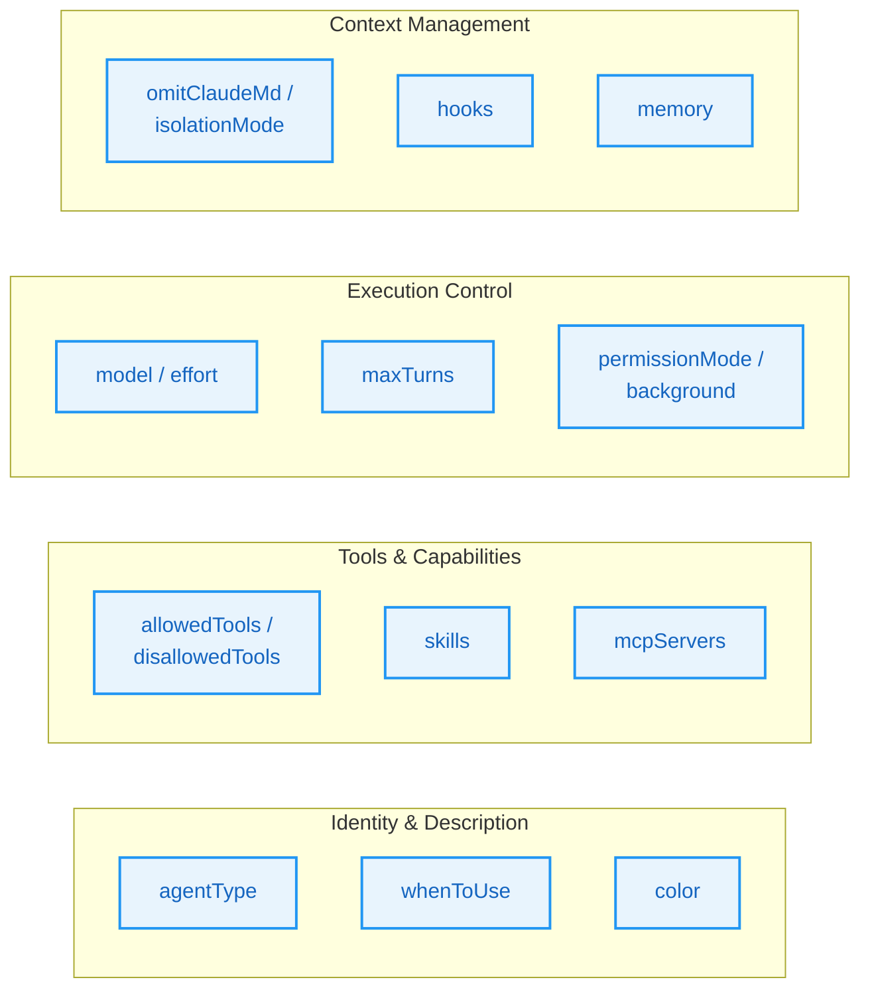
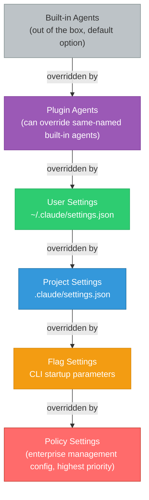
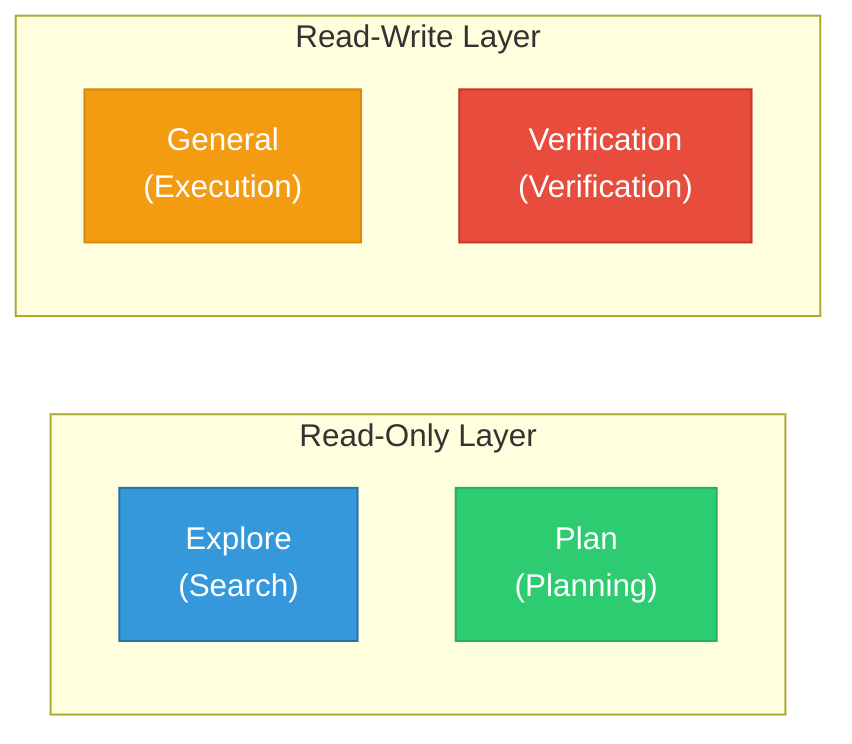
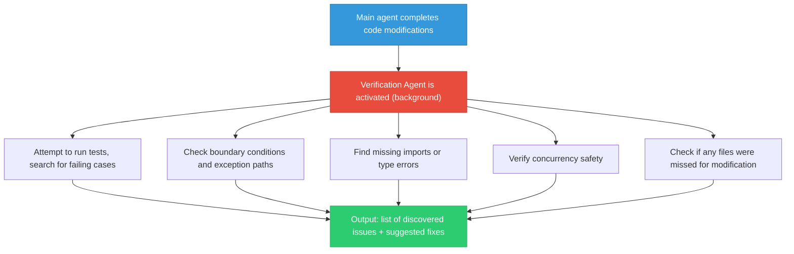
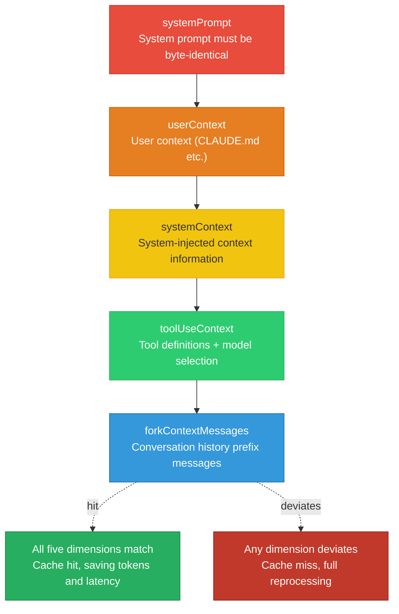
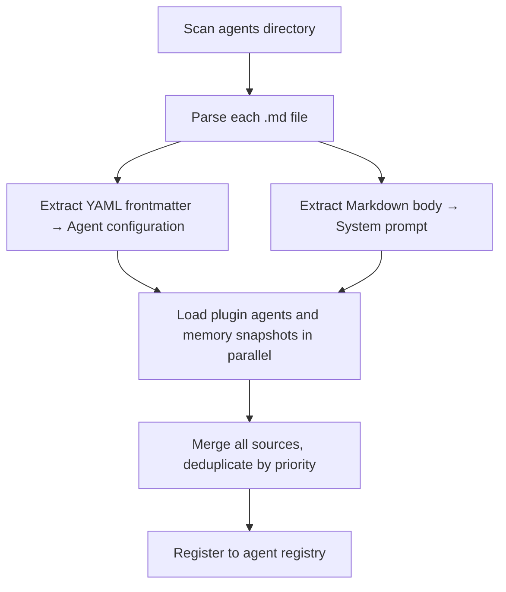
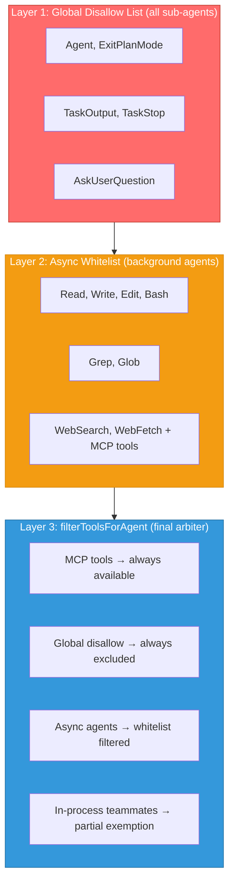
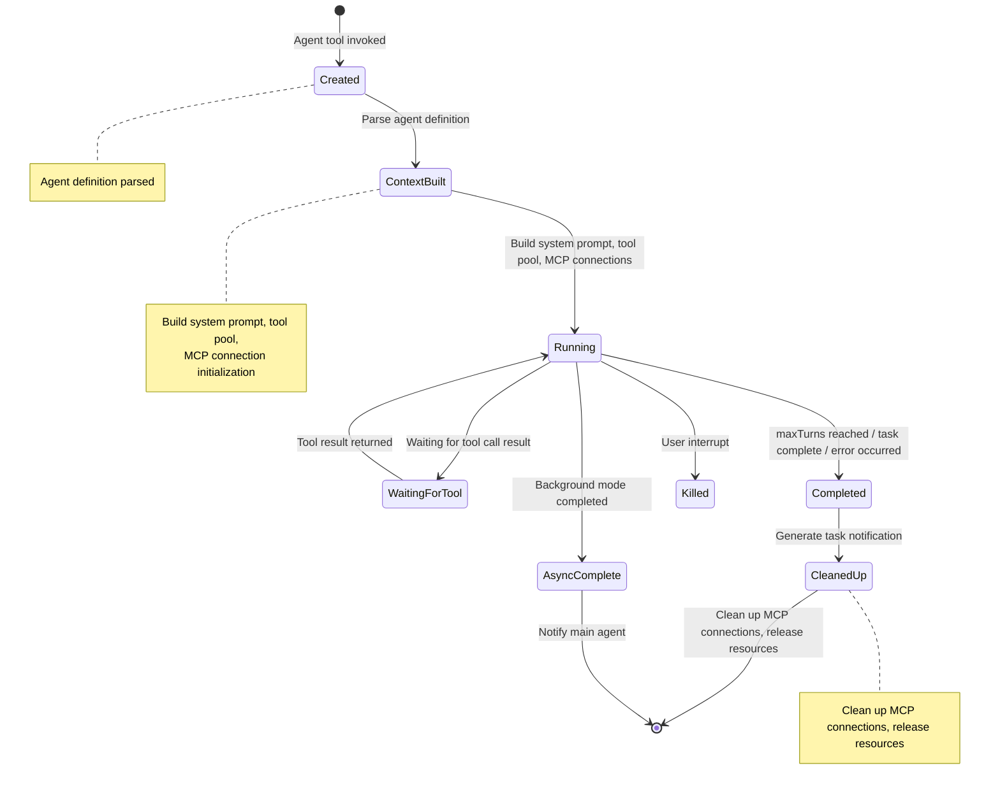

# Chapter 9: Sub-Agents and the Fork Pattern

> **Learning Objectives:**
> - Deeply understand the spawning mechanism and full lifecycle management of sub-agents
> - Master the Fork pattern's cache sharing strategy and byte-level inheritance principles
> - Learn how to design and create custom agents for specific scenario requirements
> - Understand the design philosophy of the adversarial Verification Agent and its engineering significance

The true power of Claude Code lies not in its single-turn conversational ability, but in its capacity to delegate complex tasks to specialized sub-agents for parallel processing. Imagine a large symphony orchestra: the conductor (the main agent) does not need to personally play every instrument, but instead delegates the performance of different sections to experts in their respective domains (sub-agents). This chapter will provide an in-depth analysis of the complete AgentTool architecture, reveal the design philosophy of built-in agents, and focus on how the Fork pattern achieves true parallel execution without wasting tokens through an ingenious caching strategy.

---

## 9.1 AgentTool Architecture

### Directory Structure and Module Responsibilities

The AgentTool code resides in the agent tools directory and consists of the following core modules:

| Responsibility | Description | Design Rationale |
|------|------|----------|
| Tool main entry | Handles input schema, routing strategy, sync/async branching | Single entry point reduces invocation complexity |
| Agent runner | Manages lifecycle, context construction, MCP initialization | Decouples lifecycle from business logic |
| Fork pattern implementation | Builds cache-safe message prefixes | Cache strategy evolves independently |
| Built-in agent registry | Dynamically loads based on feature gates | On-demand loading reduces startup overhead |
| Custom agent loading | Parses Markdown/JSON definitions | User-friendly declarative configuration |
| Utility functions | Tool filtering, parsing, result formatting, etc. | Reusable infrastructure |

The core design principle of this architecture is **separation of concerns**: the tool main entry is responsible for "deciding what to do," the runner is responsible for "how to do it," and the Fork module handles a specific "how to do it more efficiently" strategy.

> **Architecture Insight: Why not merge routing logic and execution logic?**
>
> In many simple systems, routing and execution are the same module. However, Claude Code's scenarios are far more complex than simple systems — a single tool invocation might go through a synchronous path (main thread waits), an asynchronous path (background execution), or a Fork path (cache-parallel). Separating routing decisions from the execution process means that when a new execution strategy needs to be added (such as a future "streaming sub-agent"), you only need to add a branch at the routing layer without modifying the runner's core logic. This is a classic application of the **Strategy Pattern** at the system architecture level.

### BaseAgentDefinition Type Definition

All agents are based on the `BaseAgentDefinition` type defined in the agent loading module, which includes the following key fields: unique agent identifier (agentType), usage scenario description (whenToUse), allowed/disallowed tool lists, preloaded skill names, agent-specific MCP servers, lifecycle hooks, UI display color, model specification, reasoning effort level, permission mode, maximum turn limit, whether to run in background, isolation mode, and whether to omit CLAUDE.md context.

These fields are not arbitrarily assembled; they can be categorized into four major groups by functional dimension:



From this type, three concrete agent definitions are derived:

- **BuiltInAgentDefinition** (built-in agent): Dynamically generates system prompts via `getSystemPrompt()`. Built-in agents have prompts that are fixed at compile time but dynamically constructed at runtime, allowing different prompt content to be generated under different environments (different feature gate states).
- **CustomAgentDefinition** (custom agent): Comes from user/project/policy settings. Users define them declaratively through Markdown files, and the system automatically parses them.
- **PluginAgentDefinition** (plugin agent): Agents provided by plugins, carrying plugin metadata. Plugin agents can carry additional version information and dependency declarations.

> **Cross-Reference:** The loading mechanism for plugin agents is closely related to the plugin system in Chapter 11. Plugins can provide not only Skills but also Agents, and both share the same plugin discovery and loading infrastructure.

### Three Agent Sources

The loading priority of agents is determined by the load-merge function:



1. **Built-in agents** (built-in): Lowest priority, serving as the default option
2. **Plugin agents** (plugin): Can override built-in agents
3. **User settings** (userSettings) -> **Project settings** (projectSettings) -> **Flag settings** (flagSettings) -> **Policy settings** (policySettings): Priority increases in order

This means that policy-level custom agents can override built-in agents with the same name, providing flexibility for enterprise deployments.

> **Real-World Scenario: Enterprise Security Audit Override**
>
> Suppose a fintech company needs all code reviews to follow internal security standards. Administrators can define an agent named `code-review` in policy settings, overriding the built-in agent with the same name. This custom version would include company-specific security checklists (such as PCI-DSS compliance checks) in the system prompt and connect to an internal vulnerability scanning MCP server. This way, regardless of how developers configure their personal settings, enterprise-level security review standards always take effect.

---

## 9.2 Built-in Agents

Built-in agents are returned as a list of currently available agents by the `getBuiltInAgents()` function in the registration module. Each agent is carefully designed as an expert in a specific domain. Together, they cover the four most common work patterns in software engineering: exploration, planning, execution, and verification.



### Explore Agent: Read-Only Code Exploration Expert

The Explore Agent is a high-speed, read-only search agent. Its definition declares a strict list of disallowed operations: Agent, ExitPlanMode, FileEdit, FileWrite, NotebookEdit and other tools are prohibited. It can optionally use the haiku model to reduce costs and omits CLAUDE.md to save tokens.

Its core design philosophy is reflected in two key decisions:

**First, strict read-only constraints.** The system prompt declares a strict list of disallowed operations (cannot create files, modify files, or run any commands that change system state), and at the tool level, Edit, Write, and similar tools are physically prohibited via disallowedTools. This "dual-lock" design — soft constraints at the prompt level plus hard constraints at the tool level — ensures that even if the model "hallucinates" and wants to modify a file, it will be physically blocked because the tool is unavailable.

**Second, omitClaudeMd optimization.** Explore is a read-only search agent that doesn't need commit/PR/lint rules. CLAUDE.md typically contains the project's coding conventions, commit message format, PR templates, and other content — all completely useless for an agent that only performs searches. Omitting CLAUDE.md not only reduces token consumption but, more importantly, reduces noise in the system prompt, allowing the model to focus more on the search task itself. This optimization is estimated to save 5-15 Gtokens per week.

> **Best Practice: How to Effectively Use the Explore Agent**
>
> The Explore Agent is best suited for the following scenarios:
> - **Code archaeology**: Quickly locate the root cause of a bug and trace call chains
> - **Dependency analysis**: Understand which modules reference a particular function
> - **Architecture exploration**: Map out the project's directory structure and module relationships
> - **Knowledge retrieval**: Find the definition location of a specific configuration item or constant
>
> Usage tip: Give the Explore Agent a sufficiently specific search target. For example, "find all middleware functions that handle user authentication" yields much better results than "look at the code."

### Plan Agent: Structured Planning Agent

The Plan Agent reuses the Explore Agent's toolset (similarly prohibiting Edit, Write, and other modification tools) but serves a different role — it is the software architect and planning expert. The Plan Agent uses the inherit model and omits CLAUDE.md. Its system prompt requires it to output structured implementation plans and conclude with a "key files" list, providing clear guidance for the subsequent implementation phase.

The Plan Agent's output typically contains the following structured information:

| Output Element | Description | Value for Subsequent Phases |
|---------|------|-----------------|
| Problem analysis | Understanding and decomposition of current requirements | Ensures correct implementation direction |
| Implementation steps | Modification steps ordered by priority | General Agent can execute step by step |
| Key files | List of files that need to be read and modified | Reduces search overhead in subsequent phases |
| Risk assessment | Potential side effects and caveats | Focus areas for the Verification Agent |
| Dependencies | Inter-step dependencies | Determines whether parallel execution is possible |

> **Why does the Plan Agent omit CLAUDE.md?**
>
> The reason is the same as for the Explore Agent but with a subtle difference. Explore omits it because "it's not needed"; Plan omits it because "it shouldn't." The purpose of the planning phase is to understand the code structure and create a plan, and it should not be constrained by project-specific coding style rules. If the Plan Agent saw a rule like "this project uses camelCase naming," it might start considering naming details during the planning phase, when those details should be handled during the implementation phase. Omitting CLAUDE.md lets the Plan Agent focus more on "what to do" rather than "how to do it."

### General Purpose Agent: General Agent

The General Purpose Agent is the most flexible agent, with full tool permissions (using the wildcard `'*'` to allow all tools). However, the actually available tools are still constrained by the global filtering function. It is the "executor" that does the actual work — Explore handles reconnaissance, Plan creates the plan, and General Purpose handles the modifications.

The design philosophy of the General Purpose Agent is "trust by default, push boundaries to the perimeter." It does not impose preset restrictions at the tool level; instead, it relies on the global security layer (permission system, tool filtering function) to ensure safety. The benefit of this design is maximum flexibility — different tasks can dynamically combine different tool sets without needing to predefine tool whitelists for each type of task.

> **Anti-Pattern Warning: Don't use the General Purpose Agent for read-only tasks**
>
> Although the General Purpose Agent can technically perform read-only searches, this introduces unnecessary cost and security risks. Read-only tasks should use the Explore Agent: its haiku model is cheaper, omitting CLAUDE.md saves tokens, and tool restrictions eliminate the risk of accidental modifications. This is a classic application of the **principle of least privilege**.

### Verification Agent: Verification Agent

The Verification Agent is a unique "adversarial" agent designed to **break the code being verified as thoroughly as possible**, rather than confirming that it works. It uses a red UI indicator to emphasize its adversarial nature, always runs in the background, is prohibited from modifying project files, and uses the inherit model.

#### The Deep Philosophy of Adversarial Design

The Verification Agent's system prompt explicitly warns of two failure modes:

1. **Verification Avoidance**: The model tends to find excuses not to run tests, such as "this code logic looks correct" or "the test environment is complex to configure." The system prompt lists common self-rationalization excuses and requires the Agent to actually execute verification rather than providing verbal confirmation.

2. **Surface Correctness Trap**: The code may pass basic happy-path tests but harbor hidden issues at boundary conditions, concurrency scenarios, and error paths. The system prompt requires the Agent to pay special attention to "less obvious" failure modes.

This adversarial design draws on the **Red Teaming** concept in software engineering. Traditional testing verifies "code works as expected," while red team testing verifies "code won't crash under unexpected circumstances." Applying both mindsets to different instances of the same LLM creates a "left hand fighting the right hand" self-adversarial mechanism.



> **Design Philosophy: Why does the Verification Agent run in the background?**
>
> The Verification Agent always runs in the background, which is a deliberate design decision. There are three reasons: first, verification is a "waitable" task — users don't need to see the verification process in real time; they only need to see the final result. Second, background execution frees up the main thread, allowing users to continue interacting with the main agent. Third, background mode forces the verification Agent to work independently, preventing the verification flow from being interrupted by waiting for user input.

---

## 9.3 Fork Pattern: Cache-Safe Parallel Execution

The Fork pattern is one of the most sophisticated architectural innovations in Claude Code. It allows the main agent to "fork" the complete context at a given moment to multiple parallel sub-tasks while leveraging the Anthropic API's prompt cache mechanism to avoid retransmitting large numbers of tokens.

### Intuitive Understanding of the Fork Pattern

If you are familiar with the `fork()` system call in Unix, Claude Code's Fork pattern shares a similar spirit:

| Analogy Dimension | Unix fork() | Claude Code Fork Pattern |
|---------|-------------|----------------------|
| Trigger timing | Parent process calls fork() | Main agent calls Agent tool |
| Inherited content | Memory image, file descriptors | System prompt, tool definitions, conversation history |
| Post-fork relationship | Parent-child processes run independently | Main/sub-agents run in parallel |
| Communication method | pipe/shared memory | Task notification XML |
| Resource savings | Copy-on-Write memory sharing | Prompt Cache token sharing |
| Recursion protection | Process level limits | querySource check |

### Core Design of the forkSubagent Module

Activating the Fork pattern requires three conditions: feature gate enabled, non-Coordinator mode, and non-non-interactive mode. When Coordinator mode is active, Fork mode is automatically disabled because the Coordinator already has its own task delegation model.

> **Cross-Reference:** The mutual exclusivity of Coordinator mode and Fork mode will be discussed in detail in Chapter 10. In short, the Coordinator is a heavier orchestration pattern suited for scenarios requiring fine-grained task management; Fork is a lightweight parallel pattern suited for distributing the same context to multiple independent sub-tasks.

In the routing logic of the tool's main entry, when the user omits the sub-agent type and Fork mode is enabled, the system triggers the Fork path.

### Inheriting the Full Context and System Prompt from the Parent Conversation

The core principle of the Fork sub-agent is **byte-level inheritance** — the sub-agent must share exactly the same API request prefix as the parent agent to hit the prompt cache.

In the Fork path, the system prioritizes using the system prompt bytes already rendered by the parent agent, avoiding cache invalidation caused by reconstruction. Only when the rendered prompt cannot be retrieved does it fall back to the reconstruction path. Reconstruction may deviate due to differences in the hot/cold states of feature gates, leading to cache invalidation, so passing the rendered raw bytes is the key to ensuring an exact match.

> **Why byte-level rather than semantic-level?**
>
> Prompt cache is a low-level infrastructure optimization of the Anthropic API that reuses processed tokens through byte prefix matching. This means that even if two pieces of text are "semantically identical," a single character difference at the byte level (even an extra space or newline) will cause the cache to miss. This is why the Fork pattern needs to pass the rendered raw bytes rather than reconstructing — reconstruction may produce differences in whitespace characters, attribute order, and other subtle areas, and these differences are sufficient to invalidate the entire cache prefix.
>
> An apt analogy: prompt cache is like the ETag in HTTP caching — it compares exact hash values of content. Even if you reformat the indentation of an HTML document, the browser rendering result is the same, but the ETag has changed and the cache is invalidated.

### CacheSafeParams: Five Dimensions

The cache-safe parameter type defines the critical contract for cache hits, containing five dimensions: system prompt (systemPrompt), user context (userContext), system context (systemContext), tool definitions and model (toolUseContext), and conversation prefix messages (forkContextMessages).



These five dimensions correspond to the components of the Anthropic API cache key: system prompt, tools, model, messages prefix, and thinking config. Only when all five dimensions are exactly consistent can a sub-request hit the parent request's cache.

The Fork path ensures tool definitions remain unchanged through the `useExactTools` flag — when Fork mode is activated, it uses the parent's tool pool directly rather than re-resolving agent tools, thereby maintaining byte-level consistency of tool definitions.

### The Ingenious Design of buildForkedMessages

The Fork message construction function is the core of cache sharing. Its processing logic is as follows: first, preserve the complete parent assistant message (including all tool_use blocks, thinking, and text, but with new UUIDs assigned); then collect all tool_use blocks; generate a uniform fixed-string placeholder tool_result for each tool_use; and finally construct a single user message containing the placeholder results and the sub-task directive.

The key point is that the placeholder results are shared across all Fork sub-agents as the fixed string "Fork started -- processing in background." This means:

- **All Fork sub-agents share the same prefix**: `[...history, assistant(all_tool_uses), user(placeholder_results..., directive)]`
- **Only the final directive text differs**: Maximizing the cache hit area
- Result structure: `[...history, assistant(all_tool_uses), user(placeholder_results..., directive)]`

> **Cache Efficiency Analysis Example**
>
> Consider a conversation scenario: the parent conversation has accumulated 50,000 tokens of history messages, the parent agent's assistant message contains 3 tool_use blocks (approximately 2,000 tokens), and the system prompt and tool definitions are approximately 10,000 tokens.
>
> **Without Fork mode (traditional sub-agents):**
> - Each sub-agent independently builds a request: 50,000 + 2,000 + 10,000 = 62,000 tokens/request
> - 3 sub-agents total: 186,000 input tokens
>
> **With Fork mode:**
> - Parent request: 62,000 tokens (first time, establishing cache)
> - 3 sub-agents share prefix: only each "directive text" portion is new (approximately 200 tokens each)
> - 3 sub-agents total: 3 * 200 = 600 new input tokens
> - Grand total: 62,600 input tokens (of which 62,000 hit cache)
>
> **Savings ratio:** (186,000 - 62,600) / 186,000 = approximately 66% token savings
>
> These savings become even more significant at scale (e.g., when dozens of Fork calls are generated in a single session).

### Recursive Fork Protection

Fork sub-agents retain the Agent tool to maintain cache-consistent tool definitions, so recursive Forking must be prevented. The system implements a dual detection strategy:

1. **querySource check** (primary defense): Set on context options, unaffected by automatic compression. This is a runtime marker set in the Fork sub-agent's context, identifying "I was forked." Since it is not part of the conversation history, it won't be cleared by the context compression mechanism, ensuring reliable recursion prevention even in long conversations.

2. **Message scanning** (fallback): Detects specific tags, handling edge cases where querySource was not passed. This is a defensive programming strategy that handles extreme cases where querySource might be lost during serialization/deserialization.

The sub-task directive generation function produces directives containing strict behavioral norms. The core content includes: declaring itself as a Fork worker rather than the main agent, prohibiting the generation of sub-agents, and prohibiting asking questions or suggesting next steps.

> **Why not give Fork sub-agents the ability to Fork as well?**
>
> On the surface, recursive Forking could enable "infinitely parallel" nested execution. But in practice, this would introduce serious engineering problems:
> - **Resource explosion**: Each Fork creates a new API connection and tool instances; recursive Forking would cause exponential growth in resource usage
> - **Result aggregation difficulty**: Nested Fork results require multi-level aggregation, increasing the risk of result loss
> - **Debugging difficulty**: Recursive structures make error tracing and performance analysis extremely complex
> - **Cache invalidation**: Each level of Fork context would be slightly different from the previous level, causing cache hit rates to plummet at recursive depths

---

## 9.4 Custom Agents

### Definition Files in the .claude/agents/ Directory

Custom agents are loaded through the load-merge function. The loading process is as follows:



1. Scan Markdown files in the agents directory
2. Parse agent definitions from each Markdown file
3. Load plugin agents and memory snapshots in parallel
4. Merge all sources, deduplicating by priority

### Markdown Frontmatter Format

A complete custom agent Markdown file example:

```markdown
---
name: security-auditor
description: Analyze security vulnerabilities in code and generate audit reports
tools:
  - Bash
  - Read
  - Grep
  - Glob
disallowedTools:
  - Write
model: haiku
effort: high
permissionMode: default
maxTurns: 30
color: orange
background: true
memory: project
skills:
  - /commit
mcpServers:
  - slack
hooks:
  PreToolUse:
    - matcher: Bash
      command: "audit-log.sh"
---

You are a code security audit expert. Your responsibilities are:

1. Analyze potential security vulnerabilities in code
2. Check for common attack vectors (XSS, SQL injection, CSRF, etc.)
3. Generate structured audit reports
4. Provide remediation recommendations

Report format:
- **Vulnerability Level**: Critical / High / Medium / Low
- **Impact Scope**: Affected files and functions
- **Remediation**: Specific code modification proposals
```

The `parseAgentFromMarkdown()` function parses this frontmatter, mapping `name` to `agentType` and using the Markdown body as the system prompt. If the `memory` field is enabled, the system also automatically injects file read/write tools to support persistent memory.

#### More Custom Agent Examples

**Example 1: Documentation Generation Agent**

```markdown
---
name: doc-writer
description: Generate API documentation and usage guides for code
tools:
  - Read
  - Grep
  - Glob
  - Write
disallowedTools:
  - Bash
model: haiku
effort: medium
maxTurns: 20
color: blue
background: true
---

You are a technical documentation expert. Your responsibilities are:

1. Read function signatures, type definitions, and comments in code
2. Generate structured API documentation
3. Write usage examples for complex logic
4. Keep documentation style consistent with existing docs

Output requirements:
- Use Markdown format
- Include parameter descriptions, return value descriptions, usage examples
- Mark deprecated APIs
```

**Example 2: Test Generation Agent**

```markdown
---
name: test-generator
description: Automatically generate unit tests and integration tests for specified modules
tools:
  - Read
  - Write
  - Grep
  - Glob
  - Bash
model: inherit
effort: high
maxTurns: 40
color: green
background: true
---

You are a test engineer. Your tasks are:

1. Read the source code of the target module and understand its public interfaces and internal logic
2. Identify all code paths that need testing
3. Write test cases for each path
4. Ensure test coverage: normal paths, boundary conditions, error handling

Testing principles:
- Tests should be independent and repeatable
- Use meaningful test descriptions
- Mock external dependencies, do not mock internal functions of the module under test
```

**Example 3: Performance Analysis Agent**

```markdown
---
name: perf-analyzer
description: Analyze code performance bottlenecks and provide optimization recommendations
tools:
  - Read
  - Grep
  - Glob
  - Bash
disallowedTools:
  - Write
  - Edit
model: inherit
effort: high
maxTurns: 25
color: yellow
---

You are a performance analysis expert. Your tasks are:

1. Identify performance hotspots in code (O(n^2) loops, unnecessary memory allocations, frequent I/O)
2. Analyze database query efficiency (N+1 queries, missing indexes)
3. Evaluate whether concurrency and async patterns are used appropriately
4. Provide specific optimization recommendations with estimated performance improvements

Report format:
- **Issue number** and severity (Critical/High/Medium/Low)
- **Code location**: filename:line number
- **Issue description**: Why is this slow
- **Optimization recommendation**: Specific modification proposals
- **Expected improvement**: Quantified performance improvement estimates
```

> **Cross-Reference:** The hooks configuration for custom agents uses the same format as the Hook system in Chapter 8. You can define lifecycle hooks such as PreToolUse and PostToolUse for agents to implement cross-cutting concerns like audit logging and automatic formatting.

---

## 9.5 Agent Tool Isolation

### Global Disallow List

The system defines a global disallow list — tools that no sub-agent can use, including: tools that prevent recursive output retrieval, Plan mode-related tools (main thread only), Agent tool (prevents recursive nesting), tools for asking user questions, and task stop tools (requiring main thread task state).



### Async Agent Whitelist

Async (background) agents have their toolset further restricted to a whitelist set, including core tools like Read, Write, Edit, Bash, Grep, Glob, WebSearch, etc., but excluding tools that could cause recursion such as TaskOutput and Agent.

### filterToolsForAgent

The tool filtering function is the final arbiter, implementing a three-layer filtering mechanism: MCP tools are always available; globally disallowed tools are always excluded; async agents can only use whitelisted tools, but in-process teammates can be partially exempted.

> **Design Consideration: Why are MCP tools always available?**
>
> MCP tools are external services explicitly configured by users, and they have been authorized by the user (through permission configuration). Unlike built-in tools, the behavior of MCP tools is defined by external servers, and Claude Code cannot predict their functional scope. Therefore, the system chooses not to restrict sub-agents from using MCP tools, delegating safety control to MCP's permission system (see Chapter 12).

---

## 9.6 Sub-Agent Lifecycle Management

Sub-agents go through a complete lifecycle from creation to destruction. Understanding this lifecycle is critical for designing efficient multi-agent collaboration workflows.

### Lifecycle State Transitions



### Context Construction Phase

Before a sub-agent begins execution, the runner constructs a complete execution context. This process includes:

1. **System prompt rendering**: Generates the system prompt based on the agent definition, injecting tool descriptions, permission information, etc.
2. **Tool pool assembly**: Determines the available tool set based on allowedTools/disallowedTools and the global filtering function
3. **MCP server initialization**: Establishes connections for agent-specific MCP servers
4. **Skill preloading**: Loads the skills specified in the agent definition
5. **Memory injection**: If the memory option is enabled, injects persistent memory content

### Resource Cleanup Phase

After a sub-agent completes or fails, the runner is responsible for cleaning up resources:

- Closes agent-specific MCP server connections (note: non-specific connections are managed by the parent)
- Releases tool instance references
- Formats results as task notifications and passes them to the caller
- If it is a background agent, queues the notification for processing in the main agent's next turn

> **Best Practice: Setting maxTurns Appropriately**
>
> maxTurns controls the maximum number of execution turns for a sub-agent. Setting it too low may cause the task to be interrupted before completion; setting it too high may waste tokens in ineffective loops. Recommended empirical values:
> - Read-only search tasks: 10-15 turns
> - Code generation tasks: 20-30 turns
> - Complex refactoring tasks: 30-50 turns
> - Exploratory tasks: 15-20 turns
>
> For agents running in the background, it is recommended to set a lower maxTurns as a safety valve to prevent runaway agents from continuously consuming resources.

---

## Hands-On Exercises

**Exercise 1: Create a Custom Code Review Agent**

Create `code-reviewer.md` in the project's `.claude/agents/` directory, defining an agent specifically for code review. Requirements:
- Read-only permissions (disallow Write, Edit)
- Use the `haiku` model to reduce costs
- Output structured review reports
- Set maxTurns to 15 (review tasks don't need many turns)
- Enable background mode (reviews don't need to block the main flow)

**Extension Challenge:** Add an MCP server connection to the code review agent, connecting to an external code quality inspection service.

**Exercise 2: Analyze Fork Pattern Cache Efficiency**

Assume the parent conversation has 100 messages (approximately 80,000 tokens), and the parent agent issued 3 Fork calls at once. Based on the Fork message construction mechanism, calculate:
- The cache prefix length of the first Fork sub-agent
- How much cache the second and third Fork sub-agents can reuse
- If Fork mode is not used, how many input tokens the 3 sub-agents would need to transmit

**Reflection Question:** If the 3 Fork sub-agents' task descriptions are 200, 350, and 180 tokens respectively, what are their respective new tokens? What are their cache hit rates?

**Exercise 3: Explore the Verification Agent's Adversarial Strategy**

Review the design philosophy of the Verification Agent's system prompt, list all the "self-rationalization excuses" defined within it, and reflect on why these are necessary for LLM verification tasks.

**Deep Reflection:** If you were to design a "code review Agent," should you adopt the adversarial style of the Verification Agent or a more collaborative style? In what scenarios is adversarial more appropriate? In what scenarios is collaborative more appropriate?

**Exercise 4: Design a Multi-Agent Collaboration Workflow**

Design a complete software development workflow using the following combination of built-in agents:

1. User states a requirement: "Add OAuth2 support for the user authentication module"
2. Use the Explore Agent to investigate the existing authentication code structure
3. Use the Plan Agent to create an implementation plan
4. Use the General Purpose Agent to execute the implementation
5. Use the Verification Agent to verify the implementation

Write out the input and expected output for each step.

---

## Key Takeaways

1. **AgentTool's three-tier agent system** (built-in, custom, plugin) provides a complete spectrum from out-of-the-box to deep customization, and the priority mechanism allows enterprise-level overrides. Custom agents are defined through Markdown files, lowering the barrier to creation.

2. **Built-in agents each serve their purpose**: Explore focuses on high-speed read-only search, Plan does structured planning, General Purpose is the all-rounder, and Verification adopts an adversarial verification strategy. Together, they cover the core software engineering workflow.

3. **The core innovation of the Fork pattern** is achieving prompt cache sharing through byte-level inheritance: identical system prompts, tool definitions, message prefixes, plus uniform placeholder results maximize the cache hit area. In large-scale parallel scenarios, it can save 60%+ tokens.

4. **The five dimensions of CacheSafeParams** (system prompt, user context, system context, tool context, messages) are the necessary and sufficient conditions for cache hits. Any deviation in any dimension will cause the cache to miss. This is why the Fork path prioritizes passing rendered raw bytes.

5. **Three-layer defense for tool isolation** (global disallow list, async whitelist, `filterToolsForAgent` filtering) ensures sub-agents won't recurse, won't exceed permissions, and won't block user interaction in background mode.

6. **Sub-agent lifecycle management** goes through complete state transitions from creation to cleanup. Setting maxTurns appropriately, choosing the right model, and correctly configuring the tool set are key to using sub-agents efficiently.

7. **The adversarial verification philosophy** is not just a technical choice but reflects an engineering culture — rather than trusting that code "should work," actively try to prove that it doesn't.
