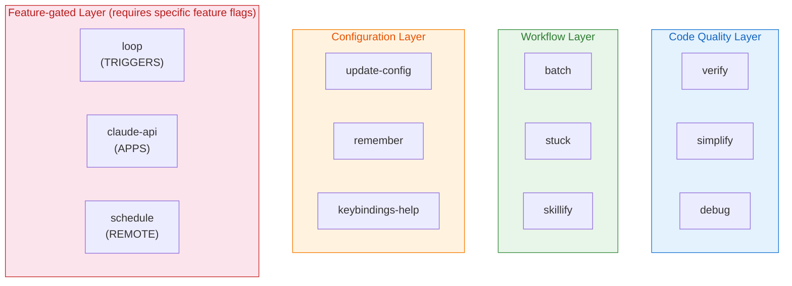
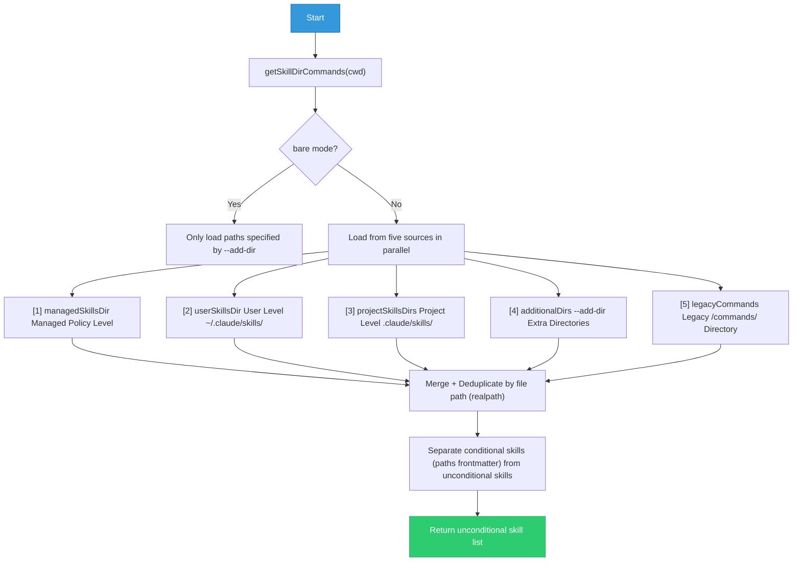
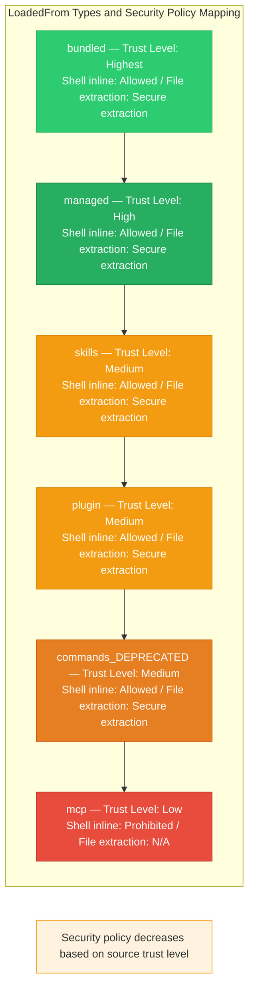
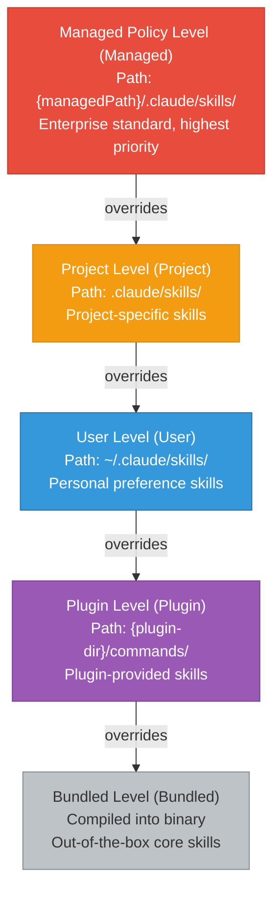
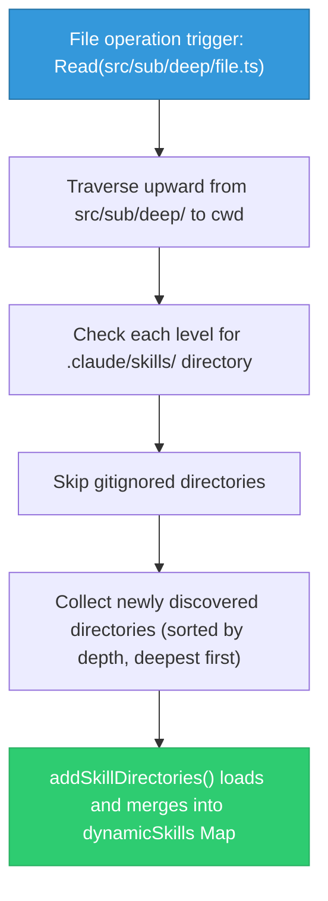
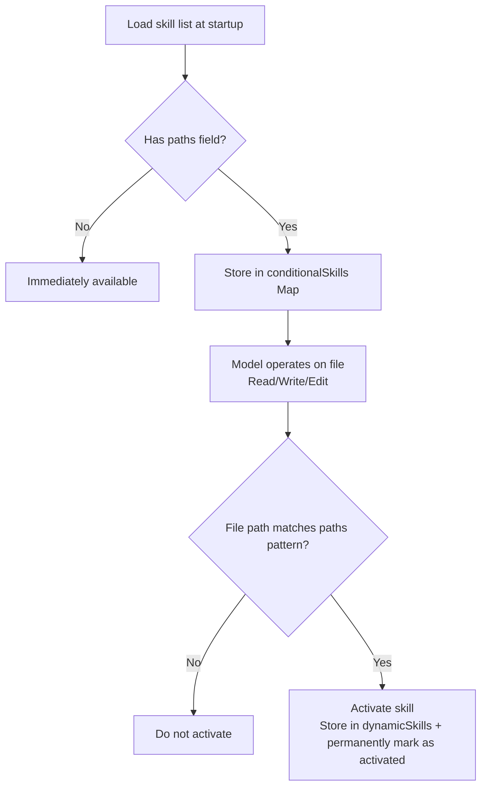
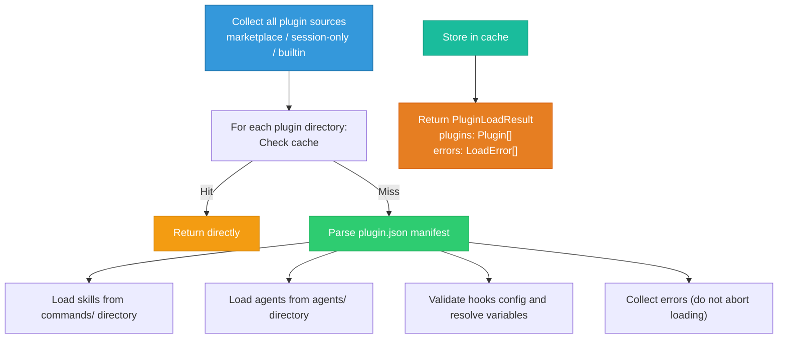

# Chapter 11: The Skill System and Plugin Architecture

> "Good architecture makes adding features easy; great architecture makes removing features just as easy."
> -- Adapted from *Clean Architecture*

**Learning Objectives:**
- Master the complete lifecycle of Claude Code Skill definition, loading, and execution mechanisms
- Understand the tiered skill strategy from user-level to managed-level and its security implications
- Learn the full process and best practices for creating custom skills
- Understand the cache-first loading model and security boundaries of the plugin system
- Master the patterns and anti-patterns of skill composition

---

## 11.1 Skill System Architecture

Claude Code's skill system is a multi-layered extension mechanism. It allows users to define reusable prompt templates through Markdown files, and allows developers to register compile-time built-in skills through TypeScript code. The design goal of the entire system is: **zero-configuration usability, configurable power**.

It's like a chef's toolbox: the built-in knives and pots (built-in skills) can handle most cooking needs, but when you need to prepare a specific cuisine, you can add specialized tools (custom skills). Moreover, these tools can be managed in tiers — home kitchen (user-level), restaurant kitchen (project-level), chain restaurant standards (managed-level).

### 11.1.1 Built-in Skill Inventory

Built-in Skills are skills compiled into the CLI binary, available out of the box for all users. They are registered uniformly at startup via `initBundledSkills()`.

The registration entry function determines which skills to load based on feature flags. Skills are divided into two categories:

- **Core Skills**: Always registered, such as `verify`, `debug`, `simplify`, `remember`, `batch`, `stuck`, etc.
- **Feature-gated Skills**: Gated by feature flags, only registered when the corresponding feature flag is enabled, such as `loop` (AGENT_TRIGGERS), `claude-api` (BUILDING_CLAUDE_APPS), `schedule` (AGENT_TRIGGERS_REMOTE)

The complete list of core built-in skills is as follows:

| Skill Name | Purpose | User-invocable | Typical Use Case |
|---------|------|-----------|------------|
| `update-config` | Configure various settings in settings.json | Yes | Modifying permission rules, environment variables, default models |
| `keybindings-help` | Keyboard shortcut customization help | Yes | Viewing and customizing key bindings |
| `verify` | Verify the correctness of code changes | Yes | Final verification before committing, local checks before CI |
| `debug` | Debugging assistance, providing diagnostic approaches | Yes | Locating bug root causes, analyzing error stacks |
| `simplify` | Code simplification and refactoring review | Yes | Eliminating duplicate code, reducing cyclomatic complexity |
| `skillify` | Convert prompts into reusable skills | Yes | Templating one-off prompts |
| `remember` | Memory management (CLAUDE.md entries) | Yes | Adding project conventions, team agreements |
| `batch` | Batch file processing | Yes | Batch renaming, batch formatting |
| `stuck` | Help the model get unstuck | Yes | "Bailout" instruction when the model is stuck in a loop |
| `lorem-ipsum` | Generate placeholder content | Yes | Placeholder text during UI development |



### 11.1.2 Built-in Skill Registration Mechanism

Each built-in skill is registered through a registration function, receiving a skill definition object that contains the following key fields: name, description, aliases, usage scenario hints, argument hints, allowed tools list, model specification, whether to disable model invocation, whether it is user-invocable, runtime gating callback, lifecycle hooks, execution context (inline or fork), associated agents, referenced file collection, and most importantly, the prompt generator function.

The most critical fields include:

- Prompt generator: A lazily executed prompt generator that only runs when the skill is invoked
- `files`: An optional collection of referenced files that are extracted to disk on first invocation, allowing the model to access them via Read/Grep
- `isEnabled`: Runtime gating callback; for example, the `/loop` skill checks whether the related feature is enabled on each invocation
- `context: 'fork'`: Marks the skill to execute in an independent subprocess

#### Security Design of File Extraction

File extraction employs an elegant lazy singleton pattern, using the `??=` operator to ensure concurrent calls share the same extraction Promise, avoiding race conditions. File writes use `O_NOFOLLOW | O_EXCL` flags to prevent symlink attacks, directory permissions are set to `0o700`, and file permissions are set to `0o600`.

The implications of these security measures:

| Security Measure | Attack Vector Protected | How It Works |
|---------|-------------|---------|
| `O_NOFOLLOW` | Symlink hijacking | Opening fails if the path is a symbolic link |
| `O_EXCL` | TOCTOU race conditions | File must not exist, ensuring creation rather than overwrite |
| `0o700` directory | Directory traversal | Only the owner can access the directory |
| `0o600` file | File leakage | Only the owner can read and write the file |
| `??=` singleton | Race conditions | Concurrent calls share the same Promise |

> **Why do skills need referenced files?**
>
> Certain skills (such as `verify`) need to reference additional documentation or configuration when executing. These files are compiled into the binary (they don't exist as separate disk files), but need to be extracted to disk when the skill is first invoked. This design has two benefits: first, skill distribution doesn't require additional file management; second, files undergo complete security checks during extraction.
>
> You can think of it as "the manual that comes with the software" — when not needed, it takes up no space (embedded in the binary), and when needed, it's expanded onto the desktop (extracted to a temporary directory).

### 11.1.3 Skill Loading Engine

All file-system-based skills (non-built-in) are loaded by a unified loading engine. This is a session-cached asynchronous function.

The core flow of the loading engine is as follows:



The deduplication strategy uses `realpath` to resolve symbolic links and obtain canonical paths, then keeps skills from the first source encountered. This avoids duplicate loading caused by symbolic links or overlapping parent directories.

> **Why is deduplication needed?**
>
> Consider this directory structure:
> ```
> /home/user/projects/my-app/        <- Project directory
> /home/user/projects/my-app/symlink <- Symbolic link pointing to .claude/skills/
> ```
>
> Without `realpath` resolution, the same skill directory could be loaded twice through two paths: once through the original path `.claude/skills/my-skill/`, and once through the symbolic link `symlink/my-skill/`. This would cause the skill to be registered twice, potentially resulting in conflicts or duplicate execution. `realpath` resolution ensures that regardless of the access path, everything ultimately points to the same physical location.

---

## 11.2 Skill Definition Format

### 11.2.1 Markdown Frontmatter Configuration

File-based skills are organized in directory form, where each skill is a directory named `skill-name/` containing a `SKILL.md` file. This is the only directory structure format.

`SKILL.md` supports YAML frontmatter configuration. The fields supported by the parsing logic include:

```yaml
---
name: my-skill-display-name
description: This is an example skill
when_to_use: Use when the user needs to perform a certain operation
arguments: arg1 arg2 arg3
argument-hint: "[arg1] [arg2] [arg3]"
allowed-tools:
  - Bash
  - Read
  - Write
model: claude-sonnet-4-20250514
effort: high
user-invocable: true
disable-model-invocation: false
context: fork
agent: code-builder
version: "1.0"
paths:
  - "src/**/*.ts"
  - "lib/**/*.js"
hooks:
  pre:
    - command: npm run lint
  post:
    - command: echo "done"
shell: bash
---

# Skill Body

This is the main content of the skill, supporting Markdown format.
You can use $ARGUMENTS to reference user-input arguments.
Use $1, $2 to reference positional arguments.
Use ${CLAUDE_SKILL_DIR} to reference the skill directory.
Use ${CLAUDE_SESSION_ID} to reference the current session ID.
```

#### Field Details and Best Practices

| Field | Type | Required | Description | Best Practice |
|------|------|------|------|---------|
| `name` | string | No | Skill display name | Uses directory name when omitted; kebab-case recommended |
| `description` | string | Yes | Skill description | Be concise and clear; describe the function in one sentence |
| `when_to_use` | string | No | Usage scenario description | Helps the model automatically select the appropriate skill |
| `arguments` | string | No | Argument name list | Space-separated; named arguments improve readability |
| `allowed-tools` | list | No | Allowed tools | Follow the principle of least privilege; only list necessary tools |
| `model` | string | No | Model to use | Use haiku for read-only tasks, inherit for complex tasks |
| `context` | string | No | Execution context | Use fork for time-consuming tasks, inline for quick operations |
| `paths` | list | No | Conditional activation paths | Used for auto-activating skills by file type |
| `hooks` | object | No | Lifecycle hooks | pre/post commands for automated checks |

A complete skill creation flow example:

```
~/.claude/skills/
  my-code-review/
    SKILL.md              <- Skill definition file (required)
    review-checklist.md   <- Auxiliary file, model can read as needed
    examples/
      good-pattern.md     <- Good pattern example
      bad-pattern.md      <- Anti-pattern example
```

### 11.2.2 Parameter Substitution Mechanism

Skill prompt content supports flexible parameter substitution:

**Positional parameters**: `$ARGUMENTS` is replaced with the full argument string; `$ARGUMENTS[0]`, `$ARGUMENTS[1]` are replaced with indexed arguments; `$0`, `$1` are shorthand forms.

**Named parameters**: When frontmatter defines `arguments: foo bar`, `$foo` and `$bar` are mapped to the user input values at the corresponding positions.

The substitution logic executes in order: named parameters are replaced first, then indexed parameters, then full arguments, and finally if there are no placeholders, the argument text is appended.

```
Parameter substitution execution order:

  Input: /my-skill hello world

  Step 1: Named parameter substitution
    arguments: "greeting name"
    $greeting -> "hello"
    $name -> "world"

  Step 2: Indexed parameter substitution
    $1 -> "hello" ($0 is the skill name itself)
    $2 -> "world"
    $ARGUMENTS[0] -> "hello"
    $ARGUMENTS[1] -> "world"

  Step 3: Full argument substitution
    $ARGUMENTS -> "hello world"

  Step 4: No-placeholder append
    If no $ placeholders are used in the prompt
    -> Append argument text to the end of the prompt
```

Additionally, the skill body supports inline Shell command execution and environment variable substitution. In the prompt generator, in addition to parameter substitution, the following also occurs:

1. Add skill root directory prefix: `Base directory for this skill: ${baseDir}`
2. Replace `${CLAUDE_SKILL_DIR}` with the absolute path of the skill directory
3. Replace `${CLAUDE_SESSION_ID}` with the current session ID
4. Execute Shell command inline expansion for non-MCP skills (security consideration: MCP skills come from remote sources, so their embedded Shell commands are not executed)

> **Security Boundary: Why can't MCP skills execute Shell commands?**
>
> MCP skills come from external servers, and Shell commands can execute arbitrary system operations. If Shell command inline expansion were allowed in MCP skills, a malicious MCP server could inject a command like `$(rm -rf /)` into a skill prompt. Therefore, the system skips Shell command expansion when the `LoadedFrom` type is `mcp` — this is a critical security boundary.
>
> This is a classic "trust boundary" problem — local skill files are created and managed by the user (trusted), while MCP skills come from the network (untrusted). Security policies should differ based on the trust level of the source.

### 11.2.3 LoadedFrom Types

The source of a skill is identified by the `LoadedFrom` type, which includes six sources: legacy command directory (commands_DEPRECATED), new skill directory (skills), plugin-provided (plugin), enterprise managed policy (managed), built-in compiled (bundled), and MCP server-provided (mcp).

This type is used not only for tracking sources but also directly influences security policy. For example, skills from MCP do not execute Shell command inlining because MCP skills come from untrusted remote servers.



---

## 11.3 Skill Loading Paths

### 11.3.1 Tiered Loading Strategy

The `getSkillsPath` function clearly defines the path mapping for each source, returning the corresponding skill directory path based on source type (policySettings, userSettings, projectSettings, plugin).

Description of each tier:

**Managed Policy Level**: Distributed by enterprise administrators through centralized configuration. The path is `{managedPath}/.claude/skills/`. Can be disabled via the `CLAUDE_CODE_DISABLE_POLICY_SKILLS` environment variable.

**User Level**: Stored in the user's home directory `~/.claude/skills/`. Available across all projects. Requires `userSettings` source to be enabled and not restricted by `pluginOnly` policy.

**Project Level**: Stored in the project directory `.claude/skills/`. Only takes effect within that project context. Supports nested directory discovery (see next section).

**Additional Directories**: The `.claude/skills/` subdirectory within extra directories specified via the `--add-dir` CLI parameter.

**Legacy Commands Directory**: The `.claude/commands/` directory, compatible with the old format. Both single-file `.md` and directory-format `SKILL.md` are supported. This source is tagged as `commands_DEPRECATED`.



### 11.3.2 Dynamic Skill Discovery

In addition to static loading at startup, Claude Code also supports dynamic skill discovery during session runtime. When the model accesses files through tools like Read, Write, Edit, etc., the system searches upward along the file path for `.claude/skills/` directories.

The core function `discoverSkillDirsForPaths` implements the dynamic skill discovery mechanism:



Key security design: Skills in directories ignored by `.gitignore` are automatically skipped, preventing paths like `node_modules/pkg/.claude/skills/` from being silently loaded.

> **Anti-Pattern Warning: Do not place skills in node_modules**
>
> Although `.gitignore` filtering provides a safety net, relying on it as the sole security measure is insufficient. If an npm package places skill files in `.claude/skills/` and that directory happens to not be in `.gitignore`, those skills would be automatically loaded. It's recommended to explicitly add `**/.claude/skills/` to your project's `.gitignore`, keeping only the root-level `.claude/skills/`.

> **Practical Use Case: Project-specific Skills in a Monorepo**
>
> In a Monorepo structure, each sub-project may have its own skill requirements. The dynamic skill discovery mechanism perfectly addresses this problem:
>
> ```
> my-monorepo/
> ├── packages/
> │   ├── frontend/
> │   │   └── .claude/skills/
> │   │       └── component-gen/
> │   │           └── SKILL.md    <- Frontend component generation skill
> │   ├── backend/
> │   │   └── .claude/skills/
> │   │       └── api-gen/
> │   │           └── SKILL.md    <- API endpoint generation skill
> │   └── shared/
> │       └── .claude/skills/
> │           └── type-gen/
> │               └── SKILL.md    <- Shared type generation skill
> ```
>
> When the model operates on files under `packages/frontend/`, the frontend component generation skill is automatically discovered; when operating on files under `packages/backend/`, the API generation skill is automatically discovered. This "activate by location" pattern greatly reduces the cognitive burden of skill selection.

### 11.3.3 Conditional Skills

Skills with a `paths` frontmatter are not activated immediately, but are stored in the `conditionalSkills` Map. When the file path the model operates on matches the `paths` pattern, the skill is activated.

Matching uses gitignore-style patterns, implemented through the `ignore` library. When a file path matches a conditional skill's paths pattern, the skill is activated and stored in the dynamic skill set. Activated conditional skill names are permanently recorded — even if the cache is subsequently cleared, they will not revert to conditional status.



> **Why do activated conditional skills need permanent marking?**
>
> Suppose you define a conditional skill with `paths: ["src/**/*.ts"]` that gets activated when the model first reads `src/foo.ts`. If it's later moved back to conditional status due to cache cleanup, the skill would "disappear" unless the model reads a matching file again. But at that point, the model might be executing a task based on this skill's guidance, and the skill's sudden disappearance would cause inconsistent behavior. Permanent marking ensures that once activated, a skill remains available throughout the entire session.

---

## 11.4 Plugin System

### 11.4.1 Plugin Directory Structure

Plugins are a higher-level extension unit than skills. A plugin can contain multiple components such as skills, agents, hooks, etc. Its directory structure typically includes:

```
my-plugin/
├── plugin.json           <- Plugin manifest (optional)
├── commands/             <- Custom slash commands
│   ├── build.md
│   └── deploy.md
├── agents/               <- Custom AI agents
│   └── test-runner.md
└── hooks/
    └── hooks.json        <- Hook configuration
```

The plugin manifest `plugin.json` contains the plugin's metadata:

| Field | Description | Purpose |
|------|------|------|
| name | Plugin name | Display and reference |
| version | Version number | Compatibility checking |
| description | Description text | User identification |
| commands | Command directory path | Discover custom commands |
| agents | Agent directory path | Discover custom agents |
| hooks | Hook configuration path | Lifecycle hooks |

Plugin discovery sources are listed in priority order:

1. **Marketplace Plugins**: Configured in settings via the `plugin@marketplace` format
2. **Session-only Plugins**: Loaded via the `--plugin-dir` CLI parameter or SDK plugins option

> **Cross-Reference:** Agents provided by plugins (agents/) use the same Markdown format as the custom agents described in Chapter 9. The difference is in the source — custom agents come from the `.claude/agents/` directory, while plugin agents come from the plugin's `agents/` directory, with different priorities.

### 11.4.2 Cache-First Loading Strategy

Plugin loading employs a cache-first strategy to avoid redundant file system I/O. Cache-first functions prioritize returning already-loaded plugin data from cache, and only perform actual disk reads when the cache is empty.

The complete loading flow:



> **Design Philosophy: Why "collect errors without aborting"?**
>
> Plugin loading adopts a "best-effort" strategy — even if one component of a plugin fails to load (for example, a command's Markdown format is incorrect), other components can still load normally. This avoids the "one bad apple spoils the bunch" problem. Errors are collected into `PluginLoadResult.errors` and can be diagnosed and fixed later.
>
> This fault-tolerant design is very important in plugin systems. Imagine if a format error in a third-party plugin caused the entire Claude Code to fail to start — the user experience would be disastrous.

### 11.4.3 Indirect Registration of MCP Skills

MCP servers can also provide skills. To avoid circular dependencies, the build function for MCP skills is obtained indirectly through an intermediate registration module. The skill loading module registers the build function at initialization, and the MCP skill module retrieves it when needed. This is a classic "publish-lookup" pattern that inserts a leaf node into the dependency graph to break the cycle. The reason dynamic imports are not used is that in bundled binaries, non-literal dynamic imports fail due to path resolution errors.

```
Dependency relationships and cycle breaking:

  Normal dependency chain (would create a cycle):
  ┌──────────┐     ┌──────────┐     ┌──────────┐
  │  skills   │────>│   mcp    │────>│  skills   │  <- Cycle!
  │  module   │<────│  module  │<────│  module   │
  └──────────┘     └──────────┘     └──────────┘

  Using intermediate registration module to break the cycle:
  ┌──────────┐     ┌──────────┐     ┌──────────┐
  │  skills   │────>│ registry │<────│   mcp    │
  │  module   │     │  module  │     │  module   │
  └──────────┘     └──────────┘     └──────────┘
       │                                  │
       │  publish(buildFn)                │  lookup(buildFn)
       └──────────┐         ┌────────────┘
                  ▼         ▼
            ┌──────────────────┐
            │  Intermediate     │  <- Leaf node in the dependency graph
            │  registration    │     (no dependencies of its own)
            │  module          │
            └──────────────────┘
```

> **Why not use dynamic import?**
>
> Claude Code's binary is built by bundling all TypeScript modules together using a bundler (such as esbuild). When dynamic import uses string variables as paths, the bundler cannot determine at compile time which modules to include, resulting in path resolution failures. The "publish-lookup" pattern avoids runtime dynamic resolution issues by establishing all dependency relationships at compile time.

---

## 11.5 Complete Tutorial for Creating Custom Skills

This section walks through a complete example, demonstrating the entire process of creating a practical skill from scratch.

### Case Study: Creating an API Endpoint Generation Skill

**Goal:** Create a skill that, when the user inputs `/gen-api GET users`, automatically generates complete REST API endpoint code, including routing, controllers, type definitions, and tests.

#### Step 1: Create the Skill Directory

```bash
mkdir -p ~/.claude/skills/gen-api
```

#### Step 2: Write SKILL.md

```yaml
---
name: gen-api
description: Generate complete REST API endpoint code scaffolding
when_to_use: Use when the user needs to create a new API endpoint or CRUD operation
arguments: method resource
argument-hint: "[GET|POST|PUT|DELETE] [resource-name]"
allowed-tools:
  - Read
  - Write
  - Grep
  - Glob
model: inherit
effort: high
user-invocable: true
---

# API Endpoint Generator

Create a $method REST API implementation for resource $resource.

## Context Collection

First, execute the following investigation steps:

1. Use Grep to find existing route definition patterns
2. Use Read to view an existing route file as reference
3. Use Glob to find the location of type definitions
4. Use Grep to find existing test file structures

## Generation Specification

Based on the investigation results, generate the following files:

### 1. Route Definition
- File location: Reference the pattern of existing route files
- Include request validation middleware
- Include authentication/authorization checks

### 2. Type Definitions
- Request body types
- Response types
- Query parameter types

### 3. Controller Logic
- Input validation
- Business logic
- Error handling
- Response formatting

### 4. Test File
- Happy path tests
- Edge case tests
- Error handling tests

## Notes

- Follow the existing code style and patterns in the project
- Use the existing error handling utilities in the project
- If the project uses an ORM, use the corresponding query syntax
```

#### Step 3: Test the Skill

After launching Claude Code, enter `/gen-api GET users` and verify:
- Whether the skill is correctly recognized and loaded
- Whether parameter substitution is correct (`$method` = "GET", `$resource` = "users")
- Whether the generated code conforms to the project's existing patterns

#### Step 4: Iterative Refinement

Continuously improve based on usage feedback:
- If you find the model frequently misses a certain step, add stronger instructions in the prompt
- If the generated code style is inconsistent, add more specific style requirements in the prompt
- If you need to support more parameters, expand the `arguments` field

### Best Practices for Skill Composition

Skills are not used in isolation — they can be combined with other skills, agents, and tools to form powerful workflows.

#### Pattern 1: Skill Chain

```
Skill chain example: API development workflow

  /gen-api POST orders     -> Generate API skeleton
       |
       v
  /verify                   -> Verify generated code
       |
       v
  /remember "Use RESTful route naming"  -> Record project convention
```

#### Pattern 2: Conditional Skills + Agents

```
Conditional skill + agent combination:

  1. Define a conditional skill (paths: ["src/api/**/*.ts"])
     -> Only activates on API files

  2. Custom agent references this skill
     -> Agent automatically uses the skill when handling API tasks

  3. Skill references auxiliary files
     -> Pattern files under the skill directory serve as reference
```

#### Pattern 3: Skills + Hooks

```yaml
# SKILL.md
---
hooks:
  pre:
    - command: npm run type-check
  post:
    - command: npm run test -- --related
---

# Skill Content
Run type checking before generating code (pre hook),
and run related tests after completion (post hook).
```

> **Anti-Pattern Warning: Do not create "do-everything" skills**
>
> A skill should do one thing and do it well. If you find a skill's prompt exceeds 200 lines, consider splitting it into multiple skills. For example, instead of creating an "full-stack development" skill, create three independent skills: "API generation", "frontend component generation", and "test generation".
>
> Reason: The larger the skill, the greater the uncertainty when the model executes it. Small, focused skills are easier to debug, easier to reuse, and easier to compose with other skills.

---

## Hands-on Exercises

### Exercise 1: Create a Custom Project-level Skill

Create `.claude/skills/code-review/SKILL.md` in the project root directory:

```yaml
---
description: Perform a code review focusing on security, performance, and maintainability
arguments: file_path
allowed-tools:
  - Read
  - Grep
  - Glob
paths:
  - "src/**/*.ts"
  - "src/**/*.tsx"
---

Perform a comprehensive code review of file $file_path.

Check the following aspects:
1. Security vulnerabilities (XSS, injection, sensitive data leakage)
2. Performance issues (unnecessary loops, memory leak risks)
3. Maintainability (naming, complexity, duplicate code)
4. Completeness of error handling

Output a structured review report.
```

**Extension Challenge:** Create a `review-checklist.md` auxiliary file under the skill directory containing a detailed review checklist, and have the skill prompt reference this file.

### Exercise 2: Create a User-level Skill with Named Parameters

Create a skill at `~/.claude/skills/generate-api/SKILL.md`:

```yaml
---
description: Generate boilerplate code for REST API endpoints
arguments: method resource_name
allowed-tools:
  - Write
  - Read
---

Create a $method REST API implementation for resource '$resource_name'.

Generate the following files:
1. Route definition
2. Request/response types
3. Controller logic
4. Basic tests
```

Usage: `/generate-api POST user`

**Discussion Question:** What happens if the user enters `/generate-api` without any arguments? How can you improve the skill definition to handle missing arguments?

### Exercise 3: Explore Skill Loading Debug Logs

Launch a session with `CLAUDE_CODE_DEBUG=1 claude` and observe the debug output of skill loading to understand which sources of skills are loaded in the current environment.

**Checklist:**
- Confirm that all built-in skills are loaded
- Check if there is compatibility loading from legacy command directories
- View the activation status of conditional skills
- Verify that the deduplication strategy is working correctly

### Exercise 4: Create a Skill with Lifecycle Hooks

Create a skill that automatically runs lint checks before execution and automatically runs related tests after execution. Consider:
- How should pre hook failures be handled?
- How does post hook output affect the skill result?
- How can you reference skill arguments within hooks?

### Exercise 5: Design a Conditional Skill System

Design the following conditional skills for a React + TypeScript project:

1. When operating on files under `src/components/`, activate a "component generation" skill
2. When operating on files under `src/hooks/`, activate a "Hook generation" skill
3. When operating on files under `src/api/`, activate an "API integration" skill
4. When operating on `*.test.*` files, activate a "test assistant" skill

Consider: Is there overlap between these skills? How can you avoid conflicts between skills?

---

## Key Takeaways

1. **Tiered Architecture**: Skill sources are layered from managed -> user -> project -> plugin -> bundled, with enterprise policies having the highest priority. Each layer has independent paths and security policies.

2. **Security First**: MCP skills (`loadedFrom === 'mcp'`) do not execute Shell command inlining; built-in skill file extraction uses `O_NOFOLLOW | O_EXCL` to prevent symlink attacks; skills in gitignored directories are automatically skipped. Security policy decreases based on source trust level.

3. **Lazy Loading**: Built-in skill referenced files are only extracted to disk on first invocation; conditional skills are only activated when matching file patterns; dynamic skills are only discovered when file operations trigger path scanning. This lazy strategy optimizes startup performance and memory usage.

4. **Deduplication Strategy**: Uses `realpath` to resolve symbolic links for canonical paths, keeping the first occurrence, to avoid duplicate loading. This resolves issues caused by symbolic links and overlapping parent directories.

5. **Circular Dependency Resolution**: Through the intermediate registration module's "publish-lookup" pattern, a leaf node is inserted into the dependency graph to break cycles. This pattern is chosen over dynamic imports due to binary bundling limitations.

6. **Parameter System Flexibility**: Supports three levels of substitution — `$ARGUMENTS` (full arguments), `$ARGUMENTS[N]`/`$N` (positional arguments), and named parameters (`$foo`) — plus `${CLAUDE_SKILL_DIR}` and `${CLAUDE_SESSION_ID}` environment variables. The substitution order ensures parameter names don't conflict with positional indices.

7. **Plugins as Extension Units**: Plugins are higher-level than skills and can contain skills, agents, and hooks. Cache-first loading and fault-tolerant error collection ensure plugin reliability and performance.

8. **Skill Composition Patterns**: Skills can be combined with other skills, agents, and hooks. Keep skills small and focused, and achieve complex workflows through composition.
