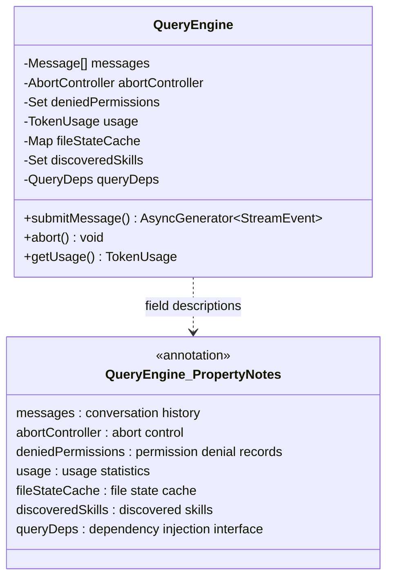
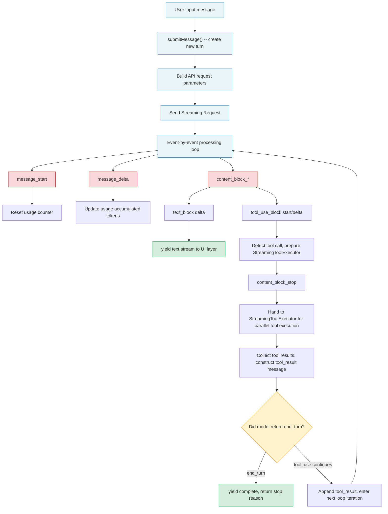
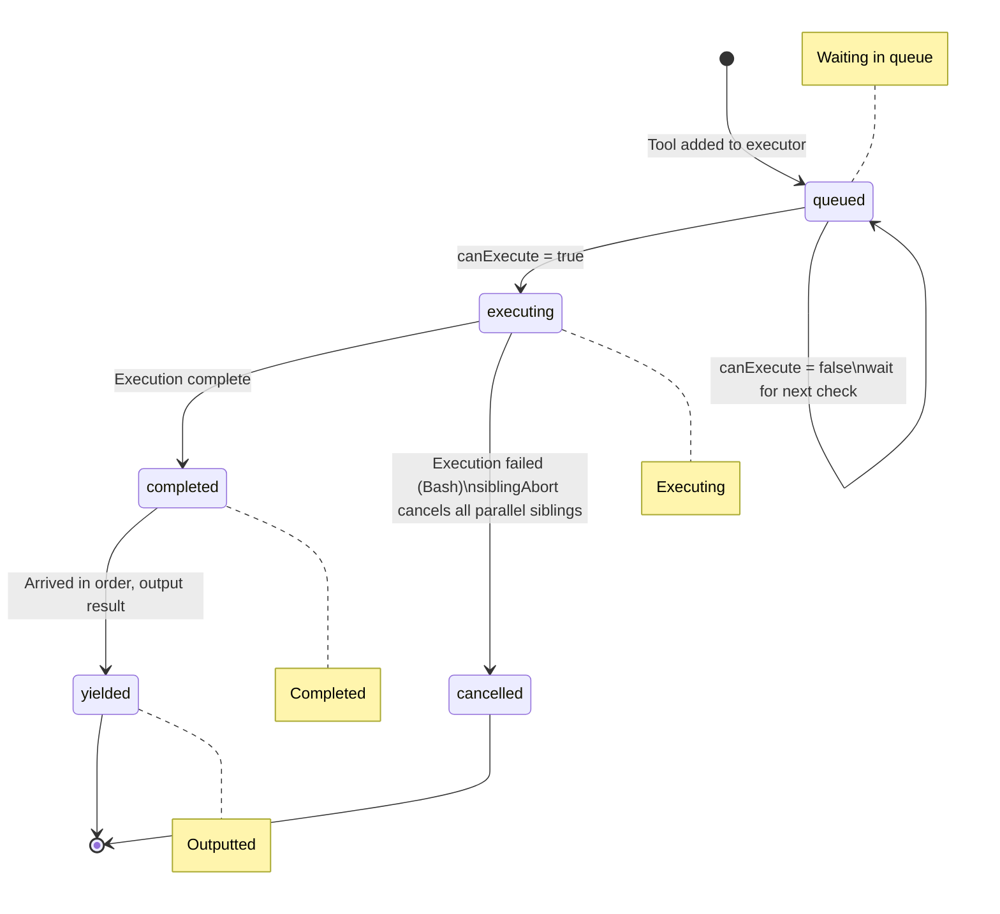
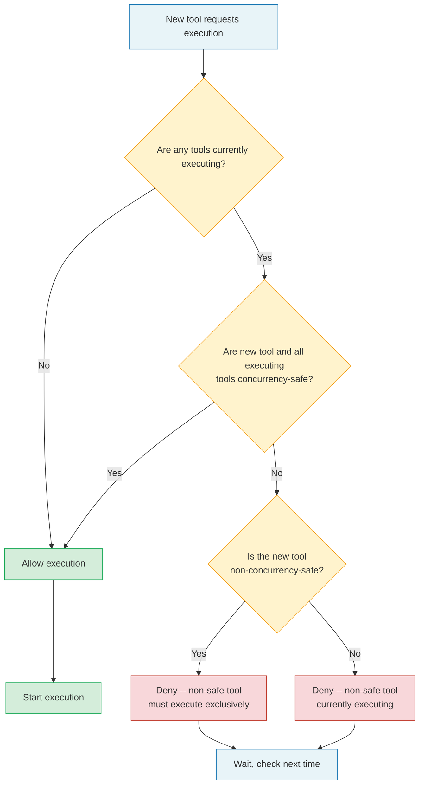
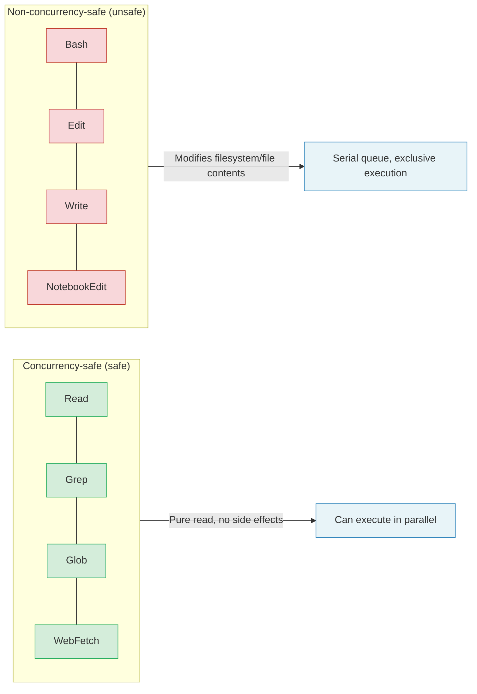
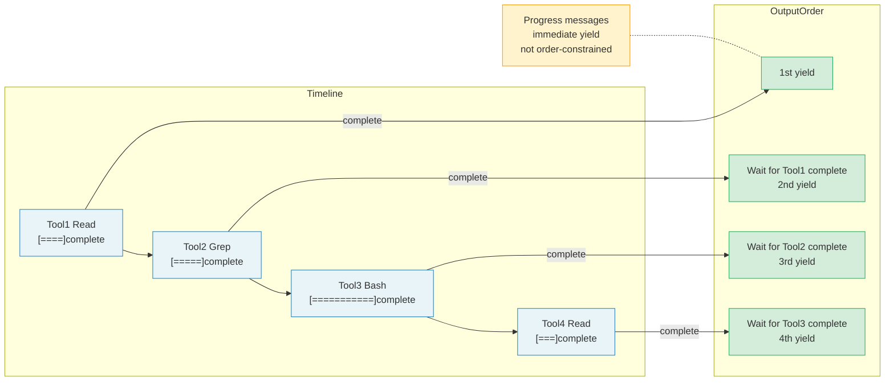
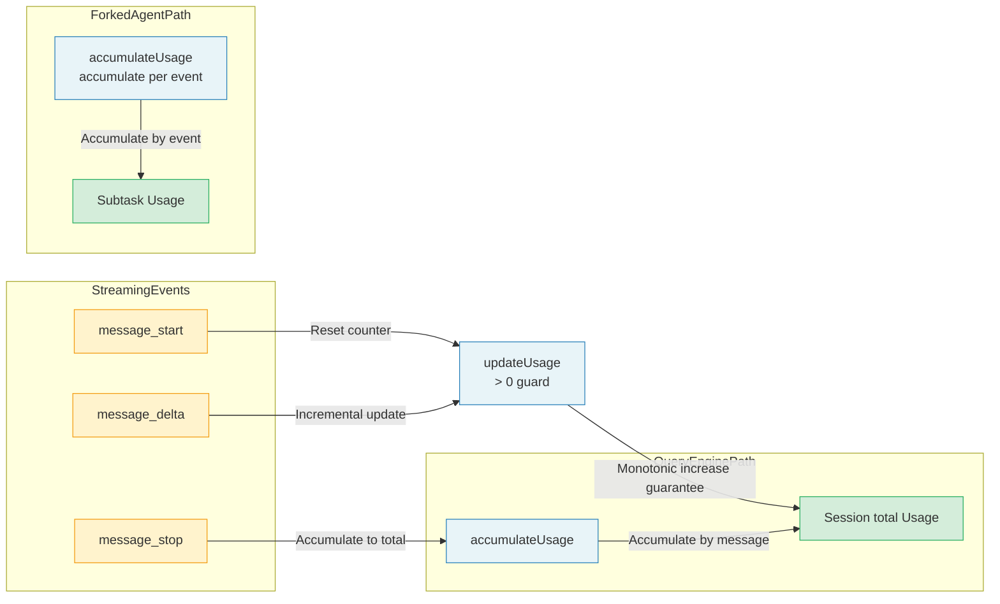
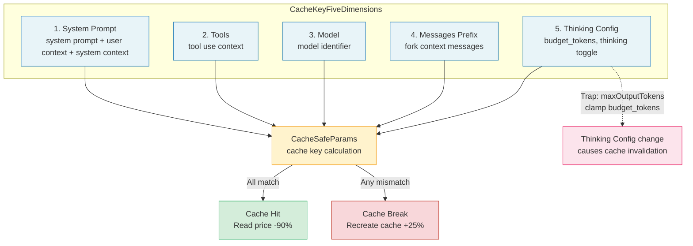
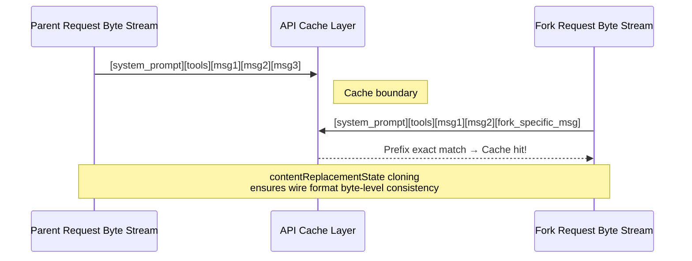

# Chapter 13: Streaming Architecture & Performance Optimization

> "Premature optimization is the root of all evil -- but latency is the root of all user complaints."
> -- adapted from Donald Knuth

**Learning Objectives:** Master Claude Code's streaming processing architecture and cost control strategies. Understand how QueryEngine enables real-time interaction through streaming APIs, how StreamingToolExecutor balances concurrency with safety, and how the system optimizes startup performance and runtime costs through parallel prefetching, lazy loading, and prompt caching. Through this chapter, you will establish a complete performance optimization mindset, able to identify, measure, and solve performance bottlenecks in Agent systems.

---

## 13.1 Streaming API Interaction

### 13.1.1 QueryEngine: The Manager of Query Lifecycle

Claude Code's core interaction model is streaming. `QueryEngine` is the owner of query lifecycle and session state, extracting core logic originally scattered across query functions into an independent class, serving both headless/SDK paths and REPL interaction paths.

One session corresponds to one `QueryEngine` instance. Each time a user sends a message, `submitMessage()` starts a new turn, with state (messages, file cache, usage, etc.) persisting across turns. `QueryEngine` internally maintains core state including message list, abort controller, permission denial records, usage statistics, file state cache, and discovered skill names.

**Why introduce a class instead of using functional APIs directly?** The answer lies in the complexity of state management. If session state is passed as parameters between functions, the call chain becomes extremely fragile -- any new state field requires modifying all function signatures. Classes encapsulate state as instance properties; adding new state only requires initialization in the constructor without breaking existing interfaces. This also binds the state's lifecycle to the instance: destroying the instance destroys the state, avoiding memory leak risks from global state.



QueryEngine's design embodies the "single ownership" principle: session state has one and only one owner. This is particularly important in concurrent scenarios -- if multiple components simultaneously modify the message list, it could lead to disordered messages or duplicate processing. Class instantiation provides a natural mutual exclusion boundary for state.

> **Cross-reference:** QueryEngine's core query loop is analyzed in detail in Chapter 2 "The Dialog Loop -- Heartbeat of an Agent". This chapter focuses on its streaming characteristics and performance optimization mechanisms.

### 13.1.2 Real-time Reception of Token Streams

`submitMessage` is an `AsyncGenerator`, which means callers can consume streaming messages in real-time without waiting for the entire query to complete.

Inside QueryEngine's query loop, streaming events are processed one by one. The system performs different operations based on different event types: `message_start` events reset the current message's usage counter; `message_delta` events update usage and capture stop_reason; `message_stop` events accumulate the current message's usage into the total.

This phased design enables the system to process tool calls and progress messages in real-time without waiting for complete responses.

**Where is the real value of streaming processing?** Let's understand with a comparison. Suppose the model generates a response requiring three tool calls, with a total time of 5 seconds:

| Strategy | Model outputs tool1 (1s) | Model outputs tool2 (2s) | Model outputs tool3 (2s) | Total time |
|----------|--------------------------|--------------------------|--------------------------|------------|
| Non-streaming (wait all) | Waiting... | Waiting... | Execute tool1, 2, 3 | 5s + tool execution |
| Streaming (execute on arrival) | Execute tool1 | Execute tool2 | Execute tool3 | 5s (parallel) |

In streaming mode, tool 1 starts executing at second 1, and by second 5, all three tools may have completed. Non-streaming mode requires waiting 5 seconds to receive the complete response, then executing all tools serially or in parallel. For developers needing fast iteration, this difference is the gap between "instant response" and "waiting to load".

### 13.1.3 Immediate Detection of Tool Call Blocks

In streaming mode, when the API returns a `tool_use` type content block, the system doesn't need to wait for the entire response to complete before starting processing. This means the model generates tool call parameters while the system parses and prepares for execution, greatly shortening the delay between "model decides to call tool" and "tool starts executing".

This immediate detection relies on `content_block_start` and `content_block_delta` events from streaming events. When the system receives `content_block_start` with type `tool_use`, it immediately knows a tool call is coming and can pre-lookup tool definitions and prepare permission check context. Subsequent `content_block_delta` events incrementally build the tool's JSON input parameters through an incremental JSON parser enabling parsing-while-receiving.

**Challenges of incremental JSON parsing.** Tool parameters are in JSON format, but streaming transmission means JSON arrives character by character. Traditional `JSON.parse()` requires a complete string to work. Claude Code's approach is to maintain an accumulation buffer, appending to the buffer each time a delta arrives, then attempting to parse. Since JSON's structure is known (defined through inputSchema), the parser can make reasonable "predictions" for incomplete JSON -- for example, when the buffer content is `{"path": "/src/ind`, the system can predict this is a file path parameter and start file system预热 (such as triggering OS-level file cache prefetching).

> **Anti-pattern warning:** Don't do heavy computation on delta events during streaming processing. Each delta event may only contain one or a few tokens; if the parsing logic itself costs more time than it saves, it's counterproductive. The correct approach is lightweight buffer accumulation, triggering substantive processing only at key "boundary events" (like `content_block_stop`).

### 13.1.4 Complete Streaming Data Flow Overview

Let's connect the streaming API interaction process from user input to final output into a complete data flow diagram:



The key insight of this data flow is: **streaming processing is not an optimization, but an architectural choice.** It determines that every component of the system must be designed according to "incremental, interruptible, composable" principles. In this sense, streaming architecture is the cornerstone of the entire Agent Harness.

---

## 13.2 Concurrency Control of StreamingToolExecutor

### 13.2.1 Design Philosophy: Execute on Arrival

`StreamingToolExecutor` is the core of Claude Code's tool execution layer. Its design goal is to start tool execution immediately when streaming arrives, rather than waiting for all tool call blocks to arrive before unified processing.

This "execute on arrival" philosophy can be understood with a life analogy: imagine a kitchen where the chef (model) verbally gives a series of instructions -- "chop onions", "boil water", "make sauce". The traditional approach is to wait until the chef finishes all instructions before starting; while "execute on arrival" means the sous-chef starts doing each task as the chef says it. Chopping onions and boiling water can happen simultaneously (concurrency-safe), but "pour onions into pot" must wait until "onions are chopped" (serial dependency).

Each tracked tool has a state machine with four states: `queued`, `executing`, `completed`, and `yielded`. When a new tool is added to the executor, it enters the `queued` state, immediately triggering queue processing logic.



### 13.2.2 Concurrency Safety: The Choice Between Parallel and Serial

The core logic of concurrency control is in the `canExecuteTool` method, with clear and rigorous rules:



- **When no tools are executing**, any tool can start.
- **When tools are executing**, parallel execution is only allowed when the new tool and all executing tools are concurrency-safe.
- **Non-concurrency-safe tools** must execute exclusively; no other tool can run in parallel with them.

This means read-only tools like Read, Grep, Glob can execute simultaneously in parallel, while tools with side effects like Bash, Edit, Write need to queue serially.

**Why not do more fine-grained dependency analysis at the tool level?** This is an intentional simplification decision. Theoretically, we could analyze whether there are data dependencies between two Bash commands (e.g., `mkdir foo && echo bar > foo/file.txt` has a dependency, while `echo hello` and `echo world` don't). But this analysis requires understanding shell semantics, which is costly and error-prone. Claude Code chose a conservative but reliable strategy: Bash is inherently unsafe; better to wait an extra second than risk parallel execution of potentially conflicting commands.

The concurrency safety classification follows a simple matrix:



> **Best practice:** When designing custom tools, be sure to correctly set the `isConcurrencySafe` flag. A common mistake is marking a database-read-only tool as unsafe, causing unnecessary serial waiting. Conversely, marking a tool that actually modifies state as safe is even more dangerous -- it will lead to data races. The principle is: **when uncertain, choose safe = false (fail-closed).**

### 13.2.3 Result Buffering and Ordered Output

Although tools can execute in parallel, results must be output in order. The `getCompletedResults()` method guarantees this through the `yielded` state marker: completed tool results are output sequentially in the order they were added; if a non-concurrency-safe tool is still executing, subsequent tool results won't be output even if ready. Progress messages are an exception -- they are immediately yielded without order constraints, ensuring users see real-time progress feedback from tool execution.

**Why must we strictly maintain order?** This is because the model's reasoning depends on the order of tool results. If tool results return to the model out of order, the model might misunderstand the correspondence of results. For example, if the model first called Read to read file A, then Read to read file B. If B's result arrives before A's, the model might mistake B's content for A's. Order guarantee ensures the model's understanding of the world remains consistent.

This design can be compared to an "airport baggage carousel": luggage (tool results) may be processed at different speeds, but passengers (the model) see them in the same order as checked in. Early-arriving luggage waits in the background until all luggage before it has arrived before appearing together on the carousel.



### 13.2.4 Sibling Tool Error Cascading

When a Bash tool execution fails, StreamingToolExecutor triggers a cascading cancellation mechanism: marking itself in error state and aborting all parallel sibling tools through `siblingAbortController`.

Only Bash tool errors trigger cascading because Bash commands often have implicit dependency chains (e.g., if `mkdir` fails, subsequent commands are meaningless). Failures of independent tools like Read and WebFetch don't affect other parallel tools.

**Design considerations for cascading cancellation.** Why not let all tool errors trigger cascading? Consider this scenario: the model simultaneously calls Read to read three unrelated files. If the first file doesn't exist causing Read to error, we shouldn't cancel the other two reads -- their results are equally valuable to the model. Bash's specialness lies in that multiple Bash commands called by the model in one turn usually have implicit dependencies (like compile-then-test); one command failing often means subsequent commands' inputs are invalid.

This "selective cascading" strategy is a pragmatic approach: it doesn't pursue theoretical perfect consistency but makes reasonable assumptions based on actual usage patterns.

> **Cross-reference:** Tool concurrency safety properties are defined in detail in the `buildTool` factory function in Chapter 3 "The Tool System -- Agent's Hands", with default value `isConcurrencySafe: () => false`, following the fail-closed principle.

---

## 13.3 Startup Performance Optimization

Claude Code's startup time directly affects user experience. CLI tool psychology research shows that startup delays over 2 seconds make users feel the tool is "clunky", and over 5 seconds triggers "is it frozen?" anxiety. The system shortens the latency from command line input to first response through three optimization strategies: parallel prefetching, lazy loading, and lazy module evaluation.

These optimizations are not independent tricks but constitute a systematic startup optimization methodology: **Identify critical path -> Parallelize non-critical paths -> Defer non-essential modules -> Eliminate dead code**.

### 13.3.1 Parallel Prefetching: Racing Against Module Evaluation

The top of Claude Code's entry file is the core of the parallel prefetching strategy. The system starts two subprocesses at the earliest stage of module evaluation, letting them execute in parallel with the subsequent ~65ms import chain. The two key prefetch operations are MDM configuration reading and Keychain credential prefetching.

**startMdmRawRead** spawns multiple `plutil` processes in parallel on macOS to read MDM plist configurations, and spawns `reg query` on Windows to read registry. It uses `existsSync` to quickly skip non-existent plist files, avoiding unnecessary 5ms spawn overhead.

**startKeychainPrefetch** changes two keychain reads (OAuth tokens ~32ms, legacy API key ~33ms) from serial to parallel, and executes in parallel with the import chain. The design document comments precisely explain the optimization motivation: serial cost is ~65ms, while starting two subprocesses here lets them execute in parallel with the entry file's ~65ms imports.

Both prefetch results are awaited in subsequent initialization stages, at which point the subprocesses are likely complete with almost zero wait.

Let's calculate the benefit of parallel prefetching with specific numbers:

```mermaid
gantt
    title Startup Performance: Serial vs Parallel Prefetch
    dateFormat X
    axisFormat %Lms

    section Before Optimization (Serial)
    import chain (65ms)           :a1, 0, 65
    MDM read (30ms)               :a2, 65, 95
    Keychain #1 (32ms)            :a3, 95, 127
    Keychain #2 (33ms)            :a4, 127, 160

    section After Optimization (Parallel Prefetch)
    import chain (65ms)           :b1, 0, 65
    MDM read (30ms)               :b2, 0, 30
    Keychain #1 (32ms)            :b3, 0, 32
    Keychain #2 (33ms)            :b4, 0, 33
```



> Before optimization total: 65 + 30 + 32 + 33 = **160ms**
> After optimization total: max(65, 30, 32, 33) = **65ms**
> Benefit: 160ms -> 65ms, saving **95ms (59%)**

95 milliseconds may not sound like much, but in the CLI tool world, users are extremely sensitive to the latency from "typing command to seeing output". This "racing against import chain" strategy essentially utilizes idle CPU time while waiting for I/O.

> **Best practice:** Conditions for parallel prefetching are: (1) prefetch operations are I/O-intensive not CPU-intensive; (2) results won't be used immediately but needed at some later point; (3) prefetch failure shouldn't block the main flow. If your prefetch operation violates any condition, parallelization adds complexity without benefit.

### 13.3.2 Lazy Loading

The `messageSelector` in QueryEngine uses `require()` for true lazy loading because the MessageSelector component pulls in heavy dependencies like React/ink, loaded only when first needed.

Conditional imports are also an important lazy loading strategy. Coordinator mode and snip compaction achieve dead code elimination through feature flag gating functions. When feature flags are off, bundlers can completely eliminate these code paths and their dependency trees, reducing bundle size and module initialization time.

The key decision for lazy loading is **drawing a line: what must be loaded at startup, what can wait until needed.** The line follows a simple principle: if a module's load time exceeds 5ms and isn't needed in the first 3 seconds after startup, it should be lazy loaded. 5ms is an empirical threshold -- below this, lazy loading's runtime check overhead might offset its benefit.

Three levels of lazy loading and their applicable scenarios:

```
+-------------------+----------------------------+---------------------------+
| Lazy Level        | Implementation             | Applicable Scenarios      |
+-------------------+----------------------------+---------------------------+
| Conditional       | feature flag + require()   | Optional feature modules  |
| import            |                            | (coordinator, snip)       |
+-------------------+----------------------------+---------------------------+
| Load on first use | getter + require()         | Heavy dependencies        |
|                   |                            | (MessageSelector + React) |
+-------------------+----------------------------+---------------------------+
| Compile-time      | bun:bundle feature()       | Disabled features         |
| elimination       |                            | (dead code elimination)   |
+-------------------+----------------------------+---------------------------+
```

### 13.3.3 Lazy Schema Evaluation

Tool inputSchema/outputSchema achieves lazy initialization through `lazySchema`, avoiding Zod schema construction during module loading. Combined with getter access patterns, schemas are only constructed when first actually used.

Zod schema construction costs are often underestimated. A moderately complex schema with nested objects, optional fields, and description text takes about 0.1-0.3ms to construct. If Claude Code's sixty-plus tools all build schemas at startup, total overhead is 6-18ms -- unacceptable for a CLI tool.

`lazySchema`'s implementation leverages JavaScript's getter semantics: first access triggers the construction function, the constructed result is cached to an instance property, subsequent accesses read directly from cache without going through the getter. This is a "trigger once, permanently replace" pattern.

### 13.3.4 Startup Optimization Checklist

If you're building your own CLI Agent tool, the following checklist can help you systematically perform startup optimization:

- [ ] **Identify critical path**: Use `console.time` or profiling tools to measure each initialization step's duration
- [ ] **Parallelize I/O operations**: File reads, network requests, process spawns should all parallelize with module loading
- [ ] **Lazy load heavy dependencies**: React, large parsers, database drivers should be deferred to first use
- [ ] **Eliminate unused code**: Remove unneeded features through feature flags and tree-shaking
- [ ] **Lazy initialize heavy objects**: Zod schemas, regexes, WASM modules should be deferred construction
- [ ] **Measure and iterate**: Establish CI baselines for startup time, prevent performance regression
- [ ] **Focus on P95 not average**: Startup experience on slow machines is the real user experience

---

## 13.4 Token Cost Tracking

### 13.4.1 Cost Calculation Engine

Claude Code's cost tracking is built on two core functions: `updateUsage` and `accumulateUsage`.



**updateUsage** handles usage data from single streaming events. Since Anthropic API's `message_delta` events only return incremental fields, `updateUsage` uses `> 0` guards for each field to distinguish "not returned" from "truly zero". This guard is crucial: if the API returns `input_tokens: 0` (because that request used caching), the system won't incorrectly overwrite the previously recorded true value to zero.

This seemingly simple guard reveals a profound design issue: **semantic ambiguity of incremental protocols.** When a field is missing or zero, does it mean "this quantity is indeed zero" or "this event doesn't contain information about this quantity"? Without distinction, "100% cache hit rate" leads to the absurd result of "displaying zero input tokens".

The essence of the `> 0` guard is a **monotonic increase guarantee**: usage fields only increase, never decrease or get overwritten with smaller values. This ensures that querying usage at any time gets the maximum known value up to that point.

> **Anti-pattern warning:** Don't use `|| 0` as default value in `updateUsage`. `|| 0` treats `0`, `undefined`, `null`, `""` all as falsy, causing true zero values to be incorrectly replaced. Using `> 0` guard (or more rigorous `!== undefined && val > 0`) correctly distinguishes "not returned" from "truly zero".

### 13.4.2 accumulateUsage Accumulation Pattern

**accumulateUsage** is responsible for accumulating usage across messages. Its semantics are simple field summation, separately accumulating input tokens, cache creation tokens, cache read tokens, output tokens, etc.

In QueryEngine, this accumulation happens at each `message_stop` event. In forked agents, it happens at each `message_delta` event. The difference between the two strategies is granularity: QueryEngine accumulates by message, forked agent accumulates by event, but the final result is consistent.

**Why do the two scenarios choose different accumulation granularities?** QueryEngine is a long-lifecycle session manager; its usage tracking is oriented toward "how much did this session consume in total" scenarios, so per-message accumulation is precise enough. Forked agent is a short-lifecycle subtask executor; it may be aborted at any time, so more frequent accumulation is needed to ensure usage data isn't lost -- if a fork crashes before `message_stop`, per-message accumulation would lose the entire message's usage.

### 13.4.3 Best Practices for Token Cost Tracking

Understanding Claude Code's cost tracking mechanism, let's summarize a set of best practices for tracking token costs in Agent systems:

**1. Establish Cost Budget Awareness**

Set a token budget上限 at the start of each session. Claude Code implements this through the `maxBudgetUsd` parameter. When cumulative cost approaches the budget limit, the system should proactively remind users rather than silently exhausting the budget.

```
+------------------+---------------------------+
| Budget Level     | Suggested Action          |
+------------------+---------------------------+
| < 50%            | Normal operation, no alert|
| 50% - 80%        | Light reminder (statusbar)|
| 80% - 95%        | Clear warning (suggest    |
|                  | compacting context)       |
| > 95%            | Strong warning (limit new |
|                  | tool calls)               |
| >= 100%          | Hard limit (stop dialog   |
|                  | loop)                     |
+------------------+---------------------------+
```

**2. Layered Cost Tracking**

Don't just track totals. Decompose costs by the following dimensions to locate cost hotspots:

- **By turn**: Which turn consumed the most tokens? Usually the initial context-building turn.
- **By tool**: Which tool's execution result is largest? Large file reads are the most common token black holes.
- **By type**: What's the ratio of input tokens vs output tokens? Output tokens are usually 3-5x more expensive.
- **Cache efficiency**: What's the cache hit rate? Below 70% usually means context management issues.

**3. Cost Anomaly Detection**

Set normal token consumption ranges, trigger alerts when deviating from normal ranges. For example:
- Single turn input exceeds 100K tokens -- possibly a tool returned an oversized result
- Single turn output exceeds 10K tokens -- model might be "verbose output"
- Cache hit rate suddenly drops from 80% to 20% -- context might have been unexpectedly cleared

**4. Real-world Case: Cost Breakdown of a Typical Session**

Suppose a developer uses Claude Code to implement a new feature, with a session containing 8 turns:

```
Turn    Input    Output    Cache Read    Cache Create    Cumulative Cost($)
 1       15,000      2,500         0          15,000     $0.12
 2       20,000      1,800        15,000      5,000     $0.22
 3       22,000      3,200        18,000      4,000     $0.35
 4       25,000      1,500        20,000      5,000     $0.44
 5       85,000      2,000        22,000     63,000     $0.89  <-- Tool returned large file
 6       90,000      1,200        80,000     10,000     $1.15  <-- Cache break!
 7       30,000      4,500        25,000      5,000     $1.32  <-- Recovered after compact
 8       32,000      2,000        28,000      4,000     $1.48
```

Note turns 5-6: A tool returned a huge file (63K cache creation tokens), causing subsequent turns' input to surge. Turn 7 recovered to normal levels through context compaction. This case shows: **tool output token costs are often more worth watching than the model's own output.**

---

## 13.5 Caching Optimization Strategies

### 13.5.1 Three Dimensions of Prompt Cache Sharing

Anthropic API's prompt caching is a key mechanism for reducing costs and latency. The cache key consists of five dimensions: system prompt, tools, model, messages prefix, and thinking config.



`CacheSafeParams` precisely encapsulates the first four dimensions: system prompt, user context, system context, tool use context, and fork context messages.

The fifth dimension (thinking config) derives from `toolUseContext.options.thinkingConfig`, but has a subtle trap: if a fork sets `maxOutputTokens`, related logic clamps `budget_tokens` accordingly, causing thinking config changes and thus cache invalidation. Source comments explicitly warn about this: if a fork uses cacheSafeParams to share parent request's prompt cache, different budget_tokens will invalidate the cache because thinking config is part of the cache key.

The economic impact of cache hits is significant. For Claude 3.5 Sonnet:

```
+-------------------+----------------+------------------+
| Token Type        | Price (per 1M) | Cache Hit Price  |
+-------------------+----------------+------------------+
| Input token       | $3.00          | --               |
| Cache write token | $3.75 (+25%)   | --               |
| Cache read token  | --             | $0.30 (-90%)     |
| Output token      | $15.00         | $15.00 (unchanged)|
+-------------------+----------------+------------------+
```

A typical Agent session might send 200K input tokens over 10 turns. Without caching, input cost is $0.60. With 80% cache hit rate, cost drops to $0.60 * 0.2 + $0.60 * 0.8 * 0.1 = $0.168, a 72% savings. In large projects, this savings can reach hundreds of dollars per day.

### 13.5.2 Byte-level Consistency in Fork Mode

`runForkedAgent` concatenates `forkContextMessages` with `promptMessages` as the initial message list when starting a fork. This ensures the fork request shares exactly the same message prefix as the parent request, thus hitting the parent's prompt cache. `contentReplacementState` cloning further guarantees wire format consistency -- cloning ensures the fork makes the same replacement decisions for tool_use_ids in parent messages, producing the same wire prefix, guaranteeing cache hits.

Byte-level consistency is a much stricter requirement than "logical equivalence". Two JSON objects can be logically equal (same key-value pairs) but byte-different (different key order, different whitespace count, different number precision). The API's cache key is based on exact byte prefix matching, so even a tiny format difference will invalidate the cache.

This is like two documents with identical content but different formatting: to a human the information is the same, but to the file's hash value they're completely different. Claude Code ensures the byte sequence produced by a fork is exactly consistent with the parent request by cloning `contentReplacementState`; this isn't over-engineering but an inevitable requirement of the caching mechanism.



### 13.5.3 Cache Break Detection

The system records each fork's cache hit rate through telemetry events, calculated as `cache_read_input_tokens / (input_tokens + cache_creation_input_tokens + cache_read_input_tokens)`.

When `cache_read_input_tokens` is much lower than expected, it means the fork didn't hit the parent request's cache, possibly because cache-safe params are inconsistent. Log output shows complete token distribution: high `cacheRead` + low `input` indicates good cache hits; high `cacheCreate` indicates cache break.

`skipCacheWrite` parameter is an additional optimization: for fire-and-forget forks (like speculation), no need to write new cache entries because no subsequent requests will read this prefix.

### 13.5.4 Practical Strategies for Cache Optimization

Based on Claude Code's cache design, here are practical strategy sets for cache optimization:

**Strategy 1: Minimize System Prompt Changes**

System prompt is the beginning of the cache prefix; any change invalidates the entire cache. Common factors causing system prompt changes:

- Timestamp injection (different every request) -- **anti-pattern**, use relative time
- Dynamic tool list order random -- should sort before injecting
- User preference info format tiny differences -- should standardize format

**Strategy 2: Message Order Stability**

Message addition order directly affects cache prefix. If two turns' message histories are identical except for the last message, the shared prefix can hit cache. But if a "system notification" message is inserted in the middle, the prefix breaks.

Claude Code avoids this by placing attachment messages (AttachmentMessage) in specific positions -- system notifications don't interleave between dialog messages.

**Strategy 3: Cache Preheating**

Proactively include content in the first request that might be shared by subsequent requests. For example, if you know the user will next trigger a fork agent (like post-turn summary), you can consider the fork's cache-safe params needs when building the parent request, ensuring the parent's prefix can be reused by the fork.

**Strategy 4: Monitor Cache Health**

Establish a monitoring dashboard for cache hit rate. For Agent systems, recommended baseline metrics:

```
+----------------------------+-----------+-----------------------------------+
| Metric                     | Healthy   | Anomaly Possible Cause            |
|                            | Range     |                                   |
+----------------------------+-----------+-----------------------------------+
| Overall cache hit rate     | > 70%     | System prompt frequent changes    |
| Fork cache hit rate        | > 85%     | Cache-safe params inconsistent    |
| Cache create/read ratio    | < 0.3     | Large number of new prefixes      |
|                            |           | being created                     |
| Single request cache       | < 50K     | Context too large, insufficient   |
| creation token count       |           | compression strategy              |
+----------------------------+-----------+-----------------------------------+
```

> **Cross-reference:** Context compression strategy directly affects cache efficiency. Chapter 7 "Context Management -- Agent's Working Memory" analyzes the four-level compression strategy in detail; each compression rewrites message history, potentially causing cache breaks. Designing compression strategies requires balancing "releasing token space" with "maintaining cache continuity".

---

## Practical Exercises

### Exercise 1: Analyze Tool Concurrency Behavior

In Claude Code REPL, execute a task that simultaneously triggers multiple tool calls (e.g., "Search all TypeScript files containing TODO lines, while viewing package.json content"), observe which tools execute in parallel, which queue serially. Combined with `StreamingToolExecutor`'s `canExecuteTool` logic, explain the behavior you observed.

**Extended thinking:** Try constructing a more complex scenario -- simultaneously trigger 2 Grep + 1 Bash + 1 Read. Observe whether Bash tool execution blocks subsequent Read tool startup. Record each tool's start and end times, draw an execution timeline.

### Exercise 2: Track Cache Hit Rate

Run Claude Code with `CLAUDE_CODE_DEBUG=1`, execute a task involving session memory or post-turn summary. Check `tengu_fork_agent_query` output in logs, calculate cache hit rate, analyze what factors might affect cache hits.

**Calculation method:**
```
Cache hit rate = cache_read_input_tokens / (input_tokens + cache_creation_input_tokens + cache_read_input_tokens)
```

**Judgment criteria:**
- Hit rate > 85%: Excellent
- Hit rate 60%-85%: Normal
- Hit rate < 60%: Need to investigate cause

### Exercise 3: Evaluate Parallel Prefetch Effect

In Claude Code entry, MDM read and Keychain prefetch both start at the earliest stage of the import chain. Assume MDM read takes 30ms on macOS, keychain read takes 65ms (two serial), import chain takes 65ms. Calculate the total startup time difference between serial and parallel strategies.

**Extended exercise:** Use `NODE_DEBUG=time` or custom timestamps to actually measure startup phase durations of Claude Code in your environment. Compare your measurements with theoretical calculations, analyze source of differences.

### Exercise 4: Token Cost Analysis in Practice

Choose a real project, use Claude Code to complete a medium-complexity task (like "Add an API endpoint and write corresponding tests"). Throughout the process record:
1. Token consumption per turn (input/output/cache read/cache create)
2. Which turn consumed the most tokens, why?
3. What proportion of total input tokens did tool call returns account for
4. Try using `/compact` to manually compact context, observe token changes after compaction

### Exercise 5: Performance Tuning Checklist Self-assessment

Run this chapter's "Startup Optimization Checklist" (Section 13.3.4) on the Agent system you're developing or maintaining, evaluate each item and record:
- Which optimizations are already in place?
- Which are low-hanging fruit (simple changes with significant improvement)?
- Which require larger architectural changes?
- Develop a prioritized optimization plan.

---

## Key Takeaways

1. **QueryEngine is a stateful query lifecycle manager**, implementing streaming message passing through AsyncGenerator, one instance per session, state persisting across turns. The class design encapsulates state as instance properties, avoiding memory leaks and concurrent modification risks from global state.

2. **StreamingToolExecutor implements "execute on arrival"**, concurrency-safe tools can run in parallel, non-safe tools execute serially, results buffered for ordered output. This design achieves a pragmatic balance between latency and consistency -- better to wait for one serial tool than risk parallel execution of potentially conflicting operations.

3. **The core idea of startup performance optimization is parallelization**: Let I/O-intensive operations (MDM read, keychain read) execute in parallel with CPU-intensive operations (module evaluation). Claude Code reduced startup latency from 160ms to 65ms through parallel prefetching at the entry file top, saving nearly 60%.

4. **Cost tracking uses a two-layer function design**: `updateUsage` handles incremental data from single streaming events (using `> 0` guard to prevent true values from being overwritten), `accumulateUsage` accumulates totals across messages. Different lifecycle components (QueryEngine vs forked agent) use different accumulation granularity strategies.

5. **Cache optimization requires byte-level consistency**: Fork agents must share exactly the same system prompt, tools, model, messages prefix, and thinking config as parent requests; any dimension deviation causes cache break. Continuous monitoring of cache hit rate is the cornerstone of Agent system cost control.

6. **Streaming architecture is not optimization, but architectural choice**: It determines that every component of the system must be designed according to "incremental, interruptible, composable" principles, and is the cornerstone of the entire Agent Harness. From QueryEngine to StreamingToolExecutor to tool execution, streaming thinking runs throughout.

7. **Tool output token costs are often more worth watching than model output**: A large file read might produce 60K+ cache creation tokens, while a model turn output is usually only 1-5K tokens. Optimizing tool return content (like limiting lines, filtering irrelevant info) is more effective than optimizing model output.
