# Chapter 14: Plan Mode & Structured Workflows

> "Plans are nothing; planning is everything." -- Dwight D. Eisenhower

**Learning Objectives:** Understand Claude Code's planning mode (Plan Mode) and workflow orchestration system, master the EnterPlanMode/ExitPlanMode pattern switching mechanism, understand plan file storage and recovery strategies, and implementation details of scheduling system (Cron, RemoteTrigger) and background task management. Through complete practical cases, you will learn how to use Plan Mode to improve Agent task success rate and controllability.

---

## 14.1 Plan Mode Architecture

### 14.1.1 Design Philosophy: Plan Before Execute

Plan Mode is one of Claude Code's most unique designs. It separates Agent behavior into two phases: read-only exploration phase (planning) and writable execution phase (implementation). The core philosophy of this separation is: align intent before acting, avoiding rework from directional errors.

This design philosophy can be compared to the construction industry: no architect would start laying bricks immediately upon receiving requirements. They would first draw blueprints (plan), confirm design intent with the client, evaluate structural feasibility, then begin construction (execution). During the planning phase, architects can modify plans at zero cost -- revising a drawing is much cheaper than demolishing a wall. Similarly, in Plan Mode, Agent's exploration and thinking produce no side effects (no file modifications, no command execution), and the cost of correcting "directional errors" is almost zero.

The core problem Plan Mode solves is **"Premature Action"**. Without Plan Mode, an Agent faces a dilemma: when facing complex tasks, either blindly act in the first round (high risk), or repeatedly read code without making decisions in every round (inefficient). Plan Mode provides Agent a "legitimate thinking space" -- in this space, Agent can freely explore without expectation to produce actual results, until it's confident it understands the full picture of the problem.

EnterPlanModeTool is the entry point to planning mode. Its prompt system provides different guidance strategies for different user types (external users vs internal ant users).

For external users, the system tends to encourage using Plan Mode, suggesting the model preferentially use Plan Mode for implementation tasks. For internal ant users, the system is more restrained, suggesting starting work directly and clarifying through questions when in doubt, rather than entering a full planning phase.

This differentiated strategy reflects different usage scenarios: external users value safety and alignment more, while internal users value efficiency and fluency more.

**What would happen without Plan Mode?** Let's imagine several typical scenarios:

| Scenario | Without Plan Mode | With Plan Mode |
|----------|-------------------|----------------|
| Misunderstood requirements | Directly implemented wrong feature, needs rollback | Discovered misunderstanding in read-only phase, zero-cost correction |
| Ignored existing patterns | Wrote code inconsistent with project style | First explored project to discover existing patterns, then implemented |
| Solution choice failure | Implemented poor-performing solution, needs rewrite | Compared multiple solution trade-offs before acting |
| Missed edge cases | Finished code then discovered omissions, rework | Enumerated edge cases in plan and incorporated into solution |

### 14.1.2 Mode Switching Mechanism

After user approves entering Plan Mode, EnterPlanModeTool's `call` method executes mode switching. Core logic includes: checking if in Agent context (if so throws error), calling permission transition handler to switch to plan mode, and through state update function switching permission context to plan mode configuration.

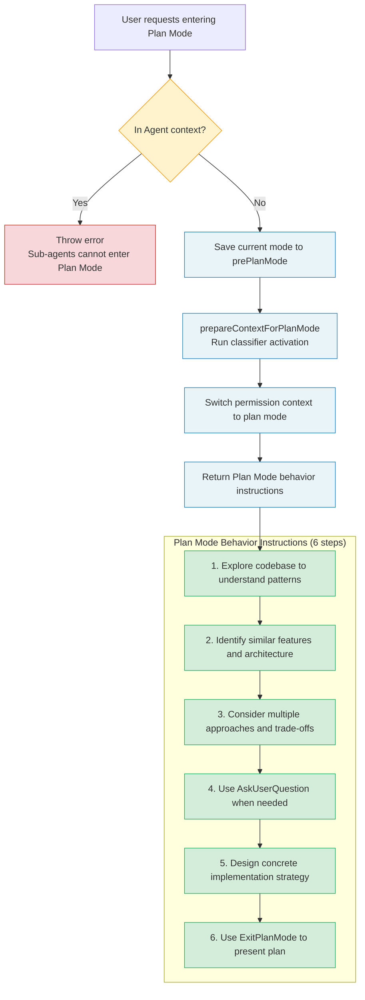

Key points:
- **Sub-agent context forbids entering Plan Mode**: Sub-agents should not enter planning mode; this is an architectural constraint. Imagine if a sub-agent entered Plan Mode, it would wait for user plan approval, but user might not even know the sub-agent exists. This would cause the entire parent Agent's execution to be blocked on an approval request users cannot understand.
- **prepareContextForPlanMode**: Runs classifier activation side effects, ensuring correct permission configuration in plan mode.
- **prePlanMode save**: Original mode is saved to `prePlanMode` field for ExitPlanMode recovery use.

After entering Plan Mode, Agent receives tool_result containing clear behavior instructions:

```
In plan mode, you should:
1. Thoroughly explore the codebase to understand existing patterns
2. Identify similar features and architectural approaches
3. Consider multiple approaches and their trade-offs
4. Use AskUserQuestion if you need to clarify the approach
5. Design a concrete implementation strategy
6. When ready, use ExitPlanMode to present your plan for approval

Remember: DO NOT write or edit any files yet.
This is a read-only exploration and planning phase.
```

The design of these six instructions implies a cognitive model: **Understand -> Discover -> Compare -> Clarify -> Design -> Present**. This is not a random list but a thinking process from divergence (broad exploration) to convergence (concrete solution). Steps 1-2 are divergence phase, Agent collects information as broadly as possible; Steps 3-4 are convergence transition phase, Agent starts focusing but still open; Steps 5-6 are complete convergence, Agent produces a definite implementation plan.

### 14.1.3 Exiting Plan Mode

ExitPlanModeV2Tool is responsible for exiting Plan Mode and restoring original permission mode. Its design is much more complex than EnterPlanMode because it needs to handle multiple scenarios.

**Mode restoration** is the core logic. System reads saved original mode from `prePlanMode` and restores it. But there's a key "circuit breaker" defense: if `prePlanMode` is `auto`, but auto mode's gate is currently closed (e.g., due to circuit breaker trigger), then fall back to `default` mode.

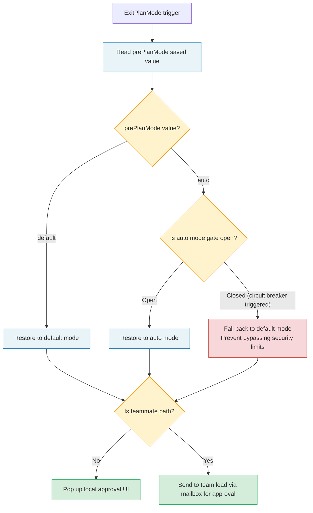

This circuit breaker defense reveals a subtle time window issue: when entering Plan Mode, auto mode was enabled, but during Plan Mode duration (possibly minutes or tens of minutes), auto mode might have been closed due to external reasons (like system load, security policy changes). If ExitPlanMode doesn't check this condition, Agent exiting Plan Mode would immediately execute operations with auto mode permissions, potentially bypassing newly activated security limits.

**Teammate path**: When Agent runs as teammate and Plan Mode is mandatory, ExitPlanMode doesn't pop up local approval UI but sends plan to team lead for approval via mailbox mechanism. Approval request contains sender, timestamp, plan file path, plan content, and request ID.

> **Cross-reference:** Teammate's mailbox mechanism is analyzed in detail in Chapter 10 "The Coordinator Pattern -- Multi-Agent Orchestration". Plan Mode's teammate path is a typical case of distributed Agent collaboration -- approval decision authority is delegated to team lead rather than local user.

### 14.1.4 Plan Mode Complete Case: From Requirement to Plan to Implementation

Let's demonstrate Plan Mode's actual operation through a complete case.

**User requirement:** "Add pagination support for project's REST API"

**Step 1: Enter Plan Mode**

Agent judges this is a non-trivial task involving multiple file modifications and proactively triggers EnterPlanMode. System saves current mode as `default`, switches to plan mode permission configuration.

**Step 2: Read-only exploration (in Plan Mode)**

Agent performs following read-only operations:

```
Tool call sequence (all read-only):
1. Glob("src/routes/*.ts")           -- Discover all route files
2. Glob("src/models/*.ts")           -- Discover all model files
3. Grep("limit|offset|page|cursor")  -- Search for existing pagination implementations
4. Read("src/routes/users.ts")       -- Read typical route implementation
5. Read("src/middleware/validate.ts") -- Understand validation middleware patterns
6. Grep("interface.*Response")       -- Search response type definitions
```

Agent discovers:
- Project uses Express + TypeScript
- Has 12 route files, none with pagination support
- Has a generic `ApiResponse` type
- Validation middleware uses Zod schema
- Database layer uses Prisma ORM

**Step 3: Solution Design and Trade-off Analysis**

Agent internally considers two solutions:

| Dimension | Offset Pagination | Cursor Pagination |
|-----------|------------------|-------------------|
| Implementation complexity | Low | Medium |
| Large dataset performance | Poor (OFFSET scan) | Excellent (index lookup) |
| Data consistency | Medium (inserts/deletes cause offset) | Excellent (cursor-based) |
| Client compatibility | Good (intuitive page numbers) | Needs adaptation |
| Prisma integration | Simple (skip/take) | Needs cursor encoding |

**Step 4: Present Plan**

Agent presents following plan through ExitPlanMode:

```
## Pagination Feature Implementation Plan

### Solution choice: Hybrid mode
- Default use offset pagination (simple, good compatibility)
- Provide cursor pagination option for high-frequency endpoints

### Implementation steps
1. Create src/types/pagination.ts -- Pagination type definitions
2. Create src/middleware/pagination.ts -- Pagination parameter parsing middleware
3. Modify src/routes/users.ts -- As first implementation example
4. Add Zod schema validation -- limit (1-100), offset (>=0)
5. Update ApiResponse type -- Add pagination metadata

### Expected impact
- New files: 2
- Modified files: 3
- Risk: Low (purely incremental, doesn't modify existing functionality)
```

**Step 5: Approval and Execution**

After user approves plan, ExitPlanMode restores original mode, Agent enters execution phase, gradually implementing according to plan.

> **Note:** In actual use, Plan Mode depth should match task complexity. For simple single-file modifications, direct execution might be more efficient than entering Plan Mode. Claude Code's prompt design has this judgment built in -- for external users, system only suggests Plan Mode for "implementation tasks", directly handling simple queries and modifications.

---

## 14.2 Plan Verification Mechanism

### 14.2.1 Verification Agent

`registerPlanVerificationHook` is referenced in `ExitPlanModeV2Tool`, its comment reveals an important design decision: verification hooks must be registered after context clear because context clear removes all hooks.

Verification hooks must be registered after context clear because context clear removes all hooks. This means verification agent runs in the phase after "clear context and start implementation", as an independent background Agent to verify whether implementation results match the plan.

**Design philosophy of verification agent.** Why need an independent verification agent instead of letting execution agent check itself? This involves the cognitive bias of "self-review" -- executioners tend to judge their work using their own understanding rather than strictly comparing against original plan text. Independent verification agent holds a snapshot of original plan file, able to review implementation results from a "bystander" perspective.

This is like code review in software engineering: having author review their own code is far less effective than having another engineer do it. Verification agent plays the role of this "other engineer".

Verification flow timing:

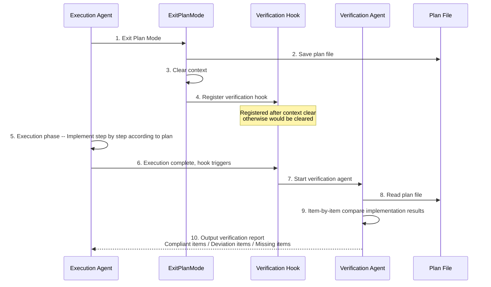

### 14.2.2 Plan File Persistence and Recovery

Plan file management is Plan Mode's infrastructure, provided by dedicated utility function module. The core challenge of this design is: **plans cannot be lost.** Users spent time approving plans, Agents spent tokens generating plans; if plans are lost due to session crash or unexpected interruption, all investment is wasted.

**File path generation** uses slug-based naming strategy. Main sessions use simple `{slug}.md` format, sub-agents use `{slug}-agent-{agentId}.md` format to avoid file conflicts.

**Slug generation** is lazy: generated on first access, subsequent reads from cache. If file for generated slug already exists, retry up to 10 times.

**Recovery mechanism** is multi-layered. `copyPlanForResume` attempts to recover plan from three sources when resuming session:

1. **Direct read of plan file**: Simplest path, if file exists return directly.
2. **File snapshot recovery** (`findFileSnapshotEntry`): Recover from `file_snapshot` system messages in transcript, particularly important in remote sessions (CCR) because local files don't persist between sessions.
3. **Message history recovery** (`recoverPlanFromMessages`): Extract plan content from three message formats:
   - ExitPlanMode's `tool_use` input (plan content injected via `normalizeToolInput`)
   - User message's `planContent` field (set during clear context flow)
   - Attachment message's `plan_file_reference` (preserved during auto-compact)

This three-layer recovery strategy can be understood as "don't put all eggs in one basket". Each layer covers different failure scenarios:

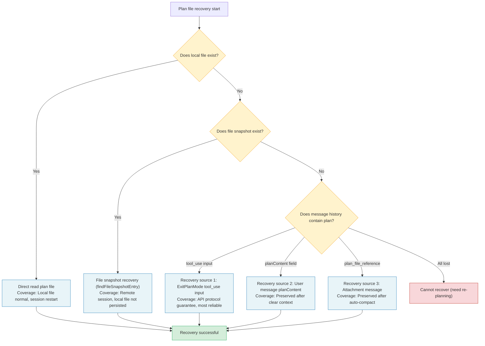

**Fork recovery** uses completely different strategy. `copyPlanForFork` generates new slug for forked session and copies original plan file to new path. This design prevents original session and fork session from overwriting each other's plan files.

Why can't fork directly share original plan file? Because after fork, two sessions might go down completely different execution paths. If fork modifies plan (like adjusting approach based on implementation feedback), directly modifying original file would affect parent session. By copying file to new path, fork has independent plan copy, not interfering with each other.

> **Cross-reference:** Fork Agent creation and state isolation mechanisms are analyzed in detail in Chapter 9 "Sub-Agents and the Fork Pattern". Plan file fork strategy is a concrete manifestation of Agent state isolation.

### 14.2.3 Deep Analysis of Plan File Recovery

Let's analyze more deeply the three recovery sources of `recoverPlanFromMessages`, understanding each source's design intent and applicable scenarios.

**Source 1: ExitPlanMode's tool_use input.** When Agent exits Plan Mode, ExitPlanMode tool's input parameters contain plan content. This content is injected into tool call's input via `normalizeToolInput`. During recovery, system finds ExitPlanMode's tool_use message from message history, extracts plan content. This is the most reliable recovery source because tool_use messages are part of API protocol, not modified by normal context management operations.

**Source 2: User message's planContent field.** During clear context flow (i.e., clearing context to restart implementation), system sets plan content to a special `planContent` field. This field's purpose is to preserve plan's "seed" after context clear, so newly started execution phase still knows what to do.

**Source 3: Attachment message's plan_file_reference.** auto-compact is an automatic context compression mechanism (detailed in Chapter 7). During compression, system recognizes plan file's importance, preserves reference to plan file in attachment messages. This ensures even after auto-compression, plan file can still be located and read through reference.

Three sources' priority design reflects "reliability first" principle: tool_use input most reliable (API protocol guarantee), planContent second (internal mechanism guarantee), plan_file_reference weakest (relies on auto-compact's correct recognition). Recovery logic attempts in this priority order, first successful source is final result.

---

## 14.3 Workflow System

### 14.3.1 WorkflowTool and Skill System

Claude Code's workflow capabilities are primarily provided by the Skill system. Skills are essentially predefined prompt templates, triggerable via slash commands. Skill execution's core preparation function handles three things:

1. **Prompt replacement**: Replace `$ARGUMENTS` placeholder with user-provided arguments.
2. **Permission extension**: Add allowed tools list to fork's execution context via `createGetAppStateWithAllowedTools`.
3. **Agent selection**: Prefer agent type specified by command, otherwise fall back to `general-purpose` agent.

**Design trade-offs of Skill system.** Why choose prompt templates over code-level plugins? This is the classic "flexibility vs reliability" trade-off. Code-level plugins can provide stronger functionality and better type safety, but their development and maintenance costs are higher, requiring developers to deeply understand system's internal APIs. Prompt templates allow anyone to define workflows in natural language, greatly lowering the extension barrier.

```
+-------------------+---------------------------+---------------------------+
| Extension method  | Flexibility               | Barrier                   |
+-------------------+---------------------------+---------------------------+
| Prompt template   | Medium (limited by prompt | Low (natural language)    |
| (Skill system)    | expressiveness)           |                           |
+-------------------+---------------------------+---------------------------+
| Hook commands     | High (arbitrary Shell     | Medium (programming       |
| (Hook system)     | commands)                 | ability required)         |
+-------------------+---------------------------+---------------------------+
| MCP servers       | Extremely high            | High (protocol            |
| (external tools)  | (independent process,     | implementation required)  |
|                   | any language)             |                           |
+-------------------+---------------------------+---------------------------+
```

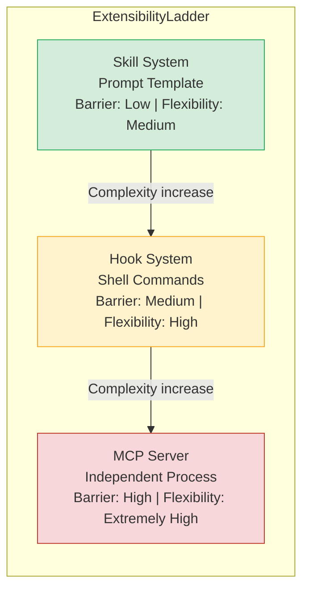

Claude Code's extensibility design follows the "ladder-style extension" principle: start with simplest prompt templates, as requirement complexity increases, progressively use more powerful extension mechanisms. Most users only need the Skill system, advanced users use hook commands, enterprise users integrate external tools via MCP.

> **Cross-reference:** Skill system's complete architecture is analyzed in detail in Chapter 11 "The Skill System and Plugin Architecture". Hook system is discussed in Chapter 8 "The Hook System -- Agent's Lifecycle Extension Points". MCP integration is introduced in Chapter 12 "MCP Integration & External Protocols".

### 14.3.2 Fork Agent State Isolation

`createSubagentContext` creates a completely isolated ToolUseContext. By default, all mutable state is isolated:

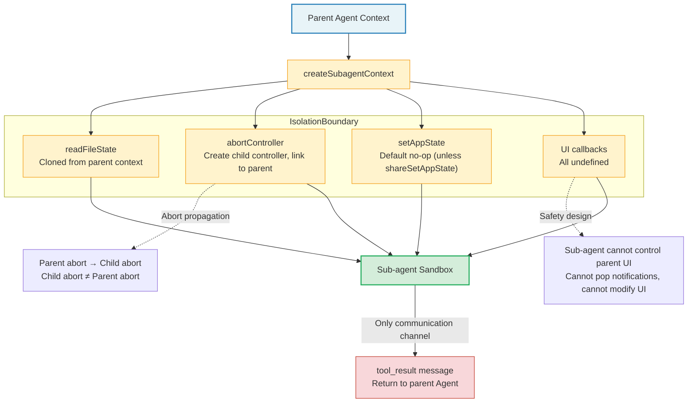

- **readFileState**: Cloned from parent context.
- **abortController**: Create child controller, linked to parent controller (parent abort propagates to child).
- **setAppState**: Default no-op, unless explicitly chosen to share (`shareSetAppState`).
- **UI callbacks** (addNotification, setToolJSX, etc.): All undefined, sub-agent cannot control parent UI.

**Why can't sub-agents control parent UI?** This is a critical safety design. If sub-agents could pop notifications or modify UI, users might be overwhelmed by notifications from multiple sub-agents, unable to distinguish main Agent from sub-Agent output. More seriously, malicious tool output (via prompt injection) could exploit sub-agent UI capabilities for phishing attacks -- for example, popping a seemingly legitimate confirmation dialog.

Fork Agent's state isolation strategy can be compared to a "sandbox": sub-agent runs in sandbox, can see outside world (through cloned file state), but cannot affect outside world (cannot modify parent Agent state, cannot control UI). The only communication channel with outside world is tool results -- sub-agent's execution results return to parent Agent through structured `tool_result` messages.

> **Best practice:** When designing sub-agents, follow "principle of least privilege". Only pass minimum context sub-agent needs to complete task, don't indiscriminately pass entire parent Agent state. This not only improves security but also reduces token consumption (sub-agent's input tokens also count toward cost).

---

## 14.4 Scheduling System

### 14.4.1 ScheduleCronTool: Local Scheduled Tasks

Claude Code's scheduling system supports two types of scheduled tasks:

- **One-shot** (`recurring: false`): Triggers once then automatically deletes.
- **Recurring** (`recurring: true`): Repeats according to schedule, rescheduling from current time.

Tasks are stored in `<project>/.claude/scheduled_tasks.json`, file format:

```json
{
  "tasks": [
    {
      "id": "a1b2c3d4",
      "cron": "0 * * * *",
      "prompt": "check the deploy status",
      "createdAt": 1710000000000,
      "recurring": true
    }
  ]
}
```

Each CronTask contains a `durable` runtime flag. Tasks with `durable: false` only exist in process memory, disappear when session ends. Tasks written to disk have this flag stripped.

**Design intent of durable flag.** Why not persist all tasks to disk? Consider these scenarios:

- User creates a one-time task "check deploy status in 5 minutes", a short-term task that no longer makes sense if session ends before triggering.
- User creates temporary polling task "check logs every minute" during debugging, this task only serves current debugging session.
- Persisting these temporary tasks to disk not only wastes storage but might cause subsequent sessions to unexpectedly trigger outdated tasks.

Therefore, `durable` flag provides a "lightweight task" mechanism: tasks needing cross-session persistence set `durable: true`, tasks only serving current session set `durable: false`.

### 14.4.2 CronScheduler: Scheduler Core

`createCronScheduler` implements a complete scheduler, including following key features:

**File lock**: Through `tryAcquireSchedulerLock` ensures multiple Claude sessions in same project directory don't repeatedly trigger same on-disk task. Non-owner sessions probe lock every 5 seconds, taking over if owner crashes.

This file lock mechanism solves an actual distributed problem: developers might simultaneously open multiple terminal windows, each running a Claude Code instance. Without file lock, same scheduled task would be triggered once by each instance, causing duplicate operations (like repeatedly sending notifications, repeatedly executing deploy checks).

File lock implementation is based on filesystem atomic operations (like `O_EXCL` create), reliable across all mainstream operating systems. Lock timeout and takeover mechanism ensures no deadlock when owner crashes -- other instances will detect and take over within reasonable time.

**Jitter mechanism**: To avoid massive sessions triggering inference requests at same moment (thundering herd), recurring tasks add deterministic positive delay. Delay is proportional to interval between triggers, default max 15 minutes. For hourly tasks, actual trigger time randomly disperses between `:00` to `:06`.

One-shot tasks use reverse jitter (trigger early), controlled by `oneShotMinuteMod`: default value 30, meaning only `:00` and `:30` exact triggers add jitter.

**Thundering Herd** is a classic distributed systems problem. If all Claude Code instances trigger scheduled tasks at whole hours, API servers would suddenly receive massive concurrent requests, possibly causing latency spikes or even service degradation. Jitter mechanism disperses trigger times within a time window, smoothing peak load into uniform load.

```mermaid
flowchart LR
    subgraph NoJitter["No Jitter -- Thundering Herd"]
        direction TB
        N1A["Instance 1: ----X-----------X-----------X----"]
        N1B["Instance 2: ----X-----------X-----------X----"]
        N1C["Instance 3: ----X-----------X-----------X----"]
        N1D["API:       ^^^Peak       ^^^Peak      ^^^Peak"]
    end

    subgraph WithJitter["With Jitter -- Smoothed Load"]
        direction TB
        N2A["Instance 1: -----X----------X-----------X----"]
        N2B["Instance 2: -------X----------X---------X----"]
        N2C["Instance 3: ----X------------X-----------X---"]
        N2D["API:       ^Smooth        ^Smooth      ^Smooth"]
    end

    NoJitter -.->|"Add Jitter"| WithJitter

    classDef peakNode fill:#f8d7da,stroke:#c0392b,stroke-width:1px
    classDef smoothNode fill:#d4edda,stroke:#27ae60,stroke-width:1px

    class N1D peakNode
    class N2D smoothNode
```

**Missed task detection**: At startup, check if any task's next trigger time has passed, notify user if so.

**Auto-expiration**: Recurring tasks auto-expire after 7 days by default (`recurringMaxAgeMs`), preventing infinite recursion causing memory leaks. Tasks with `permanent` flag (like assistant mode's built-in tasks) are exempt from this limit.

7-day expiration policy is a pragmatic choice. If a recurring task runs continuously for 7 days without anyone noticing or modifying it, it's likely no longer needed. Tasks without expiration mechanism would continue consuming resources like "zombie processes": each trigger produces API call, consumes tokens, occupies scheduler memory.

### 14.4.3 RemoteTriggerTool: Remote Triggering

RemoteTriggerTool provides remote Agent trigger management capabilities, supporting five operations: list, get, create, update, run.

It works through Anthropic API's triggers endpoint, using OAuth bearer token authentication, carrying organization identifier and beta flag headers.

Tool enablement is gated by two conditions: feature flag `tengu_surreal_dali` and policy limit `allow_remote_sessions`. RemoteTriggerTool only appears in tool list when both conditions are satisfied.

**Remote trigger application scenarios:**

1. **CI/CD integration**: When CI pipeline fails, automatically trigger Agent to analyze failure cause and generate fix suggestions.
2. **Monitoring alert response**: When monitoring system detects abnormal metrics, trigger Agent for root cause analysis.
3. **Code repository events**: When PR is created or updated, trigger Agent for automatic code review.
4. **Scheduled reports**: Regularly trigger Agent to generate project status reports.

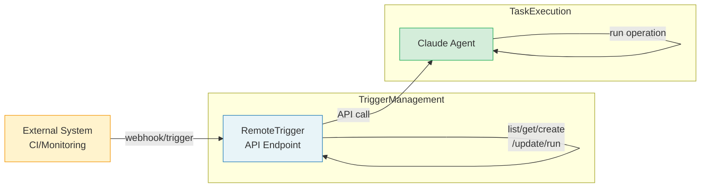

> **Best practice:** Combining remote triggers with Plan Mode can build powerful automation workflows. For example, when CI fails, trigger an Agent that automatically enters Plan Mode to analyze failure causes, generate fix plan, then automatically execute fix. This "trigger -> plan -> execute" pattern is the core paradigm of Agent-driven automation.

### 14.4.4 Session-scoped Lifecycle of Scheduled Tasks

Session-scoped tasks (`durable: false`) have lifecycle bound to session. They're stored in bootstrap state, not written to disk.

`listAllCronTasks` merges file tasks and session tasks, returning unified task list.

In scheduler's `check()` method, session tasks and file tasks go through different processing paths. Session tasks are operated directly in memory (synchronous delete), file tasks are written to disk asynchronously via `removeCronTasks`.

**Practical case: Auto-deploy monitoring workflow**

Below is an auto-deploy monitoring workflow built using scheduling system:

```
1. User: "Help me deploy to staging environment and monitor deploy status"

2. Agent creates deploy task:
   - one-shot cron task: Check if deploy complete after 30 minutes
   - prompt: "Check staging environment deploy status, analyze cause if failed"

3. Agent creates monitoring task:
   - recurring cron task: Check health status every 5 minutes
   - prompt: "Check staging environment health check endpoint, notify if abnormal return"
   - durable: false (only valid for current session)

4. After deploy succeeds:
   - Agent deletes monitoring task
   - Deploy check task auto-triggers then deletes (one-shot)

5. If session unexpectedly interrupts:
   - monitoring task disappears with session (durable: false)
   - deploy check task might trigger in next session (if persisted)
```

### 14.4.5 Workflow Design Patterns and Anti-patterns

Based on Claude Code's Plan Mode and scheduling system, we can summarize following workflow design patterns and anti-patterns:

**Pattern 1: Plan-Execute-Verify Cycle**

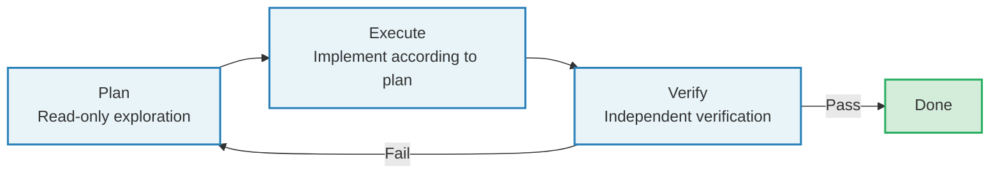

This is the most classic Agent workflow pattern. Plan phase ensures correct direction, Execute phase implements efficiently, Verify phase guarantees quality. Separation of the three enables each phase to be independently optimized and debugged.

**Pattern 2: Event-Triggered Workflow**

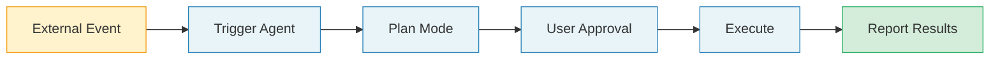

Applicable to operations automation, CI/CD integration scenarios. Event-triggered rather than user-initiated, Plan Mode ensures automated operations' safety and controllability.

**Pattern 3: Polling Loop with Escalation**

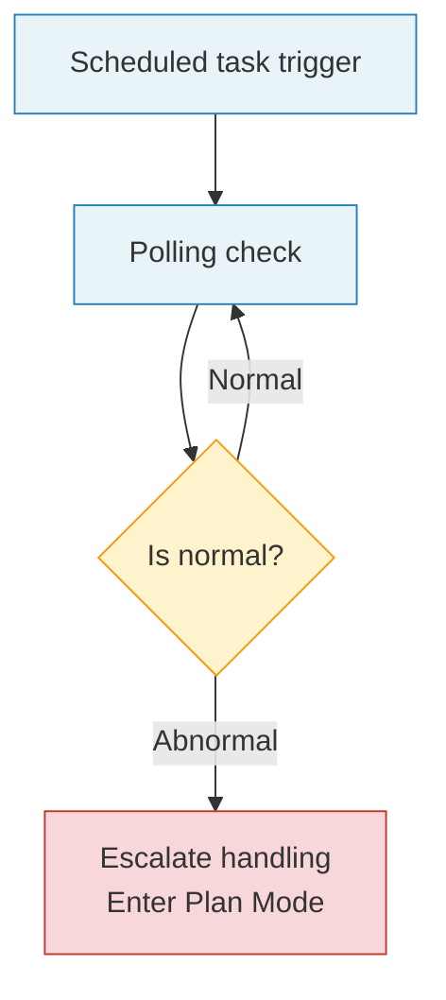

Applicable to continuous monitoring scenarios. Low-cost polling only triggers high-cost Agent reasoning when anomaly detected.

**Anti-pattern 1: Unplanned complex tasks**

Directly let Agent execute complex tasks involving multiple file modifications without going through Plan Mode. Risk: Direction errors causing large-scale rework.

**Anti-pattern 2: Over-planning**

Enter Plan Mode even for simple tasks (like modifying a config value). Wastes time and tokens, degrades user experience.

**Anti-pattern 3: Never-cleanup scheduled tasks**

Create recurring tasks but don't set reasonable expiration times. Result: Zombie tasks continuously consume resources.

**Anti-pattern 4: Synchronously waiting for polling results**

Synchronously wait for scheduled task results in main conversation (via Sleep + polling). Correct approach is asynchronously pushing results through notification mechanism, main conversation not blocked.

---

## 14.5 Background Tasks and Active Mode

### 14.5.1 SleepTool

SleepTool is listed as part of background task management. In Claude Code's tool registration, it's registered together with other scheduling-related tools. SleepTool allows Agent to pause for a period during execution, particularly useful in long-running background task scenarios like polling deploy status or waiting for external system to complete operations.

SleepTool's design seems simple (just wait specified time), but it plays an important role in Agent interaction model. Without SleepTool, Agent facing "waiting" scenarios has only two choices: either return result immediately (even if external operation not yet complete), or frequently poll in loop (wasting tokens). SleepTool provides third choice: Agent can pause execution, wait a while before continuing, without producing token consumption during wait.

**SleepTool usage scenarios:**

1. **Deploy polling**: After Agent triggers deploy, sleep 30 seconds, then check deploy status, if still in progress continue sleeping.
2. **Cache preheating wait**: After modifying cache config, sleep waiting for cache invalidation period to pass, then verify new cache is effective.
3. **Rate limit adaptation**: When calling rate-limited external API, sleep waiting for rate window reset.

> **Anti-pattern warning:** Don't use SleepTool in Plan Mode. Plan Mode should be efficient read-only exploration, shouldn't include waiting operations. If an operation in Plan Mode needs waiting, it means exploration strategy needs optimization -- should acquire all needed information at once, not poll and wait.

### 14.5.2 Background Session Management

`runForkedAgent` is the foundation of background Agent execution. It creates completely isolated context through `createSubagentContext`, runs independent query loop, and tracks complete usage metrics.

Key isolation designs include:

1. **File state cache cloning** (`cloneFileStateCache`): Sub-agent's file reads don't affect parent Agent's cache. This ensures parent Agent's file state view isn't polluted by sub-agent's intermediate operations. For example, if sub-agent reads a file then file is modified, parent Agent still holds pre-modification cached version, not refreshed due to sub-agent's read.

2. **Independent AbortController**: Sub-agent can be independently aborted without affecting parent Agent. This enables parent Agent to start multiple sub-agents, selectively canceling one sub-agent when needed without affecting other ongoing subtasks.

3. **Permission prompt suppression**: Background Agent's `getAppState` wraps `shouldAvoidPermissionPrompts: true`, avoiding background operations popping UI prompts. This is because background Agents usually execute pre-authorized tasks (like Plan verification, session summary), don't need and shouldn't interrupt users.

4. **Transcript logging**: Logs sub-agent's messages to independent sidechain, separated from main session's messages. This keeps main session's message history clear, not flooded by sub-agent's internal operations.

`lastCacheSafeParams` is a global slot, used to save current turn's cache-safe params in post-turn hooks. This enables post-turn forks (like promptSuggestion, postTurnSummary) to directly reuse main loop's prompt cache without each caller manually passing parameters.

**The design elegance of lastCacheSafeParams lies in "implicit context passing".** Explicit approach would pass parameters from main loop wherever cache-safe params are needed, but this causes function signature bloat -- each new call point needs modifying parameter list. Through global slot, callers only need to read slot value at right timing without knowing where value comes from. This reduces coupling between components.

Of course, global state has its risks: if read timing is wrong (like delayed read in async operation), slot value might have been overwritten by subsequent turns. Claude Code avoids this by immediately reading slot value in post-turn hook's synchronous execution segment -- slot's write and read happen in same synchronous execution segment, no race condition.

### 14.5.3 Background Task Lifecycle Management

Background tasks go through following lifecycle phases from creation to completion:

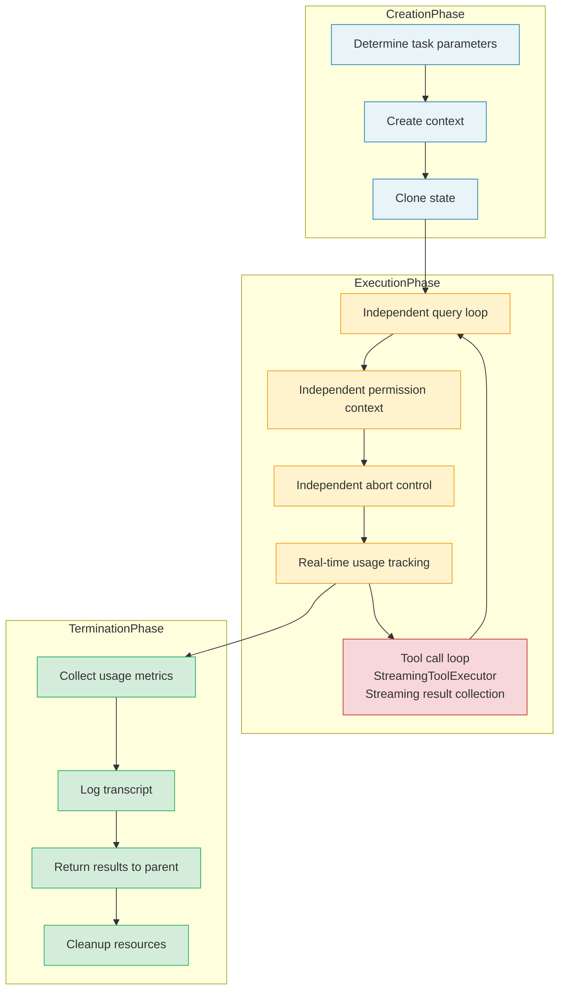

Each phase has corresponding resource management strategy. Creation phase allocates resources (context, controllers), execution phase uses resources (API calls, file access), termination phase releases resources (close controllers, write transcript). This "allocate-use-release" three-phase lifecycle management ensures no resource leaks.

---

## Practical Exercises

### Exercise 1: Experience Plan Mode Complete Flow

In Claude Code REPL, input a non-trivial implementation task (like "Add a configuration validation module for the project"), observe:
1. EnterPlanMode trigger conditions (whether model proactively entered Plan Mode)
2. Model's behavior in Plan Mode (whether only used read-only tools)
3. Plan file's content and storage location
4. ExitPlanMode's approval flow and mode restoration

**Recording template:**

```
| Step | Observed behavior | Tools used | Time |
|------|-------------------|------------|------|
| Enter Plan Mode | ... | EnterPlanMode | ...s |
| Exploration phase #1 | ... | Read/Grep/Glob | ...s |
| Exploration phase #2 | ... | Read/Grep/Glob | ...s |
| Present plan | ... | ExitPlanMode | ...s |
| User approval | ... | - | ...s |
| Execution phase | ... | Edit/Write/Bash | ...s |
```

**Extended thinking:** Compare effect difference completing same task with and without Plan Mode. Particularly focus: Do implementation results meet expectations? Need rework? How about total time and token consumption?

### Exercise 2: Create Cron Scheduled Tasks

Use `/schedule` skill to create one one-shot and one recurring scheduled task. Check `.claude/scheduled_tasks.json` content changes. Terminate and restart Claude Code, observe missed task detection notification.

**Specific steps:**
1. Create one-shot task: "Report current git branch status in 5 minutes"
2. Create recurring task: "Check for uncommitted changes every hour"
3. View `.claude/scheduled_tasks.json`, understand each field's meaning
4. Wait for one-shot task to trigger, observe trigger behavior
5. Exit and restart Claude Code, observe missed task detection notification
6. Manually delete recurring task, confirm file content update

### Exercise 3: Analyze Plan File Recovery

In a remote session (CCR), enter Plan Mode and create a plan. Terminate session then resume (`--resume`), check if plan file is correctly recovered. Combined with `recoverPlanFromMessages`' three recovery sources, analyze which path your scenario took.

**Debug tip:** Start Claude Code with `CLAUDE_CODE_DEBUG=1` environment variable, search for `copyPlanForResume` and `recoverPlanFromMessages` keywords in logs, can observe which path recovery process took.

### Exercise 4: Design a Complete Event-Driven Workflow

Choose one of following scenarios, design a complete event-driven workflow (using Plan Mode + scheduled tasks + remote trigger):

**Scenario A: Automated Code Review**
- Trigger condition: PR create/update
- Plan phase: Read PR changes, analyze code quality
- Execute phase: Generate review comments
- Verify phase: Check if comments successfully posted

**Scenario B: Infrastructure Health Monitoring**
- Trigger condition: Hourly scheduled trigger
- Plan phase: Query key metrics, analyze anomalies
- Execute phase: Generate report, trigger alerts (if anomalies)
- Verify phase: Confirm alerts sent

For your chosen scenario, answer:
1. Should task be durable or session-scoped?
2. Need jitter? Why?
3. What is Plan Mode's exit condition?
4. How to handle task execution failure cases?

---

## Key Takeaways

1. **Plan Mode is separation of read-only exploration and writable execution**, achieved through permission mode switching. EnterPlanMode saves original mode and switches to plan, ExitPlanMode restores original mode and handles circuit breaker defense. This separation ensures Agent produces no side effects during "thinking" phase, greatly reducing directional error risk.

2. **Plan file management uses slug-based naming and lazy generation**, supports three-layer recovery strategy (direct read, file snapshot, message history), ensuring plans aren't lost in various failure scenarios. Recovery strategy is ordered by reliability priority, embodying "don't put all eggs in one basket" defensive design thinking.

3. **Fork Agent achieves prompt cache sharing through CacheSafeParams**, achieves state isolation through createSubagentContext, ensuring sub-agent doesn't interfere with main Agent's state. Sub-agent's "sandbox" design -- can read outside world but cannot modify parent state -- is Agent security's key boundary.

4. **Scheduling system supports both file-persisted and session-scoped tasks**, prevents multi-session duplicate triggering through file locks, prevents thundering herd through jitter mechanism, prevents infinite recursion through auto-expiration. These mechanisms together form a robust distributed task scheduling framework.

5. **Teammate's Plan approval goes through mailbox mechanism**, not local UI popup, which is infrastructure for distributed Agent collaboration. Delegation of approval authority (from local user to team lead) embodies permission delegation pattern in Agent systems.

6. **Workflow design should follow "Plan-Execute-Verify" pattern**, avoiding anti-patterns like "unplanned complex tasks" and "never-cleanup scheduled tasks". Good workflow design balances automation efficiency with human oversight.

7. **lastCacheSafeParams' global slot design** embodies "implicit context passing" pattern, reducing inter-component coupling while avoiding race conditions through synchronous read/write. This pattern is particularly useful when needing to pass context across multiple component layers.
